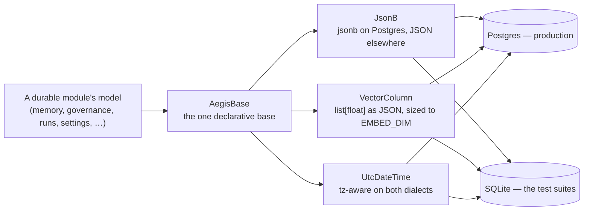

# Data

## What it is

The portable persistence layer — a minimal SQLAlchemy 2.0 base plus two
custom column types (JSON and a vector-as-JSON column) that modules like
memory and governance build their tables on. If you have never worked
across two different database engines: the same table definition needs to
produce working SQL on both **SQLite** (used by the fast unit-test suite,
which needs no running Postgres) and **PostgreSQL** (production). A column
type that only exists in Postgres — like its native `jsonb` — breaks the
test suite unless it is wrapped so it degrades gracefully on SQLite.

## Why it exists here

Without this module, every table definition that needs a JSON column or an
embedding vector would either hardcode a Postgres-only type (breaking the
SQLite test path) or duplicate a workaround in every file that needs one.
`aegis.data` centralises exactly two type decorators once, so every durable
module — memory, governance — gets both correctly, on both dialects,
automatically.

## Diagram



## The architecture

```
aegis/src/aegis/data/
  base.py   AegisBase (the declarative base), JsonB, VectorColumn, UtcDateTime, EMBED_DIM
```

That is the whole package — one file, deliberately.

## What is actually in Aegis

### `EMBED_DIM = 3072` — the one number that ties the whole embedding story together

Defined here, and re-exported through `aegis.data`, `aegis.retrieval`, and
`app.data.models`. It is the dimensionality of
`genailab-maas-text-embedding-3-large`, the platform's one embedding model
(see `gateway.md`). Every `VectorColumn` in the codebase is sized to this
constant — changing embedding models means changing this number, and every
stored vector becomes incompatible with the new dimension until
re-embedded.

### `JsonB` — native `jsonb` on Postgres, portable `JSON` everywhere else

```python
JsonB = JSON().with_variant(JSONB, "postgresql")
```

One line, and it is the whole mechanism: SQLAlchemy's `.with_variant()`
swaps the column type per dialect automatically. Production gets real,
indexable Postgres `jsonb`; the SQLite test database gets ordinary `JSON`
that still round-trips correctly for tests, even though it lacks
`jsonb`'s query operators.

### `VectorColumn` — an embedding is stored as JSON, deliberately **not** pgvector

This is worth understanding precisely, because it is a real architectural
decision with a stated reason, not an oversight:

> *"The embedding-of-record column is a portable `list[float]` stored as
> JSON ... not a pgvector `vector` type: ANN search runs on the embedded
> vector store (Qdrant), so the SQL column is only the durable
> source-of-record that the memory mirror reads, never a search index."*

Concretely: **similarity search never runs against this Postgres column.**
It exists purely so the raw floats survive durably in the same transaction
as the row they describe, and can be **replayed** into Qdrant (or a fresh
Qdrant collection) without ever calling the embedding provider again — this
is the exact mechanism that makes `python -m app.ingestion --reindex` free
(see `ingestion.md`). The module docstring notes `pgvector` was an actual
prior dependency, **removed** once vector search moved fully to the
embedded vector store — this column used to be a pgvector `vector` and
no longer is.

## How it runs

A durable module (memory, governance) defines its ORM tables on
`AegisBase`, using `JsonB` for JSON columns and `VectorColumn(EMBED_DIM)`
for any embedding-of-record column. The host application owns the actual
engine, sessionmaker, and calls `AegisBase.metadata.create_all` (plus RLS
bootstrap) — this module owns only the *shape* of the tables, never their
lifecycle.

## What is not here

- **No pgvector.** Removed on purpose; do not reintroduce it as a
  "faster" vector column — the ANN search path is Qdrant, and this column's
  entire job is durable replay storage, not a query index.
- **No connection or session management.** This package defines table
  shapes only; the host application is responsible for actually connecting
  to a database.
