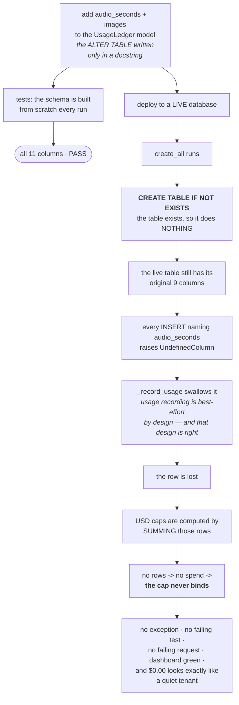
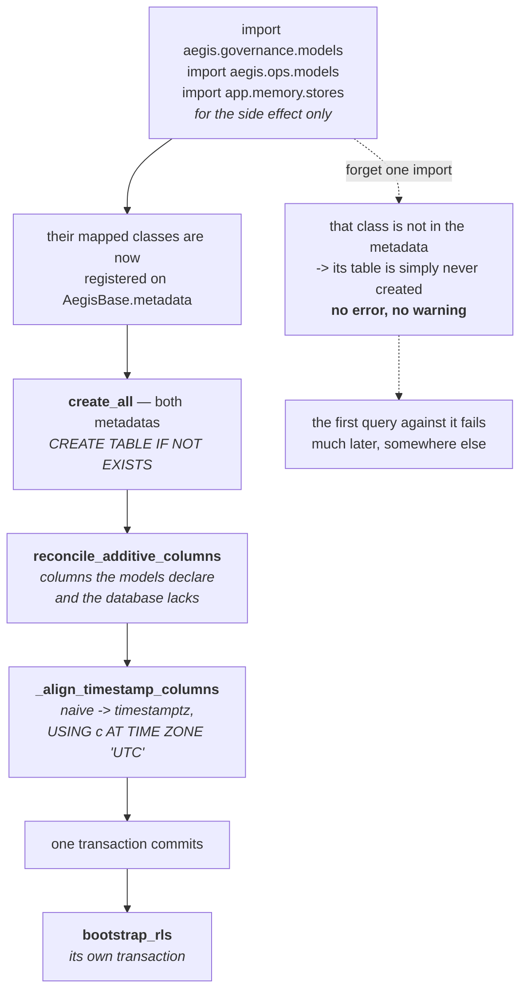
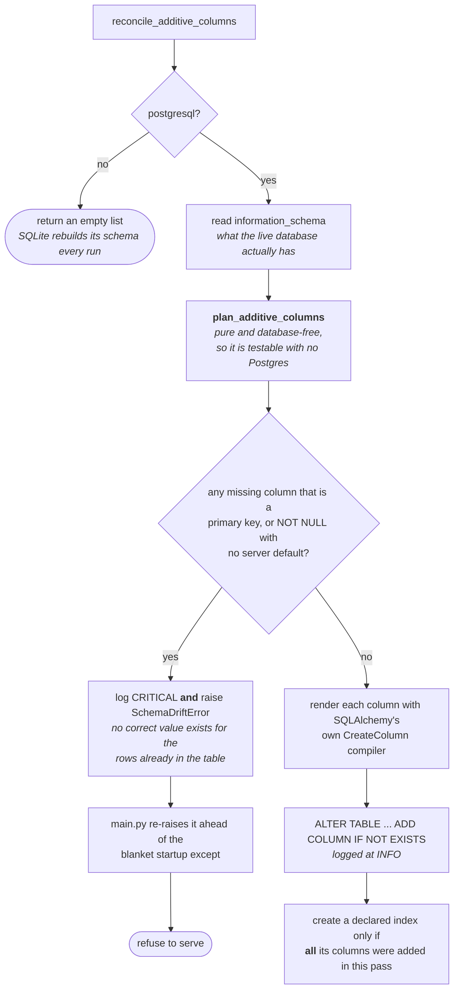
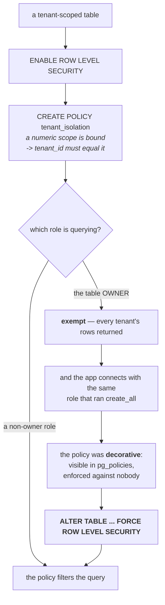

# Data — the diagrams

Five diagrams. The one to know is **diagram 2** — it is the clearest picture of how three
defensible decisions compose into an invisible failure.

Everything else about this module is explained in [`10-guide.md`](10-guide.md); a picture is
only here when it shows something prose cannot.

---

## 1. Where the data layer sits

*Look at which modules have an arrow into `aegis.data`, and which stop at the core.*

```mermaid
flowchart TB
    CORE["<b>aegis.core</b><br/>pydantic + stdlib<br/><i>imported by everything</i>"]
    DATA["<b>aegis.data</b><br/>sqlalchemy&#91;asyncio&#93;<br/><i>the aegis&#91;data&#93; extra</i>"]

    MEM["aegis.memory"]
    GOV["aegis.governance"]
    OPS["aegis.ops"]

    GR["aegis.guardrails"]
    VI["aegis.vision"]
    VO["aegis.voice"]
    FO["aegis.forecast"]

    DATA --> CORE
    MEM --> DATA
    GOV --> DATA
    OPS --> DATA

    GR --> CORE
    VI --> CORE
    VO --> CORE
    FO --> CORE
```

The four modules on the right never open a database, so they never carry an ORM. The three on
the left do, and they pay for it.

That split only exists because SQLAlchemy is **banned from the core** by a guard test. The core
is imported by everything, so a dependency there is everyone's dependency.

---

## 2. How the ledger silently lost every row

*Follow the right-hand branch. Every step on it is correct, and the end of it is a spend cap
that no longer binds.*

Three defensible decisions — no migration framework, best-effort usage recording, additive
defaulted columns — compose into an invisible, security-relevant failure.

The two branches out of `ADD` are the whole story: drift can only exist on a long-lived
database, and the only long-lived database is production.

---

## 3. Bootstrap, in order

*Look at the three imports at the top. Nothing below them can create a table they did not
register.*

DDL is transactional in Postgres, so the four steps in the box either all land or none do —
never a half-migrated schema.

Every step is idempotent, because every worker runs all of it on startup.

The dotted branch is the decorator-registry trap in its ORM form: **a registration in an
unimported module is invisible.**

---

## 4. What the reconciler will and will not do

*Look at the `yes` branch. When it fires, nothing is added at all — not even the safe columns.*

The compiler on the `DDL` edge is the detail worth stealing: a reconciled database and a fresh
one converge, because both went through the same renderer. Hand-written SQL would leave you
with a second schema that exists only in production.

The refusal is right because booting means serving with a ledger whose writes are failing right
now — uncapped, unattributed spend, indefinitely, with every dashboard green.

And the refusal needs both defences on it. **A loud failure caught by a broad handler is a
quiet failure again.**

---

## 5. Why the RLS policy was enforced against nobody

*Follow the `table OWNER` branch — that is the role the application actually connects with.*

Every inspection said isolation was on. `pg_policies` showed the policy, the code bound the
scope, and every query returned every tenant's rows.

`FORCE` made the policy real for scoped requests. Requests that bind **no** numeric scope —
login-by-username, platform-admin surfaces — are still unrestricted by design, so read this as
a documented gap rather than a complete control.

**Next:** [`50-interview.md`](50-interview.md).
