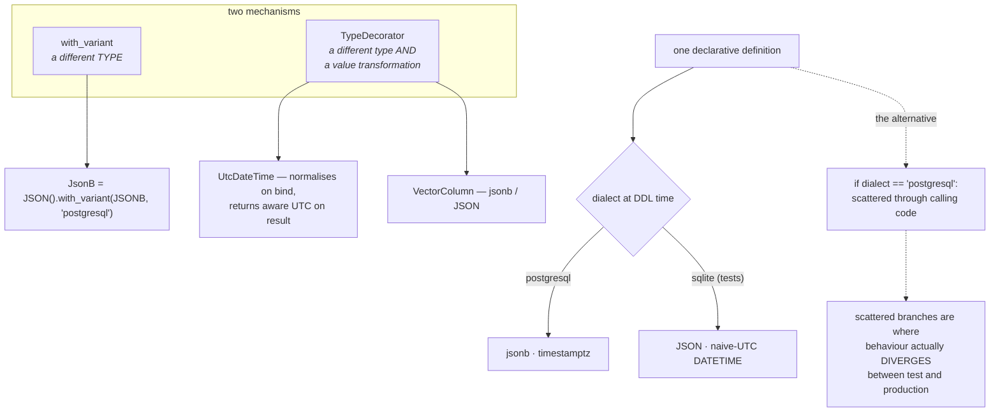
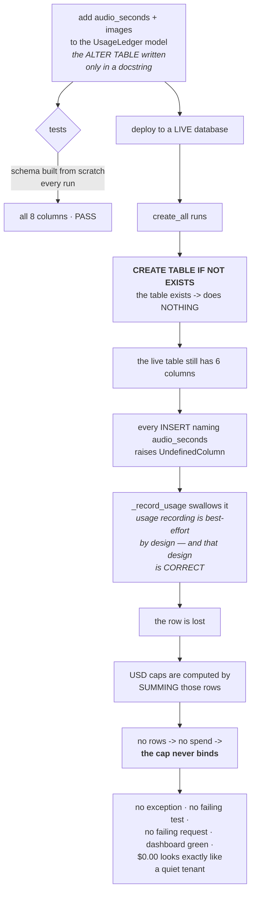
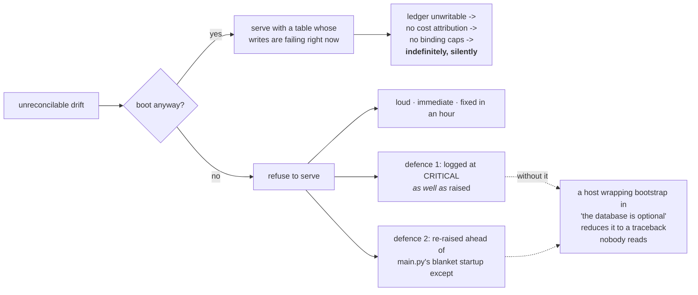
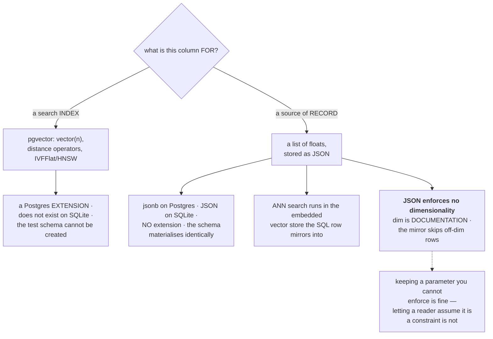
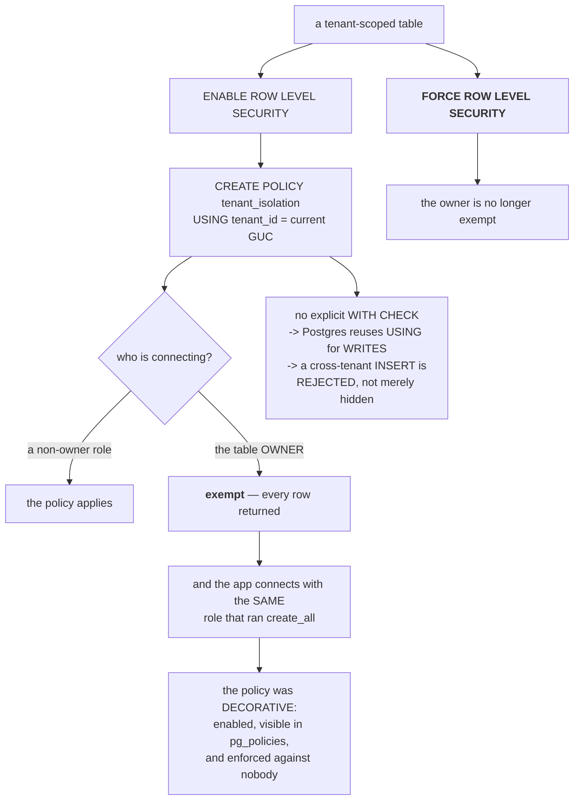
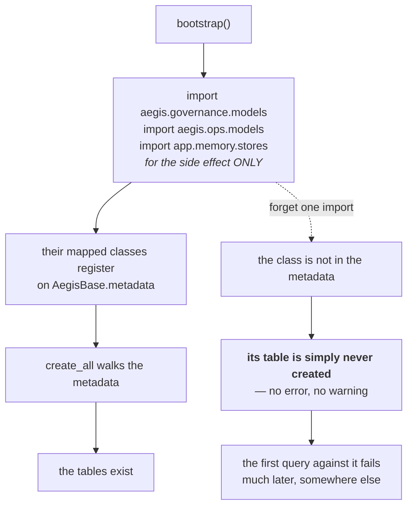

# Data — the diagrams

Diagram 4 is the one to know. It is the clearest picture of how three defensible decisions
compose into an invisible failure.

---

## 1. Where the data layer sits

```mermaid
flowchart TB
    CORE["aegis.core<br/>pydantic + stdlib<br/><b>free — imported by everything</b>"]

    DATA["aegis.data<br/>sqlalchemy&#91;asyncio&#93;<br/><i>the aegis&#91;data&#93; extra</i>"]

    MEM["aegis.memory"]
    GOV["aegis.governance"]
    OPS["aegis.ops"]

    GR["aegis.guardrails"]
    VI["aegis.vision"]
    VO["aegis.voice"]
    FO["aegis.forecast"]

    DATA --> CORE
    MEM --> DATA
    GOV --> DATA
    OPS --> DATA
    MEM --> CORE
    GOV --> CORE
    OPS --> CORE

    GR --> CORE
    VI --> CORE
    VO --> CORE
    FO --> CORE

    GR -.->|"NO ORM"| X1(["never touches aegis.data"])
    VI -.-> X1
    VO -.-> X1
    FO -.-> X1

    CORE -.->|"sqlalchemy is BANNED here"| BAN["the core is imported by everything,<br/>so its dependencies are<br/>everyone's dependencies"]
```

**Modules that persist things pay for the ORM. Modules that do not, do not.**

---

## 2. One schema, two dialects

**Express the difference once, at the type.** A dialect branch at the type is a
compile-time detail; a dialect branch at a call site is a behaviour difference.

---

## 3. The naive/aware datetime trap

```mermaid
flowchart TB
    APP["the application is uniformly aware<br/>datetime.now(UTC)"] --> COL{"the column type"}

    COL -->|"TIMESTAMP WITHOUT TIME ZONE<br/><i>the ORM default</i>"| N

    subgraph N["two failure modes"]
        F1["<b>LOUD</b>: asyncpg refuses to encode<br/>an aware datetime for a naive column<br/>-> every write and every<br/>WHERE ts &lt; :now blows up<br/><i>this killed the SLA sweeper</i>"]
        F2["<b>SILENT</b>: server_default=now()<br/>stores the SERVER'S LOCAL WALL CLOCK<br/>-> on TimeZone=Asia/Kolkata every<br/>created_at is +05:30 off,<br/>and the API relabels it +00:00"]
    end

    COL -->|"UtcDateTime"| OK

    subgraph OK["the fix"]
        A1["postgres -> timestamptz"]
        A2["sqlite -> naive UTC<br/><i>an offset would corrupt<br/>LEXICAL ordering</i>"]
        A3["bind: normalise either input form"]
        A4["result: ALWAYS aware UTC"]
    end

    OK --> BASE["applied via type_annotation_map<br/>ON THE BASE"]
    BASE --> CLASS["<b>every Mapped&#91;datetime&#93; on every table</b><br/>— including one written next year<br/>by someone who never heard of this"]
```

**Fixing each column is right today and wrong on the next one someone adds. Fixing the
base is right forever.**

---

## 4. How the ledger silently lost every row

**Three defensible decisions** — no migration framework, best-effort usage recording,
additive defaulted columns — **compose into an invisible, security-relevant failure.**

---

## 5. The additive reconciler

```mermaid
flowchart TB
    B["bootstrap()"] --> CA["create_all — both metadatas"]
    CA --> REC["reconcile_additive_columns"]

    REC --> D{"postgresql?"}
    D -->|no| SKIP["return &#91;&#93; — SQLite rebuilds<br/>its schema every run"]

    D -->|yes| READ["read information_schema<br/>-> every (table, column) that EXISTS"]
    READ --> PLAN["plan_additive_columns<br/><i>pure, database-free, testable</i>"]

    PLAN --> SPLIT{"for each missing column"}
    SPLIT -->|"nullable, or has a server_default"| SAFE["ADDABLE"]
    SPLIT -->|"NOT NULL with no default,<br/>or a primary key"| UNSAFE["UNSAFE — no correct value<br/>exists for the rows already there"]

    UNSAFE --> RAISE["log CRITICAL <b>and</b> raise SchemaDriftError"]
    RAISE --> MAIN["main.py re-raises ahead of the<br/>blanket startup except<br/><b>-> refuses to serve</b>"]

    SAFE --> DDL["render via SQLAlchemy's<br/>CreateColumn compiler"]
    DDL --> ALTER["ALTER TABLE ... ADD COLUMN IF NOT EXISTS"]
    ALTER --> LOG["log at INFO"]
    ALTER --> IDX["create an index only if ALL<br/>its columns were added in this pass"]

    REC --> ALIGN["_align_timestamp_columns<br/>naive -> timestamptz<br/>USING c AT TIME ZONE 'UTC'"]
    ALIGN --> RLS["bootstrap_rls"]
```

**Why the ORM's own compiler renders the DDL:** so a reconciled database and a fresh one
converge. Hand-written SQL would create a second schema that exists only in production —
which is the original bug wearing a different hat.

---

## 6. Why refusing to boot is right, and how the refusal survives

**A loud failure caught by a broad handler is a quiet failure again.**

---

## 7. Vector storage — index or record?

---

## 8. RLS — the statement that made the policy real

**Every inspection said "isolation is on."** `pg_policies` showed the policy. The code
bound the scope. And every query returned every tenant's rows.

---

## 9. Registration side effects

The ORM form of the decorator-registry trap: **a registration in an unimported module is
invisible.**

---

**Next:** [`50-interview.md`](50-interview.md).
