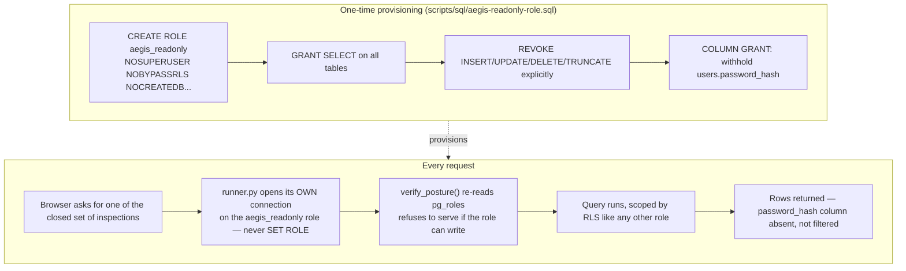

# Database console (dbadmin)

## What it is

A read-only window into the production database, reachable from the web
console instead of requiring an operator to open `psql`. If you have never
worked with database access controls: normally "give someone read access to
the database" means either giving them the same login your application uses
(dangerous — that login can also write) or writing a brand new application
for every query someone might want to ask. `dbadmin` does neither: it is a
**third Postgres role**, separate from both the schema owner and the
application's own login, that is provably incapable of writing, and a
**closed set** of pre-written queries a browser can ask it to run.

## Why it exists here

An operator needs to look at real data occasionally — "how many documents
does tenant 3 have", "what does this user's audit trail look like" — without
either (a) dropping out of the product into a terminal with full database
credentials, or (b) building a bespoke screen for every question that might
come up. The naive shortcut — let the browser send SQL, run it on the
application's own connection — is unsafe in a measured, specific way: the
application connection holds `INSERT`/`UPDATE`/`DELETE`, so a bug or a
crafted request on that path can write, not just read.

## Diagram



## The architecture

```
aegis/src/aegis/dbadmin/
  provision.py   generates the SQL that creates the role (idempotent, re-runnable)
  runner.py      its own engine/pool; verify_posture() re-checks privileges every call
  catalogue.py   the closed set of INSPECTIONS — every statement the console can run
  scope.py       tenant-scoping predicate for the console's own reads
  types.py       ReadOnlyPosture — what verify_posture reports
scripts/sql/aegis-readonly-role.sql   the generated, checked-in provisioning SQL
```

## What is actually in Aegis

### The role, exactly as created

From `scripts/sql/aegis-readonly-role.sql`:

```sql
CREATE ROLE aegis_readonly LOGIN PASSWORD '<generated>'
  NOSUPERUSER NOBYPASSRLS NOCREATEDB NOCREATEROLE NOREPLICATION NOINHERIT;

GRANT USAGE ON SCHEMA public TO aegis_readonly;
REVOKE CREATE ON SCHEMA public FROM aegis_readonly;
GRANT SELECT ON ALL TABLES IN SCHEMA public TO aegis_readonly;
REVOKE INSERT, UPDATE, DELETE, TRUNCATE, REFERENCES, TRIGGER
  ON ALL TABLES IN SCHEMA public FROM aegis_readonly;
```

**`NOBYPASSRLS` is load-bearing.** A superuser or a role with
`BYPASSRLS` ignores Row-Level Security entirely — so this role must
explicitly not have it, or every tenant-isolation guarantee elsewhere in the
platform would be moot the moment someone used the console.

### `users.password_hash` — withheld by a column grant, not filtered in code

```sql
REVOKE SELECT ON TABLE users FROM aegis_readonly;
-- then, per-column, excluding password_hash:
EXECUTE format('GRANT SELECT (%s) ON TABLE users TO aegis_readonly', cols);
```

This is the single best fact to know about this module: `password_hash` is
not hidden by application code checking a column name and skipping it. The
`aegis_readonly` role's Postgres privileges literally do not include
`SELECT` on that column. `information_schema.columns` — the same catalogue
the console's schema browser reads — **does not list it at all** for this
role, because Postgres itself withholds it. There is no code path to audit
for "did someone forget to filter this field", because there is nothing to
filter; the column is invisible at the SQL layer.

### Why a *third* role, not `SET ROLE` on the app connection

`runner.py`'s own docstring states two boundary properties directly:

> *"Never `SET ROLE` on the application connection: `RESET ROLE` is one
> legal statement"* — and its own engine and pool, entirely separate from
> the app's.

`SET ROLE` on a shared connection is not a real boundary because any
session holding that connection can issue `RESET ROLE` and walk right back
to the original, more-privileged role. A genuinely separate role, with its
own login, its own pool, its own engine, cannot be escaped that way — there
is no privileged role to reset back to on that connection at all.

### `verify_posture` — checked on every call, not once at boot

`runner.py::verify_posture(engine)` re-reads the role's actual privileges
from `pg_roles` on **every** request, not once when the server starts. If
the role's privileges were ever accidentally changed in the database
directly (a manual `GRANT`, a migration mistake), the console refuses to
serve rather than trusting a startup-time check that may now be stale.

### The closed set of queries — `INSPECTIONS`

`catalogue.py`'s own module docstring: *"Every statement the console can run
— assembled here, never accepted from a request."* There is no free-form SQL
box. `INSPECTIONS` is a fixed tuple of pre-written, parameterised queries
(browse a table, count rows, run one of the named inspections) — a request
can select *which* of these to run and supply bounded parameters (a table
name that must exist, a row limit), but it cannot supply arbitrary SQL text.

## How it runs

1. A console request names one of the `INSPECTIONS` (or asks to browse a
   named table).
2. `runner.py` opens a connection on its own pool, authenticated as
   `aegis_readonly` — never by `SET ROLE` on any other connection.
3. `verify_posture` re-confirms the role cannot write and does not bypass
   RLS, before the query runs.
4. The query executes, scoped by the same RLS policies as any other role.
5. Rows come back with `password_hash` simply absent from the result shape
   — not stripped after the fact, never present in the first place.

## What is not here

- **There is no free-form SQL endpoint.** Every possible read is one of the
  pre-assembled `INSPECTIONS` — this is a deliberate ceiling on what the
  console can be asked to do, not a missing feature.
- **The role must be re-provisioned if the schema changes** in a way that
  adds new sensitive columns — the column grant on `users` is generated
  against the schema at provisioning time; a new column added later needs
  the provisioning script re-run to decide whether it should be withheld
  too.
- **Write actions of any kind are structurally impossible from this role**,
  not merely disallowed by application logic — there is no "admin override"
  path that elevates a console session's privileges.
