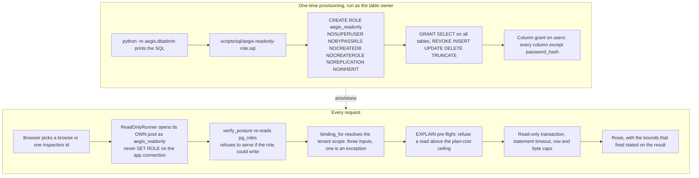

# Database console (dbadmin)

## What it is

`aegis.dbadmin` is a read-only window into the live database, reachable from the
web console instead of a terminal. It is a **third Postgres role** that cannot
write, its own connection pool, and a **closed set** of pre-written queries a
browser may ask it to run.

## Why it exists

An operator needs to look at real data occasionally — how many documents a tenant
has, what an actor did last week — without either dropping into `psql` with full
credentials or someone building a bespoke screen for every question.

The naive version of that is unsafe in a specific way: the application's own
connection holds `INSERT`, `UPDATE` and `DELETE`, so a bug or a crafted request on
that path can write, not just read. Everything in this package follows from
refusing that shortcut.

## Diagram



## How it works

### The role

`provision.py` generates idempotent SQL; `python -m aegis.dbadmin` **prints** it
rather than executing it, because creating a login role against a production
database is an operator action and a reviewable `.sql` file is a better artefact
than a migration that ran once on a laptop. Nothing in this package runs at Aegis
boot.

The role is created `NOSUPERUSER NOBYPASSRLS NOCREATEDB NOCREATEROLE NOREPLICATION
NOINHERIT`, given `USAGE` on `public` and `SELECT` on all tables, and then
explicitly stripped of `INSERT, UPDATE, DELETE, TRUNCATE, REFERENCES, TRIGGER` —
both directly and through `ALTER DEFAULT PRIVILEGES`. `NOBYPASSRLS` is
load-bearing: a role that bypasses row-level security would make every
tenant-isolation guarantee elsewhere moot the moment someone opened the console.

It also carries `statement_timeout = '10s'`,
`idle_in_transaction_session_timeout = '30s'` and
`default_transaction_read_only = on`. The last is a guard rail, not the boundary —
this role can turn it off itself. The privileges are the boundary.

### `users.password_hash`, withheld by a column grant

The table-wide `SELECT` on `users` is revoked, then re-granted per column with
`password_hash` excluded. This is the single best fact to know about the module:
the column is not hidden by application code remembering to skip it. Postgres
itself withholds it, and `information_schema.columns` — the same catalogue the
schema browser reads — does not list it for this role. There is no filtering code
to audit, because there is nothing to filter.

### Why a third role rather than `SET ROLE`

`SET ROLE` on a shared connection is not a boundary: `RESET ROLE` is one legal
statement, and a session holding that connection can walk straight back to the
more privileged role. `ReadOnlyRunner` therefore has its own engine, its own pool
and its own DSN.

### `verify_posture`, on every call

`runner.py::verify_posture(engine)` re-reads the connection's actual privileges
from `pg_roles` before **every** query, not once at startup. A DSN pointed at the
wrong role, or a manual `GRANT` applied to the right one, is a refusal on the
first request rather than a hole.

### The closed set

`catalogue.py` assembles every statement the console can run. There is no
free-form SQL box. Two front doors sit on one execution path:

- **Browse** — `browse_query` / `count_query` read one table with keyset
  pagination, ordered and filtered by columns matched against the live catalog.
- **Inspections** — eight parameterised reads, selected by id:

| Id | Title |
|---|---|
| `spend_by_tenant` | Spend by tenant |
| `spend_by_model` | Spend by model |
| `recent_audit` | Recent audit trail |
| `audit_by_actor` | Audit trail for one actor |
| `failed_jobs` | Jobs that failed or stalled |
| `documents_by_status` | Documents by ingestion status |
| `pending_approvals` | Approvals still waiting |
| `users_by_tenant` | Who is in each tenant |

A parameter an inspection does not declare is refused, not dropped — a silently
dropped filter answers a different question from the one asked.

### Identifiers are matched, never escaped

Table and column names reach this module from a request and not one of them is
escaped. Every one is matched against the live catalog via `TableInfo.column` and
`table_named`, and a name not in the catalog is refused. That has a property
escaping does not: a column this role's grants withhold is not in the catalog, so
it cannot be named in a projection, an `ORDER BY` or a predicate.

### Bounds that say what they cut

| Control | Value |
|---|---|
| Default row limit | 100 |
| Maximum row limit | 1 000 |
| Statement timeout | 10 000 ms |
| Result byte cap | 5 MiB |
| Default plan-cost ceiling | 5 000 000 |

The `EXPLAIN` pre-flight turns "timed out after ten seconds" into "this would scan
too much, here is the plan", refusing an expensive read before it runs. Every
bound that fired is stated on the result rather than silently trimming rows.

## What it stores

This module stores nothing. It reads other modules' tables and writes none of
them. Its role owns no objects and holds no `CREATE` on the schema.

## Security and tenant isolation

`scope.py` is the smallest module in the package and the one the page stands on.
It resolves a sealed tenant authority from the caller — three inputs, three
outcomes, one of them an exception — so "no authority" raises rather than becoming
a value that can be passed onward and mistaken for "every tenant".

Every generated statement carries `TENANT_PREDICATE` in its `WHERE`:

```sql
(current_setting('app.dbadmin_all_tenants', true) = 'on'
 OR {alias}.tenant_id = substring(current_setting('app.tenant_id', true) from '^[0-9]+$')::int)
```

Note that this is **not** null-tolerant. Aegis's own `tenant_isolation` policy is,
by default, so a page that forgot to bind a scope would otherwise return every
tenant's rows and look healthy doing it. Here, nothing bound means no rows.

The two session variables are `app.tenant_id` and `app.dbadmin_all_tenants`. The
second is deliberately a different name from governance's `app.tenant_all` — one
name per boundary, so widening one cannot widen the other. There is no field on
`Inspection` in which to write a `WHERE` that replaces the predicate; extra
conditions are `AND`-ed after it.

All three routes require a **platform admin**. The console is deployment
configuration a tenant cannot reach: no settings-catalogue key contains `sql`,
`database.`, `db.query` or `schema.browse`, so it is not a tenant-writable
setting. Browse and inspection calls are additionally rate-limited.

## API surface

| Method | Path | Who may call it | Returns |
|---|---|---|---|
| GET | `/v1/database/overview` | `platform_admin` | The console's own posture, the readable schema, the inspection catalogue and the tenant list — one call rather than four. |
| POST | `/v1/database/browse` | `platform_admin` | One table, keyset-paginated and tenant-filtered. 400 for an identifier not in the catalog or a read the planner refuses, 403 for a scope this caller may not read, 404 for an unknown tenant, 429 for the rate limit, 503 when the connection is not read-only. |
| POST | `/v1/database/inspections/{inspection_id}` | `platform_admin` | The rows for one curated read. Same error shape as browse, plus 400 for an unknown inspection or an undeclared parameter. |

## Configuration

| Variable | Default | Effect |
|---|---|---|
| `AEGIS_DB_CONSOLE_ENABLED` | `false` | Turns the console on. |
| `AEGIS_DB_CONSOLE_DSN` | empty | The console's own DSN. It must name the read-only role — never `POSTGRES_DSN`, which holds write privileges, and never the owner DSN, which on a stock cluster bypasses RLS. |
| `AEGIS_DB_CONSOLE_MAX_PLAN_COST` | `5000000.0` | The planner cost above which a read is refused before it runs. |
| `AEGIS_DB_CONSOLE_POOL_SIZE` | `3` | The console's own pool, separate from the application's. |
| `AEGIS_DB_CONSOLE_MAX_OVERFLOW` | `2` | Extra connections the console pool may open. |

## Where it lives

| File | What it does |
|---|---|
| `aegis/src/aegis/dbadmin/provision.py` | Generates the idempotent role SQL; `READONLY_ROLE`, `WITHHELD_COLUMNS`, `provisioning_sql`, `revocation_statements`. |
| `aegis/src/aegis/dbadmin/runner.py` | `ReadOnlyRunner` — its own engine and pool, `verify_posture`, the timeout, the caps and the `EXPLAIN` pre-flight. |
| `aegis/src/aegis/dbadmin/catalogue.py` | `INSPECTIONS`, `browse_query`, `count_query`, `table_named`, `TENANT_PREDICATE`, the row limits. |
| `aegis/src/aegis/dbadmin/scope.py` | `binding_for`, `narrow_to`, `TENANT_GUC`, `ALL_TENANTS_GUC`. |
| `aegis/src/aegis/dbadmin/types.py` | `ReadQuery`, `QueryResult`, `TableInfo`, `Column`, `ReadOnlyPosture` and the error types. No I/O. |
| `aegis/src/aegis/dbadmin/__main__.py` | `python -m aegis.dbadmin` — prints the provisioning or revocation SQL. |
| `scripts/sql/aegis-readonly-role.sql` | The generated, checked-in provisioning SQL. |
| `scripts/sql/aegis-app-role.sql` | The serving role, for contrast — it holds write privileges and is not the console's. |
| `backend/src/app/api/routes_db.py` | The three console routes. |

## What it does not do

- **No free-form SQL.** Every read is a browse or one of the eight inspections.
  The execution path would accept another front door; the front door is the part
  deliberately not built.
- **No writes of any kind.** Not disallowed by application logic — structurally
  impossible for this role, with no override path.
- **It does not track schema changes.** The role must be re-provisioned after a
  schema change: a table created since the last run carries no grant, so the
  browser simply does not list it.
- **It does not decide which new columns are sensitive.** The column grant on
  `users` is generated against the schema at provisioning time.
- **It runs nothing at boot.** Provisioning is an operator action.
