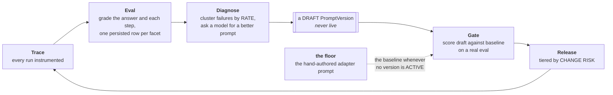
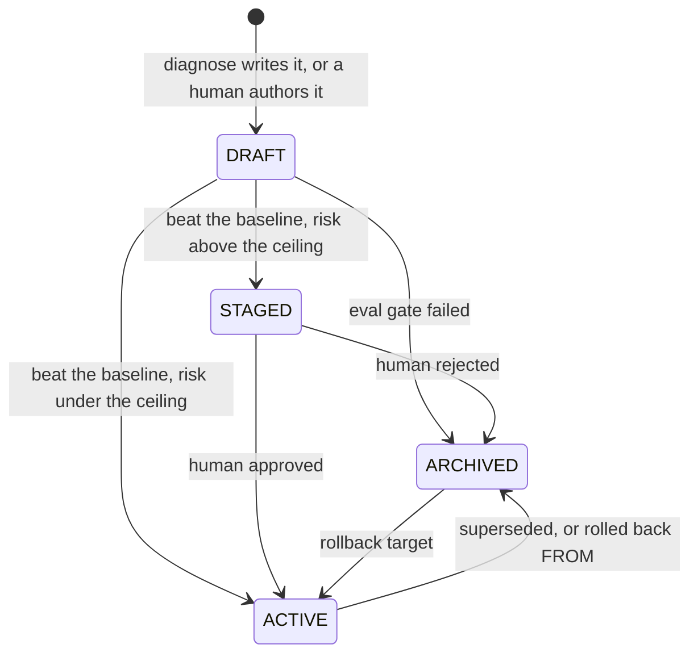
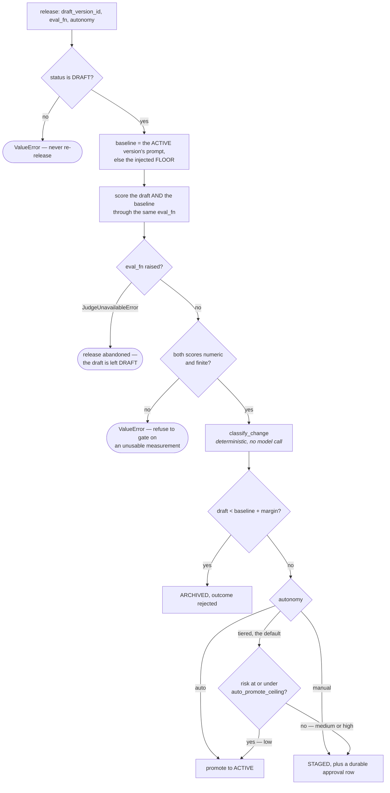
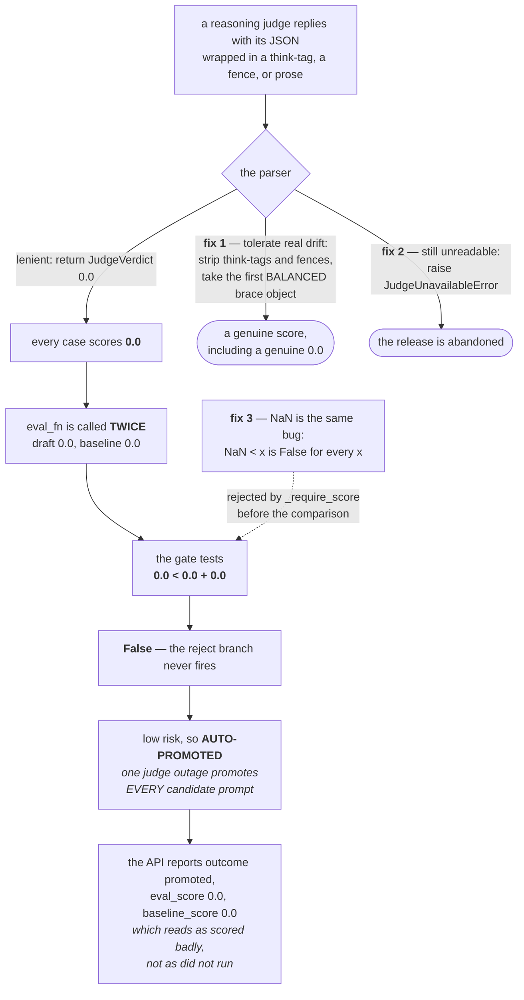
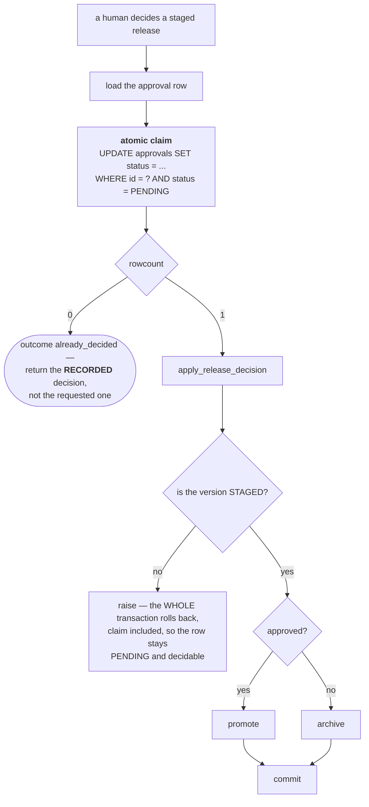

# Evals & LLM-Ops — the diagrams

Five diagrams. The two worth reproducing from memory are **the loop** and **the vacuous pass** —
the first is what the module is, the second is why anyone should trust it.

Everything else about this module is explained in [`10-guide.md`](10-guide.md); a picture is
only here when it shows something prose cannot.

---

## 1. The LLM-Ops loop

*Look at what Diagnose is allowed to emit, and at the dotted edge into Gate.*

The optimiser's only output is a **DRAFT**. It cannot stage, promote, or reach production by any
route that does not pass through Gate and Release.

The floor is why a self-modifying system is safe to run: with nothing active, the baseline is the
prompt a human wrote, so the loop builds **on** it and can never settle below it.

---

## 2. The prompt version lifecycle

*Look at the two ways into ARCHIVED — only one of them can come back.*

Two mirror guards keep every transition single-use: **only a DRAFT may be released**, and **only a
STAGED version may be decided**. A replayed decision therefore cannot re-promote or re-archive.

The `ARCHIVED --> ACTIVE` edge is not open to every archived row — it requires `activated_at` to
still be set. A rejected draft was never live, so it never carries that marker and can never be
rolled back *to*; the version you rolled back *from* has its marker cleared, so it cannot be
rolled back *to* either.

At most one version per `prompt_key` is ACTIVE, enforced in `promote`.

---

## 3. The release gate, end to end

*Look at the three exits above the comparison — none of them promotes anything.*

`classify_change` runs on the **diff**, not on the score, and makes no model call — the classifier
deciding whether a model's proposal is safe must not itself be a model.

Note the ordering: risk is classified after both scores exist but the eval result cannot influence
it. A HIGH-risk change goes to a human however well it scored.

The default margin is `0.0`, so a draft has to be strictly better. That single fact is what makes
the next diagram possible.

---

## 4. The vacuous pass — the bug worth memorising

*Follow the top chain first, then read the two branches off the parser.*

`0.0` looked defensive and was not, for one precise reason: **the gate is a comparison, not a
threshold.** A constant applied to both sides cancels, and the test degenerates into `0 < 0`.

Fix 1 and fix 2 are one design, not two: a uniformly strict parser turns routine formatting drift
into false failures, and a uniformly lenient one produces this. A real `0.0` still parses as
`0.0`.

> A control that cannot fail is worse than no control, because it produces the paperwork of
> safety with none of the substance.

---

## 5. Exactly-once release decisions

*Look at the order — the row is claimed before the draft is touched.*

Claim first, act second. Claiming afterwards would leave a window in which two workers both
applied the decision.

The failure being closed is a **reject replayed after an approve**: it would archive the
now-ACTIVE version, leaving the prompt key with no active version at all, so every run silently
drops to the floor prompt. Nothing errors — the system just stops using the prompt it promoted.

`rowcount == 0` returning the recorded decision rather than the requested one is what makes the
endpoint genuinely idempotent instead of merely harmless.

**Next:** [`50-interview.md`](50-interview.md).
