# Evals & LLM-Ops — the diagrams

Diagram 2 (the loop) and diagram 5 (the vacuous pass) are the two to be able to draw from
memory. The second one is the story that lands.

---

## 1. The three evaluation layers

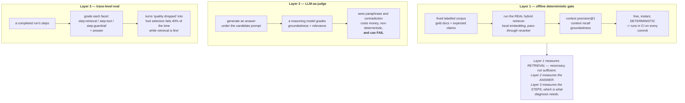

---

## 2. The LLM-Ops loop

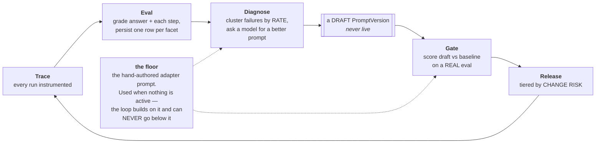

---

## 3. Prompt version lifecycle

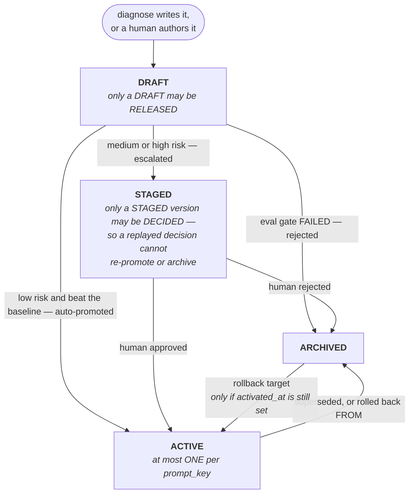

---

## 4. The release gate, end to end

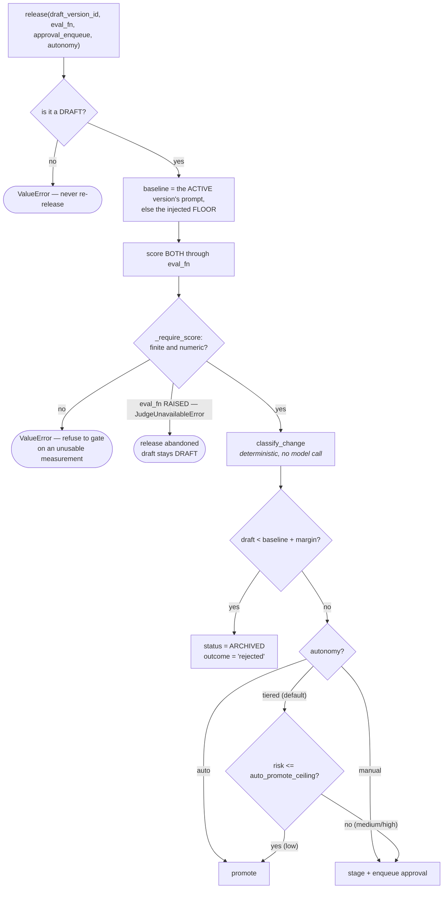

---

## 5. The vacuous pass — the bug worth memorising

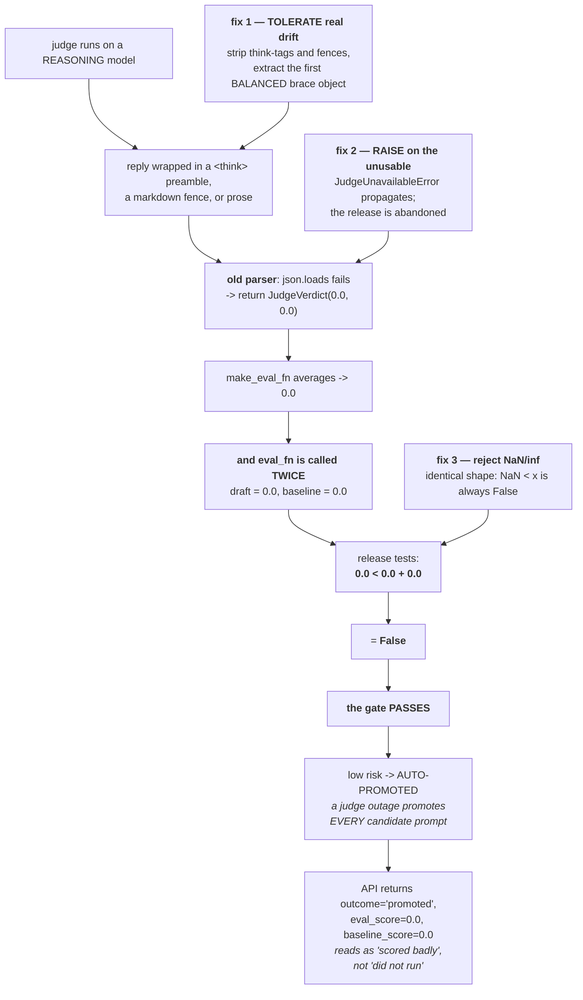

**Why `0.0` looked defensive and was not:** the gate is a **comparison**, not a threshold.
A constant applied to both sides cancels. A conservative default is only conservative
relative to the operation that consumes it.

---

## 6. The unlabelled-case inflation

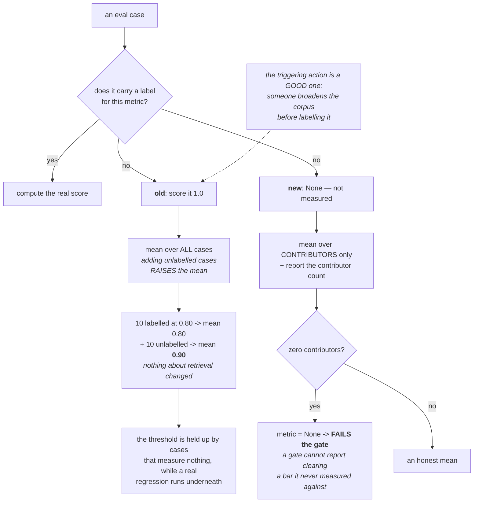

---

## 7. Self-grading — the judge pointed at the wrong thing

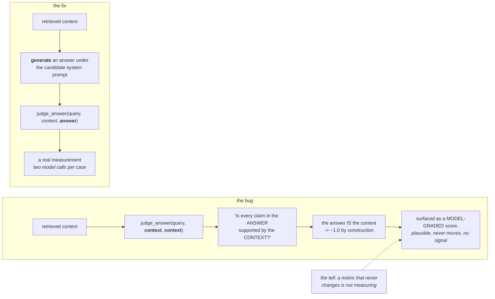

The same structure is what makes the release scorer real: it **generates under the
candidate prompt** and judges that, so the score moves with the prompt. A scorer that does
not is the vacuous-pass bug in different clothes.

---

## 8. Change-risk classification

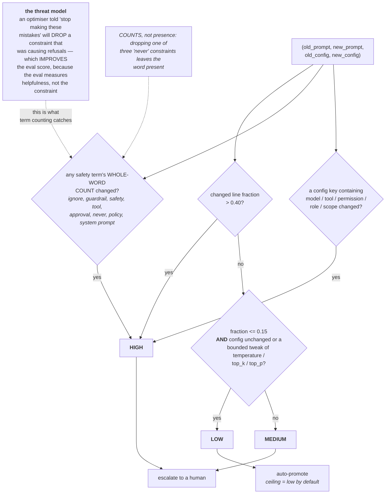

---

## 9. Rollback ordering

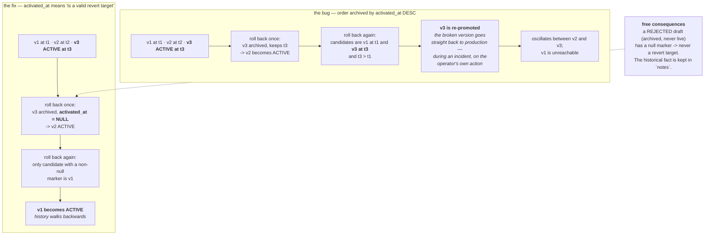

---

## 10. Exactly-once release decisions

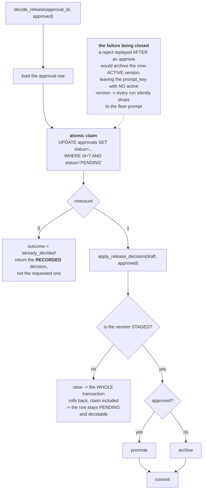

---

## 11. Diagnose — rate, not volume

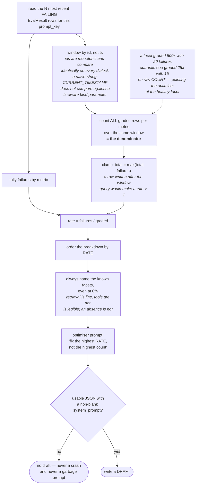

---

**Next:** [`50-interview.md`](50-interview.md).
