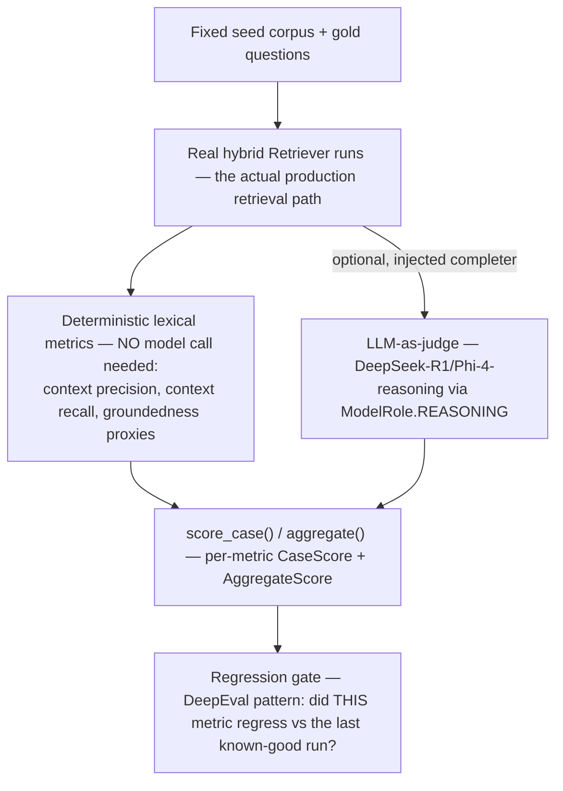

# Evals

## What it is

The measurement harness for retrieval quality — RAGAS-style deterministic
metrics (context precision, context recall, groundedness) computed as
lexical proxies, an **optional** LLM-as-judge for a richer model-graded
pass, and a DeepEval-style per-metric regression gate that runs the real
hybrid retriever against a fixed seed corpus. If you have never built an
eval harness before: the key design choice worth understanding is
**deterministic-by-default, model-optional-by-choice** — most of what this
module measures does not need a model call at all, and the parts that do
are strictly opt-in.

## Why it exists here

Without a real eval harness, "did that ingestion prefix change help
retrieval" is a guess. This project actually needed the answer once: when
the D7 chunk-prefix enrichment step was added (see `ingestion.md`), the
real A1→A2 ablation measured on this repo's own gold set moved recall@6 by
**−3.8 percentage points** (0.774 → 0.736) — a real, measured regression on
this deployment's own data, even though the same technique improved a
published external benchmark by 20+ points. That number is why the module's
own documentation is careful to distinguish "measured on our corpus" from
"cited from someone else's."

## Diagram



## The architecture

```
aegis/src/aegis/evals/
  ir_metrics.py   the deterministic lexical proxy metrics (no model needed)
  judge.py        the optional LLM-as-judge (off by default)
  metrics.py      CaseScore, AggregateScore, score_case(), aggregate()
  goldset.py       the fixed seed corpus + gold questions
scripts/eval_goldset.py   the CLI entrypoint
runs/eval-goldset-*.json  a real, dated measurement artifact checked into the repo
```

## What is actually in Aegis

### Everything model-involved is injected, never imported directly

Quoted: *"Everything is inject-only where a model is involved: the
LLM-as-judge takes a `complete` [callable] ... importing this module never
requires a model."* This means the core deterministic metrics run with zero
external dependencies and zero cost — a CI job can run the lexical-proxy
metrics on every commit without touching a model provider at all. The judge
is a genuinely optional, separately-wired addition for a richer but paid
evaluation pass.

### The judge — real models, off by default

`judge.py`'s own docstring names the exact models: DeepSeek-R1 or
Phi-4-reasoning, routed through `ModelRole.REASONING` at the gateway (see
`gateway.md`) — the same reasoning-tier deployment the rest of the platform
uses, not a separate judge-specific model. `judge_enabled()` gates whether
this richer pass runs at all; the deterministic metrics stand alone and are
meaningful with no judge wired.

### A real ablation, on this project's own data, that disagreed with the published benchmark

This is the single most useful fact in this module, because it is a live
demonstration of why the harness exists at all rather than trusting
external literature. Enriching chunks with the D7 citation prefix
(`ingestion.md`) is reported in the ECIR 2026 paper this project cites as a
significant benchmark improvement. Measured on **this repo's own** 53-case
gold set over four real PDFs, the same technique moved recall@6 **the
other way**: −3.8 percentage points (0.774 → 0.736), while recall@20 also
slipped slightly (0.906 → 0.896). The prefix was kept anyway, for a
different, stated reason — self-describing citations — not because it was
measured to help retrieval on this corpus. That distinction, made
explicitly rather than glossed over, is exactly the discipline this module
exists to enforce.

## How it runs

1. `scripts/eval_goldset.py` runs the fixed gold-set questions through the
   real, production hybrid retriever.
2. Deterministic lexical metrics score every case with no model call.
3. If a judge completer is injected, each case additionally gets a
   model-graded assessment.
4. Scores aggregate and are compared against the last known-good run to
   catch a regression on a specific metric, not just an overall average
   moving.

## What is not here

- **The lexical proxies are proxies, not the RAGAS library itself** — they
  are described as "RAGAS-style," a deterministic approximation of that
  family of metrics. The real RAGAS package IS a dependency and runs the live
  metrics (`aegis.evals.libs.ragas_suite`); the offline proxies here deliberately do not
  use it, so this gate stays free and network-free.
- **The judge is off by default** — a deployment relying only on the
  deterministic metrics never sees the richer model-graded assessment
  unless it explicitly wires a completer in.
