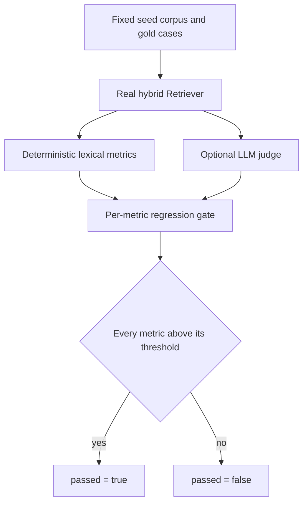

# Evals

## What it is

Aegis measures its own retrieval quality with an offline test harness. **Evals**
runs a fixed set of questions through the real retrieval pipeline, scores the
answers with metrics that need no model call, and fails a build when a score
drops below its threshold. An optional model-graded pass adds a second opinion
when a deployment wants one.

## Why it exists

Changes to chunking, embedding or fusion feel like improvements and are often
not. Without a harness, "did that help?" is an opinion. This module turns it into
a number produced the same way every time, so a change can be defended or
reverted on evidence.

## Diagram

## How it works

**1. The inputs are frozen.** `corpus.py` holds a small service-request knowledge
base plus deliberate distractor documents, and a list of `EvalCase` records. Each
case carries the query, the gold document ids a correct retrieval must surface,
and the claim keywords a grounded answer must be able to cite.

**2. The real retriever runs.** `harness.build_eval_retriever` builds the actual
`aegis.retrieval.pipeline.Retriever` over `InMemoryKnowledgeBackend`. The
embedding is a deterministic local hash and the reranker is a pass-through, so
the run is fully offline and repeatable, and what is measured is the fused
retrieval order itself.

**3. Deterministic metrics score every case.** `metrics.py` computes three
lexical proxies — each a number between 0 and 1:

| Metric | What it asks |
|---|---|
| context precision @ k | Of the top-k retrieved sources, what fraction are gold documents? |
| context recall | Of the case's gold documents, what fraction appear anywhere in the results? |
| groundedness | What fraction of the case's expected claims appear in the assembled answer context? |

These are named after RAGAS metrics and computed by token and substring overlap.
They are **proxies**: no model, no network, no `ragas` dependency.

**4. The gate compares each metric to its own threshold.**
`regression.run_regression_gate()` follows the DeepEval pattern — a declarative
`Metric` carries its own pass bar and direction, and the run's `passed` flag is
what a CI job asserts.

| Metric | Threshold |
|---|---|
| `context_precision@1` | 0.66 |
| `context_recall` | 0.95 |
| `groundedness` | 0.85 |
| `tool_selection_accuracy` | 0.99 |

`tool_selection_accuracy` is the agentic case: when a router is injected
(`route_fn` plus a `roster`), the gate asserts the router still picks the
expected specialist role for representative queries. With no router injected that
case is skipped and the retrieval metrics stand alone.

**5. The judge is optional and injected.** `judge.py` grades an answer's
groundedness and relevance with a reasoning-tier model through
`ModelRole.REASONING`. It runs only when a `complete` callable is passed in and
the `TAIF_EVAL_LLM_JUDGE` flag is set. An unparseable verdict raises
`JudgeUnavailableError` rather than scoring `0.0`, so a judge outage stops a
release instead of silently passing one.

**6. The gold set is anchored on spans, not chunk ids.** `goldset.py` defines
ground truth as a **verbatim answer span** in the source document. A retrieved
chunk is a hit when that span appears inside it. Two pipelines that chunk
differently are therefore graded against identical truth, and the set survives a
re-ingest or a parser change. Spans are one sentence and at most `MAX_SPAN_WORDS`
words. A case whose span lands in no chunk of any arm is reported **ungradeable
and dropped**, never scored zero. `gold_set_hash` pins which gold set produced a
run.

**7. The ablation ladder isolates what each piece buys.** `ablation.py` runs the
same questions through seven configurations:

| Arm | What it is |
|---|---|
| A0 | Text layer, fixed word windows, dense retrieval only |
| A1 | Adds layout-aware parsing and section chunking |
| A2 | Adds the chunk prefix (title, type, date, heading path) |
| A3 | Adds hybrid vector + graph + BM25 fused by RRF |
| A4 | Adds the local cross-encoder rerank — the shipped path |
| L1 | A4 with the graph arm removed |
| L2 | A4 with the BM25 arm removed |

Every arm uses the same embedder, so the table measures the pipeline and not the
model.

**8. Differences get intervals.** `ir_metrics.py` reports recall@20, recall@6,
precision@6, MRR@20 and nDCG@10, and adds `wilson_interval`, `paired_bootstrap`
(10,000 resamples) and `mcnemar_exact`. The design is **paired** — every arm
answers the same questions — so the test runs on the per-query difference, which
is what makes a sample of about 50 cases usable at all.

**9. The result can be streamed.** `stream.py` emits one
`STEP_STARTED`/`STEP_FINISHED` bracket keyed `SpanKind.EVALUATOR` with an
`EVAL_RESULT` custom event carrying the overall score, the pass flag and the
per-metric breakdown. It never calls a model; it projects an already-computed
report.

## What it stores

This module stores nothing. The harness holds its corpus in memory and returns a
report object. Persisted evaluation rows in the `eval_results` table are written
and read by the separate LLM-Ops module (`aegis.ops`), not by this one. The only
files this module writes are the ones an operator asks for: a run artifact such
as `runs/eval-goldset-20260819.json`.

## Security and tenant isolation

No tenant-scoped data. The corpus and the gold set are fixtures checked into the
repository, identical for every deployment, so there is nothing here to scope.
The one access rule that applies is on the HTTP route below: reading the report
requires the admin or AI-team role.

Two safety properties are worth naming. The default path makes **no network call
at all**, so running the gate cannot leak a query to a provider. And the judge
fails closed: a verdict that cannot be parsed raises rather than returning a
score a gate could mistake for a pass.

## API surface

| Method | Path | Who may call it | Returns |
|---|---|---|---|
| GET | `/v1/evals/report` | admin or ai_team role | The regression-gate rollup: per-metric values, thresholds, the overall score and the pass flag |

The route runs the deterministic gate with no model and memoises the result for
the process, because the gate is deterministic and dashboards poll it.

The module also has two command-line entry points:

- `python -m aegis.evals.harness` — a human-readable aggregate report.
- `python -m aegis.evals.regression` — the per-metric gate, with a POSIX exit code.
- `scripts/eval_goldset.py` — the gold-set run that produces a dated artifact.

## Configuration

| Variable | Default | Effect |
|---|---|---|
| `TAIF_EVAL_LLM_JUDGE` | unset (off) | Opts a run into the networked LLM-as-judge pass. With it unset, the judge never runs and no model is called. |

Thresholds are code, not environment: `DEFAULT_THRESHOLDS` in `harness.py` and
`DEFAULT_METRICS` in `regression.py`. Changing a bar is a reviewed edit, not a
deploy-time knob.

## Where it lives

| Path | What it does |
|---|---|
| `aegis/src/aegis/evals/corpus.py` | The frozen seed corpus and the labelled eval cases |
| `aegis/src/aegis/evals/metrics.py` | `CaseScore`, `AggregateScore`, `score_case()`, `aggregate()` |
| `aegis/src/aegis/evals/harness.py` | `evaluate()`, `build_eval_retriever()` and the aggregate thresholds |
| `aegis/src/aegis/evals/regression.py` | The declarative per-metric gate and `run_regression_gate()` |
| `aegis/src/aegis/evals/judge.py` | The optional injected LLM-as-judge |
| `aegis/src/aegis/evals/goldset.py` | The span-anchored gold-set schema, loader, hash and hit rule |
| `aegis/src/aegis/evals/ir_metrics.py` | Recall, precision, MRR, nDCG, intervals and paired significance tests |
| `aegis/src/aegis/evals/ablation.py` | The seven-arm ablation ladder and its comparison table |
| `aegis/src/aegis/evals/stream.py` | AG-UI streaming of a finished report |
| `aegis/src/aegis/evals/data/fixture_gold_set.jsonl` | The shipped gold set, one case per line |
| `backend/src/app/api/routes.py` | Serves `GET /v1/evals/report` |
| `scripts/eval_goldset.py` | The gold-set CLI |

## What it does not do

- **It does not depend on `ragas` or `deepeval`.** Both patterns are implemented
  natively so the gate runs in CI with no keys, no network and no heavy install.
- **It does not compute answer relevancy deterministically.** That needs a
  generation and a similarity model; relevance is only available through the
  optional judge.
- **It does not grade a live production run.** The corpus is fixed. Scoring real
  traffic is the LLM-Ops module's trace-eval loop.
- **It does not import a model client.** Anything model-involved arrives as an
  injected callable, so importing `aegis.evals` pulls in no gateway and no
  provider SDK.
- **It does not score an ungradeable case.** A case nobody can hit is dropped and
  counted, not recorded as a failure.
