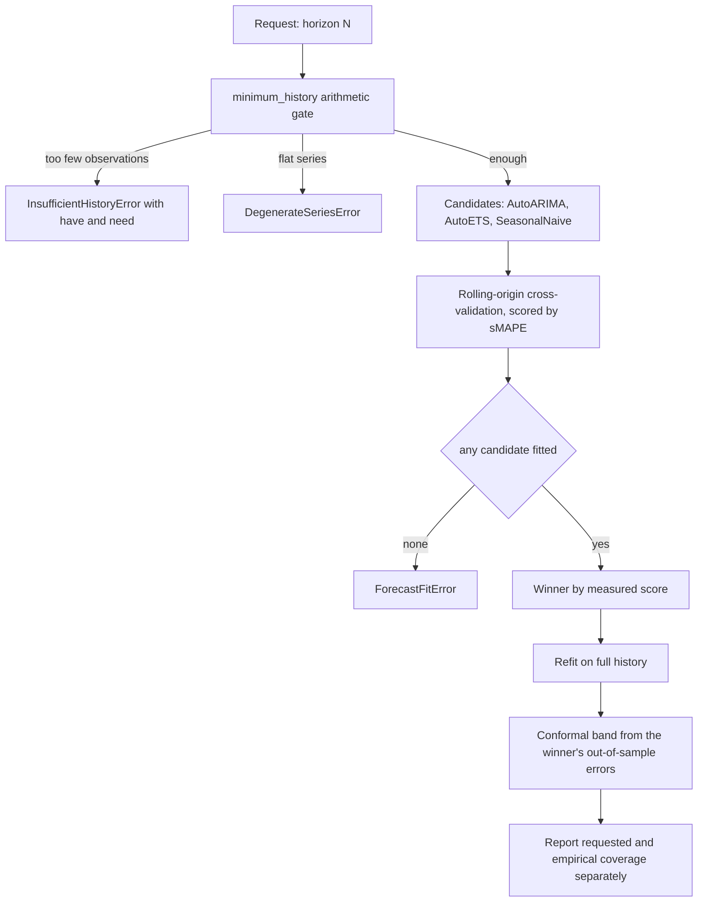

# Forecast

## What it is

Time-series forecasting with a **calibrated** confidence band and a model
chosen by measurement rather than preference. Three surfaces use it: a
tenant's future spend, that spend projected against its budget cap, and the
client's own domain demand series.

**Conformal calibration** means the band is built from the model's real,
measured error on data it never saw, not from an assumption about how its
errors are distributed.

## Why it exists

A forecast that is confidently wrong is worse than no forecast. The defining
behaviour of this module is that every result states both the coverage it was
asked for and the coverage it actually achieved, side by side, with no
rounding — and that it refuses outright when the data cannot support a
forecast rather than returning a degraded line without saying so.

## Diagram



## How it works

**The refusal arithmetic, before anything is imported.** `minimum_history()`
lives in a dependency-free layer so a caller can decide whether a series is
worth forecasting before paying to import statsforecast:

```
need = backtest_windows * horizon
     + max(
           (conformal_windows - 1) * horizon + 1,   # conformal calibration
           2 * season_length + 1,                   # two full seasonal cycles
           2 * horizon,                             # train longer than you predict
       )
```

Both window counts default to `3`. Season length comes from the frequency:
hourly 24, daily 7, weekly 52, monthly 12. A short series produces an
`InsufficientHistoryError` carrying `have` and `need`, which the endpoint
renders as `refusal.code = "insufficient_history"`.

**Rolling-origin cross-validation.** For each cutoff the model is fitted on
data strictly *before* it and scored on the `horizon` observations after it.
Nothing scored was ever seen in training or calibration. A random split would
leak the future into calibration and void the guarantee.

**Model selection is measured.** `AutoARIMA` (with `approximation=True`),
`AutoETS` and `SeasonalNaive` all compete, and the winner is whichever had the
lowest sMAPE. The seasonal-naive baseline is deliberately in the roster and
deliberately reported: publishing the losers is what makes the selection
auditable. Every candidate's score is returned in `candidates`, and anything
that could not be fitted at all is returned in `excluded_models` with its
reason.

**Refusal instead of a naive fallback.** If no candidate — including the
seasonal-naive baseline — can be fitted and scored, `ForecastFitError` is
raised. A series that defeats all three has no forecast worth presenting.

**Both coverage numbers, always.** `BacktestReport` carries
`requested_coverage` (what was asked for), `empirical_coverage` (the fraction
of held-out actuals that fell inside the band), and `coverage_meets_request`
as an explicit boolean with no rounding up. It also carries `smape`, `mape`
(`None` when any actual is near zero, where MAPE is undefined rather than
merely large), `mae`, `windows`, `horizon` and `n_points`.

**`model_selected_on_backtest_windows`** is reported too: when the winner was
chosen on the same windows the metrics come from, those metrics are a mildly
optimistic in-selection estimate. Stated rather than hidden.

**Budget burn-down.** `project_burndown()` joins three things: the cap from
`budgets`, the spend so far in the current window from `usage_ledger`, and the
forward projection. It answers *when* a tenant runs out, with an
`exhaustion_ts` and `exhaustion_step`, rather than a percentage bar with no
date. `cumulative_bounds_are_calibrated` is always `False`, because summed
marginal conformal bounds are an envelope, not a calibrated interval on the
cumulative total.

**The horizon is clamped** to a maximum of 60 steps at the API layer.

## What it stores

This module stores nothing. It reads three sources and computes in memory:

| Source | Read by | For |
| --- | --- | --- |
| `usage_ledger` | `backend/src/app/forecast/ledger.py` | daily spend and model-call volume |
| `budgets` | the budget route, via `list_budgets` | the cap the projection burns down against |
| the domain adapter's records | `backend/src/app/forecast/domain.py` | the client's own demand series |

`backend/src/app/forecast/service.py` keeps an in-process cache keyed by a
fingerprint of the series points, so an unchanged series is not refitted.

## Security and tenant isolation

- `/v1/forecast/usage` and `/v1/forecast/budget` read the same rows as
  `GET /v1/admin/usage` and are scoped identically: `_scope_tenant` resolves
  the caller's authority, and the reader binds the RLS scope. A tenant admin
  sees only its own tenant; a platform admin may target any tenant or
  aggregate across all.
- Both are restricted to the tenant-admin tier or above, because they are
  spend surfaces.
- `/v1/forecast/domain` is open to every authenticated role, because it
  carries no tenant spend — the series comes from the adapter's records, not
  the ledger.
- Every result carries `data_source` (`usage_ledger` or `adapter`), so a demo
  series can never be mistaken for live client data.

## API surface

| Method | Path | Who may call | Returns |
| --- | --- | --- | --- |
| GET | `/v1/forecast/usage` | tenant admin or platform admin | `ForecastResponse` for `metric=spend` or `metric=calls` |
| GET | `/v1/forecast/budget` | tenant admin or platform admin | the same forecast plus a `BudgetBurndown` for `window=day` or `window=month` |
| GET | `/v1/forecast/domain` | any authenticated caller | the adapter's demand forecast |
| GET | `/v1/reports/forecast.csv` | callers holding the report-download authority | the forecast as CSV |

A refusal is not an error status. The response carries `available=false` and a
typed `refusal` with `code` (`insufficient_history`, `degenerate_series`,
`fit_failed`, `extra_missing`), a human-readable `reason`, and `have`/`need`
where they apply.

## Configuration

This module reads no environment variables. Its behaviour is set per call:

| Knob | Default | Effect |
| --- | --- | --- |
| `horizon` | `14`, clamped to `60` | steps forecast ahead |
| `level` | `0.9` | the coverage level requested |
| `interval` | `conformal` | `parametric` is the alternative in the type system |
| `backtest_windows` | `3` | rolling-origin cutoffs scored |
| `conformal_windows` | `3` | windows the conformal band calibrates on |
| `metric` | `spend` | `spend` or `calls`, on the usage route |
| `window` | `month` | `day` or `month`, on the budget route |

The forecasting stack itself is an optional pip extra, `aegis[forecast]`.
Without it the endpoints answer `available=false` with
`refusal.code = "extra_missing"`.

## Where it lives

| Path | What it does |
| --- | --- |
| `aegis/src/aegis/forecast/series.py` | `minimum_history()`, `season_length_for()`, `infer_freq()`, `bucket_events()` — the dependency-free layer |
| `aegis/src/aegis/forecast/engine.py` | `forecast_series()`: candidate build, cross-validation, scoring, conformal band |
| `aegis/src/aegis/forecast/budget.py` | `project_burndown()` and the exhaustion arithmetic |
| `aegis/src/aegis/forecast/types.py` | `ForecastResult`, `BacktestReport`, `BudgetBurndown`, and the four error types |
| `backend/src/app/forecast/ledger.py` | reads `usage_ledger` into a series |
| `backend/src/app/forecast/domain.py` | reads the adapter's records into a series |
| `backend/src/app/forecast/service.py` | the cached `ledger_forecast`, `ledger_burndown` and `domain_forecast` entry points |
| `backend/src/app/api/routes.py` | the three forecast routes and the refusal rendering |
| `backend/src/app/api/routes_reports.py` | the CSV export |

## What it does not do

- No forecast is produced from insufficient history. The gate is a hard
  refusal, not a warning attached to a degraded number.
- The cumulative burn-down envelope is not a calibrated interval, and says so
  on every response.
- It does not forecast per user, only per tenant scope and for the adapter's
  domain series.
- `parametric` intervals exist in the type system; conformal calibration is
  what the running deployment exercises.
- It does not persist forecasts. Every response is computed from the current
  history, with an in-process cache as the only reuse.
