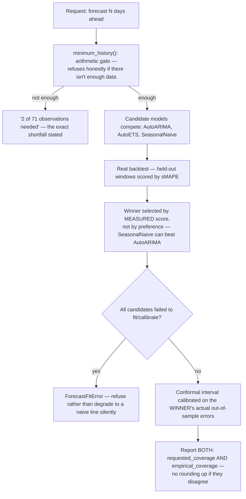

# Forecast

## What it is

Time-series forecasting — for spend, in the running deployment — with a
**calibrated** confidence interval, and a model **selection process that
measures rather than assumes** which forecasting method fits the data best.
If you have never worked with conformal prediction: most forecasting tools
give you an interval derived from the model's own internal assumptions
about error distribution, which can be wrong if those assumptions do not
hold for this particular series. Conformal calibration instead measures the
model's *actual* historical error on held-out data and builds the interval
from that — an empirically honest band, not a theoretical one.

## Why it exists here

A forecast that is confidently wrong is worse than no forecast. This
module's defining behaviour is that it **reports whether it kept its own
promise**: every forecast states both the coverage it was asked to hit and
the coverage it actually achieved on held-out backtests, side by side, with
no rounding up.

## Diagram



## The architecture

```
aegis/src/aegis/forecast/
  series.py   minimum_history() — the dependency-free arithmetic gate
  types.py    BacktestReport, ForecastFitError, IntervalMethod
  budget.py   cumulative-spend forecasting built on the per-step conformal bounds
  __init__.py the public forecast() entrypoint
```

## What is actually in Aegis

### The refusal arithmetic, spelled out exactly

`minimum_history()` computes the observations needed to **fit, calibrate,
and backtest honestly** — quoted, it exists "in the dependency-free layer,
so a caller can decide whether a series is even worth forecasting before
paying to import statsforecast":

```
need = backtest_windows * horizon
     + max(
         (conformal_windows - 1) * horizon + 1,   # conformal calibration
         2 * season_length + 1,                    # two full seasonal cycles
         2 * horizon,                               # train longer than you predict
       )
```

This is exactly what produced the real refusal message this project's own
forecast endpoint gave before it had enough data: *"2 of 71 observations
needed."* That number is not an arbitrary threshold — it is this formula,
computed for the actual requested horizon and seasonal period. Once the
demo seeder wrote 90 days of history, the same endpoint began answering
`available: true`.

### Model selection — measured, not assumed

Multiple candidate models (AutoARIMA, AutoETS, SeasonalNaive) are actually
**backtested** on held-out windows and scored by sMAPE — the winner is
whichever model's real, measured error was lowest, not a fixed preference
order. This produced a genuinely counter-intuitive real result in this
project: on the live seeded data, `SeasonalNaive` — the simplest candidate,
which just repeats the same point from one season ago — **beat**
`AutoARIMA` on measured backtest (sMAPE 19.9 vs 38.4). The seasonality in
the underlying weekday/weekend usage pattern was strong and regular enough
that a more sophisticated model overfit relative to just repeating the
pattern.

### Refusal instead of a silent naive fallback

`ForecastFitError` is raised, not swallowed, when every candidate —
including the seasonal-naive baseline — fails to fit or calibrate. Quoted:
*"a series that defeats AutoARIMA, AutoETS **and** the seasonal-naive
baseline has no forecast worth presenting."* The module's design bias
throughout is to refuse loudly rather than present a degraded number
without saying so.

### The coverage report — both numbers, always, no rounding up

Every `BacktestReport` states `requested_coverage` (what was asked for,
e.g. 90%) and `empirical_coverage` (what the backtest actually achieved)
as **two separate fields**, plus an explicit boolean for whether the
empirical figure reached the requested one — with no rounding. A forecast
that promised 90% coverage and measured 79% on backtest reports both
numbers plainly rather than only the requested figure.

## How it runs

1. A forecast request states a horizon and (implicitly, from the data) a
   seasonal period.
2. `minimum_history()` checks whether enough observations exist; if not,
   it refuses with the exact shortfall.
3. Candidate models are backtested on held-out windows; the winner is
   selected by measured score.
4. A conformal interval is calibrated on the winning model's actual
   out-of-sample errors.
5. The response reports the forecast, the selected model, and both the
   requested and empirically-achieved coverage.

## What is not here

- **No forecast is ever produced from insufficient history** — the
  arithmetic gate is a hard refusal, not a warning attached to a degraded
  number.
- **The interval method is conformal by default; a `parametric` alternative
  exists in the type system** (`IntervalMethod = Literal["conformal",
  "parametric"]`) but conformal calibration on measured out-of-sample error
  is the one actually exercised in the running deployment.
