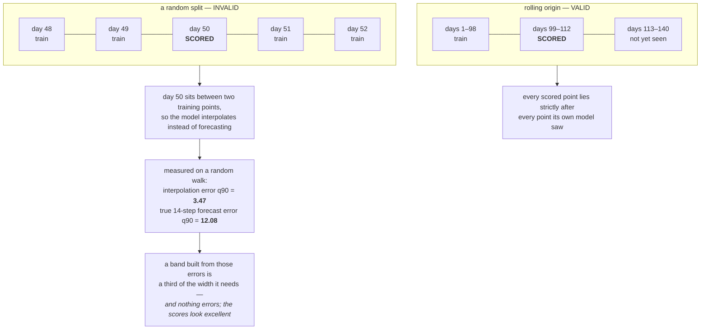
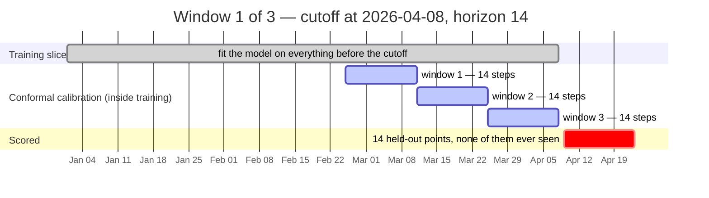
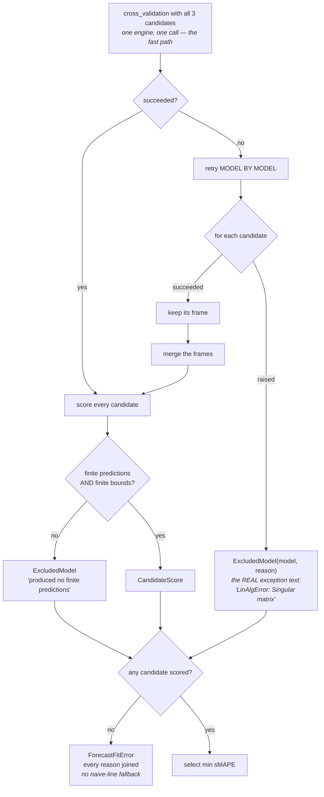

# Forecasting — the diagrams

Five diagrams. The two worth being able to draw from memory are **the rolling-origin split** and
**where the conformal band is calibrated** — between them they carry the module's entire
argument about honesty.

Everything else is explained in [`10-guide.md`](10-guide.md). A picture is here only where it
shows something prose cannot.

---

## 1. The pipeline: refuse first, then fit, then measure

*Look at the thick arrow — everything above it runs with none of the forecasting stack
installed.*

```mermaid
flowchart TB
    A["forecast_series(points, horizon, level)"] --> V{"horizon ≥ 1?<br/>backtest_windows ≥ 2?<br/>level a whole percent in (0,1)?"}
    V -->|no| E0["ValueError"]

    V -->|yes| N["normalise_points<br/>sort · naive UTC · duplicates SUM"]
    N --> F["infer_freq — the MODAL gap"]
    F --> MH{"len ≥ minimum_history?"}
    MH -->|no| R1["InsufficientHistoryError<br/>have=9 · need=71 · reason"]

    MH -->|yes| D{"any variation at all?"}
    D -->|no| R2["DegenerateSeriesError"]

    D ==>|yes| IMP["require('aegis&#91;forecast&#93;')<br/><b>the first heavy import</b>"]
    IMP --> CV["rolling-origin cross_validation<br/>3 cutoffs × 14 steps = 42 points"]
    CV --> SC{"any candidate scoreable?"}
    SC -->|no| R3["ForecastFitError<br/>+ each candidate's real exception"]

    SC -->|yes| SEL["select min sMAPE<br/>losers and baseline published"]
    SEL --> RF["refit the winner on the FULL history"]
    RF --> FIN{"every value finite?"}
    FIN -->|no| R4["ForecastFitError"]
    FIN -->|yes| OUT["ForecastResult<br/>+ BacktestReport(requested vs empirical)"]
```

Both refusals a short or flat series can hit are decided **before** `IMP`, so a tenant with nine
days of ledger is turned away without paying to import statsforecast.

---

## 2. Random split versus rolling origin

*Look at day 50 in the top row: its neighbours are in training, so the model never has to
extrapolate.*

The numbers are measured on one 140-step random walk, not a benchmark. The direction of the gap
is the point, not its exact size.

---

## 3. One backtest window, and where the band is calibrated

*Look at the calibration windows — they sit **inside** the training slice, ending at the cutoff,
never after it.*

The conformal quantile is taken over forecast errors from those three windows — **h-step-ahead
errors of the right horizon**, measured on data the model at this cutoff had not been fitted to
yet. Nothing after the cutoff enters the calibration.

The three calibration bars are drawn back-to-back ending at the cutoff, which is the shape of
the construction; the exact placement inside the training slice is statsforecast's business. The
part that is pinned, and the part that matters, is that they are **inside training and before
the cutoff**.

Windows 2 and 3 of the backtest repeat this whole picture with the cutoff moved forward 14 and
28 days. `step_size = horizon`, so the scored blocks never overlap and every held-out point is
scored exactly once. 3 × 14 = the 42 points the coverage rate is counted over.

---

## 4. What happens when a candidate blows up

*Look at the two paths into `ExcludedModel` — without the second one, a NaN candidate would be
in neither list.*

One casualty must not cost the caller its forecast — and nothing is silently dropped.

---

## 5. Where the heavy import happens

*Look at which box `minimum_history` lives in — that placement is what makes a free refusal
possible.*

```mermaid
flowchart TB
    subgraph LIGHT["imports with NONE of the forecasting stack installed"]
        TY["types.py<br/>pydantic only<br/><i>result contract + the four refusals</i>"]
        SE["series.py<br/>stdlib + types<br/><i>bucketing · freq inference · minimum_history</i>"]
        BU["budget.py<br/>types only<br/><i>burn-down arithmetic</i>"]
        INIT["__init__.py<br/>a lazy wrapper"]
    end

    subgraph HEAVY["imported on FIRST CALL, inside a function body"]
        EN["engine.py"]
    end

    INIT -->|"from aegis.forecast.engine import ..."| EN
    EN -->|"require('aegis&#91;forecast&#93;')"| SF["statsforecast + pandas + numpy<br/>numba-compiled · CPU only"]
    EN -.->|"extra missing"| ERR["ImportError naming<br/>pip install 'aegis&#91;forecast&#93;'"]

    SE --> REFUSE["a caller can decide whether a forecast is<br/>even offerable <b>before</b> paying for the stack"]
```

The API schema layer and the frontend type generator depend on `types.py`, which is why it must
stay pydantic-only. `tests/forecast/test_isolation.py` enforces every arrow here in a subprocess.

**Next:** [`50-interview.md`](50-interview.md) — the questions you'll be asked.
