# Forecast — the diagrams

Diagram 3 (the constant-series trap) is the one to be able to draw from memory. It is the
best single story in this module.

---

## 1. Refuse first, then fit, then measure

```mermaid
flowchart TB
    A["forecast_series(points, horizon, level)"] --> V{"horizon >= 1?<br/>windows >= 2?<br/>level a whole percent in (0,1)?"}
    V -->|no| E0["ValueError<br/><i>before any work</i>"]

    V -->|yes| N["normalise_points<br/>sort, naive UTC,<br/>duplicates SUM"]
    N --> C{"at least 2 points?"}
    C -->|no| R1["InsufficientHistoryError<br/>cannot infer a frequency"]

    C -->|yes| F["infer_freq — the MODAL gap,<br/>so one outage cannot reclassify"]
    F --> MH["minimum_history(h, season)"]
    MH --> C2{"len >= need?"}
    C2 -->|no| R2["InsufficientHistoryError<br/>have=9, need=71, + the reason"]

    C2 -->|yes| D{"any variation at all?"}
    D -->|no| R3["DegenerateSeriesError<br/><i>see diagram 3</i>"]

    D -->|yes| IMP["require('aegis&#91;forecast&#93;', 'statsforecast')<br/><b>the first heavy import</b>"]
    IMP --> CI["ConformalIntervals(n_windows, h)"]
    CI --> CV["rolling-origin cross_validation<br/>step_size = h, refit = False"]
    CV --> SC["score each candidate:<br/>sMAPE, MAPE, MAE, EMPIRICAL coverage"]
    SC --> ANY{"any scoreable?"}
    ANY -->|no| R4["ForecastFitError<br/>+ each candidate's real exception"]

    ANY -->|yes| SEL["select min sMAPE<br/>losers published, baseline included"]
    SEL --> RF["refit the winner on the FULL history"]
    RF --> FIN{"every value finite?"}
    FIN -->|no| R5["ForecastFitError<br/><i>no partially undefined forecast</i>"]
    FIN -->|yes| OUT["ForecastResult<br/>+ BacktestReport(requested vs empirical)"]
```

**Everything before `IMP` is dependency-free.** A series can be shaped, validated and
refused without paying to import statsforecast at all.

---

## 2. Why a random split is invalid

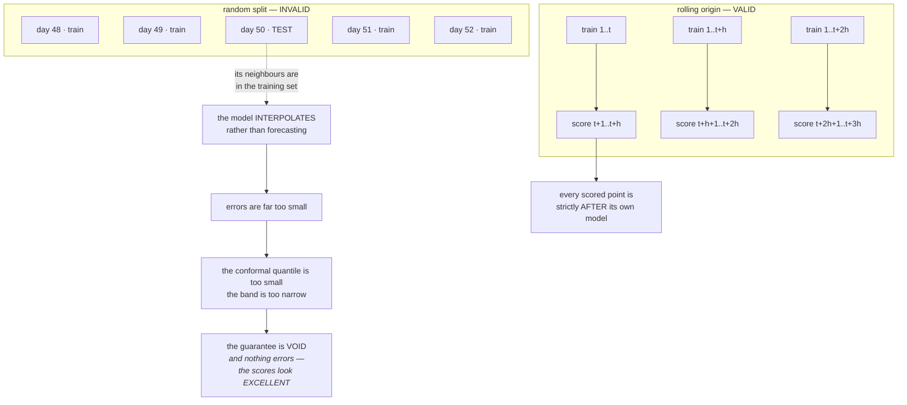

**The symptom of leakage is excellent scores, not an error.** That is what makes it
dangerous: a leaking evaluation looks like a triumph until production.

---

## 3. The constant series — every number true, the whole thing a lie

```mermaid
flowchart TB
    LEDGER["a quiet tenant's ledger<br/>140 days, all 0.0<br/><i>gap-filled with REAL zeros</i>"] --> FIT["the fit"]

    FIT --> M1["sMAPE = 0.0%<br/><i>both sides ~0 contributes 0</i>"]
    FIT --> M2["MAE = 0.00"]
    FIT --> M3["conformal band width = 0<br/><i>90th percentile of zeros is zero</i>"]

    M3 --> COV["coverage: is 0.0 inside &#91;0.0, 0.0&#93;?<br/><b>YES</b>, 42 times out of 42"]
    COV --> EMP["empirical_coverage = 1.0"]
    EMP --> MEETS["coverage_meets_request<br/>1.0 >= 0.9 → <b>TRUE</b>"]

    M1 --> DASH
    M2 --> DASH
    MEETS --> DASH
    DASH["the dashboard:<br/>sMAPE 0.0% · achieved 100% · meets request"]

    DASH --> LIE["a BETTER result than any real<br/>forecast will ever produce —<br/>describing the ABSENCE of data"]

    LEDGER --> CHECK{"spread <= 1e-12 x scale?"}
    CHECK -->|yes| REFUSE["DegenerateSeriesError<br/><i>before statsforecast is even imported</i>"]
```

**Why no honesty control caught it.** Requested and achieved were separate fields — both
correct. Coverage was measured, not assumed — it measured 100%. The comparison was strict
— it passed on merits. The losers were published — they scored perfectly too.

Every control answers *"is this number computed correctly?"* None of them asks *"was this
question well-posed?"*

---

## 4. Two kinds of band

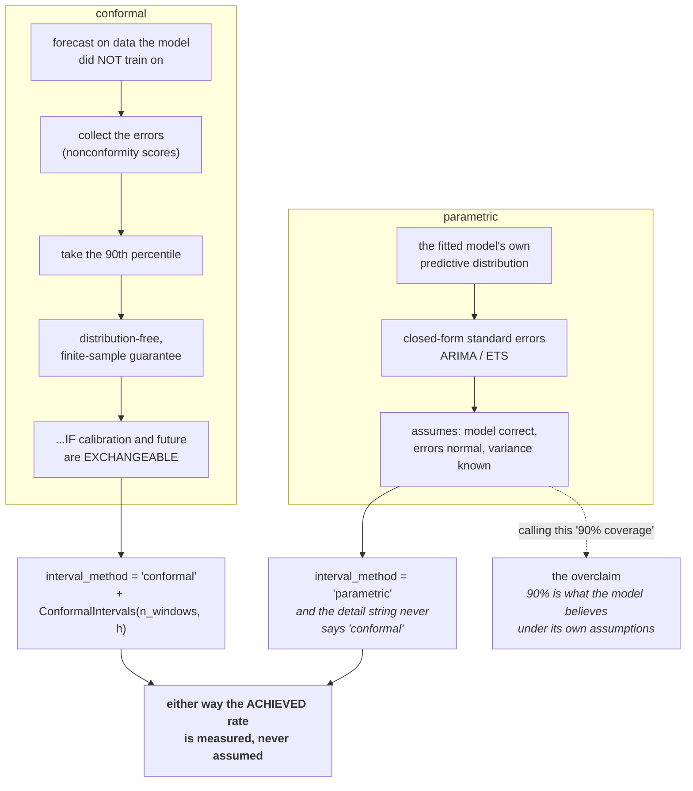

---

## 5. Requested versus achieved

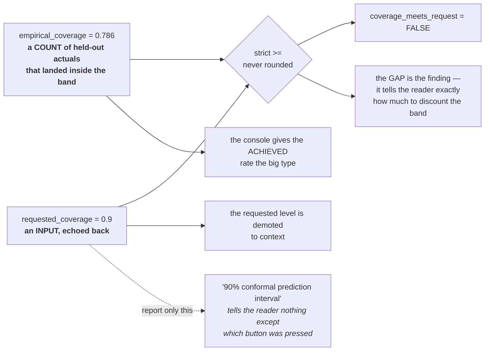

---

## 6. The minimum-history arithmetic

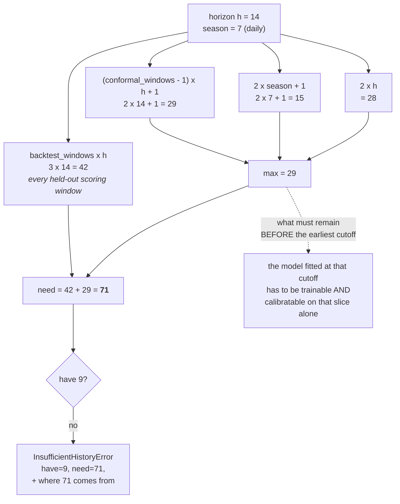

**The refusal carries arithmetic, not adjectives.** "Insufficient history" is a shrug.
"Have 9, need 71" lets the user wait or shorten the horizon.

---

## 7. Backtest failure handling

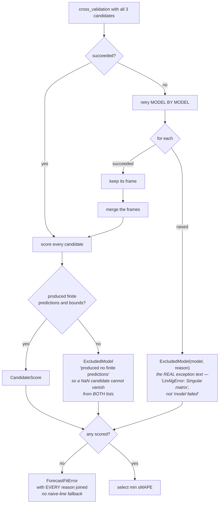

**One casualty must not cost the caller its forecast** — and nothing is silently dropped.

---

## 8. Metric definedness

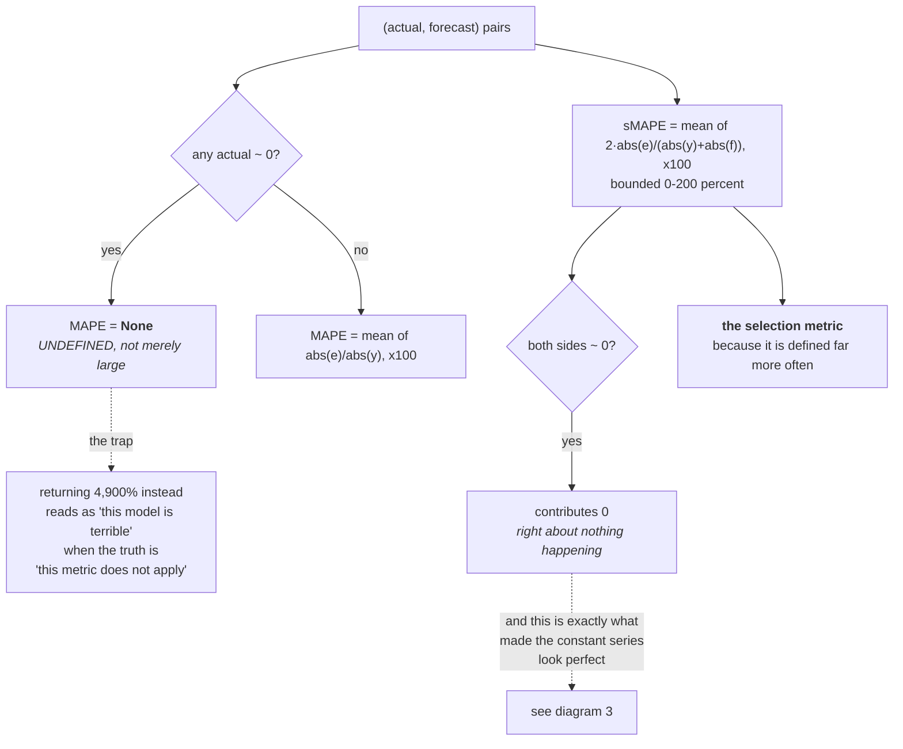

---

## 9. The burn-down envelope

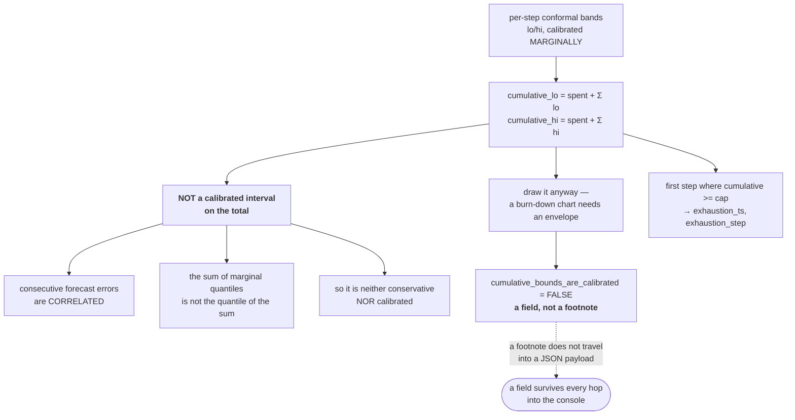

---

## 10. Refusal as a transport decision

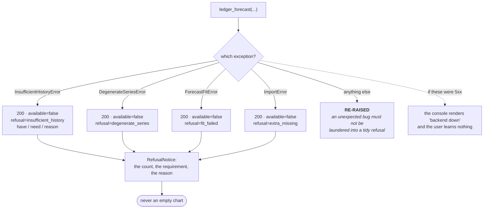

**A refusal is a result, not an error.** "This tenant has nine days of ledger and needs
seventy-one" is the most useful thing the surface can say.

---

## 11. Where the heavy import happens

```mermaid
flowchart TB
    subgraph LIGHT["imports with NONE of the stack installed"]
        TY["types.py<br/>pydantic only"]
        SE["series.py<br/>stdlib + types"]
        BU["budget.py<br/>types only"]
        INIT["__init__.py<br/>a lazy wrapper"]
    end

    subgraph HEAVY["imported on FIRST CALL, inside a function body"]
        EN["engine.py"]
    end

    INIT -->|"from aegis.forecast.engine import ..."| EN
    EN -->|"require('aegis&#91;forecast&#93;', 'statsforecast')"| SF["statsforecast + pandas + numpy<br/>numba-compiled, CPU only"]

    SE --> REFUSE["minimum_history() lets a caller<br/>decide whether a forecast is<br/>even offerable — <b>before</b><br/>paying to import the stack"]

    EN -.->|"extra missing"| ERR["ImportError naming<br/>pip install aegis&#91;forecast&#93;"]
```

---

**Next:** [`50-interview.md`](50-interview.md).
