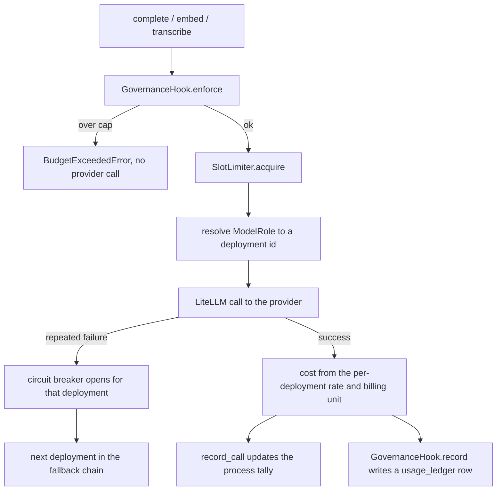

# Gateway

## What it is

The single chokepoint every model call passes through — chat completions,
embeddings, transcriptions, vision. One module talks to the provider; every
other module calls it.

Because there is exactly one door, routing, cost metering, budget enforcement,
concurrency limiting and circuit breaking are each implemented once and cannot
be forgotten at a call site.

## Why it exists

Three properties become structural rather than a matter of discipline. A
budget check happens **before** the provider is contacted, so an over-cap
tenant never generates a bill. A call's cost is computed and ledgered **after**
every successful call, so nothing spends money invisibly. And a concurrency
slot is held for the call's **actual** duration, retries and fallbacks
included.

## Diagram

## How it works

**The fleet is declared in Python.** `routing.py::_FLEET_DECLARATION` holds
**12** `Deployment` rows, each with a real input and output rate per 1,000
tokens. There is no JSON or YAML rate table anywhere in the repository, and
import-time checks raise immediately on a duplicate deployment id or on a
`tenant_selectable=True` deployment sitting on a role the safety layers use.

| Role | Default deployment | Tenant-selectable members |
| --- | --- | --- |
| `CHEAP` | `genailab-maas-gpt-35-turbo` | none |
| `REASONING` | `genailab-maas-Phi-4-reasoning` | none |
| `GENERATION` | `genailab-maas-gpt-4o` | gpt-4o, DeepSeek-V3-0324, Llama-3.3-70B-Instruct, Llama-4-Maverick-17B |
| `EMBEDDING` | `genailab-maas-text-embedding-3-large` | none |
| `VISION` | `genailab-maas-Llama-3.2-90B-Vision-Instruct` | none |
| `VOICE` | `genailab-maas-whisper` | none |

Only the answer-generation tier is tenant-selectable. Everything else is
infrastructure a tenant does not pick — including the classifier the guardrails
judge them by. A tenant who selects DeepSeek-V3 is ledgered at DeepSeek's
price, not gpt-4o's.

**Billing units.** `BillingUnit` is `TOKENS`, `AUDIO_MINUTES` or `IMAGES`.
`VOICE` bills per audio minute; every other role bills per token. Carrying the
unit explicitly is what stops a transcription with zero output tokens from
ledgering as `$0.00` and slipping past a USD cap. `usage_ledger` therefore has
`audio_seconds` and `images` columns alongside the token counts.

**The limiter, chosen once at boot.**

| Limiter | Scope | Chosen when |
| --- | --- | --- |
| `NoSlotLimiter` | `unlimited` | `GATEWAY_MAX_CONCURRENT_CALLS < 1`; a warning is logged |
| `RedisSlotLimiter` | `fleet` | stores are on and a `REDIS_URL` is configured; every process shares one count |
| `LocalSlotLimiter` | `process` | the fallback; bounds this interpreter only, and says so |

The lease is derived from `max_call_hold_seconds(llm_timeout_seconds)`, not
from the timeout directly, because the outer backstop gives the primary
deployment and each fallback its own timeout budget. A lease shorter than the
call it guards would hand the slot to a second caller mid-flight.

**The circuit breaker is scoped per deployment.** A deployment failing
repeatedly is skipped in the fallback chain, and one health-check probe
reopens it later. Keyed any more broadly, one tenant's failures could degrade
or charge another tenant. A fallback chain also never crosses a tenant's own
pricing tier.

**Governance is injected, not built in.** The standalone `aegis.gateway`
package does no budget enforcement at all unless a host supplies a
`GovernanceHook` — it never pretends to enforce. The backend injects a real
one at import time in `app.core.llm`.

## What it stores

This module owns no tables. Its metering writes one row per successful call
into `usage_ledger`, which the governance module owns:

| Column | What it carries |
| --- | --- |
| `tenant_id`, `user_id` | who spent it |
| `ts` | when |
| `model` | the deployment id actually called |
| `prompt_tokens`, `completion_tokens` | token counts |
| `audio_seconds`, `images` | the non-token billed units |
| `cost_usd` | computed from the deployment's declared rate and billing unit |
| `trace_id` | the trace correlation id |
| `run_id` | the spend-to-run attribution; `NULL` means "not attributable to a run", never zero and never unknown |

`run_id` deliberately has **no** foreign key to `runs`. The ledger row is
written during the run; the `runs` header is written afterwards, so a
constraint would fail every in-run insert and take the USD caps with it.

The gateway also keeps a process-wide in-memory tally that
`GET /v1/metrics` and `GET /v1/gateway/optimization` read.

## Security and tenant isolation

- `usage_ledger` carries `tenant_id` and is registered for Postgres row-level
  security. It is also **append-only for the serving role**: `UPDATE` and
  `DELETE` are revoked.
- Budget enforcement happens before any network call, so an exhausted tenant
  never reaches the provider.
- The circuit breaker is keyed on the deployment, so no tenant's failure
  history can affect another tenant's service or spend.
- Only `GENERATION` deployments are tenant-selectable; the guardrail
  classifier, the embedder and the voice model cannot be chosen by a tenant.
- `ensure_spend_caps_bind()` refuses to boot a non-dev deployment whose caps
  do not bind — fail-open budgets, or no governance hook at the chokepoint.

## API surface

| Method | Path | Who may call | Returns |
| --- | --- | --- | --- |
| GET | `/v1/gateway/optimization` | any authenticated caller | measured per-role savings versus the frontier baseline, plus the effective routing, fallback and baseline knobs |
| GET | `/v1/models` | any authenticated caller | the effective role-to-deployment routing table with each row's unit cost and billing unit |
| GET | `/v1/metrics` | any authenticated caller | the efficiency and cost dashboard fed by the tally |

The gateway itself is a library surface: `app.core.llm.complete`, `.embed`
and `.transcribe`.

## Configuration

| Variable | Default | Effect |
| --- | --- | --- |
| `GENAILAB_BASE_URL` | `https://genailab.tcs.in` | the provider endpoint (backend settings) |
| `GENAILAB_API_KEY` | `""` | provider credential |
| `GENAILAB_SSL_VERIFY` | `false` | TLS verification for the provider |
| `LLM_MAX_OUTPUT_TOKENS` | `1024` | per-call output ceiling |
| `LLM_TIMEOUT_SECONDS` | `60.0` | per-call timeout; the slot lease is derived from it |
| `GATEWAY_MAX_CONCURRENT_CALLS` | `12` (backend) / `0` (standalone package) | concurrency bound; below 1 means unlimited |
| `GATEWAY_SLOT_WAIT_SECONDS` | `60.0` | how long a caller waits for a slot |
| `GATEWAY_BREAKER_THRESHOLD` | `3` | consecutive failures before a deployment's breaker opens |
| `GATEWAY_BREAKER_COOLDOWN_SECONDS` | package default | how long it stays open before a probe |
| `GATEWAY_BASELINE_ROLE` | unset | the role savings are repriced against |
| `MODEL_<ROLE>` | per-role fleet default | overrides a role's deployment, e.g. `MODEL_GENERATION` |
| `COST_<ROLE>_IN` / `COST_<ROLE>_OUT` / `COST_<ROLE>_UNIT` | declared rates | override a role's rate or billing unit |
| `BUDGET_FAIL_OPEN` | `false` | whether a budget-check failure admits the call |
| `REDIS_URL` | `redis://localhost:6379/0` | decides fleet-wide versus per-process limiting |

The standalone package reads its own `GATEWAY_BASE_URL`, `GATEWAY_API_KEY`,
`GATEWAY_SSL_VERIFY`, `GATEWAY_MAX_OUTPUT_TOKENS`, `GATEWAY_TIMEOUT_SECONDS`
and `GATEWAY_BUDGET_FAIL_OPEN` only when no host calls `configure()`. The
backend calls `configure()` at import of `app.core.llm`, so in the running
platform the `GENAILAB_*` and `LLM_*` settings are the live ones.

## Where it lives

| Path | What it does |
| --- | --- |
| `aegis/src/aegis/gateway/routing.py` | the 12-deployment fleet, rates, billing units, role-to-deployment resolution |
| `aegis/src/aegis/gateway/llm.py` | `complete` / `embed` / `transcribe`, the fallback chain, the circuit breaker, metering |
| `aegis/src/aegis/gateway/limiter.py` | `SlotLimiter` and its Redis, local and no-op implementations |
| `aegis/src/aegis/gateway/types.py` | `BudgetExceededError`, `LLMResult`, `Usage`, the `GovernanceHook` protocol |
| `aegis/src/aegis/gateway/stream.py` | the per-call `model_call` stream event |
| `backend/src/app/core/llm.py` | the host shim: builds the limiter, wires governance and observability, calls `configure()` |
| `aegis/src/aegis/governance/models.py` | `UsageLedger`, the table the metering writes to |

## What it does not do

- No external rate file. Changing a price means changing Python.
- The standalone package's own default concurrency limit is unlimited; only
  the backend's `Settings` default of 12 bounds the shipped deployment.
- It does not stream partial usage. Cost is recorded once, after a successful
  call completes.
- It does not decide budgets. It calls an injected hook and reports what the
  hook said.
- It does not retry across tenants or pricing tiers; a fallback stays inside
  the caller's own tier.
