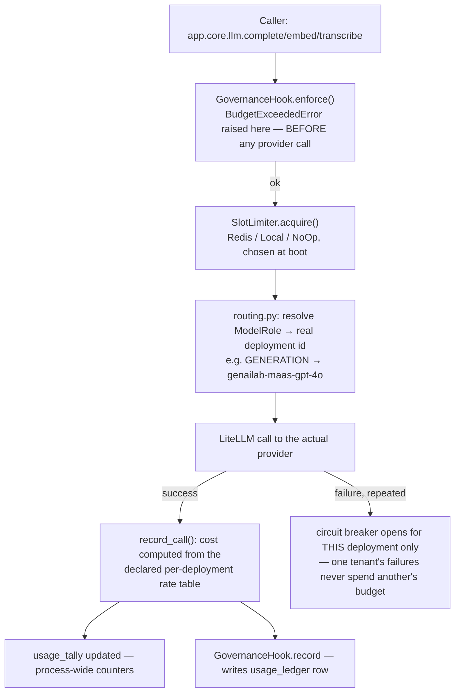

# Gateway

## What it is

The single chokepoint every model call in Aegis passes through — chat
completions, embeddings, transcriptions, everything. If you have never built
a system with a model-call gateway before: the alternative is every piece of
code that wants to call a model doing so directly, which means routing,
cost tracking, budget enforcement, and rate limiting all have to be
re-implemented (or forgotten) at every call site. Aegis has exactly one
place that actually talks to a model provider, and everything else calls
through it.

## Why it exists here

Three things this module makes structurally true rather than merely
policy: (1) a call's cost is computed and recorded **before** the caller
sees a result, so nothing can spend money invisibly; (2) a budget check
happens **before** the provider is ever contacted, so an over-cap tenant
never generates a bill in the first place; (3) a concurrency limit is held
for the **actual duration** of the call, including retries, not just the
first attempt.

## Diagram



## The architecture

```
aegis/src/aegis/gateway/
  routing.py    the 12-deployment fleet declaration, rates, role→deployment map
  llm.py        complete/embed/transcribe, the fallback chain, the circuit breaker
  limiter.py    SlotLimiter: Redis / Local / NoOp — concurrency bound
  types.py      BudgetExceededError, LLMResult, Usage, GovernanceHook protocol
  stream.py     the per-call model_call stream event
backend/src/app/core/llm.py   the host shim: builds the limiter, wires GovernanceHook, re-exports everything
```

## What is actually in Aegis

### The fleet — 12 real deployments, all in code, no rate file anywhere

`routing.py::_FLEET_DECLARATION` declares **12** `Deployment` rows, each
with a real input/output rate per 1,000 tokens. A sample, verbatim:

```python
Deployment("genailab-maas-gpt-4o", ModelRole.GENERATION, 0.0025, 0.01, tenant_selectable=True)
Deployment("genailab-maas-DeepSeek-V3-0324", ModelRole.GENERATION, 0.00027, 0.0011, tenant_selectable=True)
Deployment("genailab-maas-whisper", ModelRole.VOICE, 0.006, 0.0)
```

**There is no JSON or YAML rate table anywhere in the repository** — this is
all Python, with import-time invariant checks that raise immediately on a
duplicate deployment id, or on `tenant_selectable=True` combined with a role
reserved for guardrail-internal use.

Six `ModelRole`s map to a default deployment: `CHEAP`, `REASONING`,
`GENERATION`, `EMBEDDING`, `VISION`, `VOICE`. Every one is overridable per
deployment via a `MODEL_<ROLE>` environment variable.

### Billing units — not everything is priced per token

`BillingUnit` is `TOKENS | AUDIO_MINUTES | IMAGES`. Only `VOICE` defaults to
`AUDIO_MINUTES` — every other role is `TOKENS`. This matters concretely: a
Whisper transcription call used to ledger as `$0.00` before this was fixed,
because token-based costing has nothing to multiply for an audio call with
zero output tokens. Now it prices by audio minutes actually billed.

### The limiter — three modes, chosen once at boot

`backend/src/app/core/llm.py::_build_limiter()` picks exactly one:

- **`NoSlotLimiter`** (scope `unlimited`) — when the configured limit is
  `< 1`. A warning is logged; nothing is bounded.
- **`RedisSlotLimiter`** (scope `fleet`) — when `stores_enabled` and a
  `redis_url` are both configured. The bound is shared **across every
  worker process**, which is what "fleet" means here.
- **`LocalSlotLimiter`** (scope `process`) — the fallback when Redis is not
  configured. The bound applies only within one process.

**The lease is derived from the widest hold observed, not one attempt** —
if a call retries, the lease covers the full retry duration, so a slot is
never silently released mid-retry while the underlying call is still
running.

**A real divergence worth knowing:** the backend defaults
`GATEWAY_MAX_CONCURRENT_CALLS` to **12**. The standalone `aegis.gateway`
package, used with no host, defaults the same setting to **0** — which is
`NoSlotLimiter`, i.e. unlimited. Anyone using the gateway package directly
without the backend's settings gets no concurrency bound unless they set it
themselves.

### The circuit breaker — scoped per deployment, not per tenant

A deployment that fails repeatedly gets skipped in the fallback chain (one
health-check probe reopens it later). This is scoped to the **deployment**,
not to a tenant — the explicit reason, verified by a dedicated test suite
(`test_tenant_isolation.py`): a circuit breaker keyed any more broadly than
the deployment itself would let one tenant's repeated failures degrade
service, or worse, get charged, for another tenant entirely. A fallback
chain also never crosses a tenant's own pricing/model tier.

### Governance — enforced before the call, recorded after

`GovernanceHook.enforce()` is called and can raise `BudgetExceededError`
**before** any provider call is made — proven by a dedicated test asserting
zero calls reach the underlying `acompletion` when a budget is already
exhausted. `GovernanceHook.record()` runs only after a **successful** call,
writing the real `usage_ledger` row the rest of the platform (dashboards,
forecast, governance) reads from.

## How it runs

1. `app.core.llm.complete/embed/transcribe` is called (this is the shim
   every other backend module imports, not the raw gateway package).
2. `GovernanceHook.enforce()` checks budgets; raises before any network call
   if a cap is already tripped.
3. The slot limiter acquires a concurrency slot, with a lease sized to the
   call's actual (possibly retried) duration.
4. `routing.py` resolves the role to a real deployment id.
5. The provider call goes out through LiteLLM.
6. On success, cost is computed from the deployment's declared rate and
   billing unit, `record_call` updates the process-wide tally, and
   `GovernanceHook.record()` writes the ledger row.
7. On repeated failure, that deployment's circuit breaker opens — scoped
   to the deployment, never propagating to another tenant's calls.

## What is not here

- **No external rate file.** Every rate is a Python literal in
  `_FLEET_DECLARATION`; changing a price means changing code, not a config
  file.
- **The standalone gateway's own default concurrency limit is unlimited**
  (0 = `NoSlotLimiter`) — only the backend's `Settings` default of 12 bounds
  it in the shipped deployment.
- **Two credential env-var families coexist** (`GENAILAB_*` and
  `GATEWAY_*`) and which one is actually live depends on whether
  `app.core.llm` has been imported yet, since it calls `configure()` at
  import time — this is a real source of confusion worth being deliberate
  about when setting environment variables.
- **`aegis.gateway.routing` is imported directly by five backend modules but
  is not part of the package's declared `__all__`** — the backend depends on
  a path the gateway's own module docstring calls internal.
