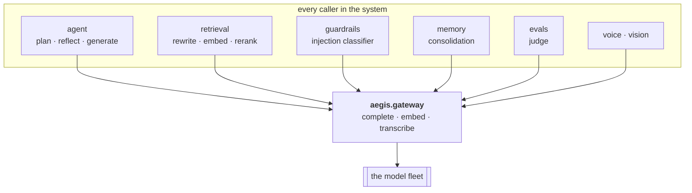
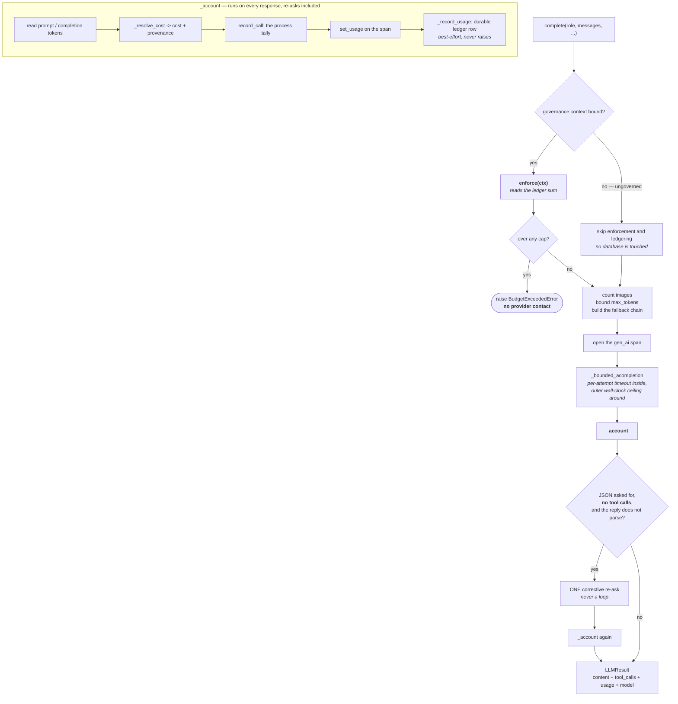
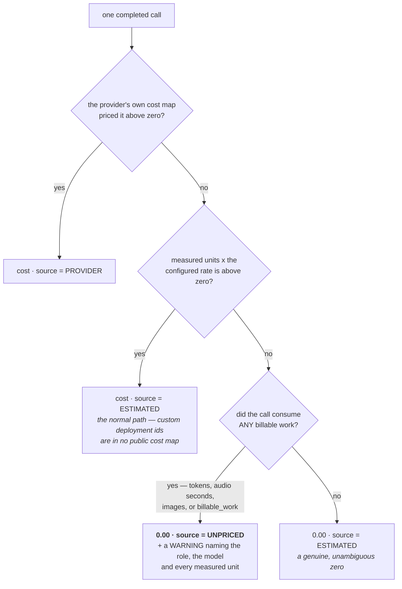
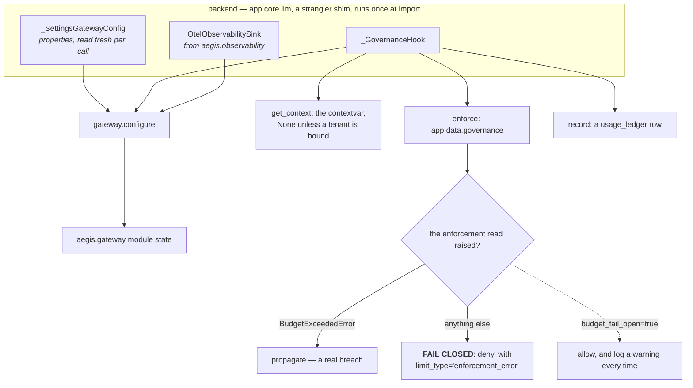
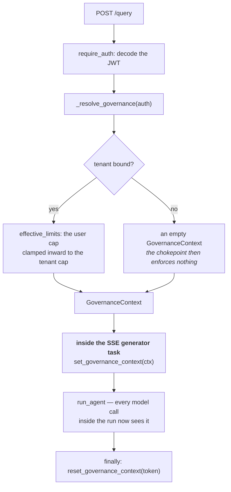

# The gateway — the diagrams

Five diagrams. The two worth reproducing from memory are **the `complete` path** and **cost
resolution** — between them they carry most of a conversation about this module.

The reasoning behind each is in [`10-guide.md`](10-guide.md); a picture is only here when it
shows something prose cannot.

---

## 1. Why one chokepoint

*Look for an arrow from a caller straight to the fleet. There is none — that is the entire
design.*

One user question is eleven model calls across six modules. Every one of them is a place
somebody could forget a timeout, forget to ledger the cost, hard-code a model id, or skip the
budget check.

> A convention that must be followed in forty places is not a control. It is a hope.

Because there is exactly one edge into the fleet, budget enforcement, the ledger row, the
`gen_ai` span, cost provenance and role routing each exist in exactly one place — including for
the call site written next year by someone who read none of this.

---

## 2. `complete` — the full path

*Look at the two red-flag edges: `OVER -> RAISE`, and the middle clause of the JSON guard.*

The refusal happens **before** any provider contact. That is the difference between a cap and a
receipt: reconciliation tells you that you overspent.

The JSON guard requires *no tool calls* because a tool-call reply has empty content by design.
Drop that clause and every action the agent ever takes pays for a second round trip.

Note where the fallback chain lives — inside `_bounded_acompletion`, not around it. A fired
fallback is detected afterwards, by comparing `LLMResult.model` (the deployment that actually
responded) against the role's primary.

---

## 3. Cost resolution — never a silent zero

*Look at the `UNPRICED` box. Without it, "we could not price this" and "this was free" are the
same number.*

A cost dashboard that cannot tell a hole in its accounting from a free call is a dashboard that
lies. One enum field keeps them apart.

The `billable_work` flag on the third branch exists for exactly one case: a transcription with
no tokens, no reported duration and no caller-supplied duration. Without it, the call that most
needs the warning is the one call that could not trigger it.

---

## 4. What the host injects, and what happens when enforcement fails

*Look at the `FAIL CLOSED` branch — it is what stops a database blip from disabling every cap
in the system.*

Each of the three is injected behind a `Protocol`, so `import aegis.gateway` never drags in a
settings module, a database driver or an OpenTelemetry SDK. The standalone defaults are honest
no-ops — no enforcement, no ledger — and say so in their docstrings.

`_SettingsGatewayConfig` is properties rather than a snapshot, so mutating the settings
singleton at runtime or in a test is honoured on the very next call.

---

## 5. Where the context is bound on a request

*Look at where `set_governance_context` sits: inside the streaming task, not around it.*

The placement is load-bearing. An SSE generator runs in its own task context, so a context
variable bound *around* the task would not be visible at the chokepoint — every model call in
the run would come back ungoverned, silently, with no error anywhere.

**Next:** [`50-interview.md`](50-interview.md) — the questions you will be asked.
