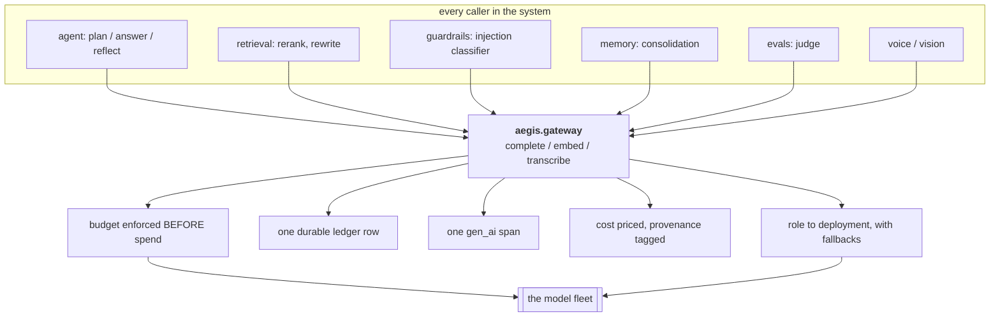
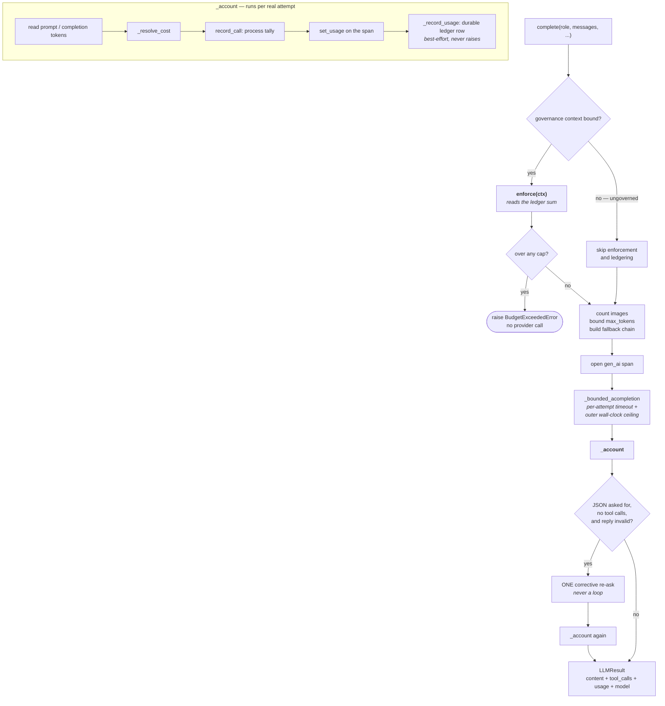
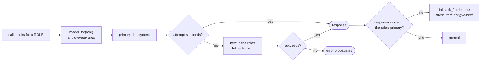
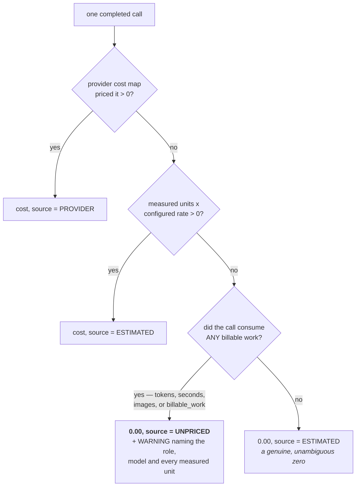
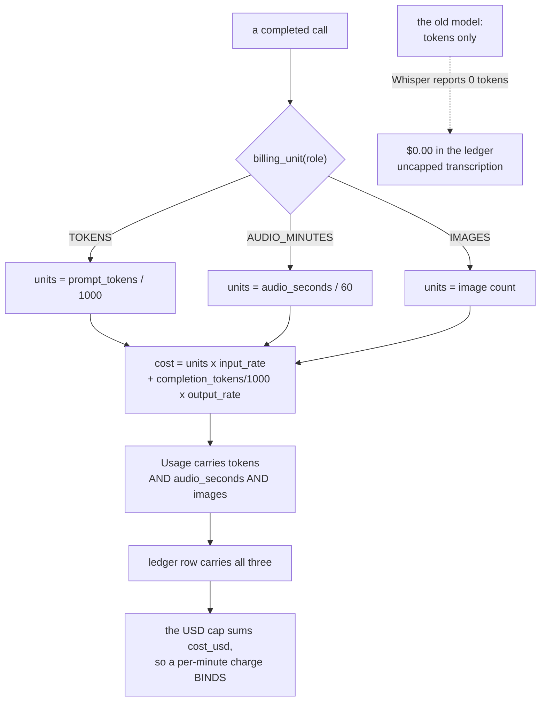
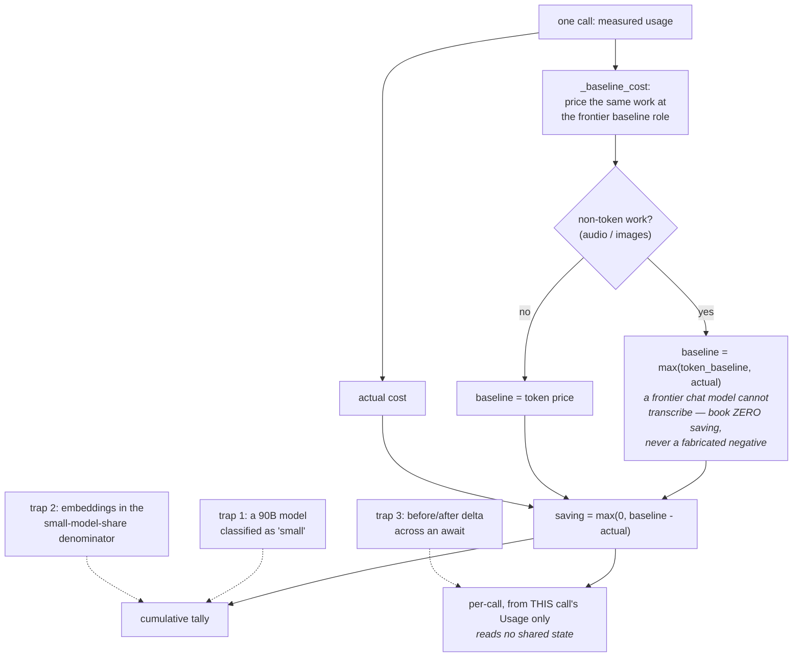
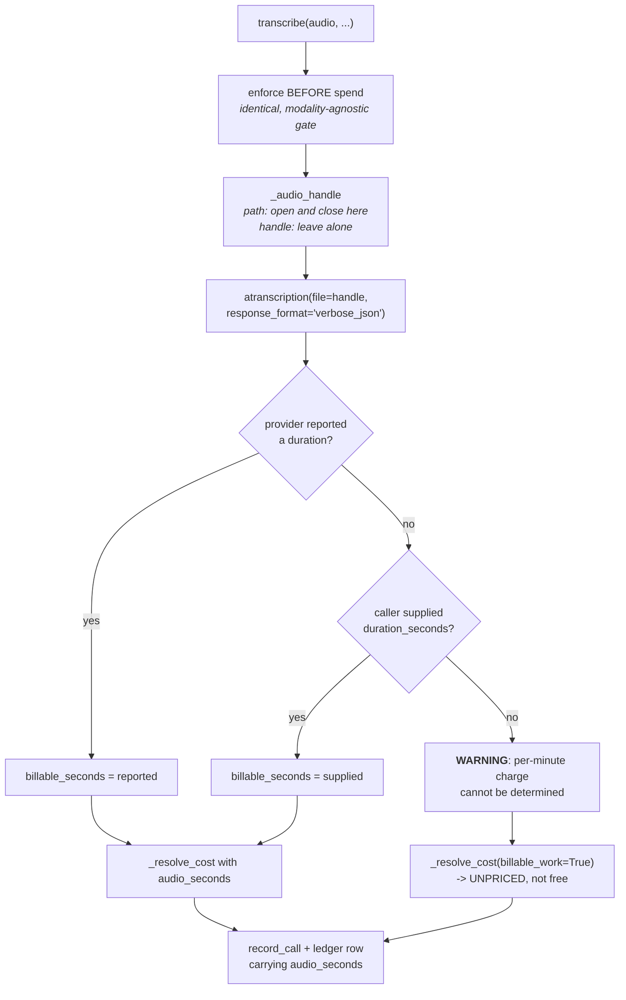
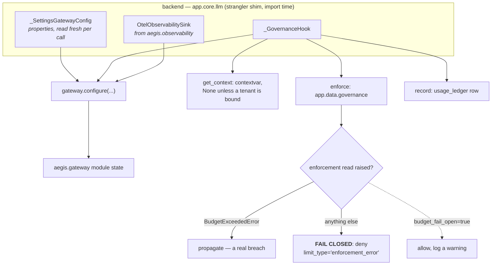
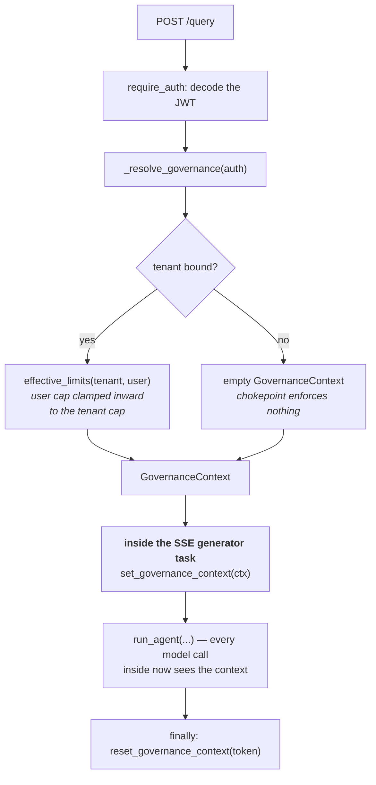

# The Gateway — the diagrams

If you can draw diagram 2 (the `complete` path) and diagram 4 (cost resolution) from
memory, you can talk about this module for half an hour.

---

## 1. Why one chokepoint

**The claim this diagram makes:** there is no arrow from a caller straight to the
provider. That is the entire design.

---

## 2. `complete` — the full path

**The two edges to point at.** `OVER -->|yes| RAISE` is the whole budget story: the
refusal happens before any provider contact. And the `JSON` guard requires *no tool
calls* — a tool-call reply has empty content by design, and without that condition every
tool call would pay for a second round trip.

---

## 3. Role routing and fallback

Default chains: `GENERATION → [REASONING, CHEAP]`, `REASONING → [GENERATION, CHEAP]`,
`CHEAP → [GENERATION]`. Each attempt carries its own timeout; the outer ceiling is
`timeout × (len(chain) + 1)`.

---

## 4. Cost resolution — never a silent zero

**`UNPRICED` is the point of this diagram.** Without that branch, "we could not price
this call" and "this call was free" are the same number, and a cost dashboard that
cannot tell them apart is a cost dashboard that lies.

---

## 5. Billing units — why tokens are not enough

The dotted branch is the bug. `VOICE` is priced `(0.006, 0.0)` — per **audio minute**,
with no output-token rate, because Whisper produces no billable output tokens.

---

## 6. The savings calculation, and the three ways it flatters you

All three dotted traps were real bugs here. Note that all three move the number in the
**favourable** direction — which is why nobody notices them.

---

## 7. `transcribe` — the non-token path

`response_format="verbose_json"` is not a formatting preference. It is what carries
`duration` — **the billing unit**.

---

## 8. Composition: how the backend wires the hooks

`_SettingsGatewayConfig` uses **properties, not a snapshot**, so mutating the settings
singleton at runtime (or in a test) is honoured on the next call.

---

## 9. Where the context is bound on a request

**The placement is load-bearing.** The context is bound *inside* the streaming task, not
around it. An SSE generator runs in its own context; binding outside would not be
visible at the chokepoint.

---

**Next:** [`50-interview.md`](50-interview.md) — the questions you will be asked.
