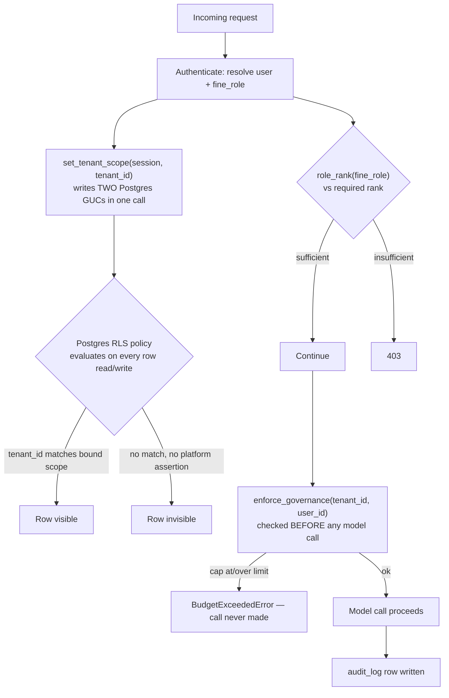

# Governance

## What it is

Governance is the module that answers four questions on every request into
Aegis: **who is asking** (authentication), **what tenant's data can they
touch** (row-level isolation), **what is their spend allowed to be** (budget
enforcement), and **what did they do** (audit). If you have never worked on a
multi-tenant system: imagine a bank where every customer's records sit in the
same building, in the same filing cabinets, and the entire safety of the
system depends on a teller never being able to open the wrong drawer — even
by accident, even under load, even after a bug. Governance is the set of
locks on those drawers, enforced at the database itself rather than trusted
to application code remembering to check.

## Why it exists here

Aegis serves multiple tenants (organisations) from one shared Postgres
database and one shared fleet of model deployments. Two failure modes this
module exists to make structurally impossible, not merely discouraged:

1. **One tenant's query returning another tenant's rows.** A `WHERE
   tenant_id = ?` clause that a developer forgets to add on one new endpoint
   is a real, common bug class. Aegis puts the same check **inside
   Postgres**, as a Row-Level Security policy, so a forgotten `WHERE` clause
   in application code is not a leak — the database itself refuses the rows.
2. **One tenant's runaway spend burning another tenant's or the platform's
   budget.** `enforce_governance` is called before every model call and
   raises before a single token is spent if any applicable cap is at or over
   its limit.

## Diagram



## The architecture

```
aegis/src/aegis/governance/
  rls.py          Row-Level Security: GUCs, the two predicates, bootstrap, the scope auditor
  enforcement.py  Budget resolution + enforce_governance() — raises BEFORE a model call
  config.py       The RBAC ladder: role_rank(), coarse/fine role mapping
  types.py        TenantScope, sealed auth-scope types
  security.py     threats-to-controls posture surface (see security.md)
  audit.py        audit_log writer
  schema.py       governance table definitions
  dashboard.py    the read model behind /governance/dashboard
```

## What is actually in Aegis

### Row-Level Security — the exact predicates, quoted

RLS is bound with **two Postgres GUCs in one statement**
(`SCOPE_BINDING_SQL`), not one:

```sql
SELECT set_config('app.tenant_id', :tenant_scope, true),
       set_config('app.tenant_all', :platform_scope, true)
```

`app.tenant_id` carries the numeric tenant. `app.tenant_all` carries a
**platform assertion** — written to `'on'` only when a caller explicitly
resolved that its authority spans every tenant (`tenant_id=None` was passed
deliberately, not left unset). The reason two GUCs exist rather than one, in
the module's own words:

> *"Writing only the first would leave 'a platform-admin read' and 'nobody
> bound a scope' spelled identically, and it is that spelling collision —
> not the policy — that makes the fail-open branch necessary."*

**There are two predicates, and which one is installed is a deployment
switch (`RLS_FAIL_CLOSED`).**

**Fail-open** (`_TENANT_ISOLATION_PREDICATE`) — the default:
```sql
(substring(current_setting('app.tenant_id', true) from '^[0-9]+$') IS NULL
 OR tenant_id = substring(current_setting('app.tenant_id', true) from '^[0-9]+$')::int)
```
A row is visible when the bound tenant matches, **or when nothing was
bound at all**. That second branch is documented as deliberate, not an
oversight: the authentication path reads `users` by username *before* any
tenant is known, and a strictly closed policy would break login itself.

**Fail-closed** (`_TENANT_ISOLATION_PREDICATE_CLOSED`) — installed when
`RLS_FAIL_CLOSED=true`:
```sql
(current_setting('app.tenant_all', true) = 'on'
 OR tenant_id = substring(current_setting('app.tenant_id', true) from '^[0-9]+$')::int)
```
Now the widening branch requires a **positive assertion** (`app.tenant_all =
'on'`), not merely an unset GUC. A session that bound nothing sees **zero
rows** — `tenant_id = NULL` is never true in SQL.

Why `set_config(..., true)` rather than `SET`: two independent reasons,
stated directly in the source. `SET app.tenant_id = :tid` is not
parameterisable — Postgres' `SET` takes a literal, so sending it as a bind
parameter over the extended query protocol raises a syntax error. This bug
existed and went unnoticed because the test suite ran on SQLite, which skips
RLS entirely at a dialect check. Second, `is_local=true` scopes the GUC to
the **current transaction**, discarded on commit — a session-level `SET`
would leak on a pooled connection into the next request that borrows it.

**The consequence that follows from `is_local=true`:** a session that
commits and then keeps working continues **unscoped** for its next
statement, because the GUC was transaction-local. `bind_scope_for_session`
exists specifically to re-bind the scope on Postgres's `after_begin` event
for every subsequent transaction on a long-lived session — described as "the
single most common real finding" of the scope auditor.

### `FORCE ROW LEVEL SECURITY`

Ordinary RLS policies do not apply to the table's **owner**. Aegis's
bootstrap forces the policy even for the owning role — otherwise the policy
would be silently inert for exactly the connection that runs it in
production.

### RBAC — the real ladder

```
platform_admin  rank 4
tenant_admin    rank 3
ai_team         rank 2   (devops also rank 2)
client          rank 1
unknown role    rank 0   — fails closed
```

`role_rank(fine_role)` collapses any unrecognised fine role to `client`'s
rank rather than erroring or granting default trust — an unknown role name
gets the *least* privilege, not an exception that might be caught and
ignored somewhere upstream.

### Budget enforcement — checked before spend, not after

`enforce_governance(tenant_id, user_id)` is called **before** every model
call. It resolves the *tightest* applicable cap across both the tenant's and
the user's own budgets (`_clamp_inward` on the tightest of each), and raises
`BudgetExceededError` — naming which cap tripped (`token_cap`, `usd_cap`,
`rpm`, or `tpm`) — if usage is already at or over the limit. **The call is
never made** when a cap has already been reached; this is not a
warn-after-the-fact system.

### Two GUCs elsewhere, deliberately named differently

The module docstring notes this predicate shape (widen on a positive
assertion) is reused in `aegis.analytics.provision.TENANT_PREDICATE` and
`aegis.dbadmin.catalogue.TENANT_PREDICATE` — but under **different GUC
names** in each case. The stated reason: "one name per boundary, so widening
one can never widen another" — a single shared name would mean a bug that
widens one subsystem's scope silently widens all three.

## How it runs

1. A request authenticates; the host resolves a `fine_role` and a
   `tenant_id`.
2. `set_tenant_scope(session, tenant_id)` binds both GUCs in one round trip
   for this transaction.
3. Every subsequent query on that session is filtered by Postgres itself —
   application-level `WHERE tenant_id = ...` clauses remain as a
   belt-and-suspenders layer, but the database is the actual enforcement
   point.
4. Before any model call, `enforce_governance` checks the resolved budgets
   and raises if any cap is tripped — no call is made.
5. The action is written to `audit_log`.

## What is not here

- **RLS is Postgres-only.** `set_tenant_scope` is a documented no-op on any
  other SQL dialect (e.g. the SQLite test database) — session GUCs and RLS
  policies are Postgres features with no equivalent tested here.
- **The fail-open predicate is the default**, not fail-closed. A deployment
  that wants the stricter behaviour must explicitly set `RLS_FAIL_CLOSED=true`.
- **Closing the login-time gap in the fail-open predicate requires a change
  outside this module** — the module's own comment says a `SECURITY
  DEFINER` login lookup would be needed to bind a scope before any tenant is
  known, and that change has not been made here.
- **A session that never calls `set_tenant_scope` at all is not the same
  failure as a session that calls it with `None`.** The former is "nobody
  resolved anything" (fail-open lets it through on the default predicate,
  fail-closed refuses it and the scope auditor names the path in logs);
  the latter is "I have resolved this caller's authority and it spans every
  tenant" — a deliberate assertion. Confusing the two in a code review is
  the mistake this whole design is built to make hard to make.
