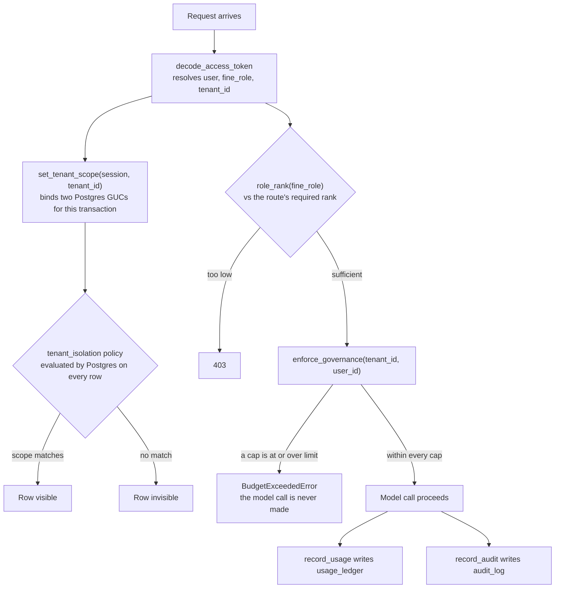

# Governance

## What it is

Governance answers four questions on every request into Aegis: **who is asking**
(authentication), **whose data may they see** (tenant isolation), **what may they
spend** (budgets), and **what did they do** (audit). It owns the tenancy tables,
the row-level security policies, the RBAC ladder and the audit trail.

## Why it exists

Aegis serves many organisations from one Postgres database and one fleet of model
deployments. Two failure modes have to be structurally impossible rather than
merely discouraged: one tenant's query returning another tenant's rows, and one
tenant's spend burning through somebody else's budget. Both are enforced here — the
first inside the database, the second before any model call is made.

## Diagram



## How it works

### Identity

`security.py` owns password hashing (Argon2id), JWT issue and decode. A token
carries a **fine role** and a tenant id. `principal_role()` derives the fine role
from the stored coarse role plus whether the user is pinned to a tenant: an
`admin` with no tenant is a `platform_admin`, an `admin` inside a tenant is a
`tenant_admin`.

### The RBAC ladder

`config.py` publishes `RBAC_LADDER` as data. Higher rank means more
administrative privilege.

| Fine role | Rank | Tenant-scoped | What it is |
|---|---|---|---|
| `platform_admin` | 4 | no | Global operator across every tenant. |
| `tenant_admin` | 3 | yes | Administrator of a single tenant. |
| `ai_team` | 2 | yes | AI/ML engineering operator; owns the LLM-Ops surfaces. |
| `devops` | 2 | yes | Platform/operations operator. |
| `client` | 1 | yes | Business end-user, always scoped to its own data. |

`role_rank()` returns **0** for any name it does not recognise, so an unknown role
sorts below every real one and fails closed on any ordering comparison. The
`user` alias ranks as `client`.

### Row-level security

**Row-level security (RLS)** is a Postgres feature: a policy attached to a table
that the database evaluates on every read and write, so a `WHERE` clause a
developer forgets is not a leak.

`set_tenant_scope(session, tenant_id)` binds **two** session variables (Postgres
calls them GUCs) in one statement:

```sql
SELECT set_config('app.tenant_id', :tenant_scope, true),
       set_config('app.tenant_all', :platform_scope, true)
```

`app.tenant_id` carries the numeric tenant. `app.tenant_all` carries a **platform
assertion**, set to `'on'` only when a caller resolved that its authority spans
every tenant. Two variables rather than one, because otherwise "a platform admin
read" and "nobody bound anything" would be spelled identically.

Two details of the call are load-bearing. `set_config` is used rather than `SET`,
because `SET` takes a literal and cannot be parameterised. The third argument
`true` means `is_local` — the setting is scoped to the current transaction and
discarded on commit, so it cannot leak onto the next request that borrows a
pooled connection. Because it is transaction-local, `bind_scope_for_session`
re-binds the scope on Postgres's `after_begin` event for every subsequent
transaction on a long-lived session.

Two predicates ship, and `RLS_FAIL_CLOSED` selects which one is installed.

**Fail-open (default).** A row is visible when the bound tenant matches, or when
nothing numeric was bound at all. The widening branch is there because
authentication reads `users` by username before any tenant is known:

```sql
(substring(current_setting('app.tenant_id', true) from '^[0-9]+$') IS NULL
 OR tenant_id = substring(current_setting('app.tenant_id', true) from '^[0-9]+$')::int)
```

**Fail-closed (`RLS_FAIL_CLOSED=true`).** Widening requires a positive assertion,
so a session that bound nothing sees zero rows — `tenant_id = NULL` is never true
in SQL:

```sql
(current_setting('app.tenant_all', true) = 'on'
 OR tenant_id = substring(current_setting('app.tenant_id', true) from '^[0-9]+$')::int)
```

`bootstrap_rls()` also issues `FORCE ROW LEVEL SECURITY`, because an ordinary
policy does not apply to the table's owner. With `RLS_SCOPE_AUDIT=true` (the
default) an engine-level listener logs every statement touching a tenant-scoped
table on a connection with no scope bound; `RLS_SCOPE_AUDIT_STRICT=true` raises
instead, which suits a test suite rather than a deployment.

**Append-only ledgers.** `_APPEND_ONLY_TABLES` names `audit_log`, `run_events` and
`usage_ledger`. Bootstrap grants the serving role its DML and then `REVOKE`s
`UPDATE, DELETE` on those three, expanding through `pg_inherits` so the monthly
partitions of `run_events` are covered too.

### Budgets

`enforce_governance(tenant_id=..., user_id=...)` runs **before** every model call.
It resolves the tightest applicable cap across the tenant's and the user's budgets
(`_clamp_inward` on the tightest of each) and raises `BudgetExceededError` — naming
which cap tripped: `token_cap`, `usd_cap`, `rpm` or `tpm` — when usage is already
at or over the limit. The call is not made. `record_usage()` writes the
`usage_ledger` row afterwards.

### Audit

`record_audit()` writes one `audit_log` row per governed action.
`list_recent_audit()` reads it back with server-side filters (actor, action
prefix, model, trace id, outcome, free text, time range), always ANDed with the
caller's sealed tenant scope.

## What it stores

Five tables on the shared `AegisBase` metadata.

| Table | Columns that matter |
|---|---|
| `tenants` | `id` (the value every other table's `tenant_id` points at), `name` (unique), `status` (`active` / `suspended`), `created_at`. |
| `users` | `id`, `username` (unique), `role` (`admin` / `ai_team` / `devops` / `client`), `tenant_id` (FK; NULL means platform-wide), `email`, `is_active`, `password_hash` (Argon2id — withheld from the database console by a column grant). |
| `budgets` | `scope_type` (`tenant` or `user`) + `scope_id`, `tenant_id`, `window` (`day` / `month`), and the four caps `token_cap`, `usd_cap`, `rpm`, `tpm`. Any cap may be NULL, meaning uncapped. |
| `usage_ledger` | One row per model call. `tenant_id`, `user_id`, `ts`, `model`, `prompt_tokens`, `completion_tokens`, `cost_usd`; `audio_seconds` and `images` so a transcription or vision call is a real row rather than `$0.00`; `run_id` (indexed, no foreign key — NULL means "not attributable to a run", never zero); `trace_id`. |
| `audit_log` | `tenant_id` + `ts` (with a `(tenant_id, ts DESC)` index), `action`, `actor`, `approved_by`, `model`, `trace_id`, and a `jsonb` `payload`. |

## Security and tenant isolation

This module *is* the isolation layer.

- **25 tables** are registered in `_TENANT_SCOPED_TABLES` and receive the
  `tenant_isolation` policy at boot. A tenant-scoped table that arrives without
  that registration looks governed from the outside and is not.
- **`_PLATFORM_BASELINE_TABLES`** (`settings`, `agent_skills`) additionally lets
  every tenant *read* the platform's rows while writing none of them — a resolver
  that could not see the platform layer would compute a value weaker than the
  platform chose.
- **Belt and braces.** Application queries still carry `WHERE tenant_id = ...`.
  The database policy is the boundary; the application predicate is what makes a
  missing policy fail a test instead of leaking quietly.
- **The predicate shape is reused** by `aegis.analytics.provision` and
  `aegis.dbadmin.catalogue`, under *different* GUC names — one name per boundary,
  so widening one can never widen another.

## API surface

All product routes are served under `/v1`.

| Method | Path | Who may call it | Returns |
|---|---|---|---|
| POST | `/v1/auth/login` | Anyone | A JWT plus the resolved role. |
| GET | `/v1/admin/tenants` | `platform_admin` | Every tenant. |
| POST | `/v1/admin/tenants` | `platform_admin` | The created tenant. |
| GET | `/v1/admin/users` | `tenant_admin` and above | Users in the caller's scope. |
| POST | `/v1/admin/users` | `tenant_admin` and above | The created user. |
| POST | `/v1/admin/users/{user_id}/role` | `tenant_admin` and above | The updated user; refuses removing the last platform admin. |
| GET | `/v1/admin/budgets` | `tenant_admin` and above | Budget rows with spend and remaining. |
| POST | `/v1/admin/budgets` | `tenant_admin` and above | The upserted budget; refuses a user cap above its tenant's. |
| GET | `/v1/admin/usage` | `tenant_admin` and above | The usage rollup. |
| GET | `/v1/audit` | admin or devops | Audit rows, newest first, server-side filtered. |
| GET | `/v1/governance/dashboard` | `tenant_admin` and above | Tenants, per-cap budget/spend/remaining, users, usage rollup and the recent audit tail. |

## Configuration

Read from the backend's environment (`backend/src/app/config.py`).

| Variable | Default | Effect |
|---|---|---|
| `JWT_SECRET` | a documented dev value | Token signing secret. A non-dev deployment carrying a known placeholder raises `InsecureConfigurationError` at startup. |
| `JWT_ALGORITHM` | `HS256` | Signing algorithm. |
| `JWT_EXPIRE_MINUTES` | `720` | Token lifetime. |
| `RLS_FAIL_CLOSED` | `false` | Installs the fail-closed predicate instead of the fail-open one. |
| `RLS_SCOPE_AUDIT` | `true` | Logs every statement on a tenant-scoped table with no scope bound. |
| `RLS_SCOPE_AUDIT_STRICT` | `false` | Raises instead of logging. |
| `BUDGET_FAIL_OPEN` | `false` | Whether a governance *read* failure lets the call through. |
| `POSTGRES_DSN` | local default | The serving role's connection. |
| `POSTGRES_ADMIN_DSN` | empty | The owner connection used for DDL and RLS bootstrap. |

## Where it lives

| File | What it does |
|---|---|
| `aegis/src/aegis/governance/models.py` | The five ORM tables and their enums. |
| `aegis/src/aegis/governance/rls.py` | GUCs, both predicates, `bootstrap_rls`, the append-only revokes, the scope auditor. |
| `aegis/src/aegis/governance/security.py` | Argon2id hashing, JWT issue/decode, `SecurityConfig`, role derivation. |
| `aegis/src/aegis/governance/config.py` | `RBAC_LADDER`, `role_rank()`, `effective_config()`. |
| `aegis/src/aegis/governance/enforcement.py` | Budget resolution, `enforce_governance`, `record_usage`, tenant/user/budget admin. |
| `aegis/src/aegis/governance/audit.py` | `record_audit`, `list_recent_audit`, outcome classification. |
| `aegis/src/aegis/governance/context.py` | The `GovernanceContext` contextvar read at the gateway chokepoint. |
| `aegis/src/aegis/governance/schema.py` | `reconcile_additive_columns` — installs additive column drift at bootstrap. |
| `aegis/src/aegis/governance/dashboard.py` | The read model behind `GET /v1/governance/dashboard`. |
| `aegis/src/aegis/governance/types.py` | Dependency-free wire types: `TenantScope`, `GovernanceConfig`, `Role`. |
| `backend/src/app/api/routes.py` | The admin, audit and dashboard routes listed above. |

## What it does not do

- **RLS is PostgreSQL-only.** `set_tenant_scope` is a no-op on any other dialect,
  including the SQLite test database. Session GUCs and policies have no equivalent
  there.
- **The append-only revoke is not tamper-proofing.** The owner role keeps full
  DML, so anyone holding `POSTGRES_ADMIN_DSN` can rewrite the trail. It makes
  tampering require that connection.
- **No SIEM export, and no audit retention or archival policy.** The trail grows.
- **The fail-open predicate is the default.** The stricter posture is opt-in via
  `RLS_FAIL_CLOSED=true`.
- **A session that never binds a scope is not the same as one that binds `None`.**
  The first is "nobody resolved anything"; the second is a deliberate assertion of
  platform-wide authority. The two GUCs exist to keep them distinguishable.
