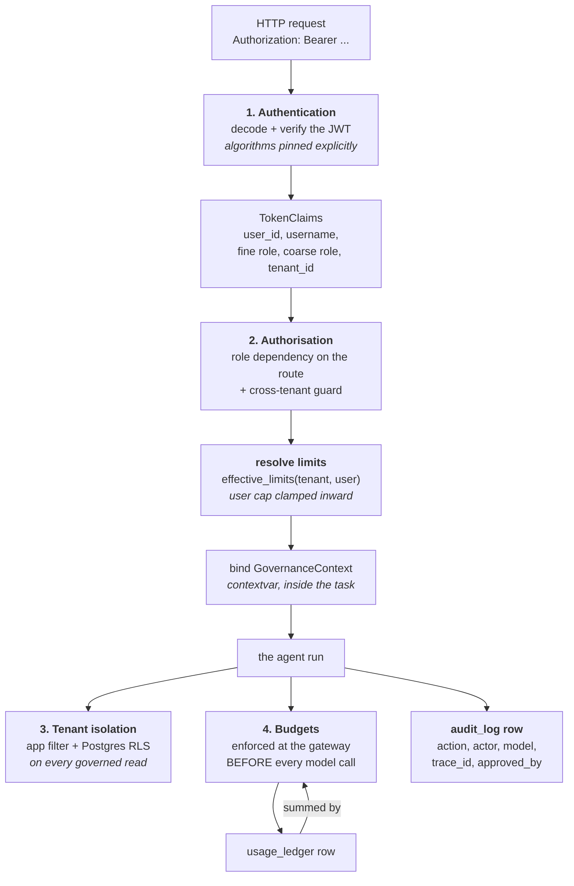
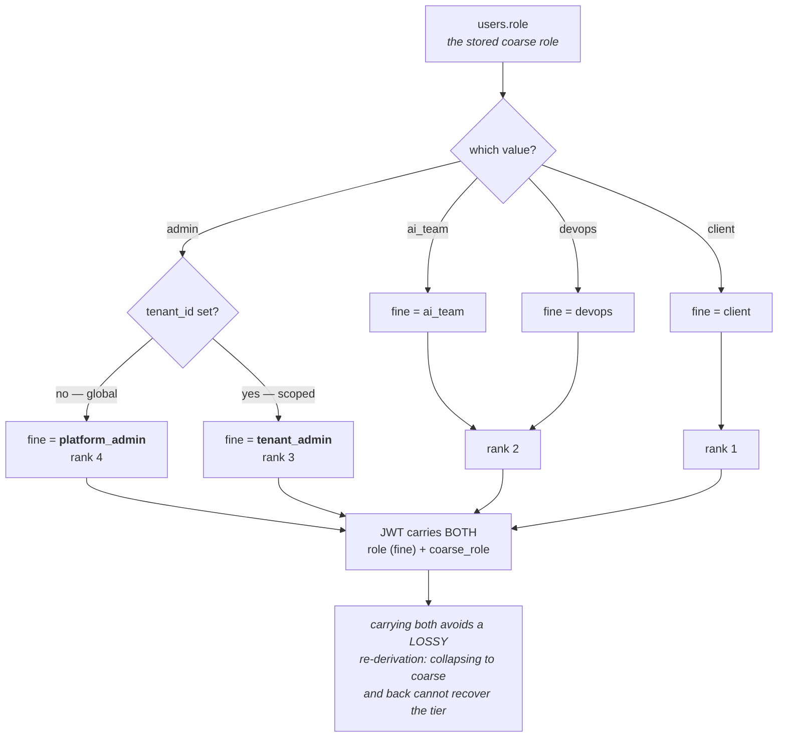
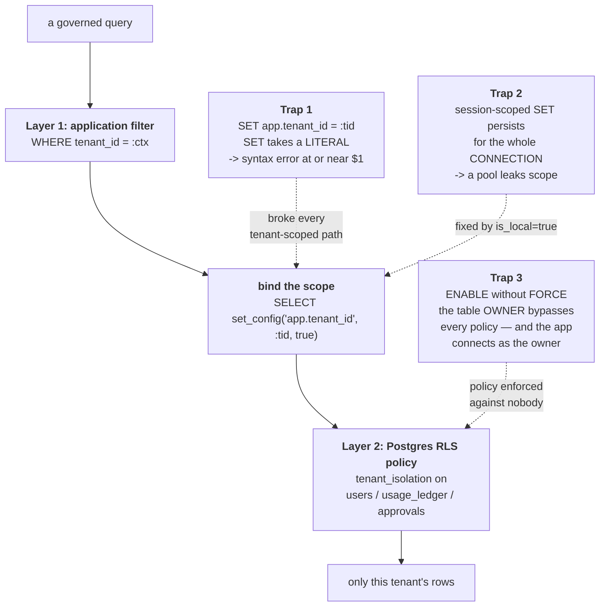
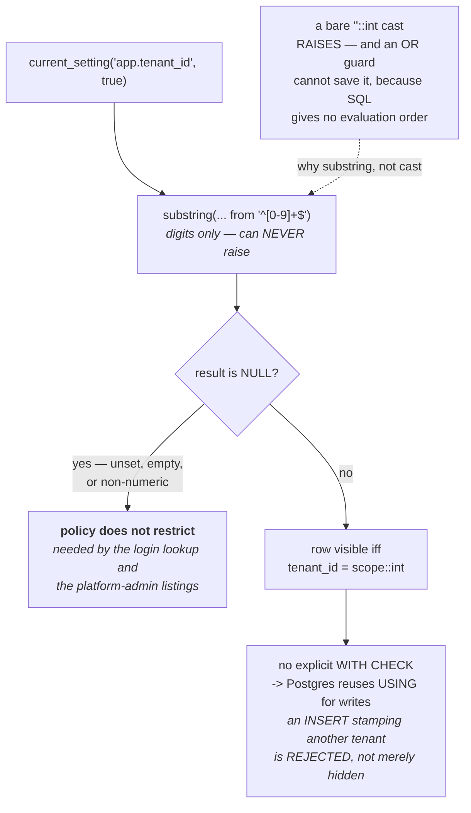
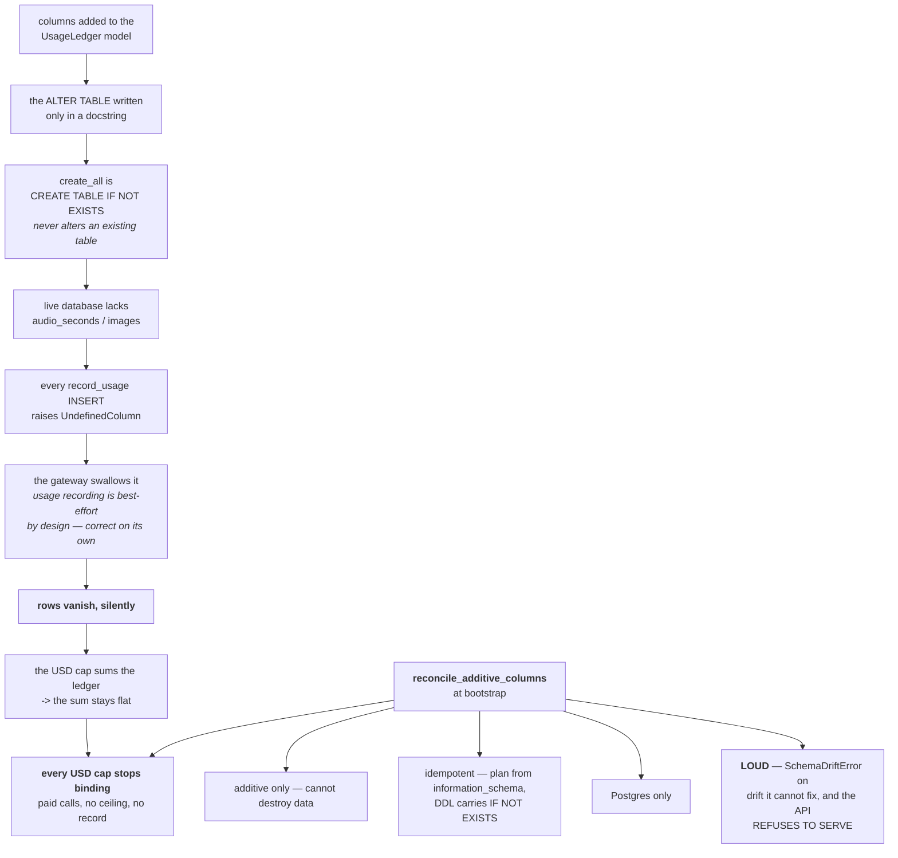
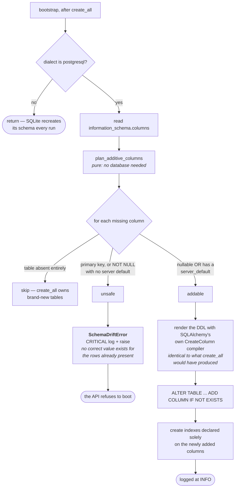
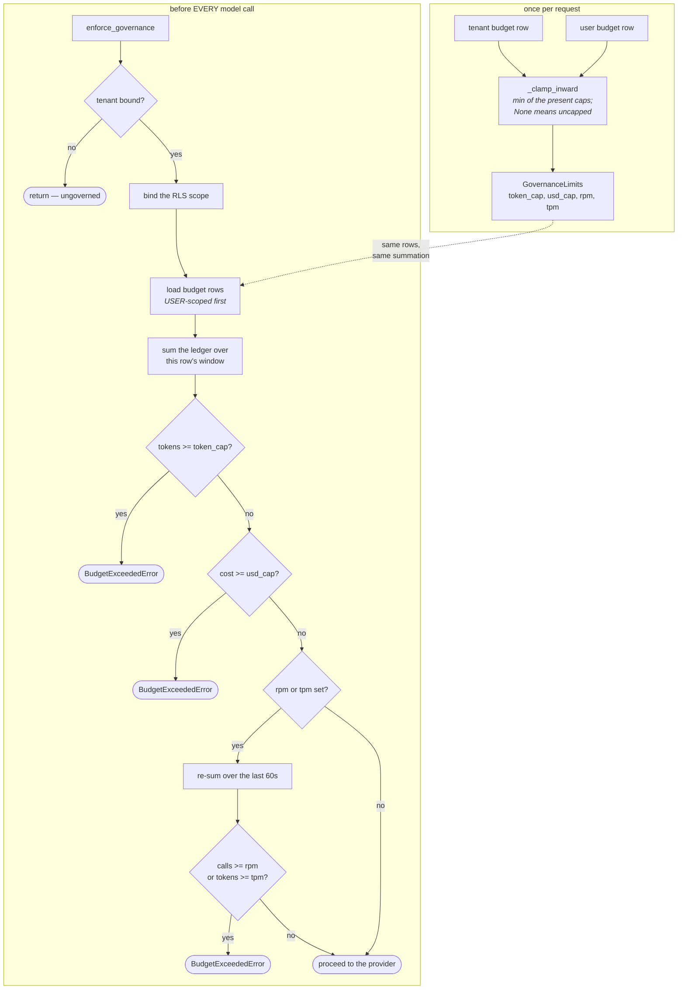
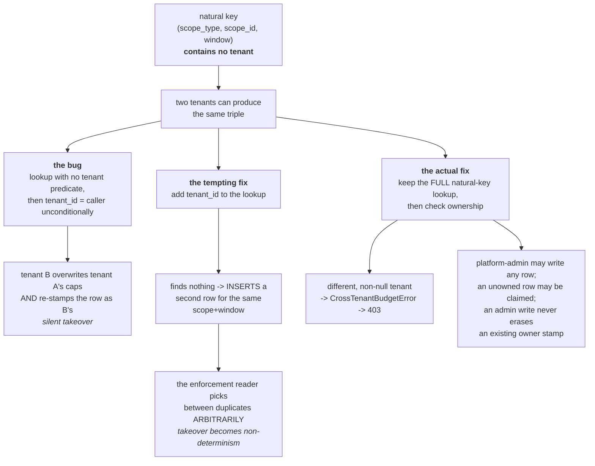
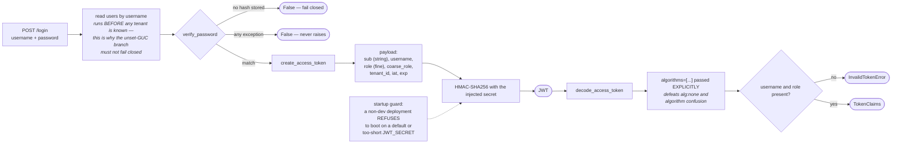

# Governance — the diagrams

Diagram 3 (the two isolation layers with both traps) and diagram 5 (the ledger failure
chain) are the two to be able to draw from memory.

---

## 1. The four controls, and where each sits in a request

The `LED → BUD` back-edge is the important one: the cap is computed from the ledger, so
the ledger's ability to accept rows *is* the cap.

---

## 2. The two role vocabularies

No fifth column. The admin split is **derived** from tenancy, so the two facts cannot
drift — they are the same fact. `ai_team` and `devops` deliberately share rank 2: neither
dominates the other.

---

## 3. Tenant isolation — two layers, and both traps

All three were live in this codebase. None is visible in code review: the code said
"set the tenant" and "enable RLS", and both statements were true.

---

## 4. The RLS predicate, branch by branch

**Describe the NULL branch honestly.** A bound numeric scope is strictly enforced; an
unbound request is not restricted. That is strictly more enforcement than before FORCE
(when the policy was inert for the owning role in every case), and it is a named gap, not
a claim of airtight isolation.

---

## 5. The ledger failure chain — why a schema change is a security control

Every individual layer is defensible. The bug lives entirely in the seam.

---

## 6. Additive reconciliation — the decision

---

## 7. Budget resolution and enforcement

**User rows first** so a user breach is attributed to the user. Comparison is `>=`, so
consumption *at* the cap blocks.

---

## 8. The cross-tenant budget takeover, and why the obvious fix is worse

---

## 9. Authentication, end to end

The payload is **encoded, not encrypted** — anyone holding the token reads every claim.
The signature buys integrity, which makes the signing secret the single thing standing
between a user and any tenant.

---

**Next:** [`50-interview.md`](50-interview.md).
