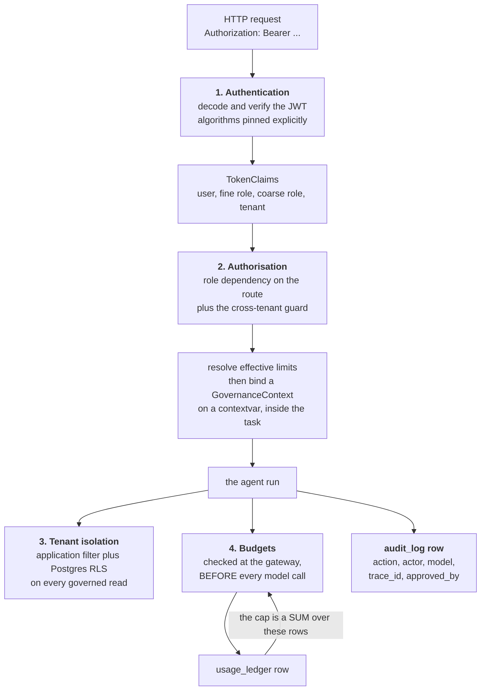
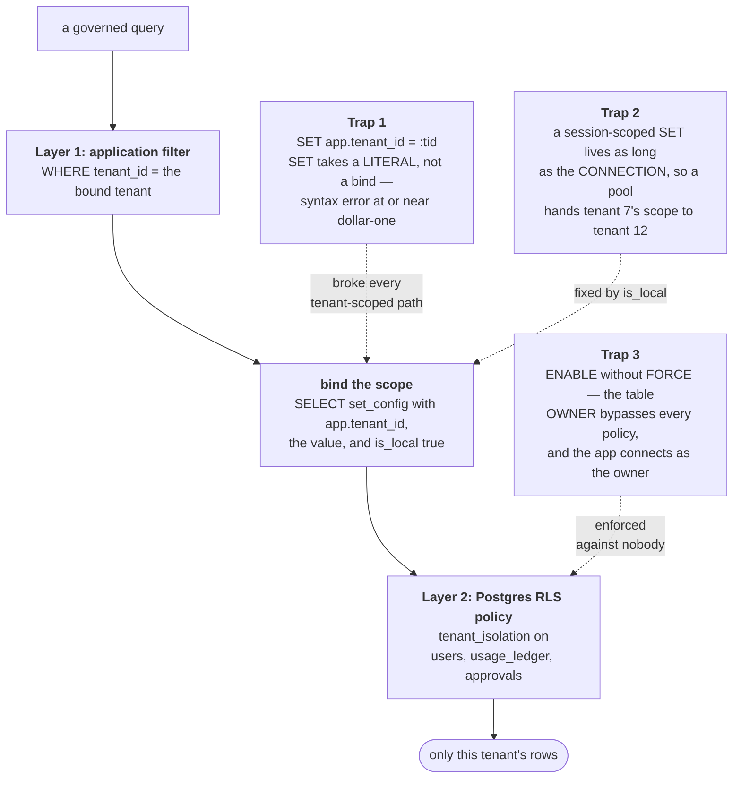
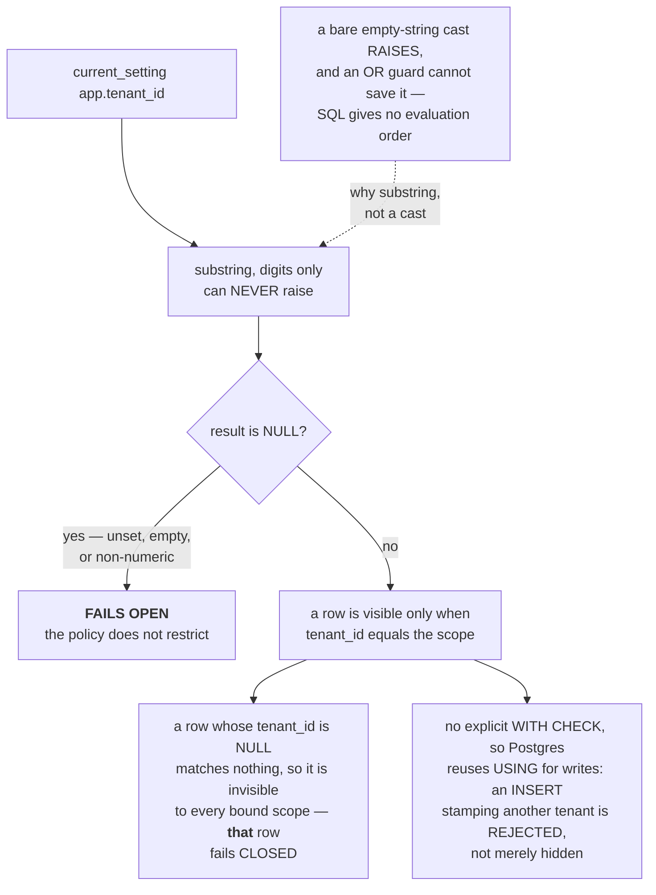
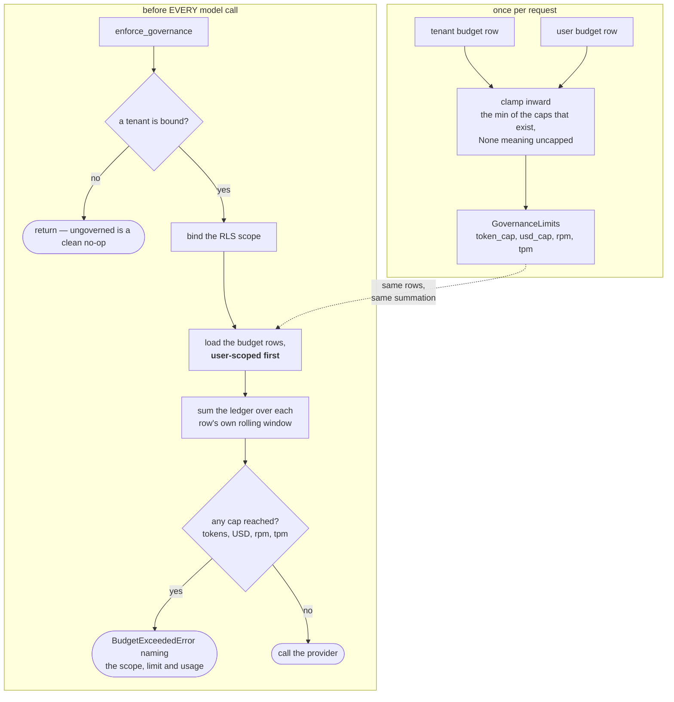
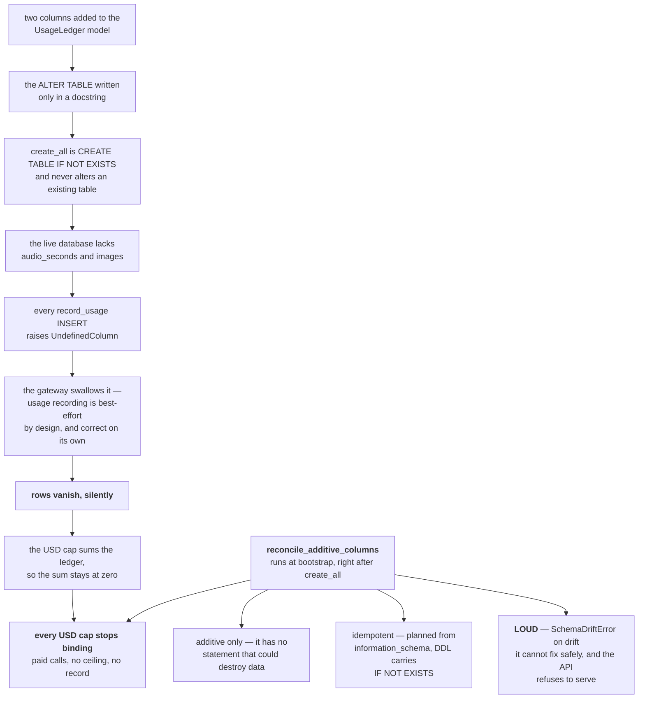

# Governance — the diagrams

Five diagrams. The two to be able to draw from memory are **the two isolation layers with
their traps** and **the ledger failure chain** — the first is how isolation is meant to
work, the second is how a control switches itself off.

Everything else is explained in [`10-guide.md`](10-guide.md); a picture is only here when
it shows something prose cannot.

---

## 1. The four controls, and where each sits in a request

*Look at the arrow that goes backwards, from the ledger into the budget check.*

That back-edge is why §12 happens. The cap is computed from the ledger, so **the ledger's
ability to accept a row *is* the cap** — and a ledger write that silently fails is a
spend ceiling that silently lifts.

The context is bound *inside* the task, not around it. An async generator runs in its own
context, so binding outside it would not be visible at the gateway where the model call
finally happens.

---

## 2. Tenant isolation — two layers, and the three traps

*Look at the annotations, not the spine. The spine was never wrong; all three traps were
live at once.*

None of the three is visible in code review. The code said "set the tenant" and "enable
RLS", and both statements were true.

Layer 1 is not redundant: it is the only layer that works on SQLite, which is what the
tests run on — which is also why the suite passed while trap 1 was live.

---

## 3. The RLS predicate, branch by branch

*Look at the NULL branch. It does not restrict, and that is deliberate.*

Two different NULLs, opposite outcomes, and people reverse them. An unset **scope** fails
open. A NULL **column** fails closed.

The open branch exists because login reads `users` by username *before* any tenant is
known — under a fail-closed branch with FORCE on, nobody could ever log in. It is a named
gap, not airtight isolation, and `effective_config()` reports it as `fail_closed=False`
rather than putting a green badge on a security page.

---

## 4. Budget resolution and enforcement

*Look at the order of the two checks at the bottom: user rows are read first.*

**User rows first**, because if both are breached, "tenant 7 is over budget" is true and
useless. Naming the narrowest breached scope is the same refusal with a better diagnosis.

The comparison is `>=`, so consumption *at* the cap blocks.

And read step 4 again: it is a read, and the ledger row is written after the provider
call. Twelve concurrent requests can all pass before any of them records a cent. The
overshoot is bounded by in-flight concurrency — say that plainly rather than claiming a
hard cap.

---

## 5. The ledger failure chain — why a schema change is a security control

*Follow it top to bottom, and notice that no box on the way down is a mistake.*

Every individual layer is defensible. The bug lives entirely in the seam, which is the one
place no layer's tests look.

The last property is the one that takes an argument: most schema drift should not stop a
boot. This table should, because a spend control is computed from it.

**Next:** [`50-interview.md`](50-interview.md).
