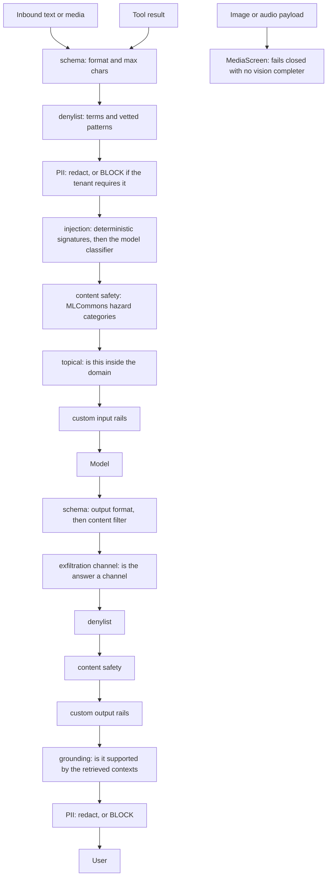

# Guardrails

## What it is

`aegis.guardrails` is the layered input/output screening pipeline that stands
between a user, a tool and the model. It validates shape, redacts personal data,
classifies prompt injection, screens content safety and topic, checks that an
answer is grounded in its sources, and screens images and audio — emitting each
step as a live event.

## Why it exists

An agentic platform reads text it did not write: a user's question, a scraped web
page, a tool's response, a model's own answer. Any of those can carry
instructions. **Prompt injection** is text that tries to override the system's own
instructions ("ignore all previous instructions and…"). The rails are the layer
that makes "no unguarded path to the model, ever" a property of the code rather
than a convention.

## Diagram

## How it works

### The pipeline object

`Guardrails` is built once in a host's composition root with an injected
`ChatCompleter` (and optionally a vision completer). It exposes three entry
points, one per **stage**:

| Stage | Method | What it screens |
|---|---|---|
| `input` | `check_input(text)` | The user's message. |
| `tool_result` | `check_tool_result(text, tool_name=...)` | A tool's output, *before* it reaches any agent's context. Deliberately runs the input chain — a scraped page is untrusted text arriving from outside. |
| `output` | `check_output(text, contexts=...)` | The model's answer. |

Every call returns a `GuardResult` with a `verdict` (`PASS`, `REDACT`, `FLAG`,
`BLOCK`), a human-readable `reason`, the possibly-rewritten `text`, and the
`layer` that decided. Callers must use `result.text`, not the string they passed
in, or a redaction did not happen.

### The input chain, in order

1. **schema** — `validate_input_format`: length ceiling and control-character
   rejection.
2. **denylist** — the tenant's extra terms and vetted pattern ids.
3. **PII** — `pii.redact` masks each span as `[REDACTED_<KIND>]`. If the tenant set
   `pii_block`, the rail stops here with a `BLOCK`, before the classifier and
   before the model.
4. **injection** — `deterministic_injection` matches signatures over Unicode-folded
   text, then `classify_injection` asks the model classifier. Results are cached.
5. **content safety** — `screen_content` against the MLCommons hazard taxonomy.
6. **topical** — off-topic detection, only when the host wired `allowed_topics`.
7. **custom input rails** — anything the host bolted on.

### The output chain, in order

`validate_output_format` → `content_filter` → `exfiltration_channel` → denylist →
content safety → custom output rails → grounding → PII.

`exfiltration_channel` runs **before** the PII rail on purpose. Redacting a number
out of the visible prose does nothing about a copy already encoded into an image
URL the reader's browser is about to fetch, and a `REDACT` verdict there would
have let the answer ship.

### Fail-closed, and the two ways a BLOCK can happen

The injection rail fails closed: an error, a timeout or an unparsable verdict is
treated as unsafe. But the pipeline files those under **two different layers**:

- `layer="injection"` — a screen read the text and judged it an attack. A finding.
- `layer="injection_unavailable"` — no screen could run. The request was refused
  *unexamined*.

Both are a `BLOCK`. Only the first is an accusation, and keeping them apart is
what stops a deployment with no model gateway from telling every user their
question was an attack.

### Normalisation

`normalize.py` folds the text the deterministic signatures match against:
zero-width characters, Cyrillic and other confusable lookalikes, fullwidth and
mathematical-bold forms, and the Unicode Tag block (U+E0000–U+E007F) — codepoints
that render as nothing yet which frontier models read as the ASCII letters they
mirror.

### Per-tenant policy

`GuardrailPolicy` is a frozen dataclass, and it is the whole of what a tenant can
reach into the pipeline. `Guardrails.with_policy(policy)` returns a **new**
pipeline object, never mutating the shared one.

| Field | Direction it can move |
|---|---|
| `topical_block`, `grounding_block`, `pii_block` | Advisory → blocking only. |
| `denylist_terms`, `denylist_patterns`, `pii_entities` | Grow only (union). |
| `input_max_chars` | Shrink only; the default is the platform's `MAX_INPUT_CHARS` of 8 000. |

`denylist_patterns` takes **ids** from the vetted `patterns.py` library, never
expressions. A regex a tenant types would be executed by this process, on the
request path, against attacker-influenced text.

No field names a model, a completer or a deployment, so no tenant write can point
the classifier at a model of their own choosing.

### Two front doors, one policy

`config/` is a standard NeMo Guardrails directory: `config.yml`, `prompts.yml`, and
Colang flows in `rails/input.co` and `rails/output.co`. Those flows call the
actions in `config/actions.py`, which delegate straight back to this same
pipeline. The declarative policy and the fast programmatic API cannot drift apart
because there is one implementation underneath both.

### Media

A non-text payload is routed to `MediaScreen`: an image-injection screen, an
image-PII rail that returns an actually-redacted image, and a
transcribe-then-guard contract for audio. Without a vision completer an image
payload fails **closed** — unlike text, pixels have no offline signature backstop.

## What it stores

This module stores nothing in the database. It has one cache: the
injection-classifier verdict cache. In `full` mode a real Redis client must be
supplied and its absence raises; in `lite`/`auto` an in-memory cache is returned.
The cache never expires and never evicts — one text has one stable verdict — so it
reports no TTL and no eviction count, which is a different statement from
reporting zeros. Both backends count hits and misses into `aegis.core.cache_stats`.

Per-tenant guardrail settings are rows in the `settings` table, owned by
`aegis.settings`, not by this module.

## Security and tenant isolation

The rails hold no tenant rows, so there is nothing to scope. What matters is the
direction of the per-tenant fold: a `GuardrailPolicy` can only make the rails
stricter than the host configured. There is no value of that object that weakens
the platform floor, which is what makes it safe to accept tenant writes at all.

`check_input` and `check_output` are also usable standalone —
`from aegis.guardrails import check_input` builds a fresh pipeline per call.

## API surface

| Method | Path | Who may call it | Returns |
|---|---|---|---|
| GET | `/v1/guardrails/policy` | Any authenticated caller | The rail stack this caller's tenant enforces, read off the *folded* pipeline, with each value's source. |
| GET | `/v1/stream/guardrail-demo` | Unauthenticated | A server-sent event stream showing the rails screening a query live. |

Enforcement itself is not a route. The rails run inside the agent graph, the chat
endpoint, the ingestion path and the tool wrappers.

## Configuration

| Variable | Default | Effect |
|---|---|---|
| `GUARDRAILS_ENGINE` | `programmatic` | `programmatic` (the offline pipeline alone), `nemo` (the Colang policy alone), or `both` (pipeline first, then Colang over what it returned — strictest verdict wins, redactions accumulate). An unrecognised value keeps the programmatic rails and logs. |
| `GROUNDING_BLOCK` | `false` | Hard-block an ungrounded answer instead of flagging it. |
| `AEGIS_PII_ENGINE` | unset | Pins the PII engine to `presidio` or `regex`. Unset means Presidio when importable, regex otherwise. |
| `AEGIS_SPACY_MODEL` | `en_core_web_sm` | The spaCy model Presidio loads. |
| `AEGIS_MODE` | `full` | Decides whether the injection cache may be in-memory. |

## Where it lives

| File | What it does |
|---|---|
| `aegis/src/aegis/guardrails/pipeline.py` | `Guardrails` — the composed chains, the stages, `with_policy`, event emission. |
| `aegis/src/aegis/guardrails/schema.py` | Format validation, content filter, denylist checks, `exfiltration_channel`; `MAX_INPUT_CHARS`, `MAX_OUTPUT_CHARS`. |
| `aegis/src/aegis/guardrails/pii.py` | The stable PII facade: `scan`, `redact`, `active_engine`. |
| `aegis/src/aegis/guardrails/_pii_presidio.py` | The Presidio-backed engine. |
| `aegis/src/aegis/guardrails/_pii_regex.py` | The regex fallback engine. |
| `aegis/src/aegis/guardrails/classifier.py` | Deterministic signatures plus the model-backed injection classifier. |
| `aegis/src/aegis/guardrails/normalize.py` | Unicode normalisation and confusable folding. |
| `aegis/src/aegis/guardrails/content_safety.py` | The MLCommons hazard rail. |
| `aegis/src/aegis/guardrails/topical.py` | The off-topic dialog rail. |
| `aegis/src/aegis/guardrails/grounding.py` | The output grounding self-check and citation integrity. |
| `aegis/src/aegis/guardrails/verdict_parsing.py` | Shared fallback parsing for model verdicts. |
| `aegis/src/aegis/guardrails/policy.py` | `GuardrailPolicy` — the per-tenant frozen dataclass. |
| `aegis/src/aegis/guardrails/patterns.py` | The vetted pattern library a tenant may point a rail at. |
| `aegis/src/aegis/guardrails/cache.py` | The injection-verdict cache and its backend choice. |
| `aegis/src/aegis/guardrails/nemo.py`, `_nemo_llm.py` | Loading and running the Colang policy. |
| `aegis/src/aegis/guardrails/config/` | `config.yml`, `prompts.yml`, `actions.py`, `rails/input.co`, `rails/output.co`. |
| `aegis/src/aegis/guardrails/media/` | `screen.py`, `injection.py`, `image_pii.py`, `audio.py`, `adapt.py`, `types.py`. |
| `backend/src/app/guardrails/__init__.py` | The host shim: wires the LiteLLM gateway as the completer and dispatches on `GUARDRAILS_ENGINE`. |
| `backend/src/app/api/routes_guardrails.py` | `GET /v1/guardrails/policy`. |

## What it does not do

- **The output rail assumes a complete answer.** It cannot scan-then-emit a
  token-by-token stream, so a streaming caller screens the assembled answer.
- **No free-form tenant regex.** `denylist_patterns` accepts library ids only.
- **The offline path cannot exercise the model-backed layers.** Without a
  completer, injection classification beyond the signatures, content safety and
  topical screening do not run.
- **The topical rail only runs where a host wired `allowed_topics`.** With none
  configured, `topical_block` changes nothing.
- **Grounding is advisory by default.** An unsupported answer is flagged in the
  trace, not withheld, until `GROUNDING_BLOCK` or the tenant's
  `guardrails.grounding.block` is set.
