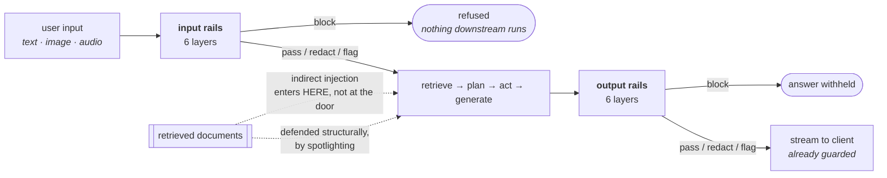
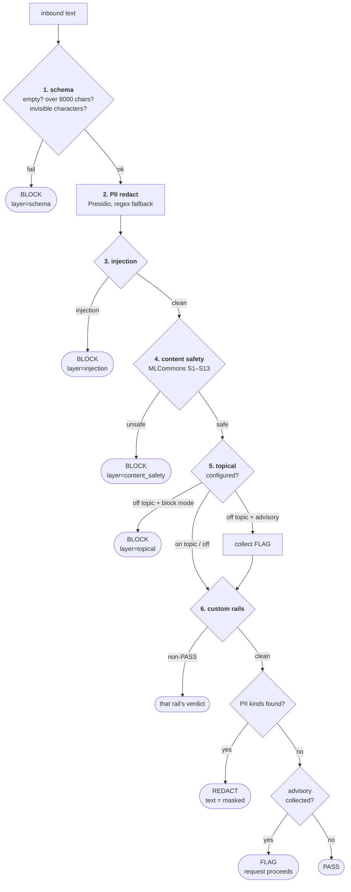
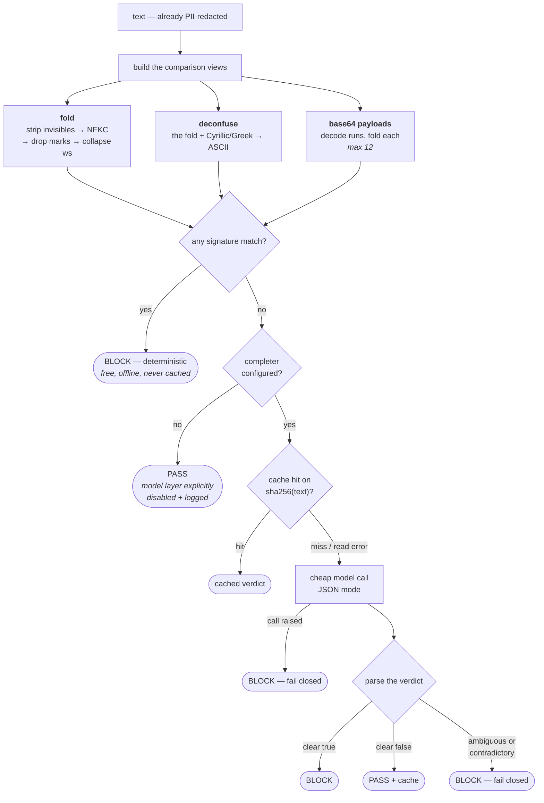
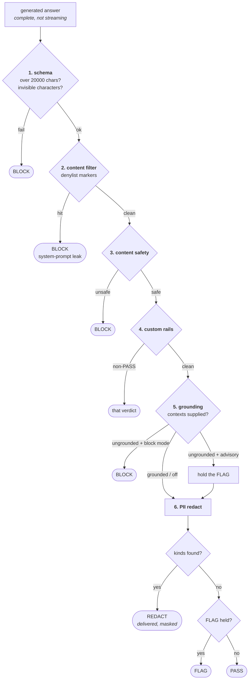
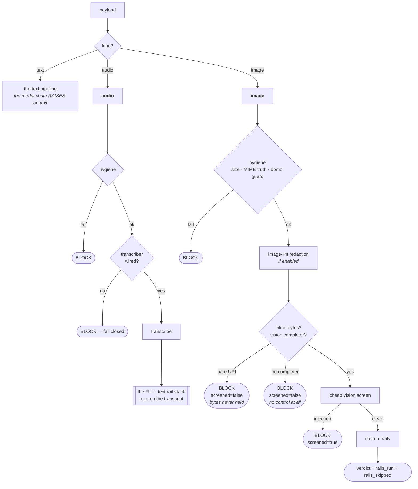

# Guardrails — the diagrams

Five diagrams. The two worth reproducing from memory are **the input chain** and **the media
chain** — between them they carry most of a long conversation about this module.

Everything else is explained in [`10-guide.md`](10-guide.md); a picture is only here when it
shows something prose cannot. Detector lists, fail directions and layer comparisons are
tables in the guide, not diagrams.

---

## 1. Where the rails sit in a request

*Look at the dotted edge — that is the attack the input rail cannot see.*

A blocked input goes **straight to END** — the router never runs and nothing downstream
executes.

The dotted edge is why the input rail is not the whole story: content that entered through
retrieval never passed the front door. Its defence is spotlighting, not a rail.

---

## 2. The input chain

*Look at the position of layer 2 — everything after it is a model call.*

Layers 3, 4 and 5 are three requests to a third-party model. Swapping 2 and 3 would send the
user's credit-card number to the classifier — the disclosure the rail exists to prevent.

Only BLOCK stops the request. A FLAG is emitted and the run continues.

---

## 3. Inside the injection rail

*Look at the three edges ending in "fail closed" — those are the fixed bug.*

The deterministic hit returns before the cache is ever consulted: caching a free, offline
decision buys nothing and adds somewhere for a stale answer to live.

The `ambiguous → BLOCK` edge used to be `startswith("no") → PASS`, which read *"No doubt this
is a prompt injection attempt"* as benign.

---

## 4. The output chain

*Look at where PII sits — last here, second on the way in.*

On the input path you redact early to protect the user's data from your own model calls. Here
there are no downstream model calls, so redaction is the last transform — applied to text
that has already survived every block decision.

The verdict is REDACT, not BLOCK: the answer is delivered with the address masked, not
withheld.

---

## 5. The media chain

*Look at the two different BLOCK reasons for an image — they are not the same fact.*

`screened=false` means the control could not run; `screened=true` means it ran and found
something. Collapsing them into one "blocked" loses what an operator needs to act on;
collapsing the second into "passed" is how a fail-open ships.

Audio has no chain of its own. It becomes text and runs the whole stack, so every rail an
operator configured — including their custom ones — applies to speech unchanged.

Every image verdict leaves the chain carrying `rails_skipped`, which always names the missing
pixel-level content-safety screen. A rail that did not run is never counted among the rails
that did.

**Next:** [`50-interview.md`](50-interview.md) — the questions you'll be asked.
