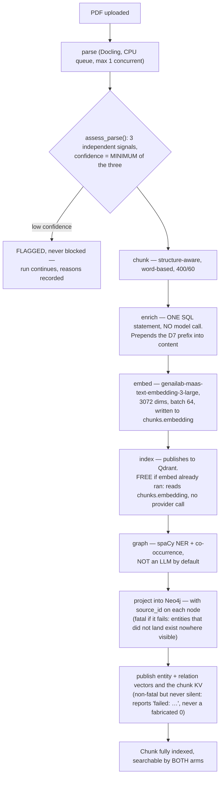

# Ingestion

## What it is

The pipeline that turns an uploaded PDF into searchable, embedded chunks a
retrieval system can query. If you have never built a document pipeline
before: a PDF is not text — it is a description of where ink goes on a
page. Extracting the *actual reading order* (which matters enormously for a
two-column academic paper or a table-heavy regulation) is a hard,
well-studied problem, and Aegis measures whether it got that right rather
than assuming it did.

## Why it exists here

The system's retrieval quality depends entirely on what got extracted from
the source PDF. Two failure modes this module is built to catch rather than
silently ship: **reading order corruption** (text extracted in the wrong
sequence reads as nonsense even though every word is technically present),
and **a parse that looks fine but silently missed structure** (headings
flattened, tables read as prose). Both are measured with real numbers, not
assumed.

## Diagram



## The architecture

```
aegis/src/aegis/ingestion/
  convert.py    the ONLY module permitted to import Docling — all parser API calls live here
  quality.py    assess_parse() — the 3-signal confidence gate
  blocks.py     the internal block representation
  furniture.py  running-header/footer stripping
  probe.py      OCR-need decision, independent PDFium text-layer reading
  tables.py     table→summary policy thresholds
aegis/src/aegis/retrieval/chunker.py   chunk_sections() — the actual chunking algorithm
backend/src/app/ingestion/
  stages.py           the 6 stage handlers (parse/chunk/enrich/embed/index/graph)
  graph_projection.py writes the extraction into Neo4j — and the node's source_id
  graph_vectors.py    writes the entity/relation vectors and LightRAG's chunk KV
  chunk_kv.py         LightRAG's chunk key-value table — how an entity resolves to a passage
  graph_backfill.py   --backfill-graph: rebuilds the two graph indexes from chunks.meta
  vector_index.py     the narrow re-index path — replay stored embeddings, no provider call
  reindex.py          the wide re-index path — re-run chunk→graph, skip only parse
  store.py            DocumentStore — local-disk artifact storage
  __main__.py         python -m app.ingestion --reindex / --verify / --backfill-graph CLI
```

**The `graph` stage has three writes, and they fail differently on purpose.**
Recording the extraction on `chunks.meta` and projecting it into Neo4j are
**fatal** — an entity that did not land exists nowhere a person can see. Publishing
the entity/relation vectors is **not** fatal, because those are an index *over* a
graph already verified present, so a transient vector-store blip must not discard
a wholly correct document. It is never silent either: with Qdrant pointed at a
dead port the stage completes and reports `entity_vectors: null, graph_vectors:
"failed: Connection refused"` — an honest unknown, not a fabricated zero.

## What is actually in Aegis

### Docling — pinned exactly, and confined to one module

`docling[rapidocr]==2.120.3`, exact-pinned. `aegis.ingestion.__init__`
states the rule directly: *"`aegis.ingestion.convert` is the only module in
the platform permitted to import Docling."* The **STANDARD** pipeline
(layout model + TableFormer) was chosen over Docling's VLM pipeline on a
**measured 255× per-page difference** — 281 seconds versus 1.10 seconds per
page on the reference machine.

**Two pipeline options are set that are not Docling's defaults, and both
are required together**: `heading_hierarchy_options.enabled = True` and
`generate_parsed_pages = True`. The source records a real measured trap:
enabling the heading option **alone** produced a plausible-looking but
wrong heading tree (`{1: 13, 2: 12, 3: 8}`) — it needs the parsed-pages
option too, which supplies the font/layout evidence the heading model
actually reasons from.

`TableFormerMode.ACCURATE` is **asserted at runtime**, not merely
requested — if it is not set to ACCURATE, `convert.py` raises rather than
silently parsing tables with the faster, less accurate model.

**`OMP_NUM_THREADS=1` is pinned before Docling loads**, and the reason is a
specific, measured crash: Docling (via torch) and xgboost each ship their
own OpenMP runtime. Loading torch first and then triggering xgboost
segfaults; loading in the other order deadlocks on the first torch matrix
operation. The fix costs about 5% parse time on the reference fixture (7.6s
→ 8.0s) and avoids the crash entirely.

### There is no fallback parser

If Docling is not installed, the call raises `ImportError` naming the exact
pip extra to install. There is no `pypdf`, no `PyMuPDF`, no degraded text
extraction path — a missing Docling install is a hard stop, not a silent
downgrade to worse text.

### The quality gate — confidence is the MINIMUM of three signals, not an average

Quoted directly: *"A parse is worth what its worst check says it is
worth."* Three independent, measured signals:

1. **Ordering agreement** — Kendall's tau computed **per page, then
   averaged weighted by anchor count** (not document-wide — the source
   records a measured case where document-wide tau was 0.967 on a badly
   re-ordered two-column PDF, while the correct per-page tau was 0.565;
   computing it document-wide would have hidden the corruption).
2. **Fragment rate** — the share of prose blocks ending mid-sentence
   (missing terminal punctuation). Crucially, this signal **reads the
   document's own list style**: if a document's list items are
   conventionally unpunctuated (a glossary, a taxonomy), they are excluded
   from the population rather than counted as broken sentences — this exact
   fix was needed for the real CFPB document in this project's own corpus,
   whose confidence went from **0.0000 to 0.9987** once the list-style
   check was added, with every prose-heavy document's score verified
   byte-identical before and after.
3. **Flat heading histogram** — catches the specific case where every
   heading collapsed to level 1 (evidence the two pipeline options above
   were not both actually engaged).

**A low-confidence parse is flagged, never blocked.** Three reasons stated
directly: the signal measures *disagreement*, not correctness, so a
genuinely unusual-but-valid layout can trigger it; blocking would burn the
most expensive stage's retry budget for nothing; and there is no automatic
remedy to fall back to anyway. The reasons are recorded on the document row
and in the durable run record, so an operator can see exactly why a
document was flagged.

### Chunking — word-based, structure-aware, not semantic and not LLM-driven

`chunk_sections()` at the shipped defaults: **400 words, 60-word overlap**,
counted by `len(text.split())` — there is **no tokenizer anywhere in the
chunker**, just whitespace splitting as a portable approximation
(~0.75 tokens/word for English). The algorithm groups blocks into runs that
share a heading path (breaking at every heading, not just a path change),
packs blocks greedily up to the word budget, and — critically — **a table
block is never split and never has prose packed into it**; it is always
its own chunk.

Every chunk is prefixed with four fields — `[title · type · date · heading
path]` — before it is embedded, so the chunk carries its own citation
context even in isolation.

### `enrich` calls no model at all

This is worth knowing precisely because it's counter-intuitive given the
name: the `enrich` stage is **one idempotent SQL `UPDATE` statement**,
folding the pre-computed prefix into `content`. No model call happens here.
The one model call in the entire pipeline is the **table summariser**
(`ModelRole.CHEAP`), which runs during the `chunk` stage, only for tables
above a size threshold, cached by content hash so an identical table is
never summarised twice — even across different documents.

### Embedding — real model, real dimension, and why re-indexing is free

`genailab-maas-text-embedding-3-large`, **3072 dimensions**, batched at 64
chunks per request, written to `chunks.embedding` in Postgres. That storage
is what makes `python -m app.ingestion --reindex` **free** — it replays the
already-computed vectors from Postgres into a fresh Qdrant collection
without calling the embedding provider again. This exact mechanism is what
recovered the platform after the Chroma→Qdrant migration accidentally
dropped every existing vector: the embeddings had never left Postgres.

### Graph extraction — spaCy by default, not an LLM

The `graph` stage runs `build_extractor(prefer="deterministic")`, which
resolves to a **spaCy** NER + sentence-co-occurrence extractor, not a
model call — entity/relation extraction here is a classical NLP technique,
not an LLM prompt. If spaCy is unavailable, it degrades to a `NoOpExtractor`
that honestly extracts nothing rather than guessing.

## How it runs

1. `parse` — Docling extracts structured blocks, and `assess_parse` scores
   confidence as the minimum of three independent signals.
2. `chunk` — blocks are packed into ~400-word chunks along heading
   boundaries; any table above threshold gets a cached model-written
   summary.
3. `enrich` — one SQL statement prepends the citation prefix. No model call.
4. `embed` — chunks are embedded in batches of 64 and the vectors stored in
   Postgres.
5. `index` — the stored vectors are published to Qdrant.
6. `graph` — spaCy extracts entities and relations per chunk.

## What is not here

- **No fallback parser.** Missing Docling is a hard `ImportError`, not a
  degraded path.
- **OCR is a per-document decision, not per-page.** A document that is 90%
  digital text with one scanned page gets no OCR at all for that page — the
  affected pages are named in the decision reason, but not recovered.
- **The flat-heading check cannot detect a half-configured Docling** — it
  only catches the fully-flat case; the "one option set, the other
  forgotten" case (the exact trap documented above) needs both options
  actually verified in the pipeline construction, which is why both are
  asserted rather than merely set.
- **`dedup_pieces` (content-hash deduplication) is not called by the ingest
  pipeline** — every chunk is written even if two chunks hash identically;
  deduplication exists in the codebase but is used only by a different
  retrieval path, not ingestion.
- **Only PDFs are accepted.** Upload validation checks for the PDF magic
  bytes and refuses anything else outright.
- **`--backfill-graph` is sourced from `chunks.meta`, not from Neo4j** — and it
  has to be. Neo4j holds the projection *after* merging: no extractor ids,
  descriptions already rewritten, and no record of which chunk anything came
  from, so `source_id` could not be rebuilt from it at all.
- **A whole-corpus `--backfill-graph` can exceed the embedding gateway's
  per-call timeout on a large document.** The command exits 1 naming that
  document rather than claiming success; backfilling it alone completes.
