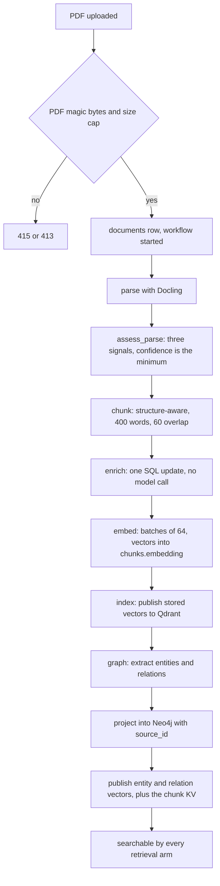

# Ingestion

## What it is

The pipeline that turns an uploaded PDF into searchable, embedded, graph-linked
chunks. Six stages run in order: parse, chunk, enrich, embed, index, graph.

A PDF is not text — it is a description of where ink goes on a page.
Recovering the actual reading order matters enormously for a two-column paper
or a table-heavy regulation, so this module measures whether it got that right
instead of assuming it did.

## Why it exists

Retrieval quality is capped by what ingestion extracted. Two failure modes are
measured rather than hoped away: **reading-order corruption**, where every
word is present but the sequence is nonsense, and **structure loss**, where
headings flatten and tables read as prose. Both produce a number recorded on
the document row.

## Diagram

## How it works

**Upload.** `POST /v1/documents` sniffs the `%PDF-` magic bytes rather than
trusting the declared content type, refuses anything above
`MAX_DOCUMENT_BYTES` (64 MiB), hashes the bytes, and dedupes on
`(tenant_id, content_sha256)` so a re-upload is cheap rather than merely
refused. A principal with no tenant pin cannot upload, because the document
would own no chunks. Bytes go to local disk through `DocumentStore`.

**parse.** Docling, pinned at `docling[rapidocr]==2.120.3`, and confined to one
module: `aegis.ingestion.convert` is the only place permitted to import it.
The STANDARD pipeline (layout model plus TableFormer) is used, not the VLM
pipeline. Two non-default options are set together and both are required:
`heading_hierarchy_options.enabled` and `generate_parsed_pages` — the heading
model reasons from the font and layout evidence the second one supplies.
`TableFormerMode.ACCURATE` is asserted at runtime, not merely requested.
`OMP_NUM_THREADS=1` is pinned before Docling loads, because Docling (via
torch) and xgboost each ship their own OpenMP runtime.

**The quality gate.** `assess_parse()` produces three independent signals and
takes the **minimum**, because a parse is worth what its worst check says:

1. **Ordering agreement** — Kendall's tau between Docling's block order and
   the raw text layer, computed **per page** and averaged weighted by anchor
   count. Document-wide tau hides column corruption.
2. **Fragment rate** — the share of prose blocks ending without terminal
   punctuation. The signal reads the document's own list style, so a glossary
   whose entries are conventionally unpunctuated is not counted as broken
   sentences.
3. **Flat heading histogram** — everything at level 1 across a long structured
   document means the heading hierarchy is not running.

A low-confidence parse is **flagged, never blocked**. The signal measures
disagreement, not incorrectness; blocking would burn the most expensive
stage's retry budget; and there is no automatic remedy to fall back to. The
score lands on `documents.parse_confidence` and the reasons land in the
durable run record.

**chunk.** `chunk_sections()` at 400 words with 60 words of overlap, counted by
whitespace splitting — there is no tokenizer in the chunker. Blocks are
grouped into runs sharing a heading path, packed greedily, and a table block
is never split and never has prose packed into it. Every chunk is prefixed
with `[title · type · date · heading path]` so it carries its own citation
context. Tables above a size threshold get a natural-language summary from a
`CHEAP`-role model call, cached by content hash in `table_summaries`.

**enrich.** One idempotent SQL `UPDATE` that folds the pre-computed prefix into
`content`. No model call happens in this stage.

**embed.** `genailab-maas-text-embedding-3-large`, 3072 dimensions, batched 64
chunks per request, written to `chunks.embedding` in Postgres.

**index.** The stored vectors are published to Qdrant. Because the vectors
live in Postgres, `python -m app.ingestion --reindex` replays them into a
fresh collection with no embedding-provider call.

**graph.** Extraction defaults to an **LLM** extractor (`GRAPH_EXTRACTOR=llm`);
setting `GRAPH_EXTRACTOR=spacy` selects the deterministic spaCy NER plus
sentence-co-occurrence extractor instead. If the model gateway cannot be
resolved, the deterministic extractor runs and its name is recorded on every
chunk and on the stage event, so the fallback is never silent. The stage then
performs three writes with deliberately different failure behaviour:

| Write | Fatal | Why |
| --- | --- | --- |
| extraction onto `chunks.meta` | yes | an entity that did not land exists nowhere |
| Neo4j projection, including `source_id` on the node | yes | same reason |
| entity and relation vectors plus the LightRAG chunk KV | no | an index over a graph already verified present; reported as `failed: <reason>`, never as a fabricated zero |

## What it stores

| Table | Columns that matter |
| --- | --- |
| `documents` | `tenant_id`, `filename`, `content_sha256`, `mime_type`, `size_bytes`, `title`, `doc_type`, `doc_date`, `status`, `completed_stage`, `workflow_id`, `page_count`, `chunk_count`, `parse_confidence`, `error`; unique on `(tenant_id, content_sha256)` |
| `chunks` | `tenant_id`, `document_id` (FK, `ON DELETE CASCADE`), `persona`, `content`, `embedding` (3072-dim), `meta` (JSONB, carries the extraction), `search_vector` (a generated `tsvector` over `content`, GIN-indexed) |
| `table_summaries` | `tenant_id`, `digest` (SHA-256 of the table's Markdown), `summary`, `row_count`, `col_count`, `model_role`; one row per table per tenant |

It also writes `job_runs` progress (owned by the jobs module), `run_events`
stage transitions (owned by the runs module), Qdrant points, and the Neo4j
projection. Source bytes live on local disk under `DOCUMENT_STORE_PATH`.

## Security and tenant isolation

- `documents`, `chunks` and `table_summaries` all carry `tenant_id` and are
  registered for Postgres row-level security.
- `chunks` carries its own `tenant_id` rather than reaching one through
  `documents`. A policy that has to join to find the owner makes the join the
  boundary instead of the row.
- `table_summaries` is scoped per tenant even though it is keyed by a content
  hash. A cache is the easiest place for a boundary to be argued away.
- Upload requires a tenant-pinned principal; a platform principal with no
  tenant is refused with a `400`.
- Uploaded bytes are validated by magic number, so a renamed `.docx` is
  refused at the door rather than at parse time.
- `AEGIS_STORAGE_ENCRYPTION` selects at-rest encryption for the document
  store; the default is `none`.

## API surface

| Method | Path | Who may call | Returns |
| --- | --- | --- | --- |
| POST | `/v1/documents` | any authenticated, tenant-pinned caller | the `document_id`, size, hash and the ingest `workflow_id` |
| GET | `/v1/documents` | any authenticated caller | the caller's tenant's documents and their ingest status |
| GET | `/v1/documents/{document_id}/ingest` | any authenticated caller | that document's stage timeline, read from `run_events` |

The command-line surface is `python -m app.ingestion` with `--reindex`,
`--verify` and `--backfill-graph`.

## Configuration

| Variable | Default | Effect |
| --- | --- | --- |
| `DOCUMENT_STORE_PATH` | `document_storage` | where source bytes are written |
| `DOCLING_WARM_ON_START` | `false` | preload the Docling models at boot |
| `GRAPH_EXTRACTOR` | `llm` | `spacy` selects the deterministic extractor |
| `TABLE_SUMMARY_ENABLED` | `true` | summarise tables during chunking |
| `TABLE_SUMMARY_MIN_ROWS` | `3` | smallest table worth summarising |
| `TABLE_SUMMARY_MIN_COLS` | `3` | as above, columns |
| `TABLE_SUMMARY_MIN_CELLS` | `12` | as above, cells |
| `TABLE_SUMMARY_MAX_GRID_CHARS` | `6000` | largest grid sent to the model |
| `MODEL_EMBEDDING` | fleet default | which embedding deployment is used |
| `QDRANT_URL` | `http://localhost:6333` | where the index stage publishes |
| `NEO4J_URI` | `bolt://localhost:7687` | where the graph is projected |
| `AEGIS_STORAGE_ENCRYPTION` | `none` | at-rest encryption for stored documents |

## Where it lives

| Path | What it does |
| --- | --- |
| `aegis/src/aegis/ingestion/convert.py` | the only module permitted to import Docling |
| `aegis/src/aegis/ingestion/quality.py` | `assess_parse()`, the three-signal confidence gate |
| `aegis/src/aegis/ingestion/blocks.py` | the internal parsed-block representation |
| `aegis/src/aegis/ingestion/furniture.py` | running header and footer stripping |
| `aegis/src/aegis/ingestion/probe.py` | the OCR-need decision and independent text-layer read |
| `aegis/src/aegis/ingestion/tables.py` | table-to-summary thresholds |
| `aegis/src/aegis/retrieval/chunker.py` | `chunk_sections()`, the chunking algorithm |
| `backend/src/app/ingestion/upload.py` | magic-byte validation, size cap, dedupe, workflow start |
| `backend/src/app/ingestion/stages.py` | the six stage handlers |
| `backend/src/app/ingestion/store.py` | `DocumentStore`, local-disk artifact storage |
| `backend/src/app/ingestion/graph_projection.py` | the Neo4j write, including `source_id` |
| `backend/src/app/ingestion/graph_vectors.py` | entity and relation vector publication |
| `backend/src/app/ingestion/chunk_kv.py` | LightRAG's `lightrag_doc_chunks` key-value table |
| `backend/src/app/ingestion/vector_index.py` | the narrow re-index path, replaying stored vectors |
| `backend/src/app/ingestion/reindex.py` | the wide re-index path, re-running chunk through graph |
| `backend/src/app/ingestion/graph_backfill.py` | `--backfill-graph`, rebuilt from `chunks.meta` |
| `backend/src/app/ingestion/__main__.py` | the `--reindex` / `--verify` / `--backfill-graph` CLI |

## What it does not do

- No fallback parser. A missing Docling install raises `ImportError` naming
  the pip extra, rather than degrading to worse text.
- Only PDFs are accepted.
- OCR is decided per document, not per page. A mostly-digital document with
  one scanned page gets no OCR for that page; the affected pages are named in
  the decision reason.
- No content-hash deduplication of chunks. Two identical chunks are both
  written.
- `--backfill-graph` is sourced from `chunks.meta`, never from Neo4j. The
  projection holds no extractor ids and no record of which chunk anything came
  from, so `source_id` could not be rebuilt from it.
- The flat-heading check catches the fully-flat case only. The
  "one Docling option set, the other forgotten" case is prevented by asserting
  both at pipeline construction, not by this signal.
