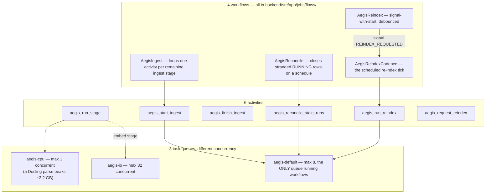

# Jobs

## What it is

The durable-work layer: anything that takes longer than one HTTP request —
parsing a document, embedding its chunks, re-indexing a whole tenant's
corpus — runs as a Temporal **workflow**, not as background work inside the
web server's own process. If you have never used a workflow engine before:
the problem it solves is "what happens if the server crashes halfway
through a six-stage document ingest?" Without Temporal, the answer is
"start over" or "silently lose the rest." With it, the workflow resumes
exactly where it left off, because Temporal itself — not the application —
tracks which steps have already completed.

## Why it exists here

Document ingestion has six real stages (parse, chunk, enrich, embed, index,
graph) each with its own cost and failure mode — a Docling parse alone can
run for tens of minutes on a large PDF. Running all six inline in a request
handler means one failed stage loses all the work before it, and a server
restart mid-ingest loses everything. Temporal makes each stage an
independently-retried **activity**, and the sequence a durable
**workflow**, so a crash resumes from the last completed stage rather than
from zero.

## Diagram



## The architecture

```
backend/src/app/jobs/
  client.py       Temporal client singleton, TemporalUnavailableError
  activities.py   start_ingest / run_stage / finish_ingest — the ingest activity bodies
  control.py      list_jobs / requeue_job / cancel_job — the tenant-facing control plane
  health.py       WORKER_RUNNING / WORKER_DOWN / ... — worker liveness surface
  ingest_log.py   writes stage transitions into aegis.runs (see runs.md)
  reconcile.py    sweeps stranded RUNNING rows with no live workflow behind them
  reindex.py      debounced signal-with-start re-index
  schedules.py    Temporal Schedules for the reconcile sweep and the re-index cadence
  worker.py       worker bootstrap — both launch modes
  flows/
    contracts.py  frozen dataclasses crossing the workflow/activity boundary + name constants
    ingest.py     AegisIngest workflow
    reconcile.py  AegisReconcile workflow
    reindex.py    AegisReindex + AegisReindexCadence workflows
aegis/src/aegis/jobs/
  stages.py       INGEST_STAGES declaration, task queue policy, per-stage timeouts
  scope.py        @tenant_activity — binds RLS scope for durable code, survives replay
```

## What is actually in Aegis

### Lazy import — importing `app.jobs` pulls no `temporalio`

`app/jobs/__init__.py` uses a **lazy PEP-562 `__getattr__`** re-export, so
code that imports the `app.jobs` package name does not eagerly import
`temporalio`. This matters for anything that only needs the package's types
or constants without needing a running Temporal client.

### Three task queues, deliberately different concurrency

```python
CPU_QUEUE = "aegis-cpu"       max_concurrent_activities=1
IO_QUEUE  = "aegis-io"        max_concurrent_activities=32
DEFAULT_QUEUE = "aegis-default"  max_concurrent_activities=8, the only queue with runs_workflows
```

`aegis-cpu` is capped at **exactly 1** because a Docling parse can peak
around 2.2 GB of memory — running two in parallel on one worker risks an
out-of-memory kill. Stage-to-queue mapping: `parse`→cpu, `chunk`→default,
`enrich`→default, `embed`→io, `index`→default, `graph`→cpu.

### Six activities, four workflows — all named as real constants

```python
START_INGEST = "aegis_start_ingest"
RUN_STAGE = "aegis_run_stage"
FINISH_INGEST = "aegis_finish_ingest"
RECONCILE_STALE_RUNS = "aegis_reconcile_stale_runs"
RUN_REINDEX = "aegis_run_reindex"
REQUEST_REINDEX = "aegis_request_reindex"
```

Workflows: `AegisIngest`, `AegisReconcile`, `AegisReindex`,
`AegisReindexCadence`. `AegisIngest` loops through the remaining stages one
activity call at a time — if the workflow resumes after a crash, it only
re-runs stages that had not yet completed, because Temporal itself persists
which activities finished.

### Re-index debouncing — signal-with-start, not a fresh workflow per request

`request_reindex` uses Temporal's **signal-with-start**: if ten re-index
requests for the same tenant arrive inside the debounce window
(`TEMPORAL_REINDEX_DEBOUNCE_SECONDS`, default 30), they collapse into
**one** run rather than ten. This is verified by a dedicated test
(`test_debounce.py`) asserting exactly that. Debouncing is explicitly not
the same guarantee as idempotency — the test suite treats them as separate
claims.

### Worker entrypoints — two real launch modes, no starting script

1. **Standalone process**: `python -m app.jobs.worker`.
2. **In-process**, inside the same FastAPI process: gated on
   `settings.stores_enabled and settings.temporal_worker_inprocess`, started
   as a supervised `asyncio.create_task`.

There is **no shell script that starts a worker** anywhere in
`scripts/` — worker startup is exclusively one of the two Python paths
above.

### The `@tenant_activity` decorator — RLS scope that survives a replay

Temporal can replay a workflow's history for recovery, which re-executes
code. `@tenant_activity` (in `aegis/src/aegis/jobs/scope.py`) binds the RLS
tenant scope from the activity's own **typed, serialised arguments** —
which are part of the durable workflow history — rather than from any
in-memory or ambient context, precisely so a replay years later still binds
the correct tenant scope rather than losing it.

### Reconciliation — closing rows with nothing running behind them

A scheduled sweep (`AegisReconcile` / `reconcile_stale_runs`) finds
`job_runs` rows still marked `RUNNING` with no live Temporal execution
behind them — the case where a worker died mid-stage without Temporal's own
retry recovering it in time — and closes them out rather than leaving a
permanently "running" row a UI would show forever.

## How it runs

1. A document upload calls `client.start_workflow(AegisIngest, ...)` on the
   default queue.
2. The workflow calls `start_ingest`, then loops `run_stage` once per
   remaining ingest stage (each routed to its stage's own queue), then
   `finish_ingest`.
3. If the worker process dies mid-run, Temporal's own history means the
   workflow resumes from the last completed stage on restart — no stage
   re-runs unnecessarily.
4. A scheduled sweep periodically reconciles any `RUNNING` row Temporal
   itself has no record of anymore.
5. A re-index request debounces through signal-with-start rather than
   queuing a fresh workflow per request.

## What is not here

- **No worker-starting shell script.** Worker launch is Python-only, via one
  of the two entrypoints above.
- **There is no `/runs` or `/run-events` REST endpoint** — the durable run
  record surfaces only through the ingest progress endpoint, the pipeline
  health endpoint, and the live SSE stream (see `runs.md`).
- **`aegis.jobs` itself imports no orchestrator SDK** — verified by a
  dedicated isolation test asserting that importing the package pulls in
  only ORM/model dependencies, never `temporalio` — the durable-execution
  dependency lives entirely in the `backend/src/app/jobs` host layer.
