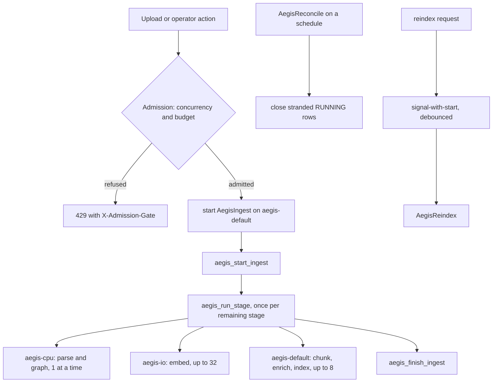

# Jobs

## What it is

The durable-work layer. Anything that outlives one HTTP request — parsing a
document, embedding its chunks, re-indexing a corpus — runs as a **Temporal
workflow**, not as background work inside the web server.

A workflow engine answers the question "what happens if the server dies
halfway through a six-stage ingest?" Temporal itself persists which steps
completed, so the work resumes from the last finished stage rather than from
zero.

## Why it exists

A Docling parse of a large PDF can run for tens of minutes. Running six stages
inline in a request handler means one failed stage discards all the work
before it, and a restart discards everything. Temporal makes each stage an
independently-retried **activity** and the sequence a durable **workflow**,
and gives every job a visible, tenant-facing row that stays meaningful even
when the orchestrator is unreachable.

## Diagram

## How it works

**Three task queues, deliberately different concurrency.**

| Queue | Concurrent activities | Runs workflows | Carries |
| --- | --- | --- | --- |
| `aegis-cpu` | 1 | no | `parse`, `graph` |
| `aegis-io` | 32 | no | `embed` |
| `aegis-default` | 8 | yes | `chunk`, `enrich`, `index`, and the bookkeeping activities |

`aegis-cpu` is capped at exactly 1 because a Docling parse is the largest
memory consumer in the system: **3,363 MB peak RSS** on a 126-page table-dense
document. Peak memory scales with the document, not just with the models, so
size the machine against the largest document you intend to ingest — two
concurrent parses of a large document is roughly 6.7 GB, on top of Postgres,
Neo4j, Redis and Temporal. `max_concurrent_activities` bounds one worker
**process**, not the fleet.

**Six stages, each with its own timeout and retry budget.**

| Stage | Timeout | Max attempts | Queue |
| --- | --- | --- | --- |
| `parse` | 1800 s | 2 | `aegis-cpu` |
| `chunk` | 300 s | 3 | `aegis-default` |
| `enrich` | 300 s | 3 | `aegis-default` |
| `embed` | 900 s | 5 | `aegis-io` |
| `index` | 600 s | 3 | `aegis-default` |
| `graph` | 1800 s | 2 | `aegis-cpu` |

**Four workflows and six activities, all named as constants.** Workflows:
`AegisIngest`, `AegisReconcile`, `AegisReindex`, `AegisReindexCadence`.
Activities: `aegis_start_ingest`, `aegis_run_stage`, `aegis_finish_ingest`,
`aegis_reconcile_stale_runs`, `aegis_run_reindex`, `aegis_request_reindex`.

`AegisIngest` calls `start_ingest`, then loops `run_stage` once per remaining
stage, then `finish_ingest`. `job_runs.completed_stage` records the last stage
that finished and committed, so a resumed job restarts *after* it.

**Admission control runs before anything is enqueued.** Two independent gates
— a per-`job_type` in-flight cap and a budget check — each raising an
`AdmissionError` carrying a one-sentence reason. The route turns either into a
`429` with an `X-Admission-Gate` header naming which gate refused. A `429`
rather than a `403`, because both conditions change on their own.

**Re-index is debounced.** `request_reindex` uses Temporal's
signal-with-start, so many requests for one tenant inside
`TEMPORAL_REINDEX_DEBOUNCE_SECONDS` collapse into a single run rather than
queuing one workflow each.

**Reconciliation.** `AegisReconcile` sweeps `job_runs` rows still marked
`RUNNING` with no live Temporal execution behind them, moves them into the
transient `RECONCILING` state, and either resumes or fails them with a reason.
A row silently stuck in `RUNNING` forever is the failure this exists to end.

**Two worker launch modes.** A standalone process, `python -m app.jobs.worker`;
or in-process inside the FastAPI application, gated on `STORES=on` and
`TEMPORAL_WORKER_INPROCESS`, started as a supervised asyncio task. Worker
liveness is reported as one of `disabled`, `starting`, `running`, `down`,
`stopped`.

**Importing `app.jobs` pulls no `temporalio`.** The package uses a lazy
PEP-562 `__getattr__` re-export, and `aegis.jobs` imports no orchestrator SDK
at all — the durable-execution dependency lives entirely in the backend host
layer.

## What it stores

One table of its own, `job_runs`:

| Column | What it is for |
| --- | --- |
| `id` | primary key |
| `tenant_id` | FK to `tenants`, nullable for a platform-level job |
| `user_id` | who started it |
| `job_type` | e.g. `ingest` |
| `workflow_id` | unique; the one link to the orchestrator, and the idempotency key |
| `run_id` | the orchestrator's attempt id, known only once execution starts |
| `status` | `pending`, `running`, `succeeded`, `failed`, `cancelled`, `reconciling`; no default, so every writer names the state |
| `completed_stage` | the last stage that finished and committed |
| `payload`, `result` | JSONB inputs and outputs |
| `error` | the failure reason |
| `cost_usd` | attribution, reconciled against `usage_ledger` |
| `created_at`, `started_at`, `finished_at` | timing |
| `cancelled_by` | who stopped it, not merely that it was stopped |

`workflow_id` is a plain string with **no** foreign key: nothing in this
database may depend on a row existing in a system Aegis does not own.

Jobs also write `run_events` (owned by the runs module) and `documents`
progress (owned by ingestion).

## Security and tenant isolation

- `job_runs` carries `tenant_id` and is registered for Postgres row-level
  security. A `NULL`-tenant row is a platform-level job and is invisible to
  every tenant.
- **`@tenant_activity`** binds the RLS tenant scope from the activity's own
  typed, serialised arguments — which are part of the durable workflow history
  — rather than from a contextvar or ambient state. A replay years later binds
  the same scope. An activity that would run without one is refused.
- `list_jobs`, `requeue_job` and `cancel_job` all take an explicit
  `tenant_id` and filter on it; the routes derive it from the auth context.
- The job control routes are restricted to the `admin` and `ai_team` roles.
- Cancellation records `cancelled_by`, because a cancelled tenant job is an
  audit question before it is an operational one.

## API surface

| Method | Path | Who may call | Returns |
| --- | --- | --- | --- |
| GET | `/v1/jobs` | admin or ai_team | the caller's tenant's job rows |
| POST | `/v1/jobs/{job_id}/cancel` | admin or ai_team | the cancelled row, stamped with `cancelled_by` |
| POST | `/v1/jobs/{job_id}/requeue` | admin or ai_team | the re-admitted row, or `429` with `X-Admission-Gate` |

`GET /v1/platform/pipeline` (platform staff or platform admin) aggregates
`job_runs` with `run_events` for the pipeline health view.

## Configuration

| Variable | Default | Effect |
| --- | --- | --- |
| `TEMPORAL_ADDRESS` | `localhost:7233` | the Temporal frontend |
| `TEMPORAL_NAMESPACE` | `default` | the namespace workflows run in |
| `TEMPORAL_TASK_QUEUES` | `""` | which queues this worker process polls; empty means all |
| `TEMPORAL_WORKER_INPROCESS` | `true` | start a worker inside the API process |
| `TEMPORAL_RECONCILE_INTERVAL_SECONDS` | `300` | how often the reconcile sweep runs |
| `TEMPORAL_RECONCILE_STALE_AFTER_SECONDS` | `3600` | age at which a `RUNNING` row is suspect |
| `TEMPORAL_RECONCILE_BATCH` | `50` | rows examined per sweep |
| `TEMPORAL_REINDEX_DEBOUNCE_SECONDS` | `30` | window in which re-index requests collapse |
| `TEMPORAL_REINDEX_MAX_WAIT_SECONDS` | `600` | ceiling on debounced waiting |
| `TEMPORAL_REINDEX_INTERVAL_SECONDS` | `86400` | the scheduled re-index cadence |
| `STORES` | `on` | `off` disables the in-process worker along with the real stores |

## Where it lives

| Path | What it does |
| --- | --- |
| `aegis/src/aegis/jobs/models.py` | `JobRun`, `JobStatus`, and the ingest corpus tables beside it |
| `aegis/src/aegis/jobs/stages.py` | `INGEST_STAGES`, the queue policy, per-stage timeouts |
| `aegis/src/aegis/jobs/admission.py` | the concurrency and budget gates and their errors |
| `aegis/src/aegis/jobs/scope.py` | `@tenant_activity`, the replay-safe scope binding |
| `aegis/src/aegis/jobs/cancel.py` | cancellation semantics |
| `aegis/src/aegis/jobs/facts.py` | the per-stage fact reporting helper |
| `backend/src/app/jobs/client.py` | the Temporal client singleton and `TemporalUnavailableError` |
| `backend/src/app/jobs/activities.py` | the ingest activity bodies |
| `backend/src/app/jobs/control.py` | `list_jobs`, `requeue_job`, `cancel_job` |
| `backend/src/app/jobs/health.py` | the `WORKER_*` liveness states |
| `backend/src/app/jobs/reconcile.py` | the stranded-row sweep |
| `backend/src/app/jobs/reindex.py` | the debounced signal-with-start re-index |
| `backend/src/app/jobs/schedules.py` | Temporal Schedules for the sweep and the cadence |
| `backend/src/app/jobs/worker.py` | worker bootstrap for both launch modes |
| `backend/src/app/jobs/ingest_log.py` | stage transitions written into `run_events` |
| `backend/src/app/jobs/flows/contracts.py` | frozen dataclasses and the name constants |
| `backend/src/app/jobs/flows/ingest.py` | the `AegisIngest` workflow |
| `backend/src/app/jobs/flows/reconcile.py` | the `AegisReconcile` workflow |
| `backend/src/app/jobs/flows/reindex.py` | `AegisReindex` and `AegisReindexCadence` |

## What it does not do

- No shell script starts a worker. Launch is Python-only, through one of the
  two entrypoints.
- `aegis.jobs` contains no orchestrator SDK import; swapping Temporal would be
  a change in the backend host layer.
- Debouncing is not idempotency. Collapsing requests inside a window is a
  separate claim from "running twice is safe".
- There is no generic job-submission endpoint. Jobs are started by the actions
  that need them, such as a document upload.
