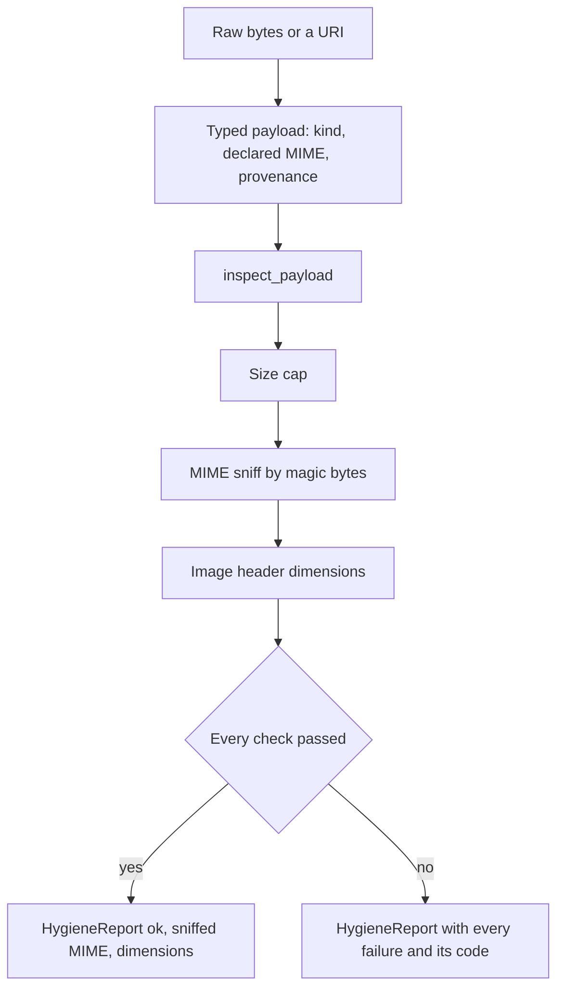

# Media

## What it is

Media is the typed payload layer every non-text input passes through. It gives
an image, a recording or a block of text one shape that knows what it is, how big
it is and where it came from — and it runs the cheap, offline checks that decide
whether those bytes are safe to look at before anything expensive touches them.

## Why it exists

A guardrail cannot screen what it cannot receive. If a rail's signature is
`Callable[[str], ...]`, an image forwarded to a model as a multimodal content
block passes through no rail at all — and text rendered into pixels is the
standard prompt-injection route against a vision model. Widening the contract
from "a string" to "a payload" is what makes screening possible at all.

## Diagram

## How it works

**1. A payload is one of three kinds.** `TextPayload`, `ImagePayload` and
`AudioPayload` share a base and are discriminated by `kind` (`text`, `image`,
`audio`). They are Pydantic models and they are **frozen** — a payload is
evidence. A rail that wants to change one, such as the image-PII rail returning a
redacted image, returns a *new* payload, so the bytes that were screened are
still exactly what was screened.

**2. Three fields carry the security-relevant facts.**

| Field | Why it matters |
|---|---|
| `data` or `uri` | Bytes the process holds, or a remote reference it does not. A payload the process cannot read is a payload the rails cannot screen, so hygiene fails **closed** on a URI rather than waving it through. |
| `mime_type` | The declared content type. Always attacker-controlled, so it is kept and never trusted — it exists so the mismatch can be detected. |
| `provenance` | Where the bytes came from, carried with them |

`byte_size` is derived from the bytes when they are present, and falls back to
`declared_byte_size` otherwise.

**3. Provenance is a trust classification.** `Provenance` holds a `source` and a
free-text `origin` (a filename, a URL, the name of the tool that produced it —
never parsed for control flow, it exists so a human reading a blocked verdict
knows what was blocked).

| `MediaSource` | Meaning |
|---|---|
| `user_upload` | A human just uploaded it |
| `tool_output` | It came back from a tool |
| `retrieval` | It came out of a retrieved document |
| `model_output` | A model produced it |
| `unknown` | Nobody recorded an origin |

`Provenance.untrusted` classifies `retrieval`, `tool_output` and `unknown` as
attacker-controlled — the indirect prompt-injection surfaces. It is a
classification the audit trail and the event stream carry.

**4. Sniffing reads the bytes, not the label.** `sniff_mime` matches container
signatures at fixed offsets. Coverage is a deliberate allowlist — PNG, JPEG, GIF,
BMP, TIFF, WEBP for images; WAV, MP3, OGG, FLAC, MP4/M4A for audio. Anything else
sniffs as `None`, and hygiene fails closed on it.

**5. Image dimensions are read from the header, never by decoding.**
`image_dimensions` parses the declared width and height out of the container
header without decompressing a pixel. That is exactly what a decompression-bomb
guard must do: a 40 KB PNG declaring 40,000 x 40,000 pixels is gigabytes of RAM
the moment anything calls a decoder. Checking the header first costs nothing and
the bomb never detonates.

**6. `inspect_payload` runs three checks, in this order.** They are the bypasses
that cost an attacker nothing and cost the defender everything:

1. **Size cap** — an unbounded payload is a denial of service on the rails
   themselves, and on the vision model behind them.
2. **MIME mismatch** — the declared type is attacker-controlled. If it says
   `text/plain` and the magic bytes say PNG, the caller's routing chose *text*
   rails for something that is an image. That single lie is the whole bypass.
3. **Decompression bomb** — both an absolute pixel cap and a compression-ratio
   cap, so the small-but-enormous file that slips under the pixel cap is still
   caught.

A `HygieneReport` returns `ok`, the **complete** list of failures (not just the
first — an operator debugging a rejected upload wants the full picture), the
sniffed MIME type and the dimensions when readable. Every failure carries a
stable code:

`empty_payload`, `size_cap_exceeded`, `uri_not_inspectable`, `mime_unrecognized`,
`mime_mismatch`, `mime_not_allowed`, `image_dimensions_unreadable`,
`decompression_bomb_pixels`, `decompression_bomb_ratio`.

`HygieneReport.summary()` renders those as one PII-free line.

**7. Everything here is pure and offline.** No model call, no network, no image
codec. Importing `aegis.media` pulls Pydantic and the standard library and
nothing else — no Pillow, no numpy, no provider client.

## What it stores

This module stores nothing. It defines value types and runs in-memory checks.
Nothing is written to a database, a cache or a file.

## Security and tenant isolation

No tenant-scoped data. A payload is a value that lives for the duration of one
call, and this package holds no policy, no configuration and no state.

The security properties it does provide are structural:

- **Fail closed on the unreadable.** A URI-only payload cannot be inspected, so
  it is refused rather than passed on.
- **Never trust the declaration.** Every hygiene decision is made against the
  sniffed type; the declared type is used only to detect the mismatch.
- **Never decode to measure.** Dimensions come from the header, so inspecting a
  bomb is free.
- **Immutable evidence.** Payloads are frozen, so what a rail screened cannot be
  edited after the verdict.
- **Codes, not prose.** A stable failure code lets a verdict say exactly which
  check refused, without echoing user content.

## API surface

No HTTP routes. This is a library that the voice, vision and guardrail modules
import. It is reached over HTTP only indirectly, through
`POST /v1/voice/transcribe` and `POST /v1/vision/analyse`.

## Configuration

No environment variables. Thresholds are a value object, `MediaLimits`, that a
caller passes in — so a host can tighten them per call site rather than globally.

| Field | Default | What it caps |
|---|---|---|
| `max_bytes` | 8 MiB | Any binary payload |
| `max_text_bytes` | 256 KiB | Text payloads, a byte-level backstop under the text rail's own character limit |
| `max_pixels` | 40,000,000 | `width * height` declared by an image header. Below Pillow's own 89 MP bomb-warning threshold, so Aegis refuses before any decoder even warns. |
| `max_pixels_per_byte` | 500 | Compression ratio. A real photo lands around 1–10; a bomb is thousands. |
| `allowed_image_mimes` | the sniffable image set | Image types accepted at all |
| `allowed_audio_mimes` | `audio/wav`, `audio/mpeg`, `audio/ogg`, `audio/flac`, `audio/mp4` | Audio types accepted at all |

## Where it lives

| Path | What it does |
|---|---|
| `aegis/src/aegis/media/types.py` | The payload union, `Provenance`, `MediaKind`, `MediaSource`, `as_payload`, `payload_from_context`, `MEDIA_PAYLOAD_ADAPTER` |
| `aegis/src/aegis/media/sniff.py` | `sniff_mime`, `image_dimensions`, the container-signature allowlist |
| `aegis/src/aegis/media/hygiene.py` | `MediaLimits`, `HygieneCode`, `HygieneFailure`, `HygieneReport`, `inspect_payload` |

The rails that *act* on these payloads live in `aegis.guardrails.media`; the
pipelines that order those rails live in `aegis.vision` and `aegis.voice`.

## What it does not do

- **It holds no policy.** It reports facts about bytes. Deciding what to do about
  a failure belongs to the rails and the pipelines above it.
- **It does not decode media.** No image is rendered, no audio is resampled, no
  codec is imported.
- **It does not detect content.** It does not read text out of an image or find
  personal data — those are separate rails that receive a payload from here.
- **It does not fetch a URI.** A remote reference is classified as
  uninspectable, not downloaded.
- **It does not branch on provenance.** The trust class is carried and reported;
  every payload is screened with the same strict path regardless of origin.
