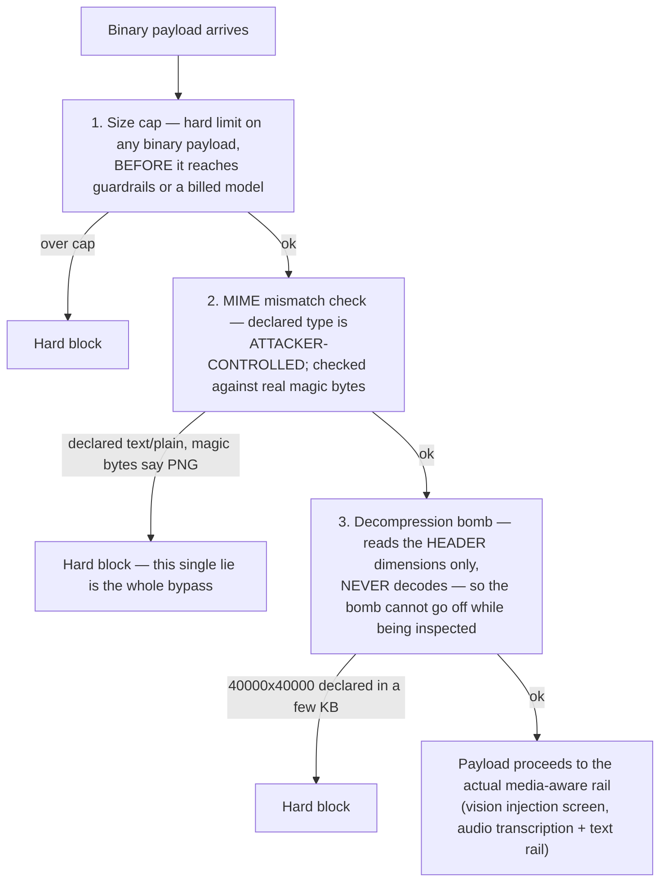

# Media

## What it is

Typed payloads (text, image, audio) plus **payload hygiene** — three cheap,
deterministic checks that run before anything else touches a non-text
payload. If you have never handled untrusted binary uploads before: the
checks here specifically target the ways a malicious file can hurt a
system *before any code ever tries to interpret its actual content* — a
size bomb, a lying MIME type, a decompression bomb. All three are stopped
by looking at the file's header or declared metadata, never by decoding it.

## Why it exists here

Quoted directly, and it names the actual attacker economics: *"They are the
bypasses that cost an attacker nothing and cost the defender everything."*
An image that is really disguised text bypasses whichever rail set the
system routes to based on the caller's own (attacker-controlled) MIME
declaration. A vision model is billed per pixel, so an unbounded image is
also a direct cost attack, not just a memory one.

## Diagram



## The architecture

```
aegis/src/aegis/media/
  types.py     MediaPayload, MediaKind, MediaLimits, TextPayload, Provenance
  hygiene.py   the three pure, offline checks — size, MIME, decompression bomb
```

## What is actually in Aegis

### Three checks, in this specific order, and all three are pure/offline

Quoted: *"Everything here is pure and offline: no model call, no network,
no image codec."* This matters — hygiene runs **before** anything that
costs money or CPU, so a malicious payload is refused at essentially zero
cost to the defender, which is the whole point given the attacker-economics
framing above.

1. **Size cap.** A hard byte-size limit checked first, before any other
   inspection — both a memory-exhaustion defence and a cost defence, since
   a downstream vision model bills per pixel.
2. **MIME mismatch.** The caller's declared content type is compared
   against the file's real magic bytes. A declared `text/plain` that is
   actually PNG data means the caller's own routing decision sent this
   payload to the text rails — the wrong rail entirely — and that single
   lie is described as "the whole bypass": if this check did not exist, an
   attacker could smuggle an image (which the vision-specific injection
   screen exists to catch) through the plain text path, which has no
   equivalent screen.
3. **Decompression bomb.** A file can declare enormous pixel dimensions
   (e.g. 40,000 × 40,000) while being only a few kilobytes on disk — the
   classic decompression-bomb shape, where actually decoding it would
   consume gigabytes of RAM. The guard reads the **header only** to get
   the declared dimensions and refuses if they exceed a sane ratio to the
   file's actual byte size — it never calls an image codec to decode the
   file, which is precisely what would trigger the bomb.

Every hygiene failure carries a **stable code** (`BOMB_PIXELS`,
`BOMB_RATIO`, and others) so a verdict downstream can state exactly which
check refused a payload and why, rather than a generic "invalid file"
message.

### `MediaKind` and `Provenance` — classified, but provenance is not yet load-bearing

`MediaPayload` carries a `Provenance` (where the media came from — the
coarse trust class, e.g. user-uploaded vs tool-returned). The type itself
notes plainly: *"Currently classification only — nothing branches on
it."* The classification is correct and the field exists because
downstream screening already needs the payload typed this way, but no rail
today makes a different decision based on which provenance value a payload
carries.

## How it runs

1. Any non-text payload passes through all three hygiene checks, in order,
   before any other code touches it.
2. A failure at any stage is a hard block, with a stable code identifying
   which check fired.
3. A payload that clears hygiene proceeds to whichever media-aware rail
   actually applies — the vision injection screen for images, transcription
   plus the full text rail stack for audio (see `vision.md` and
   `voice.md`).

## What is not here

- **`Provenance` is not yet wired to any branching logic** — it is a
  correctly-populated field with no current consumer that reads it to make
  a different decision.
- **Hygiene does not itself screen *content*** — it only validates that a
  payload is well-formed and within size/dimension bounds. Content
  screening (is this image or audio actually safe/on-policy) is a separate,
  later, model-backed step in `vision.md` / `voice.md`.
