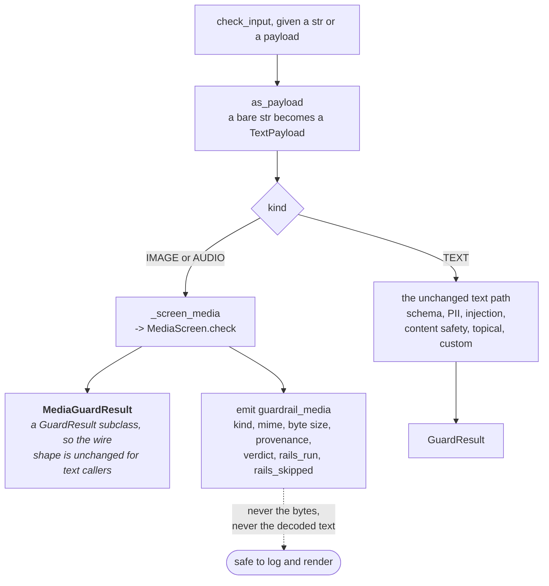
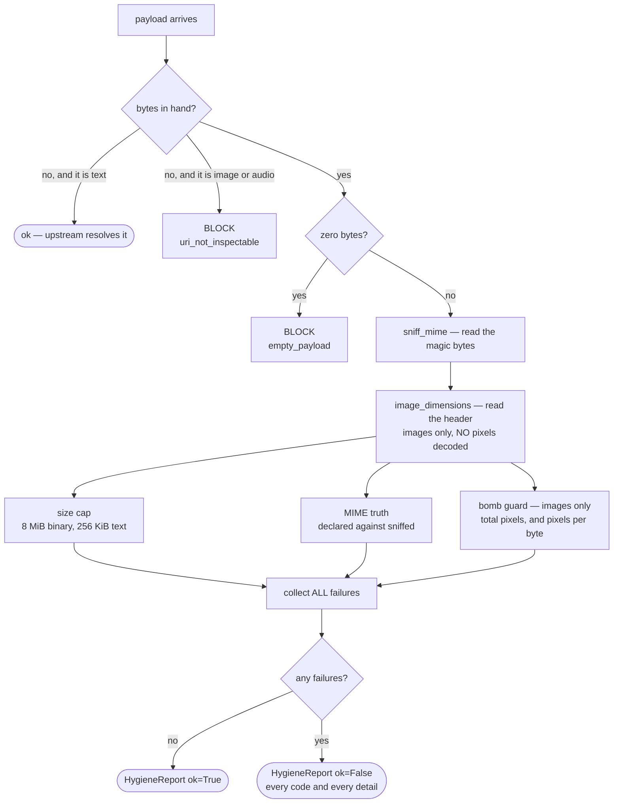
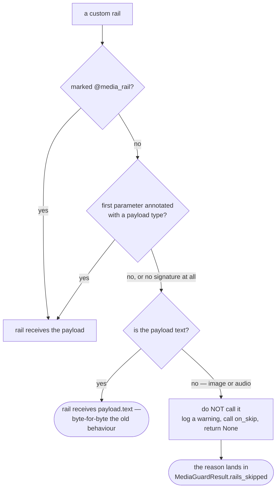

# Media — the diagrams

Five diagrams. The two worth reproducing from memory are **the hygiene gate** and **the image
chain** — between them they carry most of an interview about this module.

Everything else is explained in [`10-guide.md`](10-guide.md); a picture is only here when it
shows something prose cannot.

---

## 1. Where a payload enters the guardrails

*Look at the fork. Everything in this module hangs off one `kind` check.*

A `str` caller is handed **straight** to the text path with no encode/decode round-trip, so the
rails screen the exact string given rather than a re-derived copy of it.

`MediaScreen.check` **raises** on a `TextPayload` rather than screening it, because routing text
into the media chain would silently skip the text rails.

---

## 2. Payload hygiene — the cheap, offline gate

*Look at the URI branch. It is deliberately asymmetric.*

Text may be a reference; an image may not. Unscreenable pixels are the exact hole this module
closes, and a URI cannot be sniffed, sized or bomb-checked.

Failures are **collected, not short-circuited** — the 33-byte bomb trips both bomb checks, and an
operator debugging a rejected upload sees the whole picture rather than the first refusal.

Nothing on this path calls a model, so a hostile payload is refused before it costs a cent.

---

## 3. The image chain — order is the product

*Look at the three ways to reach the injection block. Only one of them found anything.*

```mermaid
flowchart TB
    IMG["ImagePayload"] --> HY{"hygiene ok?"}
    HY -->|no| B1(["BLOCK, layer media_hygiene<br/>every downstream rail marked skipped"])

    HY -->|yes| PII{"image-PII enabled?"}
    PII -->|no| SKIPPII["record the skip:<br/>not enabled, install aegis&#91;media&#93;"]
    PII -->|yes| RED["redact_image — OCR, paint opaque boxes,<br/>re-encode PNG, return a NEW payload"]

    SKIPPII --> SCR
    RED --> SCR["screen_image<br/>a cheap vision call on the same<br/>data URL the answering model would see"]

    SCR --> V{"the screen's verdict"}
    V -->|"no completer wired"| NC["screened=false<br/><i>no offline backstop reads pixels</i>"]
    V -->|"the reply did not parse"| UP["injection=true<br/><i>ambiguity is never a pass</i>"]
    V -->|"an instruction was found"| INJ["injection=true"]

    NC --> B2(["BLOCK, layer media_injection"])
    UP --> B2
    INJ --> B2

    V -->|clean| CUST["custom rails, through call_rail"]
    CUST --> NONPASS{"did a custom rail<br/>return non-PASS?"}
    NONPASS -->|yes| CB(["that rail's verdict verbatim —<br/>its layer, its reason"])
    NONPASS -->|no| ENT{"PII entities found earlier?"}
    ENT -->|yes| RD(["REDACT — media carries the redacted<br/>payload, and the caller forwards THAT"])
    ENT -->|no| OKI(["PASS, plus the coverage sentence"])
```

**Redact before screening**, because sending an unredacted image to a screening model is itself a
disclosure. The vision pipeline orders these two the other way round, and §19 of the guide is why
that is not an inconsistency.

**No completer wired is a block, not a degraded mode.** For text there is a regex backstop to
degrade to; no regex reads an image, so the choice is binary. The `screened=false` flag is what
lets a reader tell "the control was unavailable" from "the control found something".

A `REDACT` on a binary must hand back **pixels**, or the caller is still holding the original with
the passport number in it. And every image verdict starts life with the missing pixel
content-safety screen already sitting in `rails_skipped` — the gap is declared, not assumed away.

---

## 4. Audio — transcribe, then the whole text stack

*Look at what is on the far side of the transcript: nothing audio-specific.*

```mermaid
flowchart TB
    A["AudioPayload"] --> HY{"hygiene ok?"}
    HY -->|no| B1(["BLOCK — nothing transcribed, nothing spent"])
    HY -->|yes| TR{"transcriber wired?"}

    TR -->|no| B2(["BLOCK<br/>the text rails never saw this payload"])
    TR -->|yes| CALL["transcribe"]

    CALL --> ERR{"raised?"}
    ERR -->|yes| B3(["BLOCK<br/>no transcript for the rails to judge"])
    ERR -->|no| TEXT["the transcript, a plain str"]

    TEXT --> STACK["the FULL text rail stack<br/>signatures, injection classifier,<br/>content safety, PII, schema, topical,<br/>and every custom rail the operator wrote"]

    STACK --> V(["the text stack's verdict, with layer<br/>prefixed media_audio and reason<br/>prefixed &#91;transcript&#93;"])
```

A parallel audio policy would be weaker than the text rails and would drift the first time
someone updated one and not the other. Every attack that works typed works spoken, so the mature
stack is reused unchanged.

There is no recursion: `text_check` is `Guardrails.check_input`, and a transcript is a `str`, so
it takes the text branch of diagram 1. The media chain is entered exactly once.

---

## 5. `call_rail` — a legacy rail meets an image

*Look at the bottom-left branch — that is the one that must not silently pass.*

The alternative was to hand the rail a base64 blob, which returns "looks fine" every time — a
rail reporting coverage it does not have. Skipping is the only honest option, and it is only
honest because the skip is **recorded**.

Annotations are compared as **strings**, never resolved. `from __future__ import annotations`
makes them strings already, and resolving one would mean importing the caller's namespace, with
its import side effects, during a guardrail check.

**Next:** [`50-interview.md`](50-interview.md).
