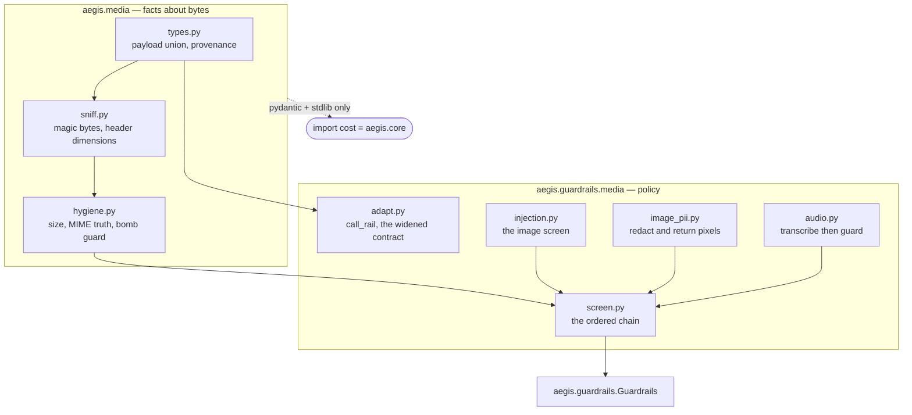
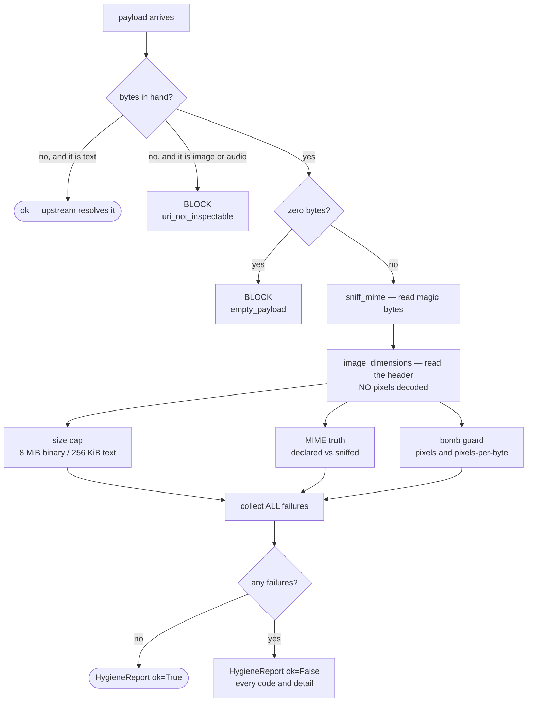
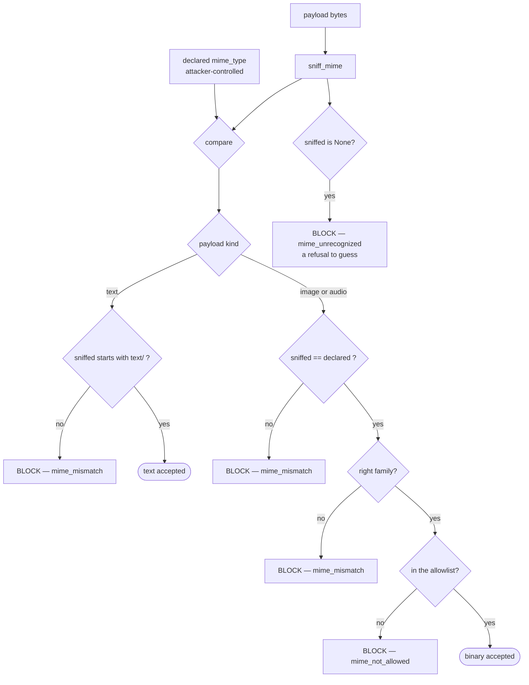
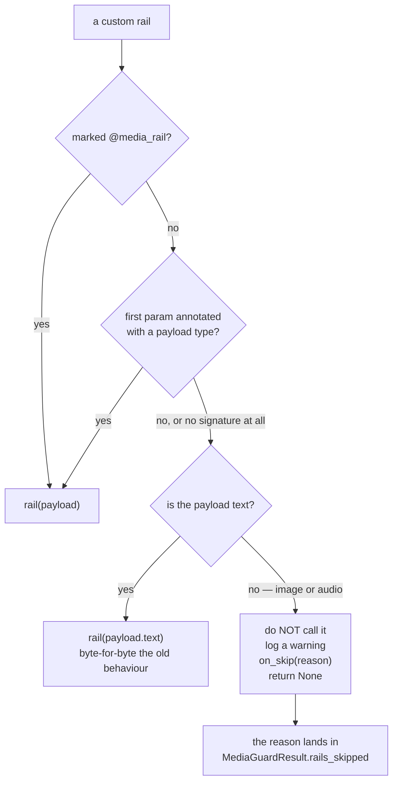
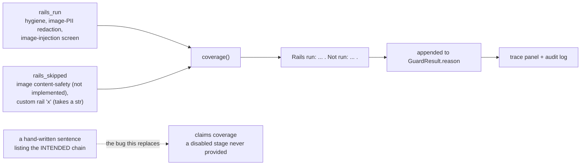
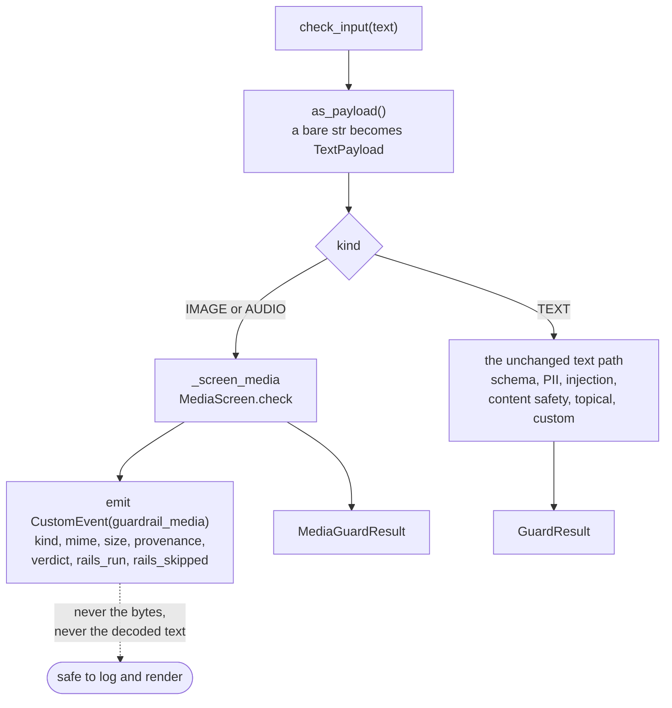

# Media — the diagrams

Every path a non-text payload can take. If you can draw diagram 2 (hygiene) and
diagram 4 (the image chain) from memory, you can talk about this module for twenty
minutes.

---

## 1. The two packages, and why they are two

**The split is the point.** `aegis.media` holds no policy — only facts. That is what
keeps it importable with no codec, no model client and no network library.

---

## 2. Payload hygiene — the cheap, offline gate

**Three things to notice.** The URI branch is *asymmetric* — text may be a reference,
an image may not, because unscreenable pixels are the hole this module closes. Failures
are **collected, not short-circuited**, so an operator debugging a rejected upload sees
the whole picture. And nothing here calls a model, so a hostile payload is refused
before it costs a cent.

---

## 3. MIME truth — why the declared type is only ever a comparand

**Text gets a family check, binary gets an exact one.** Magic bytes cannot tell
`text/plain` from `text/markdown`, so asserting an exact match there would be a lie.
For binary they can, so anything less would be a gap.

---

## 4. The image chain — order is the product

```mermaid
flowchart TB
    IMG["ImagePayload"] --> HY{"hygiene ok?"}
    HY -->|no| B1["BLOCK<br/>layer = media_hygiene<br/>every downstream rail marked skipped"]

    HY -->|yes| PII{"image-PII enabled?"}
    PII -->|no| SKIPPII["record skip:<br/>not enabled, install aegis&#91;media&#93;"]
    PII -->|yes| RED["redact_image<br/>OCR, paint boxes, re-encode PNG<br/>returns a NEW payload"]

    SKIPPII --> SCR
    RED --> SCR

    SCR{"vision completer wired?"}
    SCR -->|no| FC["screened=false, injection=true<br/>BLOCK — no offline backstop for pixels"]
    SCR -->|yes| CALL["cheap vision screen<br/>same data URL the model would see"]

    CALL --> PARSE{"reply parses?"}
    PARSE -->|"no"| FCB["injection=true<br/>ambiguity is never a pass"]
    PARSE -->|yes| VERD{"injection?"}

    VERD -->|yes| B2["BLOCK<br/>layer = media_injection"]
    VERD -->|no| CUST["custom rails<br/>via call_rail"]

    FC --> B2
    FCB --> B2

    CUST --> ENT{"PII entities found earlier?"}
    ENT -->|yes| RD["REDACT<br/>media = the redacted payload<br/>forward THAT, not the original"]
    ENT -->|no| OKI["PASS + coverage sentence"]
```

**The two edges that matter.** `SCR --> FC`: no completer is not a degraded mode, it is
*no control*, so it blocks — and `screened=false` records that the block was caused by
the control being unavailable rather than by anything found in the image.
`ENT --> RD`: a `REDACT` on a binary must hand back **pixels**, or the caller is still
holding the original with the passport number in it.

---

## 5. Audio — transcribe, then the whole text stack

```mermaid
flowchart TB
    A["AudioPayload"] --> HY{"hygiene ok?"}
    HY -->|no| B1["BLOCK — nothing transcribed, nothing spent"]
    HY -->|yes| TR{"transcriber wired?"}

    TR -->|no| B2["BLOCK<br/>the text rails never saw this payload"]
    TR -->|yes| CALL["transcribe"]

    CALL --> ERR{"raised?"}
    ERR -->|yes| B3["BLOCK<br/>no transcript for the rails to judge"]
    ERR -->|no| TEXT["transcript, a plain str"]

    TEXT --> STACK["the FULL text rail stack<br/>signatures, injection classifier,<br/>content safety, PII, schema, topical,<br/>and every custom rail"]

    STACK --> V["verdict, with layer prefixed media_audio:<br/>and reason prefixed &#91;transcript&#93;"]
```

**Why not a parallel audio policy?** Because it would be weaker than the text rails,
and the two would drift the first time someone updated one and not the other. Every
attack that works typed works spoken, so reuse the mature stack unchanged.

**Why no recursion?** `text_check` is `Guardrails.check_input`, and a transcript is a
`str` — so it takes the text branch. The media chain is entered exactly once.

---

## 6. `call_rail` — how the contract widened without breaking

**Annotations are compared as strings**, never resolved — `from __future__ import
annotations` makes them strings already, and resolving would mean importing the
caller's namespace during a guardrail check.

**The skip is recorded, not swallowed.** A rail that did not run must never be counted
among the rails that did.

---

## 7. Where the verdict sentence comes from

If the sentence is **generated from the lists**, a rail that did not run cannot appear
in it. That is a structural guarantee, not a discipline someone has to remember.

---

## 8. Routing — where a payload enters the guardrails

A `str` caller is handed **straight** to the text path with no encode/decode round-trip
— so the rails screen the exact string given, not a re-derived copy of it.

---

**Next:** [`50-interview.md`](50-interview.md).
