# Memory

## What it is

The subsystem that lets an agent remember things about a person across
separate conversations — "this customer prefers email", "this account has an
open refund request" — and recall the right ones when a new conversation
starts, without dumping the entire history into every prompt. If you have
never built a memory system: the two hard problems are **what to remember**
(not every sentence — a summary and a handful of durable facts) and **who is
allowed to see it** (memory about one customer must never leak into another
customer's conversation, even in a multi-tenant system).

## Why it exists here

Without it, every conversation starts from zero — the agent has to be told
the same preferences and constraints every time. Aegis's memory module is
built for the isolation problem specifically: this is a multi-tenant
platform, and the module's own design consequence — no shared-memory bucket
can exist here even if a future feature wanted one — is worth understanding
in detail below.

## Diagram

```mermaid
flowchart TD
    subgraph SUBJECT["Every read and write is scoped to one subject"]
        S["memory_subject_for(user_id) = 'user:&lt;id&gt;'<br/>— the ONLY shape. No tenant/platform subject exists."]
    end
    subgraph WRITE["After a turn"]
        T[Turn ends] --> P["persist(): write episodic MemoryMessage row"]
        P --> C{"every Nth turn<br/>(consolidation_every_n = 4)"}
        C -->|yes| Q[enqueue_consolidation — durable job, commits]
        Q --> EX["EXTRACT: one cheap-model call<br/>over recent turns → candidate facts"]
        EX --> RC["RECONCILE: for each candidate,<br/>find nearest existing facts by cosine"]
        RC -->|near-duplicate, same predicate| DEDUP[No LLM call — bump access_count, NOOP]
        RC -->|else| DEC["second cheap-model call:<br/>add / update / invalidate / noop"]
        DEC --> APPLY["Bitemporal apply —<br/>never a hard delete, always a new row + expired_at"]
    end
    subgraph READ["Before a turn"]
        R[New question arrives] --> RECALL["recall(subject_id, tenant_id)"]
        RECALL --> ARMS["6 arms: raw window, facts (vector+recency),<br/>profile, episodic (vector+recency), skills, summary"]
        ARMS --> SCOPE["EVERY arm filters subject_id AND tenant_id —<br/>NULL-symmetric, never a wildcard"]
        SCOPE --> WM["assemble_working_memory():<br/>budget 8000 tokens, layout profile→facts→skills→summary→episodic→raw"]
    end
```



## The architecture

```
aegis/src/aegis/memory/
  stores.py       the 6 tables: MemoryMessage, MemoryFact, MemorySession,
                   MemoryProfile, MemoryWriteLog, MemoryConsolidationJob
  recall.py        the 6 recall arms + the single _tenant_clause every arm shares
  consolidate.py   EXTRACT + RECONCILE, the bitemporal apply, the three sweep triggers
  scoring.py       the pure scoring formula (no I/O)
  working.py       assemble_working_memory() — the token-budgeted prompt block
  retention.py     the ONE place that does an unconditional hard delete
  vector_ops.py    Qdrant-backed vector search for facts and episodic messages
  config.py        MemoryConfig — every tunable, with real defaults
  spec.py          the Protocol a domain adapter must implement (FACT_TYPES, prompts, ...)
backend/src/app/adapter/memory_spec.py   the domain's concrete spec (memory_subject_for lives here)
```

## What is actually in Aegis

### The subject — one shape, composed server-side only

```python
def memory_subject_for(user_id, persona_id=None):
    if user_id is None or user_id == "":
        return None
    return f"user:{user_id}"
```

That is the **entire function**. `persona_id` is accepted and explicitly
never read. There is no `tenant:<id>` subject and no platform-wide subject —
a subject is always exactly one person.

### Two kinds of memory, and the difference that matters

**Episodic** (`MemoryMessage`) — an immutable, append-only verbatim turn.
One row per role per turn. Decayed by age, never edited in place.

**Semantic** (`MemoryFact`) — a durable, distilled fact, and it is
**bitemporal** (the Zep pattern): `valid_at`/`invalid_at` track *world*
time (when the fact was true), `created_at`/`expired_at` track
*transaction* time (when Aegis recorded that). The hot-recall predicate for
"is this fact currently believed" is exactly:

```sql
WHERE invalid_at IS NULL AND expired_at IS NULL
```

A contradiction never overwrites a row — it sets `invalid_at`/`expired_at`
on the old fact and **inserts** a new, contradicting one. A refinement sets
`expired_at` and `supersedes_id` and inserts a successor. The full history
survives; nothing is silently replaced.

### Scope enforcement — the exact predicate, and why NULL is symmetric

```python
def _tenant_clause(model, tenant_id):
    if tenant_id is None:
        return model.tenant_id.is_(None)
    return model.tenant_id == tenant_id
```

`tenant_id=None` is a **scope** — "the untenanted scope" — never a wildcard
meaning "any tenant." This clause is applied on **every one of the six
recall arms**, and on the Qdrant vector search's payload filter too (Qdrant
encodes the null case as an explicit sentinel, because its own filter
language cannot express JSON null directly). Postgres RLS is registered as a
third, independent layer over the same six tables — belt, suspenders, *and*
a third strap.

### Why there is no shared-memory bucket — a structural fact, not a policy toggle

This is worth understanding precisely, because it is not "sharing is turned
off" — it is that the schema has no way to express it. `MemoryFact.subject_id`
is a scalar `String(128)`, not a join table to multiple owners. A fact
belongs to exactly one subject string. To add sharing you would need to
change the subject to a set, change every `subject_id ==` predicate to an
`IN (...)`, and change the Qdrant filter from `MatchValue` to `MatchAny` —
none of which exists today. Contrast with `agent_skills` and `settings`,
which **are** registered as shared-read tables (`_PLATFORM_BASELINE_TABLES`)
— the codebase clearly knows how to build a shared surface, and memory is
deliberately not one.

### Scoring — the exact formula

Every candidate's score, computed **per candidate set** (min-max normalised
across whatever is being ranked right now, not globally):

```
score = 1.0·minmax(relevance)
      + 0.5·minmax(recency_decay(age_days, half_life=30d))
      + 0.5·minmax(importance / 10)
      + 0.1·minmax(log1p(access_count))

recency_decay(age, half_life) = 0.5 ** (age / half_life)
```

Only applied to semantic facts — episodic recall is ranked by Reciprocal
Rank Fusion (`k=60`), not by this formula.

### Working memory — the layout, and why it is ordered this way

`assemble_working_memory` fills a token budget (`8000 - 1200 answer reserve
- len(query)`) in this order, "lost in the middle" style:

```
profile → facts → skills → summary → episodic → raw
```

Durable, high-value context (who this person is) goes at the top; bulky
episodic context goes in the tolerant middle; the most recent verbatim turns
sit at the bottom, nearest the actual question — this is the ordering
research shows an LLM attends to best. Eviction runs in the **reverse**
order when the budget is exceeded: raw episodic turns are cut first, the
durable profile last.

### Consolidation — when it runs, and the dedup short-circuit that costs no model call

Triggered three ways: inline every `consolidation_every_n` (4) turns, a
durable `MemoryConsolidationJob` row committed synchronously so a redeploy
cannot lose the work, and an in-process sweeper polling every 60 seconds.

The reconcile step is a real cost optimisation worth knowing: if a candidate
fact's nearest existing fact has cosine similarity ≥ 0.97 **and** the same
predicate, it is treated as a duplicate — `access_count` is bumped and
logged as a `NOOP`, with **no second LLM call**. Only genuinely new or
changed facts pay for the `add/update/invalidate/noop` decision call.

### Retention — soft-forget vs hard-delete, and they are different modules

`consolidate.prune_forgotten` **soft-forgets**: a fact whose confidence has
decayed below a floor (0.05) and has never been accessed and is old enough
gets `expired_at` set — it stops being recalled but the row survives.

`retention.py` is the **only** place in the whole module that does an
unconditional, scheduled hard delete — episodic messages past a retention
window, and *only already-closed* facts (`expired_at` or `invalid_at` set
and past a separate closed-fact window). A live fact — one carrying neither
timestamp — is never eligible for hard deletion, described in the source as
"the single most important line in this module."

## How it runs

1. Before a turn: `recall(subject_id, tenant_id)` runs all six arms, each
   independently scoped, then `assemble_working_memory` packs the results
   into one token-budgeted context block.
2. After a turn: the verbatim turn is persisted as an episodic row.
3. Every 4th turn: a consolidation job extracts candidate facts from recent
   turns, reconciles each against existing facts (bitemporally), and updates
   the running summary and profile.
4. On a schedule: soft-forgetting decays unused facts; hard retention sweeps
   remove old episodic rows and already-closed facts.

## What is not here

- **No shared-memory bucket** — see above; this is structural, not a
  disabled feature.
- **`half_life_days_epi` (episodic recency half-life) is declared in config
  and never read anywhere else in the codebase.** Episodic recall is ranked
  purely by RRF fusion, with no recency, importance, or frequency term
  despite those fields being populated on every candidate.
- **The semantic cache module (`cache.py`, RedisVL-backed) is fully built
  and never wired** — nothing in the recall path constructs or queries it.
  A standing comment in the routes explains why: there is no derived cache
  to invalidate because nothing builds one, and calling `invalidate` on a
  cache instance that was never populated "would evict nothing while
  reading like a safeguard, which is worse than the note."
- **`persona` is threaded through several function signatures and never
  used** to gate anything — accepted, stored nowhere, read nowhere.
- **`MemoryOrigin.TOOL` and `.REFLECTION`** are declared enum members that
  nothing in the codebase ever writes — only `USER` and `ASSISTANT` are set.
