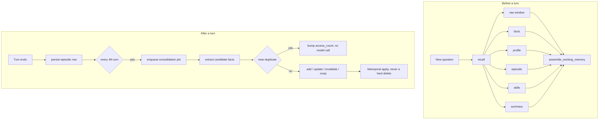

# Memory

## What it is

The subsystem that lets an agent remember things about one person across
separate conversations — "prefers email", "has an open refund request" — and
recall the right ones when a new conversation starts, without pasting the
whole history into every prompt.

It solves two problems at once: deciding **what is worth keeping** (a rolling
summary and a handful of durable facts, not every sentence), and deciding
**who may see it** (memory about one person must never surface in another
tenant's conversation).

## Why it exists

Without it every conversation restarts from zero and the same preferences and
constraints have to be restated each time. In a multi-tenant platform the
isolation half is the harder half, so this module scopes every read and every
write by subject *and* tenant, at three independent layers.

## Diagram



## How it works

**The subject.** `memory_subject_for(user_id)` returns `"user:<id>"` and
nothing else. There is no tenant-wide or platform-wide subject; a subject is
always exactly one person. It is composed server-side, never taken from a
request body.

**Two kinds of memory.**

- **Episodic** (`memory_message`) — an immutable, verbatim turn. One row per
  role per turn. Ranked by RRF fusion at recall time.
- **Semantic** (`memory_fact`) — a distilled, durable fact, and it is
  **bitemporal**: `valid_at`/`invalid_at` track when the fact was true in the
  world, `created_at`/`expired_at` track when Aegis believed it. The
  "currently believed" predicate is exactly
  `WHERE invalid_at IS NULL AND expired_at IS NULL`.

A contradiction never overwrites a row. It closes the old fact and inserts a
new one; a refinement sets `expired_at` and `supersedes_id` and inserts a
successor. The history survives.

**Recall** gathers six tiers — raw window, facts, profile, episodic, skills
and the running summary — each with its own query, each scoped to
`subject_id` **and** `tenant_id`.

**Scoring** for semantic facts, min-max normalised per candidate set:

```
score = 1.0 * relevance
      + 0.5 * recency_decay(age_days, half_life = 30d)
      + 0.5 * (importance / 10)
      + 0.1 * log1p(access_count)

recency_decay(age, half_life) = 0.5 ** (age / half_life)
```

**Working memory** fills a token budget (`ctx_token_cap` 8000, minus an
`answer_reserve` of 1200 and the query) in the order
`profile → facts → skills → summary → episodic → raw`. Durable, high-value
context sits at the top, bulky episodic material in the tolerant middle, the
most recent verbatim turns nearest the question. Eviction runs the reverse
order: raw first, profile last.

**Consolidation** fires three ways: inline every `consolidation_every_n`
(4) turns, through a durable `memory_consolidation_job` row committed
synchronously so a redeploy cannot lose the work, and through an in-process
sweeper. Reconciliation short-circuits: a candidate whose nearest existing
fact is at cosine `>= 0.97` with the same predicate is a duplicate — bump
`access_count`, log a `NOOP`, no second model call.

**Forgetting has two distinct mechanisms.** `consolidate.prune_forgotten`
soft-forgets: a fact below the confidence floor (`0.05`), never accessed and
old enough, gets `expired_at` set and stops being recalled, but the row
survives. `retention.py` is the only place that hard-deletes — episodic
messages past the retention window, and *only already-closed* facts. A live
fact, carrying neither `expired_at` nor `invalid_at`, is never eligible.

## What it stores

| Table | Columns that matter |
| --- | --- |
| `memory_session` | `id` (same string as the console's `chat_sessions.id`), `tenant_id`, `subject_id`, `turn_count`, `summary`, `last_active_at` |
| `memory_message` | `tenant_id`, `subject_id`, `session_id`, `turn_index`, `role`, `origin`, `content`, `embedding`, `importance`, `access_count`, `created_at` |
| `memory_fact` | `tenant_id`, `subject_id`, `fact_type`, `subject`/`predicate`/`object`, `text`, `embedding`, `confidence`, `importance`, `access_count`, `valid_at`, `invalid_at`, `created_at`, `expired_at`, `source_turn_ids`, `supersedes_id` |
| `memory_profile` | `tenant_id`, `subject_id`, `data` (JSONB), `updated_at` |
| `memory_write_log` | `tenant_id`, `subject_id`, `op`, `fact_id`, `before`, `after`, `reason`, `model`, `trace_id`, `ts` — the audit trail of every fact change |
| `memory_consolidation_job` | `tenant_id`, `subject_id`, `session_id`, `status`, `attempts`, `error` |

Vectors also live in Qdrant, in collections named
`aegis_mem_<table>_d<dim>` (for example `aegis_mem_memory_fact_d3072`).

## Security and tenant isolation

Three independent layers, in this order:

1. **The subject predicate.** Every query filters `subject_id`, which is
   always one person.
2. **The tenant predicate.** `_tenant_clause` is applied on every arm:

   ```python
   if tenant_id is None:
       return model.tenant_id.is_(None)
   return model.tenant_id == tenant_id
   ```

   `tenant_id=None` is the untenanted **scope**, never a wildcard. The Qdrant
   payload filter carries the same rule, encoding the null case as an explicit
   sentinel because Qdrant's filter language cannot express JSON null.
3. **Postgres row-level security.** All six tables are registered as
   tenant-scoped. The scope is bound as a property of the **session** through
   an `after_begin` hook, still `is_local=true`, so it survives the commits
   that recall and consolidation perform mid-flight. `SET SESSION` is
   deliberately not used: it would make the scope a property of the
   connection, and a missed reset would hand a live scope back to the pool.

**There is no shared-memory bucket, structurally.** `subject_id` is a scalar
`String(128)`, not a join table. Sharing would require the subject to become a
set, every `subject_id ==` to become `IN (...)`, and the Qdrant filter to move
from `MatchValue` to `MatchAny`. None of that exists. Contrast `agent_skills`
and `settings`, which *are* registered as shared-read platform baselines.

Everything except the retention sweep is authorised per subject, because
writing or correcting your own memory is a client-facing capability. The
sweep hard-deletes across every subject in a tenant, so it is admin-only.

## API surface

| Method | Path | Who may call | Returns |
| --- | --- | --- | --- |
| GET | `/v1/memory/facts` | any authenticated caller | the subject's currently-believed facts |
| POST | `/v1/memory/facts` | any authenticated caller | a newly written fact |
| PATCH | `/v1/memory/facts/{fact_id}` | any authenticated caller | the corrected fact, applied bitemporally |
| DELETE | `/v1/memory/facts/{fact_id}` | any authenticated caller | erasure confirmation |
| GET | `/v1/memory/profile` | any authenticated caller | the subject's profile blob |
| GET | `/v1/memory/subjects` | any authenticated caller | the subjects this caller may manage |
| GET | `/v1/memory/sessions` | any authenticated caller | the subject's conversation list |
| GET | `/v1/memory/sessions/{session_id}/messages` | any authenticated caller | verbatim turns for one session |
| GET | `/v1/memory/writes` | any authenticated caller | the write-log audit trail |
| GET | `/v1/memory/recall_debug` | any authenticated caller | what each arm selected and why |
| POST | `/v1/memory/forget` | any authenticated caller | GDPR erasure for a subject |
| GET | `/v1/memory/retention` | any authenticated caller | a preview of what a sweep would delete |
| POST | `/v1/memory/retention/sweep` | admin only | counts of rows hard-deleted |

## Configuration

| Variable | Default | Effect |
| --- | --- | --- |
| `MEMORY_SWEEPER_INTERVAL_SECONDS` | `60.0` | how often the consolidation sweeper polls |
| `MEMORY_SWEEPER_BATCH` | `10` | jobs claimed per sweep |
| `MEMORY_RETENTION_DAYS` | `90` | age at which episodic messages become deletable |
| `MEMORY_CLOSED_FACT_RETENTION_DAYS` | `30` | age at which an already-closed fact becomes deletable |
| `MEMORY_RETENTION_SWEEP_INTERVAL_SECONDS` | `86400.0` | how often the hard-delete sweep runs |
| `RLS_FAIL_CLOSED` | `false` | whether an unbound tenant scope sees zero rows |
| `QDRANT_URL` | `http://localhost:6333` | where memory vectors are stored |

The recall and budget knobs (`k_fact`, `n_fact`, `consolidation_every_n`,
`ctx_token_cap`, the scoring weights, `dedup_cos`) are fields on
`MemoryConfig`, a dataclass — not environment variables.

## Where it lives

| Path | What it does |
| --- | --- |
| `aegis/src/aegis/memory/stores.py` | the six ORM tables |
| `aegis/src/aegis/memory/recall.py` | the six recall arms and the shared `_tenant_clause` |
| `aegis/src/aegis/memory/working.py` | `assemble_working_memory()` and the layout/eviction order |
| `aegis/src/aegis/memory/scoring.py` | the pure scoring formula, no I/O |
| `aegis/src/aegis/memory/consolidate.py` | extract, reconcile, bitemporal apply, soft-forget |
| `aegis/src/aegis/memory/retention.py` | the only unconditional hard delete |
| `aegis/src/aegis/memory/vector_ops.py` | Qdrant search for facts and episodic turns |
| `aegis/src/aegis/memory/scope.py` | the session-level tenant scope binding |
| `aegis/src/aegis/memory/crud.py` | the write/correct/erase operations behind the routes |
| `aegis/src/aegis/memory/config.py` | `MemoryConfig` and its defaults |
| `aegis/src/aegis/memory/spec.py` | the Protocol a domain adapter implements |
| `aegis/src/aegis/memory/cache.py` | `MemorySemanticCache`, the Redis-backed recall cache class |
| `backend/src/app/adapter/memory_spec.py` | the domain's concrete spec, including `memory_subject_for` |
| `backend/src/app/api/routes_memory.py` | subjects, fact write/correct, retention preview and sweep |

## What it does not do

- No shared-memory bucket. The schema cannot express one.
- No hard delete of a live fact, at any age, by any route.
- Episodic recall carries no recency, importance or frequency term. Those
  fields are populated but episodic ranking is RRF fusion alone.
- `persona` is threaded through several signatures and gates nothing.
- The semantic recall cache is a class the package exports; the recall path
  constructs no instance of it, so recall is always computed fresh.
- `MemoryOrigin.TOOL` and `.REFLECTION` are declared and never written; only
  `USER` and `ASSISTANT` are set.
