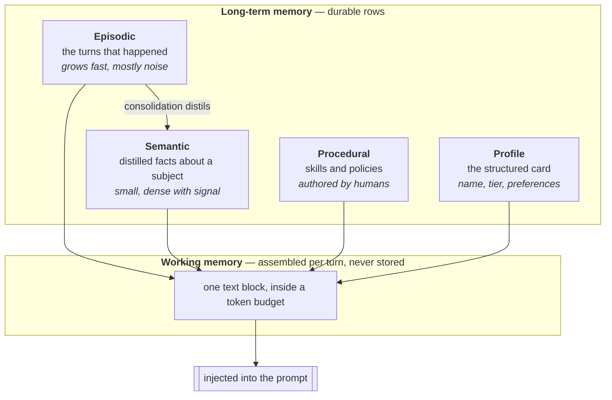
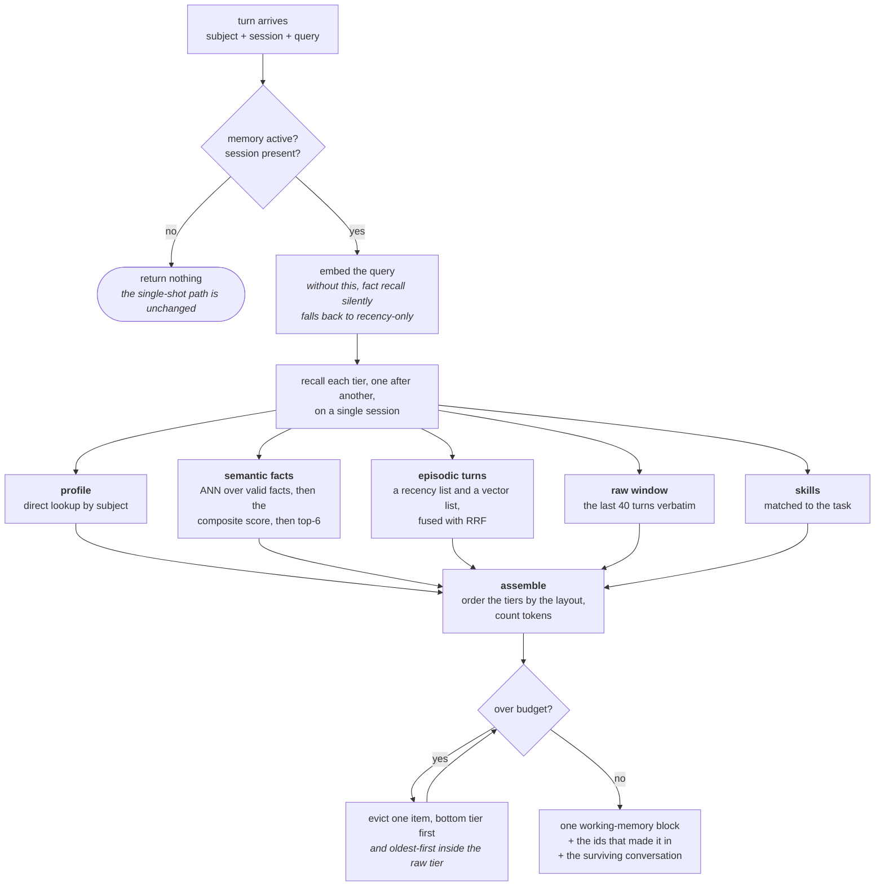
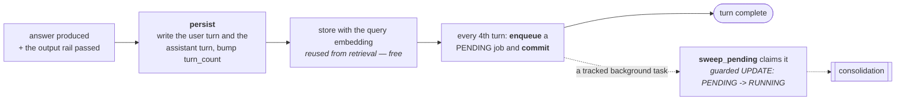
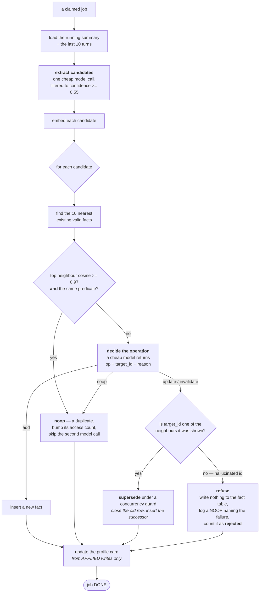
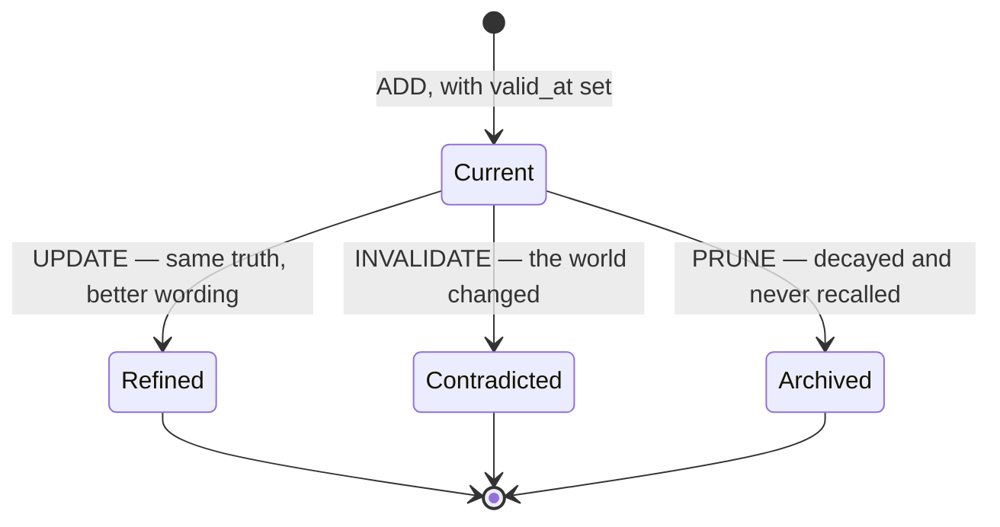

# Memory — the diagrams

Five diagrams. The two worth reproducing on a whiteboard are **the read path** and
**consolidation** — between them they carry a long conversation about this module.

The prose behind all of it is in [`10-guide.md`](10-guide.md); a picture is only here when it
shows something prose cannot.

---

## 1. The four tiers, and the one arrow that matters

*Look at `EP -> SE`. Everything else is plumbing around that arrow.*

Without the distillation arrow, memory is a transcript you have to search. With it, memory is
knowledge — and *"what tier is this customer?"* becomes a lookup instead of an inference over a
paragraph containing a question mark and a complaint about shipping.

Working memory is not storage. It is a budget, and the four durable tiers compete for it.

---

## 2. The read path — what happens before the agent plans

*Look at the eviction arrow that points backwards. It is a loop, not one drop.*

Every query on this path is scoped to subject **and** tenant, with `tenant_id=None` meaning the
null-tenant scope rather than a wildcard. The conditional form — filter *only if* a tenant was
passed — reads as defensive coding and behaves as a cross-tenant leak.

Eviction loops because dropping one item may still leave you over: the separators joining the
sections cost tokens too.

The embedding step is not optional. With no query vector, semantic recall degrades to "the six
newest facts", which looks like it is working and is not semantic in any respect.

---

## 3. The write path, and the queue seam

*Look at which arrow commits. That commit is the only reason a crash does not lose the job.*

The request path is deliberately cheap: two rows and a queued job. All the expensive thinking
happens off it.

The background task calls `sweep_pending`, not `consolidate` directly. `consolidate` does not
touch the job row, so calling it directly left the job `PENDING` forever — and the interval
sweeper then consolidated the same session a second time.

The guarded claim is what makes that safe under two sweepers: `rowcount == 0` means somebody
else won, so this one skips.

---

## 4. Consolidation — the interesting one

*Look at the `no — hallucinated id` branch. That branch is the difference between a truthful
audit trail and a confidently false one.*

**The refusal.** The tempting fallback for an invented id is "use the nearest neighbour
instead". That silently invalidates an unrelated memory, records it as a legitimate
contradiction, and leaves the audit log claiming it was intentional. A hallucinated id is a
model failure, and repairing a model failure by guessing turns one wrong answer into a
permanent wrong record.

**The dedup needs both conditions.** `tier = gold` and `tier = silver` embed extremely close
together and are a contradiction, not a duplicate.

**`PROF` reads applied writes, not candidates.** A candidate ruled `noop`, refused, or lost to
a concurrency race must not still rewrite the profile — which is the always-injected block at
the very top of the prompt, where the model attends most.

---

## 5. The life of a fact

*Look at the exits. Every one of them keeps the row.*

`Current` is the only state hot recall sees, and the filter is one predicate:
`invalid_at IS NULL AND expired_at IS NULL`. That is why a superseded row stops competing
without being destroyed.

| Leaving `Current` | What is written on the old row | The successor |
|---|---|---|
| Refinement (`UPDATE`) | `expired_at = now` — transaction time only | inserted, `supersedes_id` set |
| Contradiction (`INVALIDATE`) | `invalid_at` = when it stopped being true, **and** `expired_at = now` | inserted, `supersedes_id` set |
| Prune (`PRUNE`) | `expired_at = now` | none |

The two supersession edges are the ones people conflate. A **refinement** closes transaction
time only, because the fact never stopped being true — only our wording changed. A
**contradiction** closes both clocks. Get that wrong and your valid-time history reports a
subscription change that never happened.

`PRUNE` is soft archival, not a delete, so "forgetting" here means *stops being recalled*,
never *ceases to exist*.

**Next:** [`50-interview.md`](50-interview.md) — the questions you'll be asked about this.
