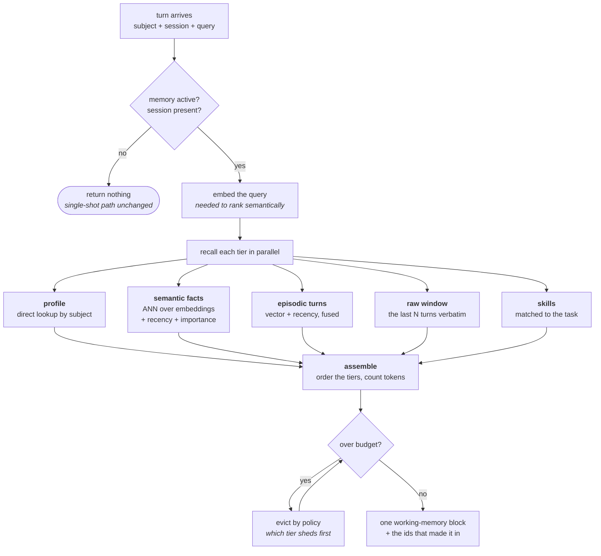
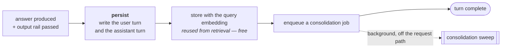
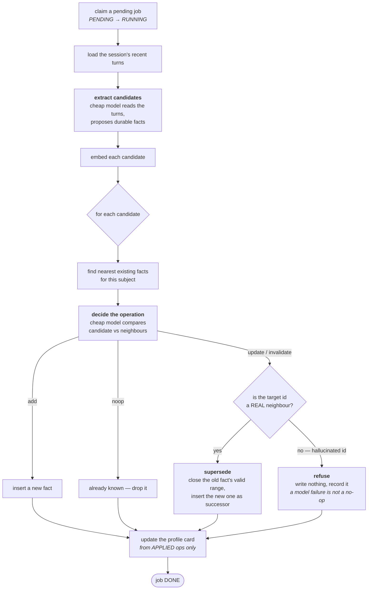
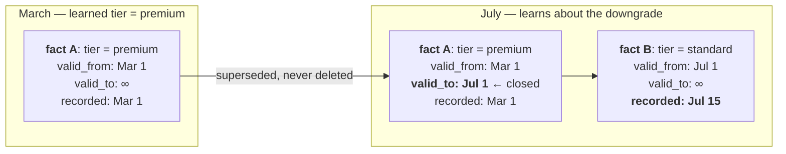
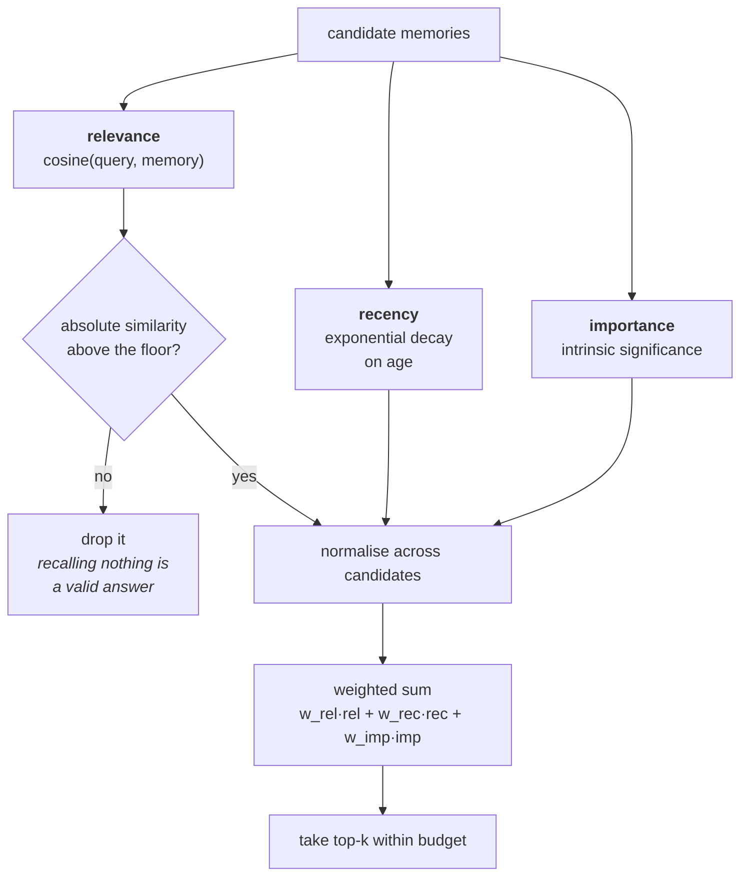
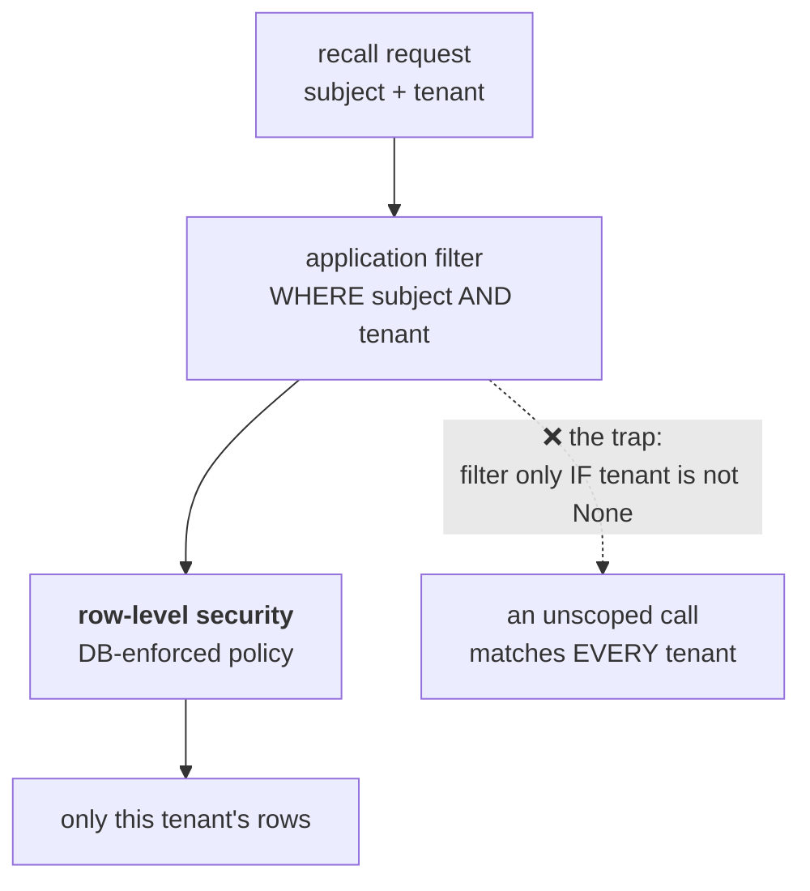

# Memory — the diagrams

Every path through the memory subsystem, drawn. If you can reproduce the read path and
the consolidation loop on a whiteboard, you can hold a long conversation about this.

---

## 1. The four tiers, and where each lives

**The arrow that matters** is `EP → SE`. Without it, memory is a transcript you have to
search. With it, memory is knowledge.

---

## 2. The read path — what happens before the agent plans

This runs on every turn, *before* retrieval.

**Two things to notice.** The embedding step is not optional — without a query vector,
semantic recall silently degrades to recency-only, which *looks* like it works and
returns whatever is newest regardless of relevance. And eviction is a **loop**, because
dropping one item may still leave you over budget.

---

## 3. The write path — what happens after the answer

The write is deliberately cheap: append two rows and queue a job. Nothing that makes a
user wait. All the expensive thinking happens in the sweep.

---

## 4. Consolidation — the interesting one

### The two edges worth pointing at in an interview

**`TGT → REJ`.** The extraction model returns which existing fact to supersede. If it
invents an id, the tempting fallback is "use the nearest neighbour instead" — and that
silently invalidates an unrelated memory and records it as a legitimate contradiction.
Bitemporal history is then permanently wrong, and nothing in the write log says so. A
hallucinated id is a **model failure** and must be refused, not repaired by guessing.

**`PROF` reads applied ops, not candidates.** If the profile is updated from the raw
candidate list, a fact the reconcile step ruled `noop` — or one whose update lost a
concurrency race — still mutates the profile. The profile then disagrees with the facts
it is supposed to summarise.

---

## 5. Bitemporal supersession, on a timeline

What "nothing is deleted" actually looks like.

Now both questions are answerable:

- *"What tier were they on in May?"* → fact A. **Valid time.**
- *"What did we believe on 10 July?"* → still premium; we only learned on the 15th.
  **Transaction time.** This is the audit question.

---

## 6. Recall scoring

**The floor must come before normalisation.** Min-max scaling maps the best candidate
to 1.0 no matter how bad it is — so a set whose best cosine is 0.15 still produces a
confident top-ranked "relevant" memory. Filter on the *absolute* score first.

---

## 7. Tenant isolation on every read

The dotted edge is the real bug pattern. Written as `if tenant_id is not None: add
filter`, it reads as defensive coding and behaves as a cross-tenant leak whenever a
caller passes nothing. The correct form is symmetric: a null tenant must match *null
tenant rows only*, not all rows.

---

**Next:** [`50-interview.md`](50-interview.md) — the questions you'll be asked about this.
