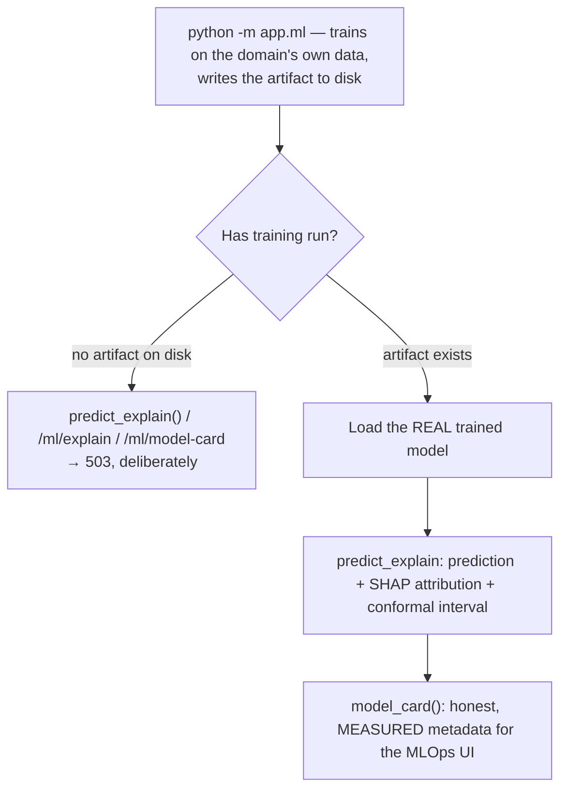

# ML

## What it is

A trained prediction model with a SHAP explanation attached and a conformal
prediction interval, exposed through `predict_explain()`. If you have never
used SHAP or conformal prediction before: SHAP answers "which input features
pushed this specific prediction up or down, and by how much" — a per-
prediction explanation, not just a global feature-importance ranking.
Conformal prediction answers "how confident should I actually be in this
number," with a statistically calibrated interval rather than a guessed
error bar.

## Why it exists here

The interesting design decision in this module is not the modelling — it is
what happens **before** a real model has ever been trained, and the project
paid for the lesson directly (see below).

## Diagram



## The architecture

```
aegis/src/aegis/ml/
  __init__.py   predict_explain(), train(), the process-wide model singleton
  dataset.py    synthesise_frame() — the deterministic built-in synthesiser
  spec.py       the Protocol a domain adapter's real training-data provider implements
```

## What is actually in Aegis

### The refusal that replaced a fallback — and the specific defect it fixed

Quoted directly from `__init__.py`: *"There is **no silent fallback**:
`predict_explain` raises [before training] rather than fitting one on the
built-in noise synthesiser and serving [that as domain evidence]."*

This corrected a real, shipped defect. Before this change, calling
`/v1/ml/explain` or `/v1/ml/model-card` before a real training run had happened
would **silently train on autogenerated noise** — `synthesise_frame()`
produces plausible-looking but entirely fabricated categorical and numeric
data specifically so the whole ML spine (training, calibration, SHAP,
round-trip) can be exercised and tested without needing real domain data.
That synthesiser is real, useful, and explicitly designed for testing — the
defect was serving its output **as if it were a genuine model explanation
about the actual domain**, to a real caller who had no way of knowing the
"explanation" they received was computed over fabricated numbers.

The fix: `predict_explain()` now **raises before ever falling back**, and a
model trained on the built-in synthesiser is explicitly **never written to
the persisted artifact path** — so there is no way for a synthetic-data
model to accidentally end up looking, on disk, like a real trained one.

### The training command, and what it needs

```
cd backend && .venv/bin/python -m app.ml
```

Real, domain-specific training data comes from the adapter's own
implementation of the `spec.py` Protocol — a real `training_frame`
provider. Only when no such provider is wired does the spine fall back to
`synthesise_frame()`, and that fallback path is meant for exercising the
ML machinery in tests and development, never for serving real predictions.

### `model_card()` — honest, measured metadata

The card returned alongside a prediction reports real, measured facts about
the model that produced it — not a static description written once and
never revisited.

## How it runs

1. `python -m app.ml` trains on the domain adapter's real data provider (or
   the synthesiser, in development/test contexts) and persists the
   artifact.
2. `predict_explain()` loads the persisted artifact if one exists.
3. If no artifact has ever been persisted, the call **raises** — surfaced
   as a `503` at the `/v1/ml/explain` and `/v1/ml/model-card` endpoints — rather
   than silently training on synthetic data and answering as if it were
   real.
4. Given a real prediction request, the response carries the prediction,
   its SHAP attribution, and a conformal interval.

## What is not here

- **No automatic retraining trigger.** The artifact is only refreshed by
  explicitly running `python -m app.ml` again; nothing watches for data
  drift and retrains on its own.
- **No fallback to a lesser but real model** — the refusal is total until a
  real artifact exists; there is no intermediate "degraded but honest"
  prediction mode.
