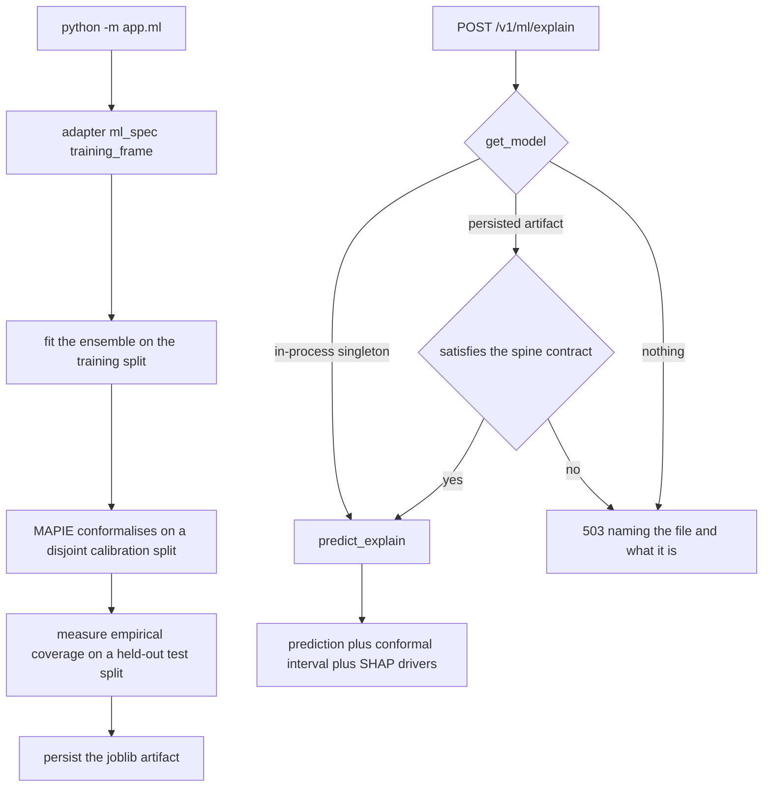

# ML

## What it is

A trained prediction model that answers three questions at once: what does it
predict, how confident should you be, and which inputs drove *this* particular
prediction. One call, `predict_explain()`, returns all three.

Two techniques do the last two:

- **Conformal prediction** measures the model's *actual* error on a held-out
  calibration split and builds the interval from that, rather than from an
  assumption about how errors are distributed.
- **SHAP** gives per-feature attributions for one prediction — "the priority
  field pushed this up by 4.2 hours" — not just a global importance ranking.

## Why it exists

An agent that quotes a number as evidence must be able to say where the number
came from and how much to trust it. An interval with no calibration and an
explanation with no attribution are both decoration. This module is also the
place where the platform refuses to substitute made-up data for real data.

## Diagram

## How it works

**One `TrustworthyModel` bundles three parts.**

1. **An ensemble.** Two members, soft-voting for classification and averaging
   for regression: an XGBoost model and a scikit-learn
   `HistGradientBoosting` model. Categorical features are one-hot encoded;
   numeric features pass through.
2. **MAPIE split conformal prediction**, wrapped around the *already fitted*
   ensemble and calibrated on a disjoint split. It produces intervals for
   regression and prediction sets for classification, with a guaranteed
   marginal coverage equal to `confidence_level` (default `0.9`).
3. **SHAP, dispatched per ensemble member.** `TreeExplainer` for boosters and
   forests (exact, needs no reference data), `LinearExplainer` for a linear
   member (exact, against a stored 100-row background), `PermutationExplainer`
   for anything else. Attributions are averaged with the ensemble's own member
   weights, so the drivers explain the ensemble's output. The dispatch is what
   lets a non-tree member be promoted at all.

**`get_model()` resolves in two steps and then stops:** the in-process
singleton, then the persisted artifact. There is deliberately no third step.
Nothing trains on demand.

**No silent substitution.** `dataset.synthesise_frame()` produces plausible but
entirely fabricated data, and it exists so the whole spine — fit, calibrate,
SHAP, round-trip — can be exercised without real domain data. Serving its
output as domain evidence is refused: `train()` never persists a
`data_source == "synthetic"` model for you, and if the domain adapter cannot
be imported the backend raises `MLModelUnavailableError` instead of resolving
to the fallback spec.

**A foreign artifact is refused by contract, not by class.** The artifact path
is a shared address that any tool writing a `.joblib` can land on. On load, the
object is checked for the two methods the routes actually call —
`model_card` and `predict_explain`. An `isinstance` check would make the class
the contract and reject a wrapper that serves perfectly; the method check
refuses only what genuinely cannot serve, and the message names the file and
what it actually is.

**`dataset_digest` answers "which data produced this model".** It is a
`sha256:<hex>` digest over exactly the feature and target columns the fit
consumed, carried on the model, through the joblib artifact, onto the card and
out of the endpoint. Same frame gives the same digest in any process, on any
machine, whatever the column order or index. Any changed cell, reordered row,
added, dropped or renamed column, dtype change, or appearing or disappearing
NaN gives a different one. To check a served model against data you trust:
`frame_digest(df, columns=[*spec.features, spec.target]) == card.dataset_digest`.

**The model card is measured, never declared.** Every field is read off the
live fitted object: `task`, `target`, `features`, `categorical_features`,
`numeric_features`, `encoded_feature_count`, `ensemble_members` with their
weights, `conformal_method`, `conformal_predictor`, `conformal_coverage` (what
was requested), `conformal_coverage_empirical` (what was achieved on the test
split), `training_size`, `calibration_size`, `test_size`, `data_source`,
`dataset_digest`, `metric_name` and `metric_value`. The requested and achieved
coverage are two separate fields and must stay that way.

## What it stores

This module stores nothing in a database. Its one piece of state is a joblib
artifact on disk:

| Path | Written by |
| --- | --- |
| `backend/.artifacts/ml_spine.joblib` | the host, via `python -m app.ml` — this is what the endpoints serve |
| `aegis/src/aegis/ml/artifacts/ml_spine.joblib` | the library's own default path, used when `aegis.ml` is driven directly |

The host path is deliberately not the library path: training through the
backend must not write into the installed package, and a read-only or shared
install would fail the write outright. The trained artifact is environment
state, not source, and is git-ignored.

## Security and tenant isolation

No tenant-scoped data. The model is a single platform-wide artifact; it is not
fitted per tenant and it holds no tenant rows.

What this module does enforce:

- Both endpoints are restricted to the `admin` and `ai_team` roles.
- With no usable artifact, both endpoints answer `503` with a sentence saying
  no model is available — never a `500`, and never a prediction computed over
  fabricated data.
- A model fitted on the built-in synthesiser is never persisted automatically,
  so it cannot be picked up later as if it were real.
- `dataset_digest` makes a poisoned fit attributable after the fact.

## API surface

| Method | Path | Who may call | Returns |
| --- | --- | --- | --- |
| POST | `/v1/ml/explain` | admin or ai_team | the prediction, its conformal interval, the requested coverage, and the signed SHAP attribution per feature |
| GET | `/v1/ml/model-card` | admin or ai_team | the measured model card described above |

Both answer `503` when no servable artifact exists.

## Configuration

This module reads no environment variables. Its behaviour is set by arguments
to `train()`:

| Argument | Default | Effect |
| --- | --- | --- |
| `spec` | the domain adapter's `ml_spec` | which features and target are used |
| `frame` | the spec's own frame provider | the training data |
| `confidence_level` | `0.9` | the guaranteed marginal coverage |
| `calibration_size` | `0.25` | fraction of rows held out for conformal calibration |
| `random_state` | `0` | determinism |
| `path` | `backend/.artifacts/ml_spine.joblib` | where the artifact is written; `None` skips persistence |

Training is run as `cd backend && .venv/bin/python -m app.ml`.

## Where it lives

| Path | What it does |
| --- | --- |
| `aegis/src/aegis/ml/model.py` | `TrustworthyModel` — the ensemble, MAPIE conformal, SHAP dispatch, the model card, save and load |
| `aegis/src/aegis/ml/__init__.py` | `train()`, `load()`, `get_model()`, `predict_explain()`, the process-wide singleton |
| `aegis/src/aegis/ml/spec.py` | the `MLSpec` Protocol a domain adapter implements, and `resolve_spec` |
| `aegis/src/aegis/ml/dataset.py` | `synthesise_frame()`, the deterministic built-in synthesiser |
| `aegis/src/aegis/ml/provenance.py` | `frame_digest()` and the digest determinism contract |
| `aegis/src/aegis/ml/types.py` | `ModelCard`, `EnsembleMember`, `TaskType`, `MLModelUnavailableError` |
| `aegis/src/aegis/ml/stream.py` | the ML stream-event shape |
| `backend/src/app/ml/__init__.py` | the host layer: wires the domain spec, owns the host artifact path, refuses a foreign artifact |
| `backend/src/app/ml/__main__.py` | `python -m app.ml`, the reproducible offline trainer and its sanity probe |
| `backend/src/app/ml/model.py` | the host-side re-export of the spine |
| `backend/src/app/ml/spec.py` | the host's spec typing |
| `backend/src/app/adapter/ml_spec.py` | the domain's real features, target and training frame |

## What it does not do

- No automatic retraining. The artifact refreshes only when
  `python -m app.ml` is run again; nothing watches for drift.
- No degraded prediction mode. Without a real artifact the answer is a
  refusal, not a lesser number.
- No screening of the training frame. The digest is tamper-evidence, not
  tamper-prevention; a poisoned frame still fits, and detection needs a
  reference digest recorded while the data was trusted.
- No per-tenant models. One artifact serves the deployment.
- The agent graph does not call it. Predictions are a tenant-facing capability
  with their own endpoints, not a stage of the agent pipeline.
