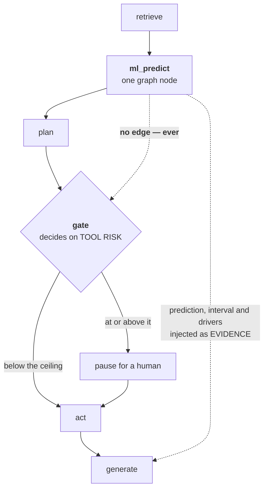
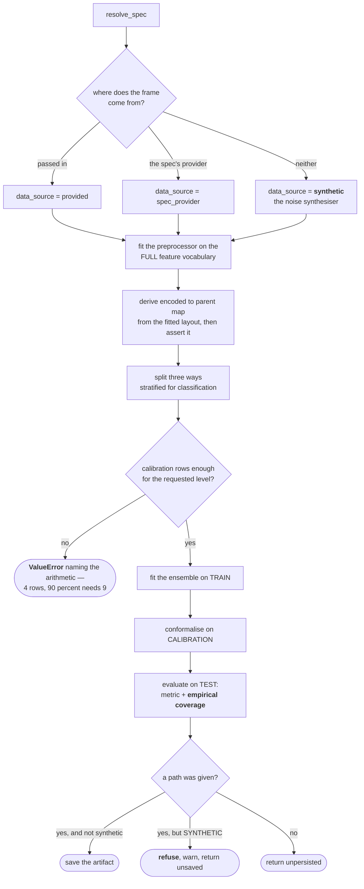
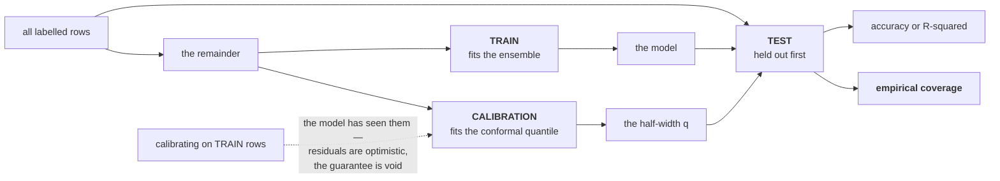
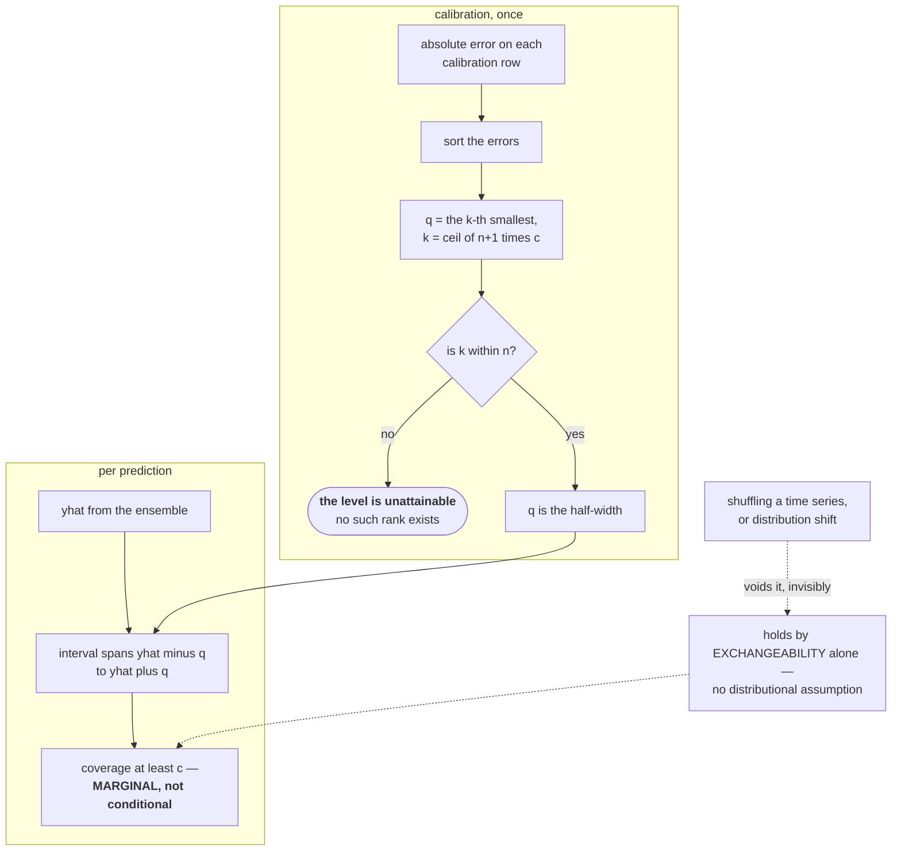
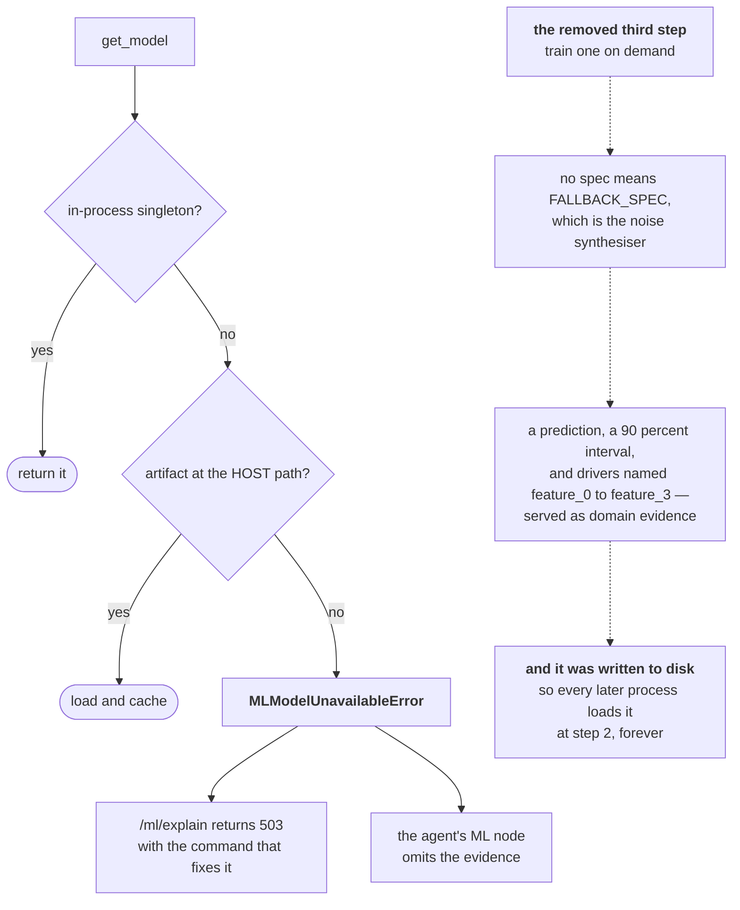

# ML — the diagrams

Five diagrams. The two worth reproducing from memory are **the three splits** and
**`get_model`'s missing third step** — between them they carry the whole argument about
what this module is allowed to say.

Everything else is explained in [`10-guide.md`](10-guide.md); a picture is only here when
it shows something prose cannot.

---

## 1. Where ML sits in a run

*Look at the dotted arrow into `gate`. It is a **non**-edge, and it is the design.*

The prediction reaches the answer. It never reaches the decision to stop.

That is what makes a failed prediction harmless: `ml_predict` swallows the exception,
returns `{}`, and the run answers with zero ML rather than failing.

---

## 2. Training, end to end

*Look at the two places it refuses: too few calibration rows, and a synthetic model asking
to be saved.*

The preprocessor is fitted on the whole frame on purpose: one-hot categories are not
target-dependent, so there is no label leakage, and every level the data contains gets a
column.

The refusal on the right is the entire §10 bug closed at its source — a persisted noise
model is reloaded by every process, forever.

---

## 3. The three splits, and the number each one earns

*Look at what TEST is touched by: nothing. That is why its coverage number can disappoint
you.*

Two splits give you a model and an interval. The third is the only one that can tell you
the interval did not do what you asked for.

> Requested 0.9 and achieved 0.76 are different facts. Report one as the other and you
> have printed your configuration and called it a result.

---

## 4. Conformal prediction, mechanically

*Look at the rank check — that is where an unattainable level gets caught before it can
serve anything.*

Every prediction gets the **same** half-width, because the score is a plain absolute
residual. Split conformal cannot say "this row is harder than that one"; CQR is the
upgrade if it ever needs to.

For classification the analogue is a prediction **set**: a singleton is a confident call,
a two-label set is genuine ambiguity, an empty set is degenerate.

---

## 5. `get_model`, and the third step that was deleted

*Look at the dashed chain on the right — that is what the deleted step did, in order.*

Nothing on that dashed chain is broken. The conformal machinery worked perfectly — on
noise.

Refusing is only safe **because** ML never gates. Omitting evidence degrades an answer;
serving fake evidence corrupts a decision.

**Next:** [`50-interview.md`](50-interview.md).
