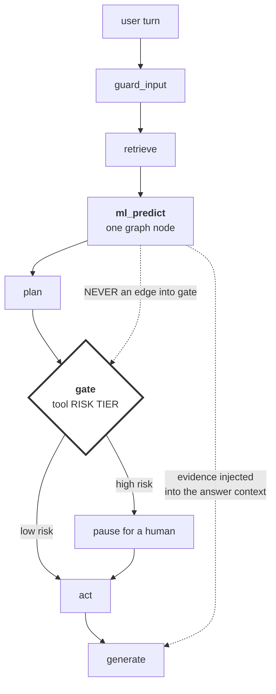
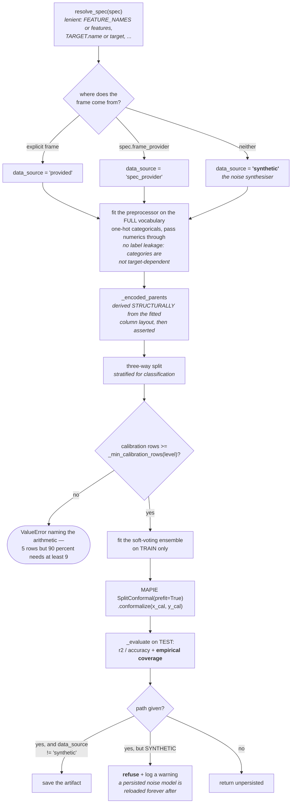
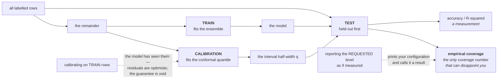
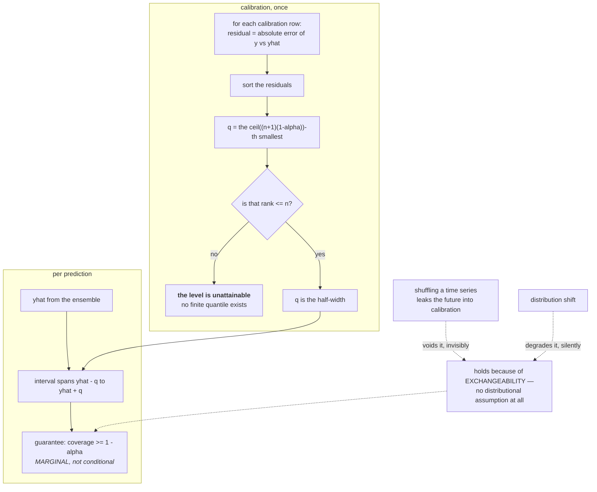
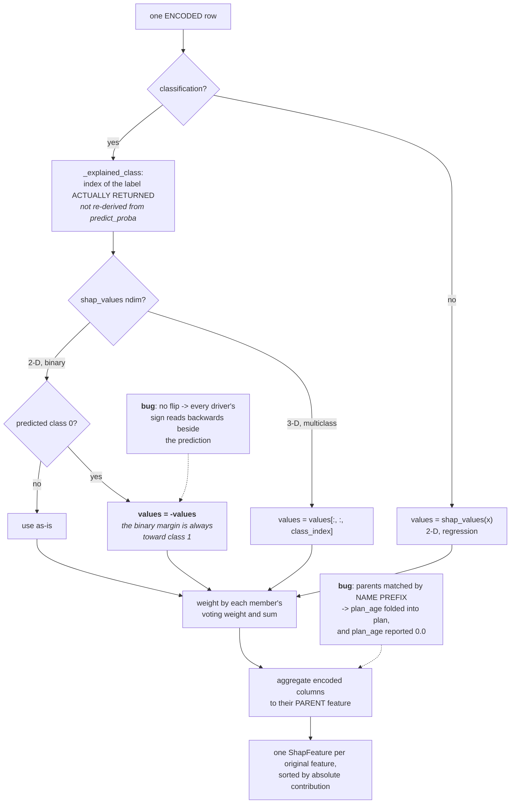
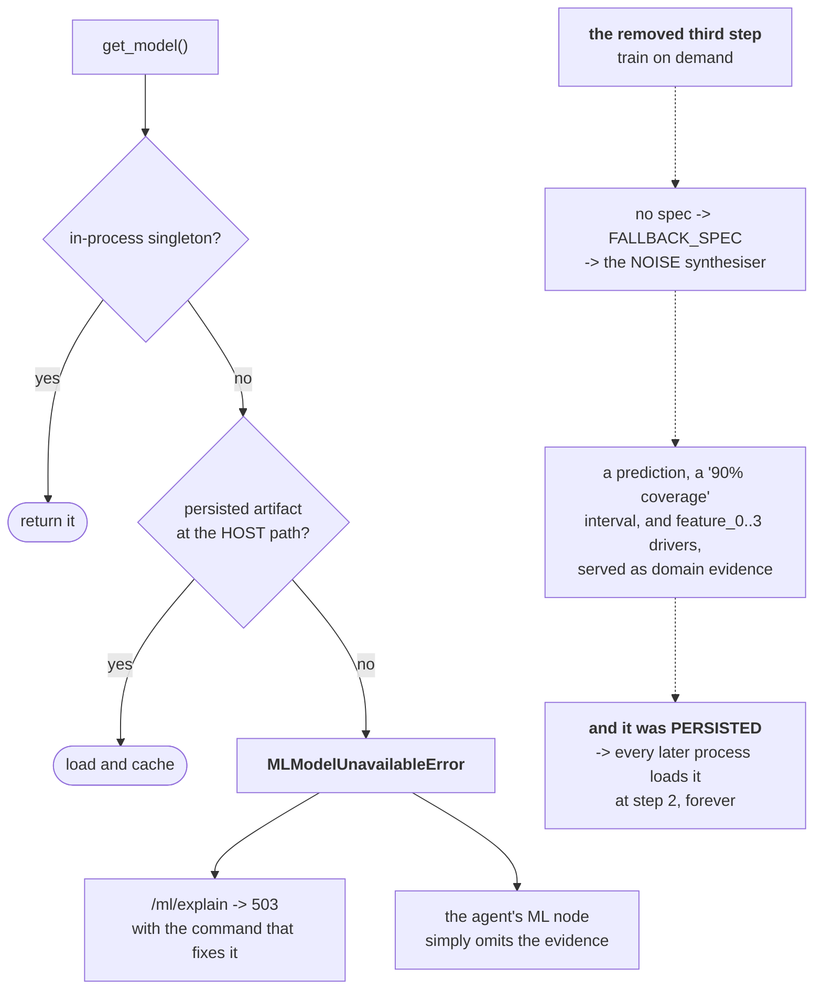
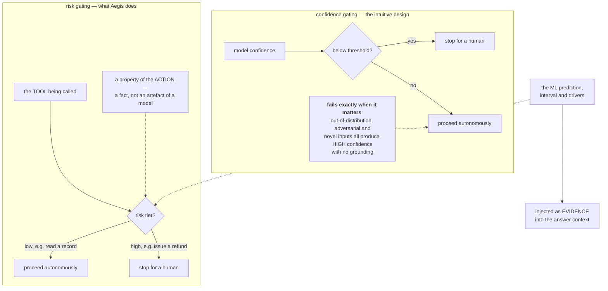
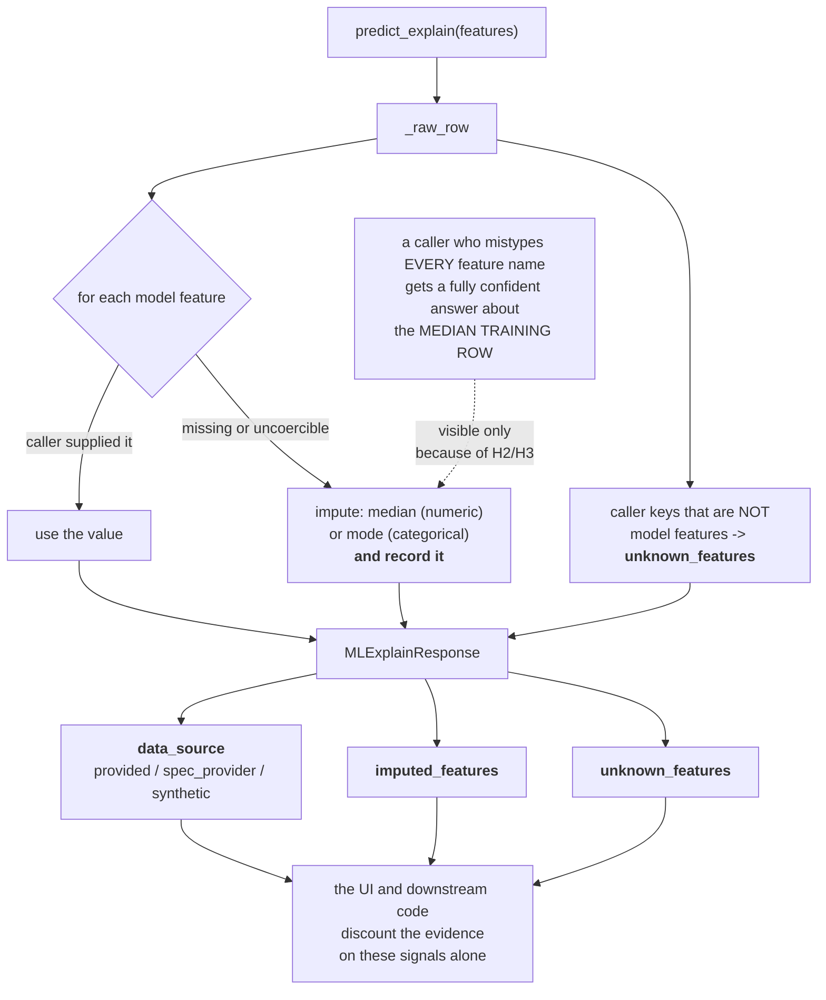
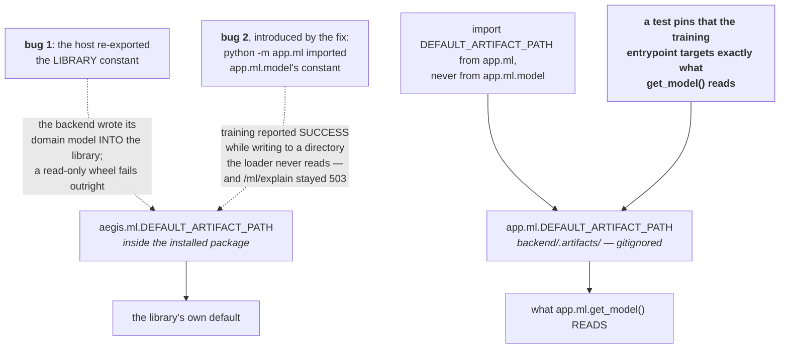

# ML — the diagrams

Diagram 3 (the three splits) and diagram 7 (ML informs, risk gates) are the two worth
being able to draw cold.

---

## 1. Where ML sits in a run

**The dotted non-edge is the design.** There is no path from the ML node to the gate. The
human stop is decided by the risk tier of the tool being called, never by how confident
the model felt.

Consequence: a failed or absent prediction is **not** a failure. The evidence is omitted
and the run continues.

---

## 2. Training

---

## 3. The three splits, and which number each one earns

---

## 4. Conformal prediction, mechanically

For classification the analogue is a **prediction set**: a singleton is a confident call,
a two-label set is genuine ambiguity, an empty set is degenerate.

---

## 5. SHAP attribution — and the two bugs on this path

`_encoded_parents` is derived structurally from the fitted preprocessor's layout and then
**asserted** against the emitted column names, so a shape change fails loudly instead of
silently mis-aggregating.

---

## 6. `get_model` — the deliberate absence of a third step

Safe to refuse **because** ML never gates. Omitting evidence degrades an answer; serving
fake evidence corrupts a decision.

---

## 7. Why the gate is on tool risk, not model confidence

The one-liner: *a model that is 99% confident about issuing a $4,200 refund still stops
for a human, because refunds are high-risk — not because the model was unsure.*

---

## 8. The honesty signals on a response

---

## 9. The artifact-path split

The test is the real fix. The path can drift again; the invariant cannot.

---

**Next:** [`50-interview.md`](50-interview.md).
