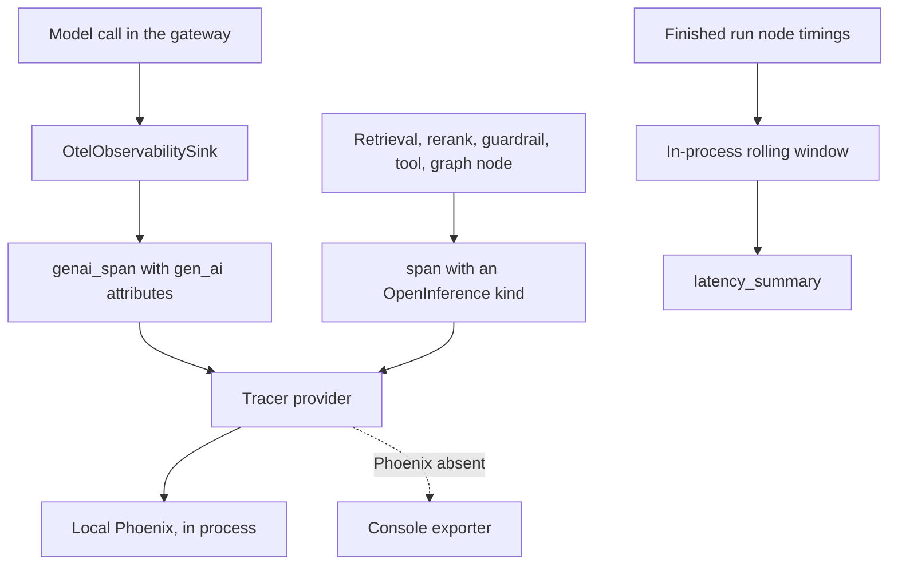

# Observability

## What it is

Observability is how an Aegis run explains itself after the fact. Every model
call, retrieval, rerank, guardrail check, tool call and graph node opens an
**OpenTelemetry span** — a timed, labelled record of one unit of work — and those
spans are exported to a local Arize Phoenix instance where the whole run renders
as a nested tree. The module also keeps a small rolling window of real per-node
timings so a latency dashboard has honest percentiles to show.

## Why it exists

When an agent answers slowly, expensively or wrongly, the question is always
*which step*. A single log line cannot answer it. Spans can: they nest, they
carry the model, the token counts and the cost, and they survive the request they
describe.

## Diagram



## How it works

**1. One tracer provider, set up once.** `init_observability()` registers an
OpenTelemetry tracer provider. When Phoenix is enabled and installed, spans go to
a **local, in-process** Phoenix instance — no Docker, no external collector. If
Phoenix or its OTel bridge is missing, a plain SDK provider with a console
exporter is installed instead, so the host still runs and spans are still
produced. Configuration is injected as call arguments (`phoenix_enabled`,
`service_name`, `project_name`), not read from a settings singleton.

**2. Model calls get `gen_ai.*` spans.** `genai_span()` is an async context
manager that opens a span named `"{operation} {model}"`, stamps the standard
request attributes and records errors. `set_usage()` attaches token counts and
cost when the call returns. The attribute keys live in one place, `semconv.py`:

| Key | Carries |
|---|---|
| `gen_ai.operation.name` | chat, text_completion, embeddings, transcription |
| `gen_ai.provider.name` | The provider, default `tcs.genailab` |
| `gen_ai.system` | Deprecated alias of provider name, still emitted for older tooling |
| `gen_ai.request.model` / `gen_ai.response.model` | Requested and answering deployment |
| `gen_ai.request.temperature` / `gen_ai.request.max_tokens` | Request parameters |
| `gen_ai.usage.input_tokens` / `gen_ai.usage.output_tokens` | Token counts |
| `gen_ai.usage.cost` | USD cost — a non-standard Aegis extension |

**3. Everything else gets an OpenInference span.** `span()` is a dependency-free
helper for the non-model units of a run. It stamps
`openinference.span.kind`, which is what makes Phoenix render the run as a tree
rather than a flat list. The kinds come from `aegis.core.events.SpanKind`, reused
rather than redefined so the same enum drives both the live event stream and the
exported spans: `LLM`, `EMBEDDING`, `RETRIEVER`, `RERANKER`, `TOOL`, `GUARDRAIL`,
`AGENT`, `CHAIN`, `EVALUATOR`.

Aegis-specific attributes ride alongside — `app.graph.node`,
`app.retrieval.result_count`, `app.retrieval.cache_hit`, `app.rerank.input_count`,
`app.router.role`, `app.guardrail.verdict`, `app.guardrail.layer`, `tool.name`,
`app.tool.risk` and others.

**4. The gateway stays free of OpenTelemetry.** `aegis.gateway` defines an
`ObservabilitySink` protocol with three methods — `span`, `set_usage`,
`trace_id`. `OtelObservabilitySink` is the concrete implementation, so a host
wires tracing with one line:

```python
from aegis.gateway import configure
from aegis.observability import OtelObservabilitySink

configure(observability=OtelObservabilitySink())
```

**5. Everything degrades to a no-op.** Before `init_observability()` runs, and in
tests, `get_tracer()` resolves against OpenTelemetry's global no-op provider.
`span()` then returns a non-recording span, and setting attributes on it is a
safe no-op. Nothing touches the network.

**6. Latency is aggregated separately, from real samples.** Each graph node is
timed with a wall-clock delta and reports a `duration_ms`.
`record_run_latency()` folds one finished run's node timings into a bounded
in-process `deque` (default capacity 512 runs). `latency_summary()` computes
percentiles from that window. Nothing is fabricated: with no runs recorded the
summary is an honest empty state (`empty=True`, `None` percentiles), never zeros
posing as measurements. `latency.py` is pure standard library — no OpenTelemetry
import — so it stays cheap to import.

`LatencySummary` carries `run_count`, `per_node`, `run_p50_ms`, `run_p95_ms`,
`run_max_ms`, `slowest_node`, `source`, `window_capacity` and `empty`.

## What it stores

This module stores nothing in the database. Spans are exported to Phoenix, which
keeps its own store outside Aegis. The latency window is an in-process buffer: it
is per-process, capped, and resets on restart. `source` and `window_capacity` on
every summary say so, so a reader never mistakes it for a durable metrics store.

## Security and tenant isolation

No tenant-scoped data. Spans describe the shape and cost of work, and the module
writes no rows anyone could read across a tenant boundary.

Two rules govern what goes into a span. Attribute values are identifiers,
counts, verdicts and durations — the operational facts — rather than user
content. And a non-recording span silently discards everything set on it, so a
deployment with tracing off cannot accumulate anything at all.

The one HTTP surface, `GET /v1/latency`, is guarded to the admin and devops
roles, because per-node timings describe the platform's internals.

## API surface

| Method | Path | Who may call it | Returns |
|---|---|---|---|
| GET | `/v1/latency` | admin or devops role | The per-node and per-run latency summary: run count, per-node p50/p95/max/count, run percentiles, the slowest node, and the `source`/`window_capacity`/`empty` honesty fields |

Spans themselves are not served over the Aegis API. They are read in the Phoenix
UI, which runs alongside the backend.

## Configuration

| Variable | Default | Effect |
|---|---|---|
| `PHOENIX_ENABLED` | `true` | When true the backend launches and wires local Phoenix. When false, or when Phoenix is not installed, a console span exporter is used instead and tracing still works. |

The standalone package takes its settings as arguments rather than environment
variables: `init_observability(phoenix_enabled=..., service_name=...,
project_name=...)`. The backend passes `service_name="taif-backend"` and
`project_name="taif"`.

Phoenix itself is an optional install (`aegis[phoenix]`); the OpenTelemetry API
and SDK are required (`aegis[observability]`).

## Where it lives

| Path | What it does |
|---|---|
| `aegis/src/aegis/observability/otel.py` | Tracer-provider setup, Phoenix export, the console fallback, `get_tracer`, `current_trace_id` |
| `aegis/src/aegis/observability/genai.py` | `genai_span`, `genai_span_sync`, `set_usage` — the model-call spans |
| `aegis/src/aegis/observability/spans.py` | `span`, `set_span_attribute(s)` — the non-model spans |
| `aegis/src/aegis/observability/semconv.py` | Every attribute-key constant, and the operation names |
| `aegis/src/aegis/observability/sink.py` | `OtelObservabilitySink`, the gateway's observability seam |
| `aegis/src/aegis/observability/latency.py` | The rolling window, `record_run_latency`, `latency_summary` |
| `backend/src/app/observability/` | The host shim: delegates to the package and injects `phoenix_enabled` from app settings |
| `backend/src/app/main.py` | Calls `init_observability(app)` on the application lifespan |
| `backend/src/app/api/routes.py` | Serves `GET /v1/latency` |

## What it does not do

- **It does not store spans itself.** Phoenix owns the trace store; this module
  produces and exports.
- **It does not provide durable metrics.** The latency window is per-process and
  resets on restart. There is no cross-process p95.
- **It does not sample or rate-limit.** Every instrumented unit of work opens a
  span when a recording provider is installed.
- **It does not alert.** It produces the record; deciding that a number is bad
  and telling someone is not here.
- **It does not import the gateway.** The dependency runs the other way: the
  gateway defines a protocol and a host injects this implementation.
