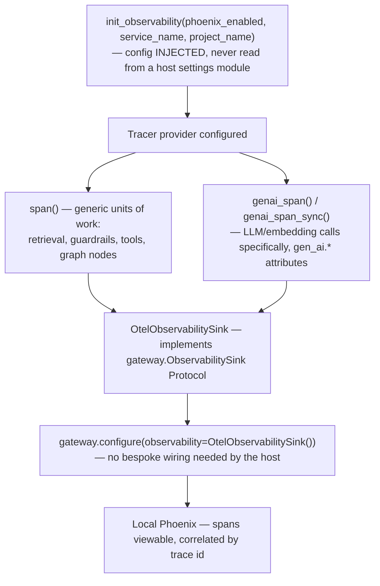

# Observability

## What it is

OpenTelemetry `gen_ai.*` spans plus OpenInference semantic conventions,
exported to a local Arize Phoenix instance. If you have never used
OpenTelemetry before: it is the industry-standard way to emit structured
"this operation happened, it took this long, here is what it touched"
traces, in a vendor-neutral format many tools can read. OpenInference is a
newer, LLM-specific extension of that same convention — the extra fields
that make sense for a model call specifically (prompt tokens, completion
tokens, which model, which role) that generic OTel does not define on its
own.

## Why it exists here

Understanding why a run was slow, expensive, or wrong needs more than logs
— it needs a structured trace showing exactly which step took how long and
what it called. This module gives every meaningful unit of work (a
retrieval, a guardrail check, a tool call, a graph node, a model call) its
own span, all correlated under one trace id, viewable in Phoenix.

## Diagram



## The architecture

```
aegis/src/aegis/observability/
  __init__.py   init_observability(), span(), genai_span(), OtelObservabilitySink
  semconv.py    the gen_ai.* attribute-key constants
  latency.py    the in-process rolling p95 latency summary (see routes_health.py consumer)
```

## What is actually in Aegis

### Configuration is injected, never read from host settings directly

`init_observability` takes `phoenix_enabled`/`service_name`/`project_name`
as explicit parameters — this module does not reach into a host
application's settings object itself. This keeps it genuinely standalone
and host-agnostic: it can be dropped into any application, not just this
one, with the same three values supplied however that host chooses to
store them.

### One shared `SpanKind` enum drives both the live stream and the exported spans

`span()` stamps the OpenInference `openinference.span.kind` attribute
directly from `aegis.core.events.SpanKind` — the **same enum** the live
AG-UI streaming event system uses (see `agent.md`'s node events). This is
a deliberate reuse, not a coincidence: it means the kind of work a span
represents in an exported Phoenix trace is guaranteed to agree with the
kind of work the same event represented in the live console stream,
because both read from one enum rather than two independently-maintained
copies that could drift.

### `OtelObservabilitySink` — implements the gateway's own Protocol

This class is the concrete implementation of `aegis.gateway`'s
`ObservabilitySink` Protocol (see `gateway.md`). Wiring it is one line at
host startup — `gateway.configure(observability=OtelObservabilitySink())`
— with no bespoke glue code needed, because the gateway module already
defines the exact interface this class fulfils.

### `gen_ai.*` spans specifically for model calls

`genai_span()` / `genai_span_sync()` / `set_usage()` are the specialised
helpers for LLM and embedding calls — carrying token counts, model
identity, and role — separate from the generic `span()` used for
non-model work like a retrieval step or a tool call. The attribute-key
constants live in `semconv.py`, so a span reader downstream can rely on a
fixed vocabulary rather than ad-hoc field names.

## How it runs

1. At host startup, `init_observability` configures the tracer provider
   with explicit, injected settings.
2. As a request executes, each meaningful unit of work opens a `span()`
   (or `genai_span()` for a model call specifically), stamped with the
   shared `SpanKind`.
3. `OtelObservabilitySink`, wired into the gateway at configuration time,
   automatically emits a `gen_ai.*` span for every model call the gateway
   makes.
4. Spans export to a local Phoenix instance, correlated by trace id —
   viewable as a full trace of one request's actual execution.

## What is not here

- **No remote/cloud export configured by default** — this is wired to a
  **local** Phoenix instance; sending spans to a hosted observability
  platform would need additional configuration this module does not itself
  provide.
- **Disabling `phoenix_enabled` is a real off switch**, not a no-op flag —
  a deployment that does not want tracing overhead can turn it off
  entirely at the injected config level.
