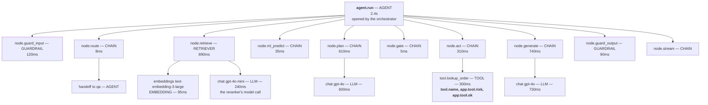
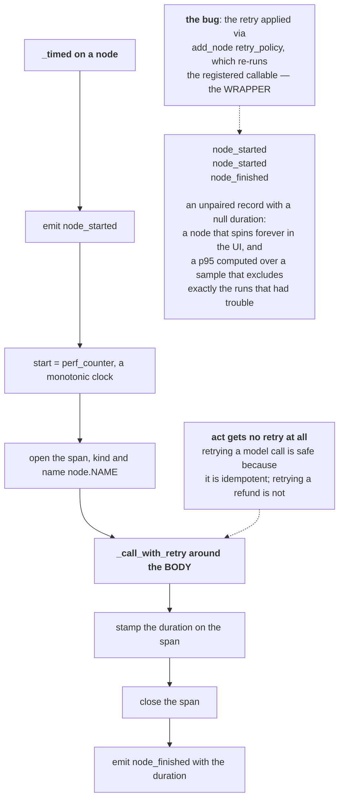
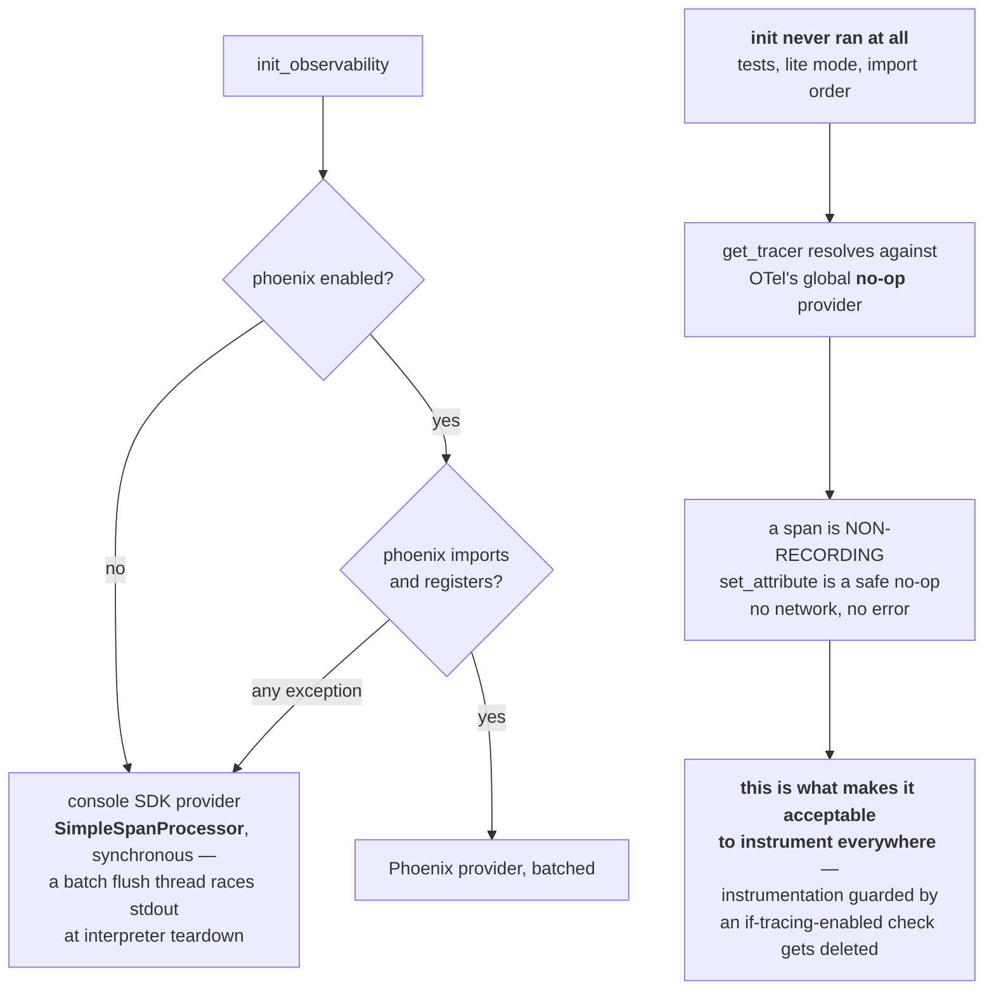
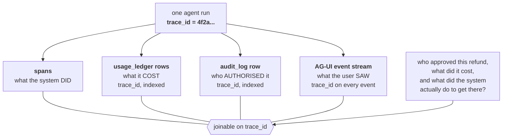

# Observability — the diagrams

Five diagrams. The one to be able to draw on a whiteboard is **the trace tree of one run**;
the one that impresses is **the three joins on one trace id**.

Everything else is explained in [`10-guide.md`](10-guide.md); a picture is only here when
it shows something prose cannot.

---

## 1. One agent run, as a trace tree

*Look at what is nested under what. Nothing here was handed a parent.*

Durations are illustrative; the structure is not.

**Every node span is opened by `_timed`**, and it is the *current* span while the body
runs — which is why the model, tool and handoff spans nest beneath it with no plumbing.

Node kinds are fixed at wiring time: the two guardrail nodes are `GUARDRAIL`, `retrieve` is
`RETRIEVER`, and **every other node defaults to `CHAIN`**. `TOOL` is not a node kind —
`act` opens one `TOOL` span per call inside its body, and **that child span is the only
place the risk tier appears**. `node.gate` carries the graph-node attributes every node
carries and nothing about risk.

Three nodes appear in no tree at all: `recall_memory`, `persist_memory` and `approval` are
wired plain, without `_timed`, so they emit neither node events nor a span.

---

## 2. `_timed` — one node, one pair, one span

*Look at where the retry sits. That position is the whole diagram.*

Composition order is a correctness property for telemetry, not a style choice. Wrap
instrumentation in a retry and you instrument the retries.

One node execution is now exactly one `node_started` / `node_finished` pair, and the
measured duration spans every attempt — the honest wall clock the user waited through.

---

## 3. What happens when there is no tracer

*Look at the bottom path: it is the one that has to be a no-op rather than an error.*

Batching is right in production and wrong for a dev exporter, and saying which one you are
configuring is most of the answer.

The fallback catches everything — a missing package, a port conflict, a version mismatch.
You lose the UI, not the spans.

---

## 4. Three orderings a trace can prove structurally

*Look at each chain as an ordering, not a pipeline. The order is the claim.*

```mermaid
flowchart TB
    subgraph P1["the image was screened BEFORE the model saw it"]
        A1["hygiene<br/>pipeline stage, no span"] --> A2["injection screen<br/><b>chat span</b>"]
        A2 --> A3["image PII<br/>pipeline stage, no span"]
        A3 --> A4["vision analyst<br/><b>chat span</b>"]
    end

    subgraph P2["no model output reached the user unguarded"]
        B1["node.generate<br/>non-streaming ON PURPOSE"] --> B2["node.guard_output"]
        B2 --> B3["node.stream<br/>paces an already-guarded string"]
    end

    subgraph P3["the gate fired on TOOL RISK, not confidence"]
        C1["node.ml_predict<br/>evidence only"] -.->|"<b>no edge</b>"| C2["node.gate<br/>carries the graph-node attributes<br/>and nothing about risk"]
        C2 --> C5["node.act<br/>approval pauses in between and<br/>emits no span of its own"]
        C5 --> C4["tool.NAME — TOOL span<br/><b>app.tool.risk = high</b><br/>the only place the tier appears"]
    end
```

In the first panel the screen and the analysis are both model calls, so both surface as
`chat {model}` spans and their order is visible. The load-bearing proof is still a test —
`analyst.calls == []` — with the trace as corroboration.

The third claim was once contradicted by the product. The console **hardcoded** a 9-node
DAG that drew the human gate branching off ML, and could not light 7 of the real nodes. The
topology is now served from the real compiled graph, with a test that fails if the offline
snapshot drifts.

> A diagram that disagrees with the system is worse than no diagram, because people
> believe it.

---

## 5. The three joins on one trace id

*Look at the key, not the boxes. One id is what turns four accounts into one story.*

Without a shared id these are four accounts of the same event that can never be reconciled
— which, in an incident, is very close to having none of them.

**Next:** [`50-interview.md`](50-interview.md).
