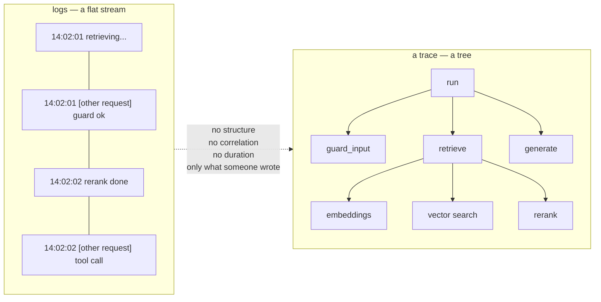
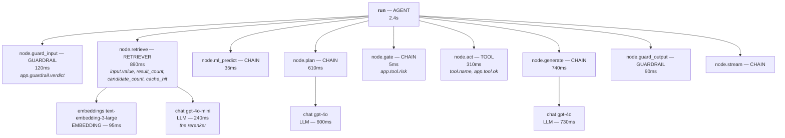
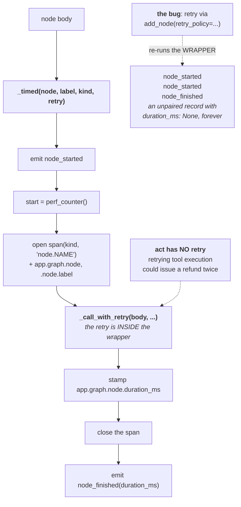
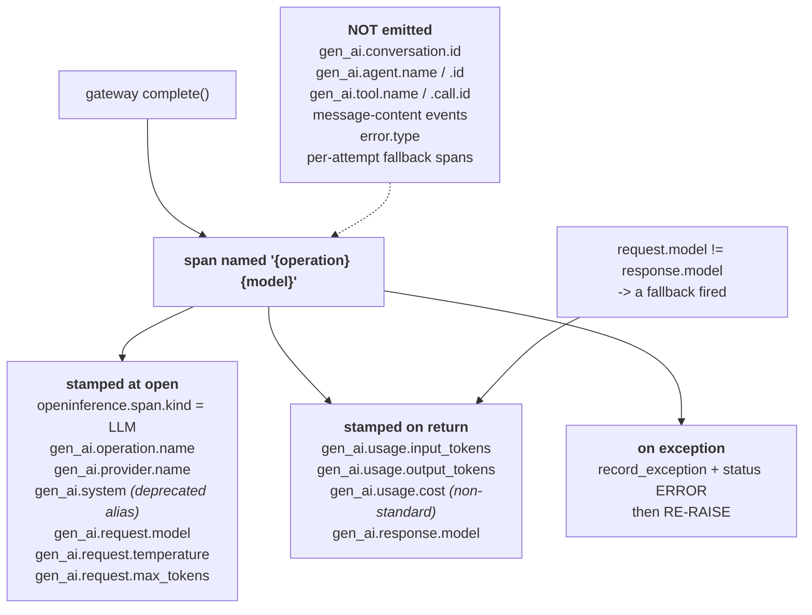
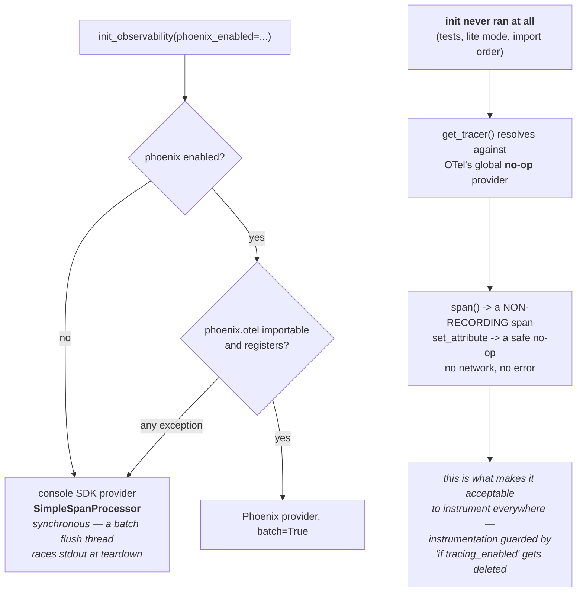
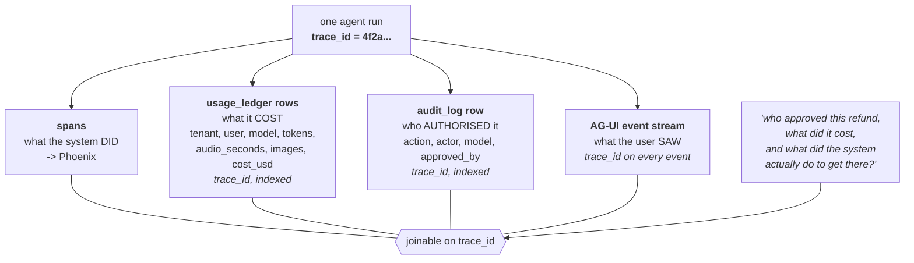
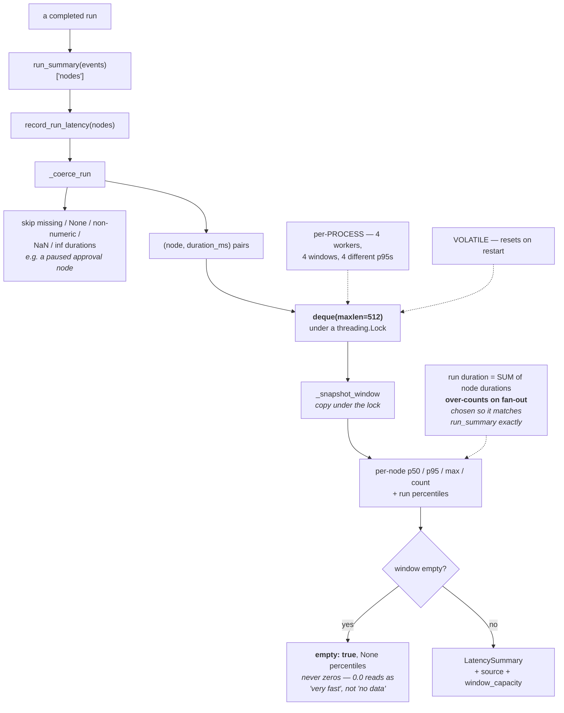
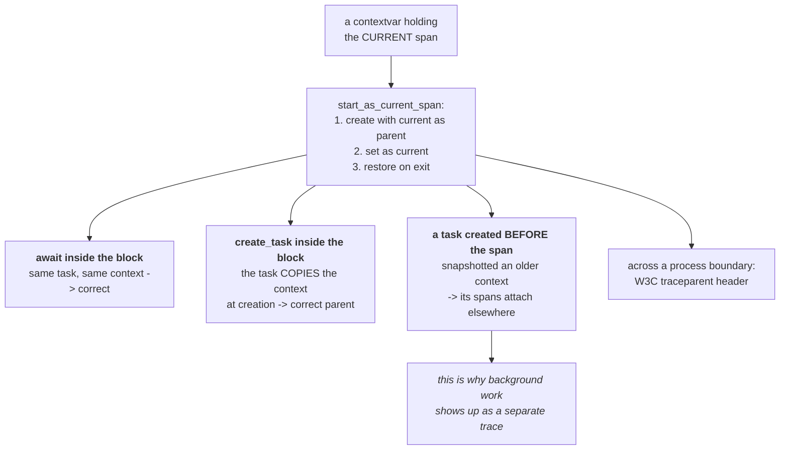
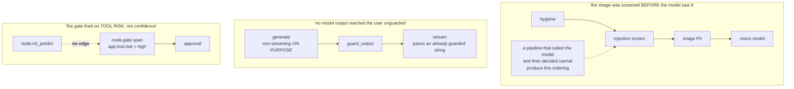

# Observability — the diagrams

Diagram 2 (the trace tree of one run) is the one to be able to draw on a whiteboard.
Diagram 6 (the three joins) is the one that impresses.

---

## 1. Why a tree, not a stream

---

## 2. One agent run, as a trace tree

**Every node span is opened by `_timed`**, and it is the *current* span while the body
runs — which is why the model and retrieval spans nest beneath it with no plumbing.

Node kinds are assigned at wiring time: guardrail nodes are `GUARDRAIL`, `retrieve` is
`RETRIEVER`, tool execution is `TOOL`, the run root is `AGENT`, everything else `CHAIN`.

---

## 3. `_timed` — one node, one pair, one span

---

## 4. What a model-call span carries

The gaps are worth memorising: the request/response/usage core is there; conversation and
agent identity exist only as `app.*` attributes.

---

## 5. Degradation — why instrumenting aggressively is safe

---

## 6. The three joins on one trace id

Without a shared id these are four accounts of the same event that can never be
reconciled.

---

## 7. The latency window — and exactly what it is not

---

## 8. Where the tree comes from — context propagation

---

## 9. The claims a trace can actually prove

The third one was a live defect in the **console**, not the code: it hardcoded a 9-node DAG
drawing the human gate branching off ML, and could not light 7 of the real nodes. The
topology is now served from the real compiled graph, with a test that fails if the offline
snapshot drifts.

**A diagram that disagrees with the system is worse than no diagram, because people
believe it.**

---

**Next:** [`50-interview.md`](50-interview.md).
