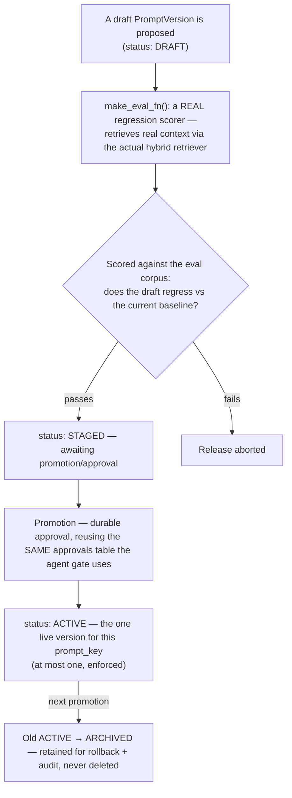

# Ops

## What it is

The LLM-Ops loop: a versioned registry for system prompts, an eval-gated
release process, and diagnosis/promotion tooling — the machinery this
project used live to fix the platform's own persona prompt (see
`settings.md`). If you have never seen a system-prompt release process
before: the point is that changing what an agent's system prompt says
should go through the same discipline as shipping code — a draft, an
automated regression check, and a reversible promotion — rather than
editing a string in place with no history and no gate.

## Why it exists here

Prompts are load-bearing: this project's own persona prompt originally
instructed the model to "be concise and decisive," which was silently
clipping every answer regardless of the question's real complexity — a real
regression that a proper release process with a diff and a rollback path
would have made easy to catch and easy to undo, which is exactly the
mechanism `ops` provides.

## Diagram



## The architecture

```
aegis/src/aegis/ops/
  models.py      PromptVersion, PromptStatus (DRAFT/STAGED/ACTIVE/ARCHIVED), EvalResult
  gate.py        make_eval_fn() — the real regression scorer; approval_enqueue seam
  registry.py    the CRUD + lifecycle transitions over PromptVersion
  release.py     the promotion/rollback flow
  diagnose.py    diagnose() — health/regression diagnosis tooling
```

## What is actually in Aegis

### Four real lifecycle states, one ACTIVE at a time

```python
class PromptStatus(StrEnum):
    DRAFT = "draft"        # proposed; not live
    STAGED = "staged"      # passed the eval gate; awaiting promotion
    ACTIVE = "active"      # the one live version — at most one per prompt_key
    ARCHIVED = "archived"  # a former active version, retained for rollback + audit
```

This is not a soft convention — "at most one ACTIVE version per
`prompt_key`" is an enforced invariant. Promoting a new version to ACTIVE
demotes the previous one to ARCHIVED in the same operation, never leaving
two versions simultaneously live. Nothing is ever deleted; an ARCHIVED
version remains queryable for audit and is one promotion call away from
being restored.

### `make_eval_fn` — a genuine scorer, not a stub

Quoted directly: it *"returns a genuine regression scorer... retrieves real
context [via] the same hybrid retriever the CI gate needs to compare a
draft against its baseline."* This is not a placeholder check — a
candidate prompt is actually scored against a bounded slice of the offline
eval corpus, using the real production retrieval path, before it can be
staged for promotion.

### Promotion reuses the agent's own approval mechanism

Verbatim: the release gate's durable approval *"reus[es] the same
approvals table the agent gate uses"* (see `agent.md`'s human-approval
gate), tagged with a distinct action (`prompt_release`) so a prompt
promotion and an agent's risky tool-call approval are distinguishable in
the same audit trail, without needing two separate approval systems.

### Verified live in this project

This exact machinery was used to fix the "be concise and decisive"
regression: a new draft version was written, scored, staged, and promoted
to ACTIVE through `POST /v1/llmops/prompts/versions` and
`.../{id}/activate`, with the old version automatically archived — real
rollback was one more `activate` call away, never a manual re-paste of the
old text.

### Two read routes, and the reason one of them returned `[]` for everyone

`GET /v1/ops/prompts` and `/v1/ops/prompts/active` are the read surface;
`/v1/llmops/prompts*` is the write surface. Until 2026-08-23 the first returned
an empty list **for every role** — not a permission error, an empty list, which
reads as "there are no prompt versions" rather than "you were not allowed to
see them". The cause was that the governance context is not bound on a `GET`, so
the scoped query found nothing. The same route also **silently substituted** a
cross-tenant `tenant_id` rather than refusing it; that is now a `403`.

The general shape is worth remembering, because it recurs: a scoped read that
returns an empty collection when the scope failed to bind is indistinguishable
from a correct empty answer, and it is the failure mode this platform's whole
"stated absence" discipline exists to prevent.

## How it runs

1. A candidate prompt is written as a new `DRAFT` `PromptVersion`.
2. `make_eval_fn` scores it against the regression corpus using the real
   retrieval path; a failing score aborts the release.
3. A passing draft moves to `STAGED`.
4. Promotion is a durable approval (through the shared approvals
   mechanism), and on success the new version becomes `ACTIVE` while the
   previous `ACTIVE` version is demoted to `ARCHIVED`.
5. `diagnose()` provides ongoing health/regression tooling over the
   registry.

## What is not here

- **No automatic rollback on a post-promotion regression** — the eval gate
  runs before promotion; nothing here watches live production metrics after
  promotion and automatically reverts. A human deciding to roll back still
  issues an explicit `activate` call against the archived version.
- **The eval corpus is a fixed, bounded slice**, not the full production
  traffic — `DEFAULT_EVAL_SUBSET` bounds how much of the regression corpus
  a release-gate check actually scores against, for cost and speed reasons.
