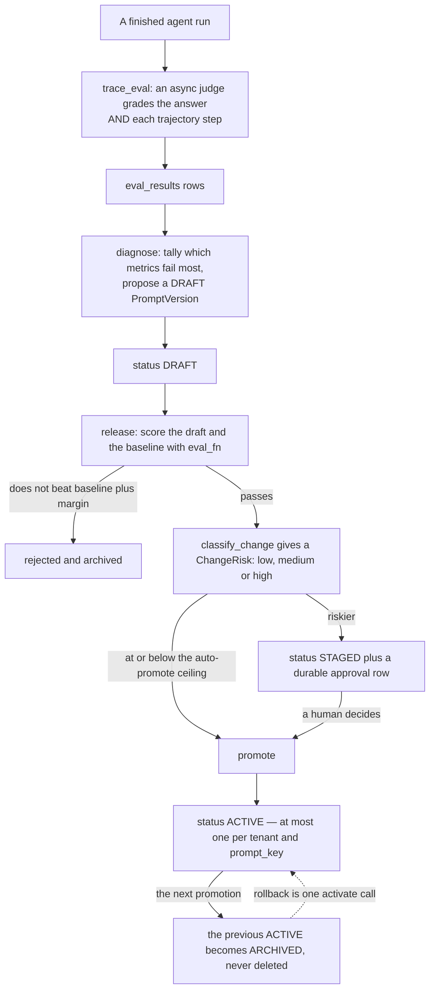

# Ops

## What it is

`aegis.ops` is the LLM-Ops closed loop: **Trace → Eval → Observe → Diagnose → Gate
→ Release**. It grades finished runs, clusters the failures, proposes a new system
prompt, scores it against the current one, and promotes it through a reversible,
audited release.

## Why it exists

A system prompt is code. It decides what the agent will and will not do, and
editing one in place leaves no history, no diff and no way back. This module puts
prompt changes through the same discipline as shipping software: a draft, an
automated regression check, a risk classification, an approval where the risk
warrants it, and a rollback that is one call rather than a re-paste of old text.

## Diagram



## How it works

### The lifecycle

```python
class PromptStatus(StrEnum):
    DRAFT = "draft"        # proposed; not live
    STAGED = "staged"      # passed the eval gate; awaiting promotion
    ACTIVE = "active"      # the one live version for its prompt_key
    ARCHIVED = "archived"  # a former active version, kept for rollback and audit
```

At most one `ACTIVE` version exists per `(tenant_id, prompt_key)`. Promoting a new
version archives the previous one in the same operation, so two are never
simultaneously live. Nothing is deleted, so rolling back is one more promotion
call against the archived version's id.

The harness reads the `ACTIVE` version through an in-process cache in
`registry.py`, and falls back to the injected **floor** renderer — the adapter's
own baseline prompt — when no version exists. A released prompt builds on the
floor and never goes below it.

### Grading a run

`trace_eval.py` runs after a run finishes. An async judge grades the **final
answer** and the individual **trajectory steps**, using the OpenInference span
kinds the graph already stamps (`step:retrieval`, `step:tool`, `step:guardrail`).
Each measurement is one `eval_results` row.

### Diagnosing

`diagnose.py` reads the recent *failing* `eval_results` rows, tallies which
metrics fail most — the answer facet against the per-step facets — and feeds that
into a proposed draft. It only ever proposes; it never promotes.

### The gate

`gate.py::make_eval_fn()` returns a genuine regression scorer. It retrieves real
context through the same hybrid retriever production uses, over a bounded slice of
the offline eval corpus (`DEFAULT_EVAL_SUBSET = 3`), so a candidate prompt is
scored against real behaviour rather than a stub.

`release.py::release()` scores the draft and the baseline (the active version, or
the floor if there is none). A draft that does not beat `baseline + margin` is
**rejected and archived**. A draft that passes is classified by
`classify_change()` into a `ChangeRisk` of `low`, `medium` or `high`, and then
`autonomy` decides:

| Autonomy | Behaviour |
|---|---|
| `tiered` (default) | Risk at or below `auto_promote_ceiling` promotes autonomously; anything riskier is staged for approval. |
| `auto` | Promote any eval-passing draft regardless of risk. |
| `manual` | Always enqueue for approval, whatever the risk. |

`LoopParams` holds the knobs. Two are blast-radius bands over the prompt diff
(`high_diff_fraction`, `low_diff_fraction`); `safety_terms` are words whose
occurrence count changing forces `high`, so guardrail, tool and approval wording
is never a low-risk edit; `critical_config_markers` make any change to a
model, tool or permission config key `high`.

### Approvals

A staged release writes a durable approval row into the **same approvals table the
agent's human gate uses**, tagged with the action `prompt_release`, so a prompt
promotion and a risky tool call are distinguishable in one audit trail without two
approval systems. `list_pending_releases()` and `decide_release()` are the inbox
read and decide helpers.

### Host injection

`aegis.ops` imports no application layer. `configure_ops()` injects, once at host
startup, the few things it cannot own: `render_floor_prompt`, `session_factory`,
`set_tenant_scope`, `enqueue_approval`, the host's `Approval` ORM class and status
enum, and `LoopParams`.

`stream.py` brackets each loop stage in a `STEP_STARTED` / `CUSTOM` /
`STEP_FINISHED` AG-UI event, so the LLM-Ops screen renders the loop as it runs
with the real numbers the stages produced.

## What it stores

Two tables on the shared `AegisBase` metadata.

**`eval_results`** — one offline-eval measurement.

| Column | Purpose |
|---|---|
| `id`, `ts` | Identity and time. |
| `run_id` | The graded run. |
| `prompt_key` | The persona the graded run used — the scoping key, so Diagnose clusters a prompt's own failures. |
| `tenant_id` | Plain indexed column; no cross-package foreign key. |
| `metric`, `score`, `passed` | The measurement. |
| `detail` | The `jsonb` body behind the score. |

**`prompt_versions`** — one versioned system prompt plus its config.

| Column | Purpose |
|---|---|
| `id`, `tenant_id`, `prompt_key`, `version` | Identity. |
| `system_prompt` | The prompt text. |
| `config` | The `jsonb` config shipped with it. |
| `status` | `draft` / `staged` / `active` / `archived`. |
| `parent_version` | What this version was derived from. |
| `created_by`, `notes`, `created_at`, `activated_at` | Provenance. |

Two indexes carry real meaning. `ux_prompt_version_tenant` is unique on
`(coalesce(tenant_id, 0), prompt_key, version)`: unique per **tenant**, because a
version number belongs to one tenant, and `coalesce(…, 0)` rather than the plain
column because PostgreSQL 14 treats NULLs as distinct in a unique index, which
would leave the platform rows with no uniqueness at all.
`ix_prompt_tenant_key_status` serves the "which version is active" lookup.

## Security and tenant isolation

- Both tables are registered in `_TENANT_SCOPED_TABLES`, so the `tenant_isolation`
  policy is installed at boot. `tenant_id` is a plain indexed column with no
  cross-package foreign key; isolation is the policy plus the app-level predicate.
- Because version numbers are unique per tenant, a tenant-scoped session
  allocating the next version cannot collide with an invisible row belonging to
  someone else.
- Reading the active system prompt is restricted: it is the instruction set behind
  every answer, so a client or a plain member is refused.
- A cross-tenant `tenant_id` on a read is a **403**, never a silent substitution.
- The `/v1/ops/*` surface admits an admin or the `ai_team` role; deciding a staged
  release additionally narrows to an admin.
- `/v1/llmops/*` admits a `tenant_admin`, a `platform_admin`, or `ai_team` —
  including an `ai_team` principal pinned inside a tenant, whose reads are then
  sealed to their own tenant.

## API surface

Reads live under `/v1/ops`; the write surface is `/v1/llmops`.

| Method | Path | Who may call it | Returns |
|---|---|---|---|
| GET | `/v1/ops/prompts` | admin or `ai_team` | Every prompt version in scope. |
| GET | `/v1/ops/prompts/active` | admin or `ai_team` | The active version per `prompt_key`. |
| GET | `/v1/ops/evals` | admin or `ai_team` | Eval results, filterable by `prompt_key`. |
| POST | `/v1/ops/diagnose` | admin or `ai_team` | The failure clustering and a proposed draft. |
| POST | `/v1/ops/release` | admin or `ai_team` | Runs the eval gate and the tiered decision on a draft. |
| POST | `/v1/ops/rollback` | admin or `ai_team` | Re-activates an earlier version. |
| GET | `/v1/ops/releases/pending` | admin or `ai_team` | The staged-release inbox. |
| POST | `/v1/ops/releases/{approval_id}/decide` | admin | Approve or reject one staged release. |
| GET | `/v1/ops/params` | admin or `ai_team` | The live `LoopParams`. |
| GET | `/v1/evals/report` | admin or `ai_team` | The offline eval report. |
| GET | `/v1/llmops/prompts` | `tenant_admin`, `platform_admin` or `ai_team` | The prompt screen. |
| POST | `/v1/llmops/prompts/versions` | same | Creates a new version. |
| POST | `/v1/llmops/prompts/versions/{version_id}/activate` | same | Makes that version live; archives the previous active one. |
| POST | `/v1/llmops/prompts/rollback` | same | Rolls back to an earlier version. |
| GET | `/v1/llmops/runs` | same | Prompt runs. |
| GET | `/v1/llmops/runs/{run_id}` | same | One prompt run in detail. |

## Configuration

`aegis.ops` reads no environment variables. Everything host-specific is injected
through `configure_ops()`, and the loop's behaviour is tuned by `LoopParams`
rather than by the environment, so an operator can read the live values at
`GET /v1/ops/params`.

| Knob | Default |
|---|---|
| `eval_margin` | `0.0` |
| `high_diff_fraction` | `0.40` |
| `low_diff_fraction` | `0.15` |
| `auto_promote_ceiling` | `low` |
| `DEFAULT_EVAL_SUBSET` | `3` |
| `RELEASE_ACTION` | `prompt_release` |

## Where it lives

| File | What it does |
|---|---|
| `aegis/src/aegis/ops/models.py` | `EvalResult`, `PromptVersion`, `PromptStatus` and their indexes. |
| `aegis/src/aegis/ops/trace_eval.py` | `evaluate_run` — grades the answer and each trajectory step. |
| `aegis/src/aegis/ops/diagnose.py` | `diagnose` — clusters failing evals and proposes a draft. |
| `aegis/src/aegis/ops/gate.py` | `make_eval_fn`, `enqueue_release_approval`, `list_pending_releases`, `decide_release`, `DEFAULT_EVAL_SUBSET`, `RELEASE_ACTION`. |
| `aegis/src/aegis/ops/release.py` | `release`, `classify_change`, `apply_release_decision`, `ChangeRisk`, `ReleaseResult`. |
| `aegis/src/aegis/ops/registry.py` | CRUD and lifecycle transitions over `PromptVersion`, plus the active-prompt cache. |
| `aegis/src/aegis/ops/config.py` | `configure_ops` and `LoopParams`. |
| `aegis/src/aegis/ops/stream.py` | One AG-UI event bracket per loop stage. |
| `backend/src/app/api/routes.py` | The `/v1/ops/*` and `/v1/evals/report` routes. |
| `backend/src/app/api/routes_llmops.py` | The `/v1/llmops/*` routes and `require_llmops_operator`. |

## What it does not do

- **No automatic rollback after promotion.** The eval gate runs before a promotion.
  Nothing here watches live metrics afterwards and reverts on its own; a human
  issues an explicit activate against the archived version.
- **The eval corpus is a bounded slice, not production traffic.**
  `DEFAULT_EVAL_SUBSET` caps what a release-gate check scores against, for cost and
  speed.
- **It does not define what "good" means.** That comes from the eval corpus in
  `aegis.evals` and the injected prompt floor.
- **It does not version tool definitions or graph topology** — only the system
  prompt and the config shipped alongside it.
