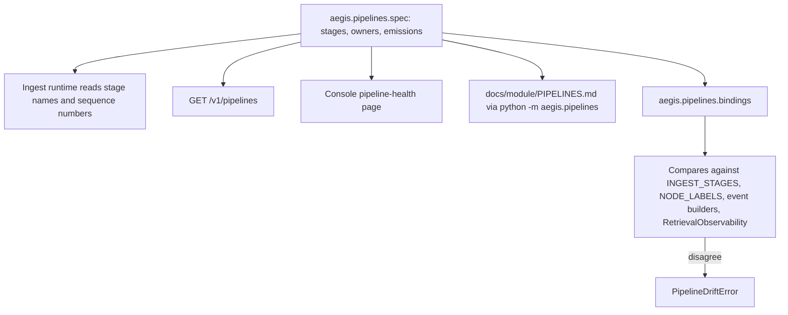

# Pipelines

## What it is

Pipelines is one declaration of the three end-to-end flows Aegis runs —
retrieval, agent and ingestion. It names each flow's stages, the module that owns
each stage, and what each stage puts on a wire or a row. Four consumers read that
one declaration, and a checker raises when the declaration and the running code
disagree.

## Why it exists

A hand-maintained architecture diagram drifts from the code the first time
someone adds a step and forgets the wiki. This module removes the second source
of truth: the shape of the platform is declared in Python, verified against the
runtime, and rendered wherever it is needed.

## Diagram

## How it works

**Three pipelines, not twenty-nine.** A module is not a pipeline. The
twenty-nine-module course in `docs/teaching/` explains the parts; this module
declares the flows those parts compose into.

| Pipeline | What it does | Entry point | Durable record |
|---|---|---|---|
| `retrieval` | A question becomes an answer context | `aegis.retrieval.pipeline.Retriever.retrieve` | none |
| `agent` | A turn becomes a streamed answer | `aegis.agent.orchestrator.run_agent` | none |
| `ingestion` | A file becomes a searchable, graph-linked corpus | `app.ingestion.upload.upload_document` | `run_events` |

**A stage declares where its output goes.** The `Channel` enum has three values,
and the distinction is the difference between a figure the platform can show you
an hour later and a figure that existed for one HTTP connection:

| Channel | Meaning |
|---|---|
| `run_event` | Committed to `run_events` in the transaction that did the work — replayable, readable an hour later |
| `stream` | An AG-UI frame on the SSE stream — it reaches the browser and is then gone |
| `result` | A field on the returned object — in-process, not persisted |

**The retrieval pipeline, eight stages.** `rewrite` (conditional), `cache`,
`recall`, `fuse`, `rerank`, `spotlight`, `assemble`, `agentic` (conditional).
Everything it produces is a `result` field.

**The agent pipeline, eighteen stages.** `guard_input`, `route`,
`answer_memory`, `recall_memory`, `plan_team` (conditional), `run_team`
(conditional), `synthesize` (conditional), `retrieve`, `plan`, `gate`, `approval`
(conditional), `act`, `verify`, `reflect`, `generate`, `guard_output`, `stream`,
`persist_memory`. `verify` sits between `act` and `reflect` and is what decides
the round against something outside the model. This is the graph's **node set**, not a path — one turn runs one
lane through it, and the edges that decide which lane are served from the
compiled graph by `GET /v1/agent/topology`.

**The ingestion pipeline, six stages**, each committing its own `run_events` row
inside the transaction that did the work, with a terminal `ingest_finished` event
closing the run out:

| # | Stage | Owner |
|---|---|---|
| 1 | `parse` | `aegis.ingestion.convert` |
| 2 | `chunk` | `aegis.retrieval.chunker` |
| 3 | `enrich` | `app.ingestion.stages` |
| 4 | `embed` | `app.ingestion.stages` |
| 5 | `index` | `aegis.retrieval.vector_store` |
| 6 | `graph` | `aegis.retrieval.graph_extract` |

**Four consumers read the one declaration.**

1. *The runtime.* `app.jobs.ingest_log` takes the `run_events` event type and the
   per-stage sequence numbers from `INGESTION_PIPELINE` rather than from string
   literals — so the vocabulary written to the durable row **is** the declared
   vocabulary, by construction.
2. *The API.* `GET /v1/pipelines`.
3. *The console.* The pipeline-health page lists every declared stage and marks
   the ones with no timing yet, instead of omitting a stage that has never run.
4. *The docs.* `docs/module/PIPELINES.md`, regenerated by
   `python -m aegis.pipelines`.

**A declaration that only restated string literals would buy nothing**, so
`bindings.py` binds it to the code:

- Ingestion stage names must equal `aegis.jobs.stages.INGEST_STAGES`.
- Agent stage names and labels must equal `aegis.agent.graph.NODE_LABELS`.
- Every streamed event name must be a real builder in `aegis.agent.events`.
- The retrieval stages must between them account for **every** field of
  `aegis.retrieval.models.RetrievalObservability` — no observability field may
  exist with nothing declaring where it came from.

A disagreement raises `PipelineDriftError` naming the difference.

**Each pipeline also declares its own limits**, so a consumer cannot promise
something the flow does not record. Retrieval records no per-stage timing and
writes nothing to `run_events`. The agent pipeline writes no rows either — node
timings reach the browser on the stream and are discarded when it closes, so
there is no p95 to aggregate later. Ingestion carries no retry count, because the
orchestrator retries an activity internally and the row holds only its latest
state.

**The declaration is standard-library only.** `spec.py` imports nothing but
`dataclasses` and `enum`, so it can be read from a documentation build, from
inside a workflow task, or from a process with no database, model client or graph
library installed. The verification that *does* need those imports lives next
door in `bindings.py` and imports them lazily.

**`docs/module/PIPELINES.md` is generated, not hand-written.** Editing it by hand
is overwritten by the next regeneration; the declaration in code is the only
place to change a pipeline's documented shape. `python -m aegis.pipelines`
verifies before it renders, so a document can never be generated from a spec the
runtime already contradicts. (This teaching page, by contrast, is hand-written.)

## What it stores

This module stores nothing. It is a declaration plus the checks that bind it to
the code.

It does *describe* one durable table it does not own: the ingestion pipeline's
`run_events`, written by the jobs module. `INGESTION_PIPELINE` supplies the event
type and the per-stage sequence numbers those rows carry.

## Security and tenant isolation

No tenant-scoped data. The declaration is the shape of the product, identical for
every caller and every tenant, so there is nothing here to scope.

`GET /v1/pipelines` is guarded by authentication and nothing narrower. It returns
the same bytes to every principal — the guard is there because the console is
behind authentication, and because an unauthenticated map of the platform's
internals is a reconnaissance gift for no gain. The route deliberately discards
the auth context after the guard runs.

A drift is **not** caught and turned into a friendly empty response: it raises,
and the 500 names the exact difference. A diagram that is quietly wrong is worse
than an error.

## API surface

| Method | Path | Who may call it | Returns |
|---|---|---|---|
| GET | `/v1/pipelines` | any authenticated principal | The three pipeline declarations — name, title, summary, entry point, durable record, every stage with its label, owner, summary, conditional flag and emissions — plus the channel legend |

The channel legend is served rather than hardcoded in the browser, for the same
reason everything else here is: a console that spelled out what `stream` means
would be a second copy of a sentence that lives in the declaration.

Command line: `python -m aegis.pipelines > docs/module/PIPELINES.md`.

## Configuration

No environment variables. The declaration is code, and it is the same in every
deployment.

## Where it lives

| Path | What it does |
|---|---|
| `aegis/src/aegis/pipelines/spec.py` | The declaration: `PipelineSpec`, `PipelineStage`, `Emission`, `Channel`, `CHANNEL_MEANING`, and the three pipelines |
| `aegis/src/aegis/pipelines/bindings.py` | `verify_pipelines` and the per-pipeline checks; raises `PipelineDriftError` |
| `aegis/src/aegis/pipelines/docs.py` | `render_markdown` — the deterministic Markdown rendering |
| `aegis/src/aegis/pipelines/__main__.py` | `python -m aegis.pipelines` — verify, then print |
| `backend/src/app/api/routes_pipelines.py` | Serves `GET /v1/pipelines`, verifying before it serves |
| `docs/module/PIPELINES.md` | The generated reference, pinned against the generator by a test |

## What it does not do

- **It does not execute anything.** Retrieval runs in `aegis.retrieval.pipeline`,
  the agent in `aegis.agent.graph`, ingestion in `aegis.jobs.stages`. This module
  declares their shape.
- **It does not describe a path through the agent graph.** The stage list is the
  node set; the edges come from `GET /v1/agent/topology`.
- **It does not record timings.** No stage here measures anything; each pipeline
  states in its own limits what it does not record.
- **It does not read the database.** The health page's timings come from
  `run_events`; the stage vocabulary comes from here.
- **It does not let a fourth pipeline appear quietly.** A new flow, or a new
  stage in an existing one, must be declared or the binding check raises.
