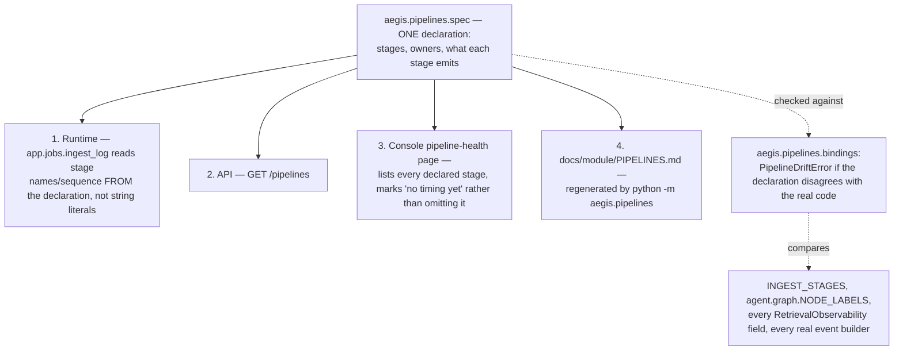

# Pipelines

## What it is

A single declaration of Aegis's three real end-to-end flows — retrieval,
agent, and ingestion — with **four separate consumers reading the same
declaration**, so a diagram, an API response, and the actual running code
cannot silently disagree with each other. If you have never seen
documentation drift from code before: the usual failure is a beautiful
architecture diagram in a wiki that describes a system from eight months
ago, because nobody remembered to update it when the code changed. This
module is built specifically to make that impossible.

## Why it exists here

The module's own docstring names the exact, real drift incidents that
motivated it: the console's orchestration map used to **hardcode its own
diagram** and drifted to nine nodes, with a human-approval gate hanging off
a step that no longer decided anything. Separately, a caching view carried
a hardcoded stage list that also drifted before it was deleted. And the
pipeline-health page used to derive its stage vocabulary from whatever rows
*happened* to land in the event log — meaning a stage that had simply never
run yet was invisible, not shown as idle.

## Diagram



## The architecture

```
aegis/src/aegis/pipelines/
  spec.py       the declaration itself — three pipelines, stdlib-only
  bindings.py   PipelineDriftError — asserts the declaration equals the real code
  __main__.py   python -m aegis.pipelines — regenerates docs/module/PIPELINES.md
```

## What is actually in Aegis

### Exactly three pipelines — not one per module

Stated directly, because it corrects an easy misreading: *"Three, not
sixteen: a module is not a pipeline, and the [module] course is the
explanation of the parts, not a description of the flows."* The three real
end-to-end flows:

- **`retrieval`** — a question becomes an answer context
  (`aegis.retrieval.pipeline`).
- **`agent`** — a turn becomes a streamed answer (`aegis.agent.graph`).
- **`ingestion`** — a file becomes a searchable, graph-linked corpus
  (`aegis.jobs.stages.INGEST_STAGES`).

Twenty-something modules compose into these three flows; the flows
themselves are the unit this module declares.

### `PipelineDriftError` — the declaration is checked against the real code, not merely hoped to match

`aegis.pipelines.bindings` actively compares the declaration to the actual
running artifacts and raises if they disagree:

- Ingestion stage names must equal `aegis.jobs.stages.INGEST_STAGES` —
  exactly the stage list `jobs.md` describes.
- Agent stage names and labels must equal `aegis.agent.graph.NODE_LABELS` —
  exactly the node table `agent.md` describes.
- Every streamed event name must correspond to a real builder in
  `aegis.agent.events`.
- The retrieval stages must between them account for **every field** of
  `RetrievalObservability` — no field can exist on the real retrieval
  result with nothing in the declaration describing where it came from.

This is a genuinely unusual amount of rigour for what could have been a
static YAML file: the declaration is stdlib-only Python specifically so it
can be imported and checked without pulling in any of the heavy
dependencies the modules it describes might need.

### `docs/module/PIPELINES.md` is generated, not hand-written

`python -m aegis.pipelines` regenerates that file directly from `spec.py`.
Editing `PIPELINES.md` by hand would be immediately overwritten by the next
regeneration — the declaration in code is the only place to change a
pipeline's documented shape.

## How it runs

This module does not itself execute at request time in the way an agent
turn does — it is the schema the other three pipelines are checked against.
`app.jobs.ingest_log` reads stage names and event sequence numbers from
`INGESTION_PIPELINE` rather than hardcoding string literals, so the
vocabulary written to the durable `run_events` log **is** the declared
vocabulary by construction, not by convention.

## What is not here

- **It is not itself an orchestration engine** — it declares the shape of
  the three flows; the actual execution lives in `aegis.retrieval.pipeline`,
  `aegis.agent.graph`, and `aegis.jobs.stages` respectively.
- **A fourth pipeline cannot be quietly added without updating this
  module** — and if a new stage is added to one of the three flows without
  updating the declaration, `PipelineDriftError` is designed to catch that
  at the binding check, not to silently let the two diverge.
