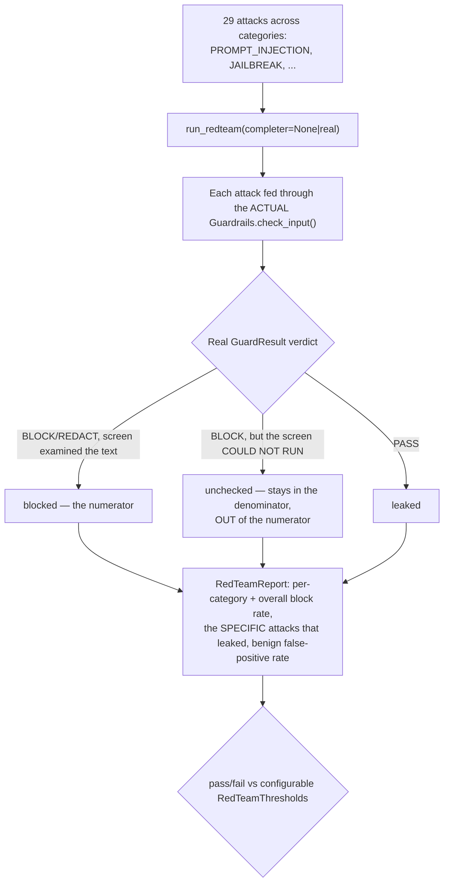

# Red team

## What it is

An importable harness that attacks Aegis's own guardrail rails with a real
battery of prompt-injection and jailbreak attempts, and reports the actual
`GuardResult` verdict for each — never a fabricated pass/fail. If you have
never built a red-team harness before: the point is not to demonstrate the
system is safe, it is to try to break it and honestly report what got
through. A harness that can be tricked into reporting a higher block rate
than what actually happened is worse than no harness at all.

## Why it exists here

Claiming guardrails work is cheap; measuring it against real attack text
is not. This module exists so "our block rate is X%" is a number computed
from actually running attacks through the actual rail code, not an
assertion. It runs **offline by default** — no API key, no model call
required — because the deterministic layers (signature matching, PII
regex/Presidio) catch the most egregious attacks with zero cost, and a
`ChatCompleter` can optionally be wired in to additionally exercise the
model-backed classifier layers.

## Diagram



## The architecture

```
aegis/src/aegis/redteam/
  battery.py   the 29 real Attack definitions, grouped by Category
  runner.py    run_redteam() — the actual execution + disposition mapping
  store.py     persisting RedTeamReport rows
  models.py    RedTeamReport, RedTeamThresholds, Category
```

## What is actually in Aegis

### Three dispositions, not two — and the third one is the honest part

Quoted directly, because it names a real incident that shaped the design:

> *"'unchecked' — the rail returned BLOCK because it **could not run**...
> The attack was stopped and nothing was learned. It stays in the
> denominator and out of the numerator, so a deployment whose model gateway
> is dead scores 0%, not 100%. This bucket exists because a live
> `owasp-full` run scored 28/28 with one of those 28 being a classifier
> timeout."*

Without this third bucket, a completely dead model gateway would fail
**closed** on every attack (correctly refusing everything, since an
unscreenable request is blocked) and the harness would report a perfect
100% block rate — which is true in the narrowest technical sense and
completely misleading about whether the guardrail system is actually
*working*. `unchecked` keeps that distinction visible: "stopped because it
could not be examined" is reported separately from "stopped because a real
screen looked at it and judged it an attack."

### Benign controls — a `REDACT` is not a false positive

The battery also includes benign prompts, to measure the false-positive
rate. A benign prompt that gets hard-`BLOCK`ed is a real false positive
(the rail wrongly refused a legitimate request). A benign prompt that gets
`REDACT`ed (PII was found and masked) is explicitly **not** counted as a
false positive — the stated reasoning is that redaction is "a privacy
action, not a denial of service." A prompt that happens to contain an email
address getting that email masked is the rail working correctly, not
failing.

### 29 real attacks, across real categories

The battery (`battery.py`) declares real `Attack` objects grouped by
`Category` — `PROMPT_INJECTION`, `JAILBREAK`, and further categories beyond
those. Each is real attack text, not a placeholder — the same kind of text
a real adversary would send, run through the same `check_input()` path a
real user's message goes through.

## How it runs

1. `run_redteam(completer=None)` (offline) or `run_redteam(completer=real)`
   (exercising the model-backed layers too) feeds every attack through the
   actual `Guardrails.check_input()`.
2. Each result is classified into exactly one of `blocked` / `unchecked` /
   `leaked`.
3. The report aggregates per-category and overall block rate, **names the
   specific attacks that leaked** (not just a count), and the benign
   false-positive rate.
4. The report is checked against a configurable `RedTeamThresholds` for an
   overall pass/fail verdict.

## What is not here

- **The offline run cannot exercise the model-backed classifier layers at
  all** — injection classification beyond the deterministic signatures,
  content safety, and topical screening all require a wired `ChatCompleter`
  to be meaningfully attacked; without one, those layers simply do not run
  and their attacks (if any target them specifically) fall into
  `unchecked`.
- **The battery is fixed at 29 attacks** — there is no fuzzing or automated
  attack-text generation; every attack is a hand-authored, specific prompt.
