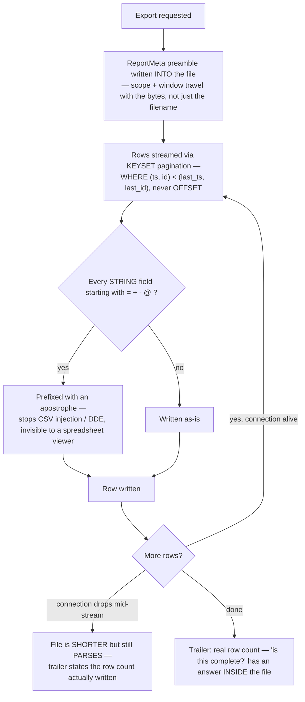

# Reports

## What it is

The export layer — turning the audit trail (and other durable records) into
a CSV file that survives leaving the browser: streamed rather than
materialised in memory, defended against spreadsheet formula injection, and
self-describing about its own scope and completeness. If you have never
thought about what happens to a file after it downloads: once a CSV leaves
the product, the product has no more control over it — it might be opened
in Excel a year later by someone with no context on what query produced it.
This module is built around that fact specifically.

## Why it exists here

An audit export is compliance evidence. Two failure modes this module
exists to prevent: a downloaded file that nobody can later prove the scope
of ("whose rows, what window, who took it"), and a downloaded file that is
silently incomplete because the connection dropped mid-export with no
signal that it was cut short.

## Diagram



## The architecture

```
aegis/src/aegis/reports/
  writer.py         CSV writing: ReportMeta preamble, the injection guard, the trailer
  audit_export.py   keyset-paginated streaming reader over the audit trail
```

## What is actually in Aegis

### The file states its own scope — because a filename is not evidence

Quoted directly: *"A CSV called `aegis-audit.csv` in a downloads folder is
evidence of nothing — nobody can tell whose rows it holds, over what
window, or who took it."* `ReportMeta` is written as a key/value preamble
**inside** the file, above the actual data table, so the scope and window
travel with the bytes themselves rather than living only in the filename or
in a UI that generated it and is no longer part of the picture once
downloaded.

### CSV injection defence — a real, named attack this module blocks

A spreadsheet application treats any cell beginning with `=`, `+`, `-`, or
`@` as a formula to evaluate. An audit trail is full of attacker-influenced
strings — an actor name, an action description — and exporting one of
those verbatim, if it happened to start with one of those characters, would
turn the compliance export itself into a delivery mechanism for a
malicious formula (this class of attack is known as CSV injection or DDE
attack). Every **string** field starting with one of those four characters
gets a leading apostrophe prefix — invisible on display in a spreadsheet,
and every CSV parser reads it as plain text. Numeric fields are left
untouched deliberately, because they are computed by this module, never
typed by an external caller — there is nothing to sanitise in a value the
system itself produced.

### Keyset pagination — not `OFFSET`, and the reason is concurrency, not speed

Quoted: *"Not `OFFSET`, which re-scans everything it skips and, worse,
silently drops or repeats rows when the trail is written to mid-export."*
An audit trail is actively being written to by the live system while an
export is running. `OFFSET`-based pagination is stateless about *position*
— it just skips a count — so if rows are inserted between two pages of an
`OFFSET` export, the page boundary shifts under it and rows can be silently
skipped or duplicated. The keyset cursor (`WHERE (ts, id) < (last_ts,
last_id)`) names an actual **position** in the ordering rather than a
count, so it is stable even while the underlying table keeps growing
during the export.

### The trailer — completeness has an answer inside the file

If a download is cut short (a dropped connection, a proxy timeout), the
file is genuinely shorter, but it still **parses** as valid CSV — and the
trailer states the actual row count written, so "is this the whole
export?" is answerable by reading the file itself, rather than requiring
the operator to have kept the original request's expected count visible
somewhere else.

## How it runs

1. An export request specifies its scope (tenant, time window).
2. The `ReportMeta` preamble is written first, describing that exact scope.
3. Rows stream out via keyset-paginated queries against the same table and
   ordering the live audit screen uses, so the export's contract matches
   what an operator would see on screen.
4. Every string value is checked for a formula-triggering leading
   character and defused if needed.
5. A trailer records the real number of rows actually written.

## What is not here

- **No resumable export.** A dropped connection produces a shorter, valid
  file with an honest trailer — but resuming from where it left off is not
  supported; a fresh export starts over.
- **The injection guard only prefixes an apostrophe** — it does not attempt
  to otherwise parse or validate the content of a string field, only to
  neutralise it as a spreadsheet formula trigger.
