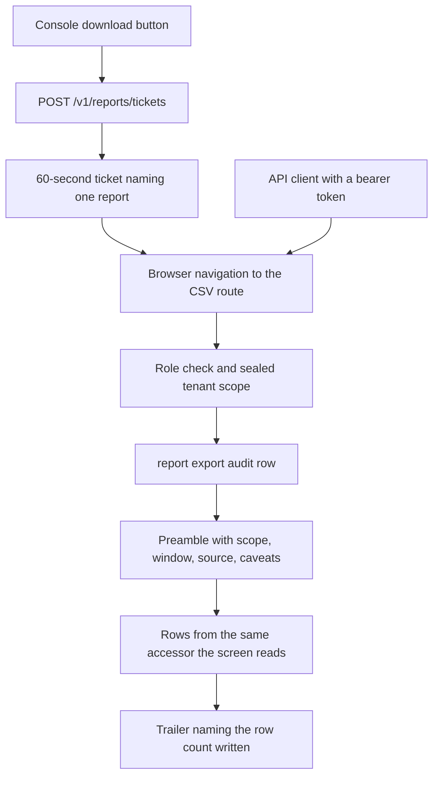

# Reports

## What it is

Reports is the take-away half of Aegis's governance surfaces. Four CSV exports —
the audit trail, the tenant roster, budget caps against consumption, and the
spend forecast — stream out of the platform as files an operator can hand to an
auditor, diff against last quarter, or keep after the demo machine is gone.

## Why it exists

An operator who can only *look* at the audit trail cannot evidence anything. The
platform spends its whole design budget producing a record; a record that stops
at the browser tab it was rendered in is not usable as evidence.

## Diagram

## How it works

**Every export is generated from the accessor the screen already reads.** The
budget report calls `aegis.governance.budget_status`, which is the same ledger
summation the gateway's spend enforcer runs — so the report and the cap that
blocks a call cannot disagree. The roster calls `list_users`, the same rows
`GET /v1/admin/users` returns. The forecast calls the forecast module. The audit
trail is the one exception in *how* it reads, not *what*.

**The audit trail streams through a keyset cursor.** The screen's accessor takes
a `limit` and materialises that many rows, which is right for a screen and wrong
for an export. `stream_audit_rows` keeps the same table, ordering (`ts`
descending, `id` descending as the tie-break) and tenant predicate, but fetches
rows in batches of 500 using `WHERE (ts, id) < (last_ts, last_id)`. A **keyset
cursor** names a position rather than a count, so it stays correct while the
trail is being written to during the export. `OFFSET` would re-scan what it skips
and can drop or repeat rows under concurrent inserts.

**Every file states its own scope.** `ReportMeta` is written into the CSV as a
key/value preamble above the table: the report id and title, when it was
generated in UTC, whose rows these are in words, the window covered, the table or
accessor they came from, who exported them and under which role, every filter
that narrowed the query, and the caveats a reader must have before quoting a
number. A filename is a convenience; the preamble is the record.

**Every file says when it ended.** The body streams, so a dropped connection
produces a shorter file that still parses. The trailer names the row count
actually written — `End of export,1284 data rows` — so "is this the whole
export?" has an answer inside the file.

**No field is executable.** A spreadsheet treats a cell beginning `=`, `+`, `-`
or `@` as a formula, and an audit trail is full of strings an attacker chose:
actor names, action names, tenant names. Every **string** field starting with one
of those characters is prefixed with an apostrophe, which spreadsheets strip on
display and every CSV parser reads as part of the text. Numbers are untouched,
because the platform produces them. This is the CSV-injection defence.

**Two encoding details serve Excel on Windows.** Rows end with `CRLF` per RFC
4180, and a UTF-8 byte-order mark opens the stream so Excel reads non-ASCII text
correctly.

**Caveats travel as data, not as a footnote.** The usage ledger records no
outcome for a call — a request refused before the gateway writes no row, and a
call that failed afterwards looks exactly like one that succeeded — so every
ledger-derived export carries a caveat saying no success or error rate can be
derived from it. The forecast export puts requested coverage beside *achieved*
coverage, the interval method, and `cumulative_bounds_are_calibrated` on every
row.

**A browser gets the file by navigation, not by a blob.** The routes send bytes
with `Content-Disposition: attachment`, and the browser writes them to disk as
they arrive. Because a navigation cannot carry an `Authorization` header, the
console first mints a **download ticket**.

## What it stores

This module stores nothing of its own. It reads existing tables — `audit_log`,
`users`, `budgets` and `usage_ledger` through their accessors — and writes one
row into `audit_log` per export, with the action `report.export`, carrying the
filters, the resolved scope and how the file was delivered.

The audit export's own columns are fixed:

| Column | What it is |
|---|---|
| `id` | The audit row id |
| `ts_utc` | Timestamp, always rendered with a UTC offset |
| `tenant_id` | The tenant the action belonged to |
| `action` | The recorded action name |
| `actor` | Who did it |
| `model` | The model involved, when there was one |
| `trace_id` | Correlates the row with its trace |
| `approved_by` | Who approved, for gated actions |

`payload` is deliberately absent — it is free-form JSON written by every call
site in the product, and it is the one column the screen never shows. The
preamble states the omission.

## Security and tenant isolation

**Scope comes from the sealed `AuthContext.tenant_scope()`, never from the URL.**
Every handler resolves its filter through `_scope_tenant`. A tenant admin asking
for another tenant's rows is refused with 403, and an omitted `tenant_id` means
*their own tenant*, never *all of them*.

**Role rules mirror the screen each report comes from**, so an export is never a
way around a screen's own access control:

| Report | Who may download it |
|---|---|
| `audit` | admin or devops |
| `tenant` | platform_admin or tenant_admin |
| `budget` | platform_admin or tenant_admin |
| `forecast` | platform_admin or tenant_admin |

**The download ticket.** `POST /v1/reports/tickets` mints a 60-second JWT naming
one report and one principal, with the purpose claim `aegis.report.download`. It
is deliberately **not** a bearer token: it carries no `role` claim, so the normal
access-token decoder refuses it and it authenticates nothing else in the product.
On redemption the scope is re-derived from the principal it names, so a stolen
ticket can export exactly what its owner could have exported anyway, for one
minute. A ticket minted for `budget` and presented on `/reports/audit.csv` is
rejected with 401. `curl` with a normal bearer works on the same routes.

**Every export is audited before a byte is streamed**, so a download the operator
cancels halfway is still on the record.

**The reports library itself holds no authorisation logic.** Every reader takes
the tenant filter as an argument it does not compute, and the HTTP layer binds
the row-security scope on the same connection the queries run on.

## API surface

| Method | Path | Who may call it | Returns |
|---|---|---|---|
| POST | `/v1/reports/tickets` | any authenticated principal whose role may read the named report | A 60-second ticket, the report id, and its expiry in seconds |
| GET | `/v1/reports/audit.csv` | admin or devops | The audit trail as CSV. Query: `since`, `until`, `actor`, `actionPrefix`, `ticket`. No `limit` — an export must not truncate. |
| GET | `/v1/reports/tenant.csv` | platform_admin or tenant_admin | The roster: users, roles and the last sign-in the trail can evidence. Query: `ticket`. |
| GET | `/v1/reports/budget.csv` | platform_admin or tenant_admin | Every governing cap beside the spend the enforcer measures against it. Query: `ticket`. |
| GET | `/v1/reports/forecast.csv` | platform_admin or tenant_admin | The projection with its caveats as columns. Query: `tenant_id`, `metric` (`spend` or `calls`), `horizon` (1–60, default 14), `window` (`day` or `month`), `ticket`. |

Downloads are named `aegis-<report>-<scope>-<timestampZ>.csv`, where scope is
`platform` or `tenant-<id>`.

When the forecast series is too short to project honestly, the file is still
produced and says why, with the arithmetic intact — a downloaded empty table
would read as "no spend"; a downloaded refusal reads as what it is.

## Configuration

This module has no environment variables of its own. Two platform settings it
depends on:

| Variable | Default | Effect |
|---|---|---|
| `JWT_SECRET` | a dev-only placeholder; a non-dev deployment refuses to boot on it | Signs and verifies download tickets |
| `JWT_ALGORITHM` | `HS256` | The signing algorithm used for tickets |

The ticket lifetime is code, not configuration: `TICKET_TTL_SECONDS = 60`.

## Where it lives

| Path | What it does |
|---|---|
| `aegis/src/aegis/reports/writer.py` | CSV encoding: `csv_row`, `ReportMeta`, `preamble`, `trailer`, `report_filename`, `content_disposition`, the formula-safety rule |
| `aegis/src/aegis/reports/audit_export.py` | `AUDIT_COLUMNS`, `audit_cells`, `stream_audit_rows` — the keyset reader over `audit_log` |
| `backend/src/app/api/routes_reports.py` | The five routes, the ticket mint and redemption, the role rules and the scope resolution |

## What it does not do

- **It does not decide who may read what.** The library takes a tenant filter as
  an argument; the HTTP layer owns authorisation and scoping.
- **It does not export the audit `payload` column.** Free-form JSON does not
  leave the platform in a file.
- **It does not offer formats other than CSV.** No JSON, XLSX or PDF export.
- **It does not schedule or email anything.** An export happens because a
  principal asked for it, now.
- **It does not derive success or error rates from the usage ledger.** The ledger
  has no outcome column, and every ledger-derived file says so.
